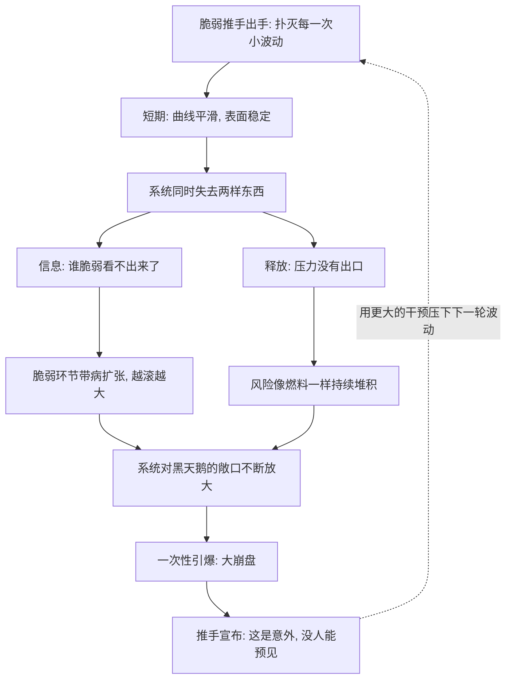

# 08｜脆弱推手：为什么过度稳定反而积累灾难？

> 本文要解决的问题：为什么那些一心消灭波动、追求稳定的人，反而在为大崩盘添柴？

---

## 一、先说结论

消灭小波动不等于消灭风险，它只是把风险从明处搬到暗处、从小处攒到大处。塔勒布给这类人起了一个名字——**脆弱推手**：他们相信「稳定压倒一切」，热衷于熨平每一次震荡，结果每扑灭一次小危机，就为下一次大危机积累一份燃料。脆弱的系统渴望噪声，稳定是它的慢性毒药。

## 二、我们先理解一个问题

假设有两个国家。

A 国每过几年就来一次小衰退：几家经营不善的公司倒闭，一批坏账暴露，失业率短暂上升，然后经济自我修正，继续往前走。曲线起起伏伏，看起来不太体面。

B 国二十年没有任何衰退。央行精准调控，政府及时刺激，每一次向下的苗头都被迅速扑灭。曲线平滑得像用尺子画的，人人称道「治理有方」。

如果让你选一个，直觉多半选 B。塔勒布说，B 才是定时炸弹——那二十年的平静不是没有风险，而是风险从未被允许暴露。A 国的小衰退至少完成了三件事：淘汰了最脆弱的企业、告诉了大家哪里有问题、给系统排了一次压。B 国把这三件事全部推迟了，而推迟不等于取消。

## 三、作者到底提出了什么观点？

塔勒布的观点可以拆成四层。

第一层：**波动是信息**。每一次小震荡都是一次体检，它暴露谁杠杆过高、谁模式脆弱、谁不堪一击。把波动压掉，等于蒙住仪表盘开车——车照样走，只是你再也不知道油还剩多少。

第二层：**波动是释放阀**。系统里积累的压力需要出口，小危机就是出口。堵死所有出口，压力不会消失，只会积蓄。

第三层：**脆弱推手是现代特有的物种**。他们是那些相信自己能预测、能控制的专家——央行行长、政策制定者、过度干预的管理者。他们的动机未必坏：消灭衰退能换来掌声和选票，而让小火烧一会儿只会换来指责。问题在于，他们用短期的平静，抵押了长期的稳定。

第四层：**风险随压制时间非线性增长**。被压住的波动不会均匀地变成「稍大一点的波动」，而是滚雪球式地积累，最终以黑天鹅的形态一次性结算——爆发的规模远远超过此前所有被扑灭的小波动之和。

## 四、把这个观点翻译成人话

用大白话说：**一个从不生病的人，不等于健康；一个从不发火的人，不等于脾气好；一个从不波动的系统，不等于安全。**

生活里这种错觉很常见。有的人常年不体检、不休息、指标「一切正常」，某天忽然倒下；有的锅炉安全阀被锈死，内部压力再大也不报警，直到整锅炸开。疼痛是坏消息，但它本身是好东西——它告诉你哪里坏了。把止痛药当治疗方案，就是脆弱推手的日常操作。

更直白一点：**小火是森林的扫地机器人，衰退是经济的清道夫。**你解雇了扫地机器人，垃圾并没有消失，只是攒到你再也看不见的地方。

## 五、为什么会这样？

塔勒布描绘的机制是这样的：

关键在于最后那条虚线：这是一个自我强化的循环。每一次压制都让下一次压制变得更必要、也更危险，直到压不住为止。

更深层的原因是**非线性**。伤害不随规模线性增长——摔一个杯子的损失是一，摔一百个杯子不是一百倍的灾难；但一次烧光整片森林的大火，其损失远超一万场小火之和。塔勒布认为，脆弱推手们用线性的头脑去管理非线性的系统，这是他们算错账的根本原因：他们只看见了「扑灭小火省下的钱」，看不见「攒出来的那场大火」。

## 六、举一个现实生活中的例子

第一个例子是森林。历史上一些地区的林务管理曾长期奉行「见火就灭」的方针：无论多小的火情，立即扑灭。表面看，这是尽职尽责——几十年间没有一场森林大火，成绩单漂亮极了。但森林里枯枝落叶、灌木藤蔓年年堆积，这些本该被周期性小火烧掉的可燃物，在「零火情」的保护下越积越厚。终于有一天，火还是着了——这一次它不再烧掉地表的枯枝就熄灭，而是借着几十年攒下的燃料一路烧上树冠，把整片森林烧成了白地。林务员消灭的不是火灾，而是小火；大火正是被「消灭小火」这个动作亲手制造出来的。

第二个例子是经济。塔勒布认为，过去几十年里央行和政府对经济周期的平滑操作，与林务员的逻辑如出一辙：每当衰退的苗头出现，就降息、注资、刺激，把每一次小感冒都用猛药压回去。企业该倒闭的没倒闭，靠廉价资金续命；债务该出清的没出清，滚成更大的债务；金融机构越来越相信「出了问题会有人兜底」，于是杠杆越加越高。2008 年的金融海啸，在塔勒布的叙事里不是一场无法预见的意外，而是几十年「见火就灭」积累出来的那场森林大火——压力被憋得太久，一爆就是系统性崩盘。

## 七、回到书中重新理解

现在再看「脆弱推手」这个词，就明白它为什么是全书批判火力最集中的靶子之一。

塔勒布实际上在区分两种「稳定」：一种是**系统的稳定**——允许局部波动、换取整体长存的动态稳定；另一种是**曲线的稳定**——把波动熨平、把问题掩盖的静态稳定。脆弱推手追求的是后者，因为它可展示、可归功、可写进述职报告；而前者看起来「乱」，政绩表上不好看。

这也解释了为什么脆弱推手的问题不是智力问题，而是**激励问题**：扑灭小火有即时的奖赏，放任小火有即时的骂名，而大火的账单永远在多年以后、且总能归咎于「百年一遇」。当收益归自己、成本归系统时，理性的人也会干出脆弱推手的事。

## 八、这个观点背后还有什么？

第一，它修正了我们对「风险管理」的理解。传统思路是「预测风险、消除风险」；塔勒布的思路是「你无法消除风险，只能选择让它以小剂量的形式分批到来，还是攒成一次大的」。压力不释放，只会转移和累积。

第二，它给「无为」和「减法」提供了依据。如果干预本身就是风险来源，那么「不干预」就不是消极，而是一种主动的风险管理——让系统自己完成排压。

第三，它暗含一个更尖锐的推论：脆弱推手不仅讨厌波动，还偏爱「大」——大而集中的系统才好管理、才出政绩、才显得重要。于是压制波动和扩张规模成了同一枚硬币的两面。而规模，恰恰是另一种更隐蔽的脆弱性来源。

## 九、这个观点有问题吗？

有说服力的地方相当扎实。森林火险管理的教训是历史事实：长期的全面扑火政策确实造成可燃物异常积累，后来的灾难性大火促使林业管理转向「计划烧除」，主动引入可控小火——这正是塔勒布逻辑的制度化承认。2008 年之后，经济学界对「大缓和」时代也有过广泛反思，承认长期的低波动环境助长了过度冒险——「稳定性本身会滋生不稳定」并非塔勒布独有，一些学者在更早的金融不稳定假说中就表达过类似思想。

但争议同样清楚。第一，逆周期干预并非一无是处：一些经济学家认为，放任衰退自我演化可能陷入通缩螺旋和大萧条式的灾难，1930 年代的教训恰恰说明「不干预」也有巨大代价——塔勒布讲清了干预的成本，但对不干预的成本着墨较少。第二，森林的类比不能无限外推：电网、航空、传染病防控等领域里，「压掉每一次小波动」是纯粹的收益，人类并不需要靠定期坠机来维持航空业健康。哪些系统需要波动、哪些不需要，塔勒布给的是原则而非操作手册。第三，这个理论存在事后归因的便利：崩盘发生后，总能回推出「都是压制波动攒的」，但它很难在事前给出可检验的预测——何时该压、何时该放，标准模糊。第四，「脆弱推手」的形象有被漫画化的倾向：现实中的政策制定是在多重约束下的权衡，不是所有干预者都像书中描写的那样盲目自信。

所以更准确的读法是：压制波动确实会积累风险，但「该放多少火」取决于系统的性质——先分清你面对的是森林还是电网，再决定要不要见火就灭。

## 十、今天再看这个观点

以下部分是基于作者思想的现代延伸，不是作者原话。

放到今天，脆弱推手的逻辑比成书时更值得警惕。超低利率时代结束后，人们回头审视长达十几年的货币宽松，「廉价资金掩盖了多少该死的企业」成为主流讨论之一——这与塔勒布的燃料积累论遥相呼应。在组织管理里，「永远不许出错的 KPI 文化」制造着同样的效果：指标永远达标，问题永远隐形，直到某天一次性爆发。在内容平台时代，算法把信息流平滑成「你想看的」，个体认知的「小火」——异见、冲突、试错——被系统性地压灭，积累的是极化与脆弱共识。

对个人而言，这个框架的提醒是直接的：一份从不出错的履历、一段从不争吵的关系、一个从不波动的生活，都可能是燃料堆积的信号，而不是健康的证据。

## 十一、这一篇真正应该记住什么？

1. 消灭小波动不等于消灭风险，只是把风险攒起来一次性结算。
2. 波动身兼两职：它是系统的体检报告，也是压力的释放阀——压掉它就两样都没了。
3. 脆弱推手的问题不是坏，是激励错位：扑灭小火有功，大火的账永远算在「意外」头上。
4. 风险随压制时间非线性增长：一万场小火的伤害，抵不过一场攒出来的大火。
5. 先分清系统是森林还是电网，再决定要不要见火就灭——原则有力，剂量因系统而异。

## 十二、留一个问题

下一次你看到一条「完美平滑」的曲线——一份永远达标的报表、一段从无波澜的行情、一个从不犯错的人——先别急着赞叹，问一句：它的小火去哪儿了？是真的没有可燃物，还是都攒在看不见的地方？

而脆弱推手还有一个没说破的偏好：他们不仅要把曲线压平，还热衷于把系统做大——大机构、大工程、大平台，才好统一调控、才显出政绩。可「大」本身就是下一层脆弱性的来源：为什么塔勒布说小动物摔不死、大象摔一次就完？下一篇，我们来看「大即脆、小即韧」的逻辑。
