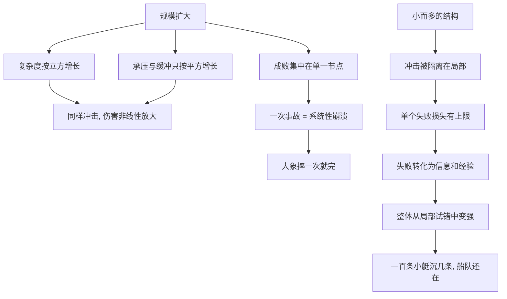

# 09｜为什么「大」是脆弱的，「小」才是反脆弱的？

> 本文要解决的问题：为什么大公司、大项目、大系统看似强大，却更容易突然死亡？

---

## 一、先说结论

塔勒布认为，规模与脆弱性正相关：东西越大，越经不起冲击；结构越小越多，越容易活下来。**小动物摔不死，大象摔一次就完；一艘巨轮沉了就是全军覆没，一百条小艇沉几条船队还在。**「小而多」的结构让错误的代价有天花板，让局部的失败反过来供养整体——这才是反脆弱的组织形态。

## 二、我们先理解一个问题

先做一个思想实验：把一只猫、一匹马、一头大象，分别从相当于自身三倍身高的地方摔下来。

猫多半抖抖毛走了。马会骨折。大象可能直接摔死——不是因为它笨重，而是因为一个冷酷的几何事实：动物的体重按体积算，随尺寸的**立方**增长；而骨骼的承重能力按横截面积算，只随尺寸的**平方**增长。个子每大一倍，体重变成八倍，骨头只粗了四倍。同样的冲击，对小个子是挠痒痒，对大个子是结构性灾难。

这个原理叫平方—立方定律，是物理学家早就搞清楚的事实。塔勒布拿它问了一个冒犯所有人的问题：凭什么认为公司、项目、国家能逃过这条定律？我们默认「大」等于「强」，可物理世界给出的答案恰恰相反——**大到一定程度，「大」本身就是那个裂开的点。**

## 三、作者到底提出了什么观点？

塔勒布的主张分四层。

第一层：**伤害随规模非线性增长**。冲击的后果不随体量等比放大，而是放大得更快——同样一块石头，砸在玻璃珠上没事，砸在落地窗上是灾难。规模越大的系统，单位冲击造成的伤害越高。

第二层：**大项目有「超支宿命」**。塔勒布观察到一个近乎普遍的现象：巨型工程——大桥、大坝、大型 IT 项目——几乎总是超预算、超工期，而且超得离谱。小项目也会超支，但超得有限。规模每上一个台阶，出错的方式就复杂一个量级，预测模型的失效速度远超规模的增速。

第三层：**大公司不是更安全，而是更会猝死**。我们以为大公司有资源、有缓冲、抗风险，塔勒布指出相反的事实：巨无霸公司往往在一次冲击中整体性死亡，而同样体量的业务分散在一百家小公司里，倒几家是常态，生态反而长青。集中带来效率的幻觉，同时抽走了冗余和退路。

第四层：**「小而多」优于「大而一」**。多个小单元的聚合，比一个大单体反脆弱：每个小单元的失败代价有上限，失败的教训能传给同伴，整体从局部的试错中获益。塔勒布把瑞士奉为样板——一个由小州组成、没有强力中心的国家，反而成了世界上最稳定的政体之一。

## 四、把这个观点翻译成人话

用大白话说：**别把鸡蛋放一个篮子，更别造一个装所有鸡蛋的巨型篮子。**

一艘能装一万人的巨轮，触礁一次死一万人；一百条装一百人的小艇，沉十条还剩九十条。巨轮省了船员、省了燃料、看起来很「高效」——直到那块礁石出现。小艇看起来浪费、重复、不够规模经济——但它的灾难有天花板。

再换一个说法：**小系统里，最坏的结果是被控制的；大系统里，最坏的结果是没想到的。**「小而多」保证的是：无论犯什么错，都死不了，还能把教训变成集体的经验。

## 五、为什么会这样？

机制可以画成两条路径：

两条路径的分叉点在「失败去哪儿了」。大单体里，失败没有别处可去，只能由整体承担；小而多的结构里，失败被关在一个格子里，烧不穿隔壁。更妙的是，局部失败还留下信息——哪种做法不行、哪个环节脆弱——这些免费的情报让整个系统变得更聪明。

塔勒布认为这里还有一层认识论的原因：大规模系统的管理者面对的复杂度超出人类预测能力，却误以为自己看得见全局。规模越大，「我不知道」的部分越多，而「我以为我知道」的自信越足——这个剪刀差本身就是脆弱性的来源。

## 六、举一个现实生活中的例子

回到开头那只大象。猫从高处摔下多半没事，大象摔一次就可能骨折甚至死亡——这不是体质差异，是平方—立方定律的判决：表面积与体积的比例决定了，规模越大，越经不起同样的冲击。

把这个定律搬到商业世界，结论惊人地吻合。那些被认为是「太大不会倒」的巨头——拥有百年历史的影像巨头、数万员工的能源巨头、超过一百五十年历史的投资银行——都曾在短短几年内从巅峰滑向破产或解体；商业史上的大型企业猝死案例反复印证：大，并不能买来免疫力。而巨型工程的超支几乎成了规律：一些关于大型项目管理的学术研究统计发现，多数大型基建与 IT 项目最终成本远超初始预算，且规模越大超支越严重——塔勒布正是据此断言，大项目的超支不是管理不善，而是规模自带的脆弱性。

正面样本是瑞士。这个国家没有强大的中央政府，权力散在二十几个小小的州里，每个州人口不过几十万到一百多万，连全国性的「大人物」都很难产生——地方事务地方说了算。塔勒布认为，正是这种「小而多」的结构让瑞士在动荡的欧洲腹地保持了罕见的稳定：一个州犯错，全国不陪绑；基层的试错不断，顶层的崩溃没有。小而多的聚合，聚出了比大帝国更强的稳定性。

## 七、回到书中重新理解

现在再看塔勒布对「大」的攻击，就明白他反的不是规模本身，而是**不可分解的集中**。

关键区别在于失败的可承受性。塔勒布的判据不是「你有多大」，而是「你最大的单点失败有多大」：一个由很多自治小单元组成的大网络，可以很大而不脆弱；一个事事耦合、牵一发动全身的中等系统，不大也已经很脆弱。「大即脆」的完整表述是：**大而不可分，才是脆。**

这也解释了为什么「小而多」在塔勒布的体系里不只是规模偏好，而是反脆弱结构的标准件：它和杠铃策略、和冗余、和无为共享同一个逻辑——把不可预测的冲击，改造成可承受的、甚至有益的局部事件。

## 八、这个观点背后还有什么？

第一，它把脆弱性从「运气问题」变成「几何问题」。大象不是运气差才摔死，是它的形状决定的。同理，大公司的猝死也不必归咎于某个昏庸的 CEO——结构本身就在积累风险，谁来掌舵都差不多。

第二，它对「规模经济」这个现代信条提出了正面挑战。商业世界默认「做大」是天然的正确，因为规模摊薄成本；塔勒布提醒我们算另一本账：规模同时放大尾部风险。效率的收益是线性的、看得见的，脆弱的成本是非线性的、藏起来的——算总账时人们只算了前者。

第三，「小而多」之所以有效，还有一个更深的理由：它把知识从理论还原成了试错。一百条小艇就是一百次独立的实验，每条船都在替整个船队探路。这就引出塔勒布更激进的下一步——我们所以为的「知识」，究竟是从哪儿长出来的？

## 九、这个观点有问题吗？

说服力是硬的。平方—立方定律是物理事实，不是观点；大型项目普遍超支在学术研究中有相当数据支持；历史上大机构猝死的案例也确实屡见不鲜。「小而多」的容错逻辑在工程上早已是不证自明的设计原则——分布式系统、冗余备份本质都是「小而多」。

但争议同样不少。第一，规模经济是真实的：制造业的单位成本、网络平台的网络效应、研发的资金门槛，都让「大」在许多领域是必要的而非虚荣的——一百条小艇造不出跨洋光缆。第二，大也有大的反脆弱面：多元化业务、深厚的现金储备、过冬的能力，有时恰恰是大公司独有的缓冲；小公司死得悄无声息、无人统计，塔勒布的样本里藏着幸存者偏差——我们看见活下来的是小艇船队，没看见每年成片沉没的小艇。第三，瑞士的稳定性未必来自「小」：一些学者认为，直接民主、长期中立、联邦制传统、乃至地理与产业因素都在起作用，把稳定单一归因于规模，有过度简化之嫌；小国寡民失败的例子同样俯拾皆是。第四，「大」与「耦合度」被塔勒布绑在一起讨论，但二者其实可以分离：一个精心解耦的大系统可能比一堆互不通气的小单元更稳——问题或许不在大不大，而在连不连。

所以更准确的读法是：规模是脆弱性的放大器而非唯一来源——「大」不必然错，「大而不可分、大而耦合、大而自负」才致命。

## 十、今天再看这个观点

以下部分是基于作者思想的现代延伸，不是作者原话。

放到今天，「小而多」几乎成了技术架构的默认答案：单体应用被拆成微服务，集中式机房被拆成可用区，巨型团队被拆成两人披萨小队——工程界用二十年的血泪独立验证了塔勒布的断言。组织层面，「中台瘦身」「拆事业部」「内部赛马」本质上都是承认大而耦合的系统调不动、死得快。金融层面，「大而不能倒」在 2008 年后成了贬义词，监管者开始讨论把巨头拆分或强制其持有更高的缓冲——这正是「小而多」思路的制度化。

对个人而言，这个框架的提醒同样直接：把自己活成一艘巨轮——单一雇主、单一技能、单一收入来源——就是在积累单点失败；把自己活成一支小艇船队，才是个人层面的「小而多」。

## 十一、这一篇真正应该记住什么？

1. 规模与脆弱正相关：体重按立方长，承重按平方长，大到一定程度「大」就是裂点。
2. 大单体让失败无处可去，小而多让失败有天花板——判据是最大单点失败有多大，不是总量有多大。
3. 巨型项目超支、巨头猝死不是管理事故，是规模自带的脆弱性在结算。
4. 瑞士式的「小而多」证明：稳定性可以靠一堆小单元聚出来，而不是靠一个大中心压出来。
5. 局部失败是系统的免费情报——小而多的结构让每一次倒下都变成集体的经验。

## 十二、留一个问题

看看你所在的系统——你的公司、你的项目、你自己的职业结构——它的失败有没有「防火墙」？如果最坏的那一次倒下会拖垮全部，那无论它现在多大、多高效，它的脆弱都只是还没到期。

而「小而多」为什么天然有效？因为它把「怎么活下去」这个问题的答案，从天才的设计图还原成了一百次笨笨的试错。这就引出一个更根本的问题：塔勒布认为，人类真正的知识从来不是从理论里长出来的，而是从试错里倒着长出来的——为什么他说大学教授是在「教鸟飞行」？下一篇，我们看这个让所有学术殿堂难堪的故事。
