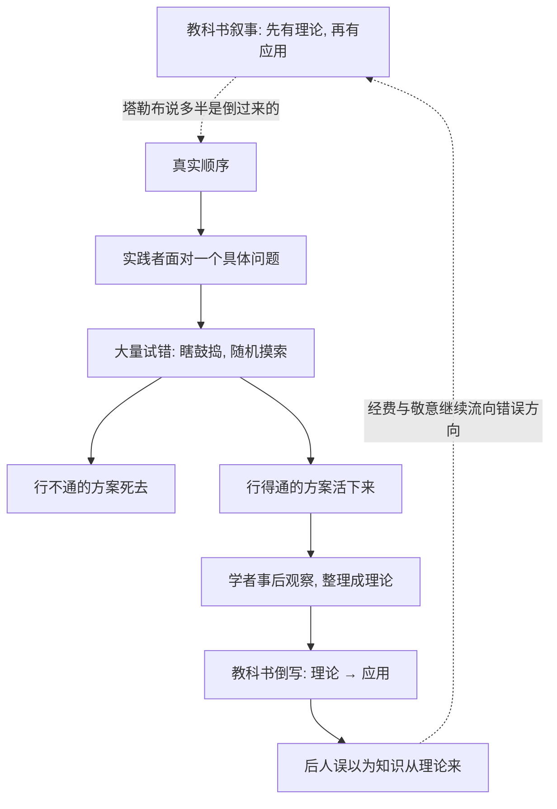

# 10｜教鸟飞行的教授：为什么知识常常从实践倒着长出来？

> 本文要解决的问题：教科书里「先有理论、再有应用」的叙事，为什么在现实中常常是反的？

---

## 一、先说结论

塔勒布认为，我们被教科书骗了：真正推动世界的知识不是「理论→应用」顺着长出来的，而是「试错→能用→理论事后贴标签」倒着长出来的。靠买卖绿木材发财的交易员根本不知道绿木材是什么；蒸汽机、飞机、喷气发动机多是工匠瞎鼓捣出来的，理论是后来补的课。他把学术界的功劳认领讽刺为——**教授给鸟上飞行课**。

## 二、我们先理解一个问题

问一个看似显然的问题：技术是从科学里来的吗？

标准答案当然是「是」：先有人搞懂原理，再有人照着原理造东西，大学负责前半段，工厂负责后半段。整条现代教育和科研拨款体系都建立在这个叙事上——所以经费要给「理论上有前景」的方向，所以发明的故事总要追溯到某间实验室、某篇论文。

塔勒布请大家停下来，看看历史证据。他设想了一个场景：一群鸟类学家开设了「飞行原理」课程，给鸟们讲授空气动力学、翼型曲线、升力公式。鸟们听完飞走了。教授们回去写论文：《论我们的教学在鸟类飞行能力提升中的关键作用》。没有人去问一句：鸟在上课之前，会不会飞？

这个故事好笑，是因为它是真的——只不过主角换成了我们。我们反复把「事后写出的解释」当成了「事前的成因」，把理论当成了知识的老爸，而实际上理论常常只是知识的户口本。

## 三、作者到底提出了什么观点？

塔勒布的批判由三块组成。

第一块是**绿木材谬误**。塔勒布讲了一个真实故事：一位交易员靠买卖绿木材赚了大钱，多年里他一直以为「绿木材」是被漆成绿色的木材——实际上它是刚砍下、未经干燥的新鲜木材。他的理论认知错得离谱，他的实操判断却完全正确：什么时候买、什么价格卖、什么样的货是好货，全对。塔勒布借此指出：知道「怎么做」和知道「它是什么」是两种知识，前者不需要后者，而学校只教后者。

第二块是**试错先于理论**。塔勒布认为，历史上多数重大技术突破走的是同一条路：实践者面对具体问题，大量鼓捣、大量失败，活下来的方案留下来；学者随后进场，把能用的方案整理成理论；教科书再把这个顺序倒写一遍。随机性的瞎鼓捣（tinkering）之所以强大，是因为它天然是凸性的：每次失败的代价小，一次成功的收益可能无限——试错本身就是一种期权。

第三块是**叙事的窃取**。塔勒布最尖锐的指控是：学术界不仅事后总结，还系统性地把功劳记在自己名下，于是「理论产生技术」成了自证预言——经费流向理论，因为人们相信技术从理论来；人们相信技术从理论来，因为教科书上这么写。这就是「教鸟飞行」真正辛辣的地方。

## 四、把这个观点翻译成人话

用大白话说：**会做和会说，是两种完全不同的本事，而且会做的那一种常常不需要会说的那一种。**

一个能烧出绝世好菜的大厨，未必说得出美拉德反应的化学式；一个把化学式倒背如流的人，多半烧不好那道菜。老司机开得稳，不是因为他心算摩擦系数；一个交易员能赚钱，不是因为他通过了理论考试。

再换一句：**我们以为知识是「想明白了再做」，现实中更多是「做出来了再想」。**先在水里扑腾会了游泳，再去补流体力学；流体力学补得再好，不下水还是不会游。

## 五、为什么会这样？

塔勒布描绘的真实顺序与教科书顺序的对比如下：

为什么试错这条路更硬？三个原因。

其一，**试错是凸的**。每一次鼓捣成本有限，而收益上不封顶——这是反脆弱的标准形状；而理论建构依赖对世界的完整建模，模型错一点，结论全盘皆输，理论路径本身是脆弱的。

其二，**世界太复杂，算不出来**。现实问题的变量远多于任何理论能容纳的，实践者用无数次小实验让环境替自己筛选答案，等于把计算外包给了现实本身。

其三，**理论天然有回溯偏差**。理论只在「什么是对的」出现之后才有东西可写，它注定活在实践的影子后面——影子跑不到身体前面去。

## 六、举一个现实生活中的例子

先看绿木材交易员。他从业多年，买卖的货品叫「绿木材」，他心里一直认定那是「被漆成绿色的木头」。真相是：绿木材是刚砍下来、含水未干的新鲜木材，「绿」指的是新，不是颜色。这个错误足以让任何木材学教授摇头——但这位交易员的采购时机、价格判断、货品挑选无一不准，生意做得风生水起。塔勒布的点睛之笔是：他对自己的商品「误解」了半辈子，而这个误解从未让他亏过一分钱。他掌握的是一整套有效却无言的操作性知识——这才是市场里真正流通的东西。

再看技术史。蒸汽机是被工匠和矿场工程师一代代改出来的，用来给矿井抽水；而解释它为何有效的热力学，要等到几十年后才由理论家建立——历史上先有会转的机器，后有说得通的原理。莱特兄弟是开自行车铺的，他们没有空气动力学学位，靠在自行车铺里鼓捣翼面、一次次试飞摔出来的手感，把人类送上了天；飞行理论是在飞机已经满天飞之后才逐渐成形的。喷气发动机的发明同样出自工程师的执着试验而非理论推导——以至于有航空工程师留下名言式的大意：真正造出发动机的人，恰恰是不理会那些「理论上不可能」论断的人。工匠在前，教授在后，这是技术史上反复重播的剧本。

## 七、回到书中重新理解

现在再看「绿木材谬误」，它的准确含义浮出来了：你以为你在思考事情的本质，其实你在想别的东西——而真正管用的那套知识，你甚至没有意识到它的存在。

塔勒布借这个故事区分了两种知识：**解释性知识**——能写成论文、能进课堂、能回答「为什么」；和**操作性知识**——长在手上的、答不出「为什么」却做得对的手艺与诀窍。他的指控不是说解释性知识没用，而是说整个社会把账记反了：操作性知识干了活，解释性知识领了功。

这也让「教鸟飞行」成为全书批判体系的关键一环：如果知识真从理论来，那么压制试错、迷信专家的脆弱推手就有了合法性；如果知识从试错来，那么「小而多」「杠铃」「无为」就全部顺理成章——它们不过是在保护试错这台发动机。这篇不是花边故事，是塔勒布整个世界观的地基之一。

## 八、这个观点背后还有什么？

第一，它重新定义了「聪明」。在塔勒布的坐标系里，能让一百万次小失败替自己探路的人，比手握完美模型的人聪明——前者拥抱世界的复杂性，后者假装复杂性不存在。

第二，它对教育体系提出了难堪的问题：学校教的是「可教的」——能写成板书、能出成考卷的知识；而最有价值的操作性知识恰恰不可教，只能在做的过程中长出来。一些学者也有过类似观察，将这类知识称为「默会知识」——我们知道的，远比我们能说出的多。

第三，它把矛头指向资源分配：如果知识从试错来，那么按「理论承诺」分配经费的体系就押错了宝；更合理的投入是保护试错的土壤——便宜的小实验、宽容的失败、低成本的鼓捣空间。

第四，也是最深的伏笔：试错为什么有效？因为试错根本不新——自然选择已经用它运转了三十八亿年。变异、淘汰、保留，就是进化版的「瞎鼓捣」。下一篇会看到，试错不仅是发明的方法，它就是生命本身的方法。

## 九、这个观点有问题吗？

有说服力的地方不容忽视。蒸汽机先于热力学、飞机先于成熟的空气动力学，这些是技术史学界广泛讨论的事实；「默会知识」的概念也独立支持了「会做不必会说」的区分；而「理论事后接管功劳」的叙事偏差，在科学社会学里早有呼应——历史确实由能写的人书写，能写的往往是理论家。

但争议同样明显。第一，反例一大把：电磁波理论在先、无线电在后；量子力学在先、半导体在后；相对论在先、GPS 校准在后——理论驱动技术的案例同样辉煌，塔勒布的样本选择有明显倾向性，他只数了工匠赢的那些局。第二，「理论无用」的推论很容易被滥用成反科学、反专业的民粹情绪——「教授不会教鸟飞行」不能推出「所有理论都是马后炮」，这种误读比原观点本身流传得更广。第三，科学与技术的关系更可能是双向共生的螺旋，而非单向的谁产生谁——用一个方向叙事替换另一个方向叙事，是以新的简化替换旧的简化。第四，绿木材交易员的故事换个角度看是警示：他不懂原理所以赚到了钱，但当市场结构改变、「绿木材」的逻辑本身变化时，不懂原理的人可能连怎么死的都不知道——操作性知识在范式稳定时是资产，在范式切换时可能就是负债。

所以更准确的读法是：理论不是无用的，它只是没有自己宣称的那么靠前——「实践试错」与「理论建构」是两条腿，塔勒布的价值在于提醒我们已经把全部体重压在了后一条腿上。

## 十、今天再看这个观点

以下部分是基于作者思想的现代延伸，不是作者原话。

放到今天，「实践先于理论」的证据不但没有减少，反而在加速积累。硅谷的「快速试错、小步迭代」方法论，本质是把绿木材逻辑制度化为开发流程——先上线一个能用的版本，让真实用户替理论筛选方向。人工智能领域更是教科书级案例：深度学习在工程上突飞猛进多年，其理论解释至今仍在追赶实践，研究者常说「我们造出了会飞的东西，还没完全搞懂它为什么能飞」——莱特兄弟的剧情正在以十亿参数的规模重演。甚至「提示词工程」这种全新技能，也完全是从千万次试错里长出来的默会知识，没有任何教科书先于实践存在。

对个人而言，这个框架的提醒是：等学明白再动手，常常是最大的拖延——在多数真实领域里，正确顺序是先下水、再补流体力学。

## 十一、这一篇真正应该记住什么？

1. 知识的真实顺序常是「试错→能用→理论贴标签」，教科书把它倒写了。
2. 绿木材谬误：知道「怎么做」和知道「它是什么」是两种知识，前者不需要后者也能运转。
3. 试错天然是凸性的：小成本失败、无上限收益——瞎鼓捣是一种期权。
4. 蒸汽机、飞机、喷气发动机多出自工匠之手，理论化在后——工匠在前，教授在后。
5. 别把「理论无用」误读成反科学：两条腿都在走，只是我们长期只认一条。

## 十二、留一个问题

想想你赖以吃饭的那项本事：其中有多少是从书本和课堂里学来的，又有多少是在一次次搞砸、修正、再搞砸里长出来的？如果后者占了大头——那么，是谁教谁飞？

而试错这台发动机为什么从不熄火？因为它的燃料不是聪明，是死亡：行不通的方案死去，行得通的活下来；撑不住的个体退出，扛得住的留下。试错从来不温柔——它靠淘汰运转，靠牺牲前进。这就到了塔勒布全书最冷酷也最深的篇章：为什么个体的死，恰恰是系统的生？下一篇，我们来看进化这台终极的反脆弱机器。
