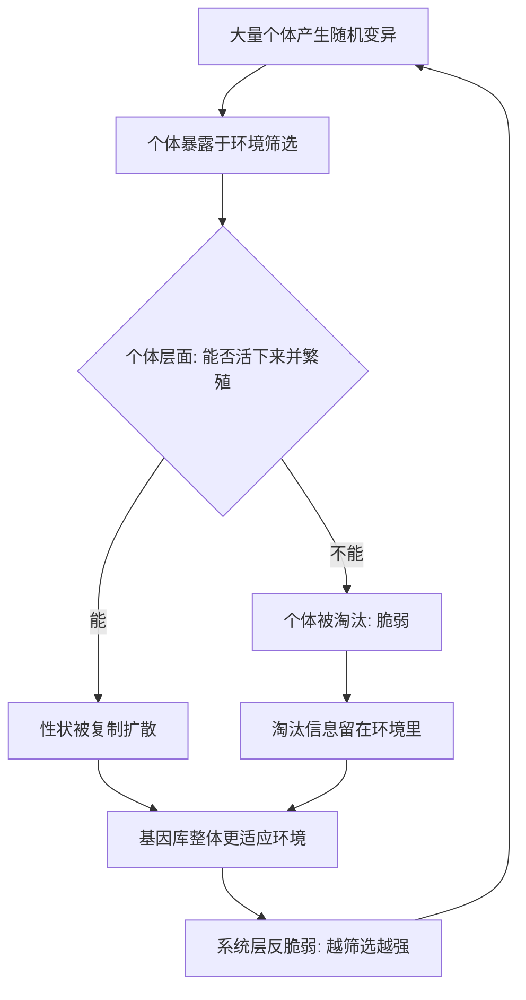

# 11｜进化为什么是终极的反脆弱系统？

> 本文要解决的问题：大自然里每一个个体都会死、都会失败，为什么整个系统反而越来越强？个体的脆弱和系统的反脆弱之间到底是什么关系？

---

## 一、先说结论

塔勒布认为，进化是反脆弱最彻底、最古老的形态——但它的代价是个体。自然选择的逻辑是：让无数个体暴露在变异、竞争和淘汰里，失败者被淘汰，幸存者的性状留下来，基因库因此一代比一代适应环境。**系统靠吃掉个体的失败而变强。**所以反脆弱是有层级的：系统层面的反脆弱，恰恰以个体层面的脆弱为燃料。把这两层混为一谈——以为「对系统好」就等于「对你好」——是理解这本书最容易犯、也最危险的错误。

## 二、我们先理解一个问题

先承认一个有点残酷的事实：大自然对个体极其不友好。绝大多数生物个体活不到把基因传下去，绝大多数物种已经灭绝，绝大多数创业公司死掉。

可另一边，生命整体却越来越强——从单细胞走到今天，生态系统在一次次灾变后反而更繁茂。一个由「会死的零件」组成的系统，为什么能越死越强？

我们平时想反脆弱，默认想的是「我」怎么变强。但进化把这个问题的方向掉转了：变强的不是个体，是个体背后的那个东西——基因库、物种、生态。**零件是消耗品，机器在升级。**理解这台机器的运转方式，就是理解反脆弱在系统层面长什么样。

## 三、作者到底提出了什么观点？

塔勒布的观点分三层。

第一，自然选择就是一台反脆弱机器。它不需要预测环境会怎么变——它只做三件事：制造大量有差异的个体、让环境去筛选、把通过筛选的性状复制下去。环境越多变、筛选越残酷，留下来的性状越经得起折腾。混乱和淘汰不是这台机器的故障，是它的电源。

第二，他特别强调：反脆弱和脆弱是**分层**的。同一现象在这一层是脆弱，在上一层可能就是反脆弱。个体的死亡对个体是终点，对基因库是一次信息更新；一家企业的倒闭对老板是灾难，对整个行业是一次试错。层级之间不是放大缩小关系，是性质反转关系。

第三，塔勒布进一步指出，人类经济系统里凡是「反脆弱」的部分，无一例外都复刻了这个结构：允许大量个体失败，用失败的信息供养整体。所以他甚至说，那些试图「拯救每一家企业」的系统，恰恰在拆除自己的反脆弱装置——这是后面「脆弱推手」批判的伏笔。

## 四、把这个观点翻译成人话

一句话：**系统从你的失败里学到了东西，所以它巴不得你多试、多失败——只要你失败的代价它付得起。**

就像免疫系统不指望每个免疫细胞都活下来，它指望的是「死掉的细胞换来了识别病原体的记忆」。进化也是一样：每一个被淘汰的个体都是一条数据——「这条路在这个环境走不通」。数据攒得够多，基因库就摸出了环境的形状。

所以对个体而言，失败是结局；对系统而言，失败是**学费**。反脆弱的本质在这一层暴露得最清楚：它不是「变强」，而是「有一套把别人的失败变现成自己养分的机制」。

## 五、为什么会这样？

进化的运转链条可以这样画：

关键在于三个机制的咬合：**变异提供多样性**（没有差异就没有选择余地），**筛选把波动变成信息**（每次环境变化都是一次考试），**复制让正确答案扩散**（考过的答案被量产）。三者循环，系统就实现了「不预测、只筛选」——这正是反脆弱在数学上的「凸性」换了个说法：个体失败的损失有限（死一个），幸存性状扩散的收益巨大（改变整个种群）。

塔勒布认为，这个结构解释了为什么进化能造出人类大脑这样精巧的东西，却从头到尾没有设计师：它靠的不是聪明，是**海量试错加无情淘汰**。个体死得越「便宜」，系统学得越快。

## 六、举一个现实生活中的例子

塔勒布在书里反复用的例子是餐馆。

你去任何一个城市的餐饮街看：今年开门的餐馆，明年可能倒了一半。每一家倒闭的餐馆对老板来说都是真切的损失——积蓄、心血、几年时间。但站到「餐饮业」这一层看，画面完全反了：正是这一家家倒掉的餐馆，用真金白银替整个行业试出了「这条街不能开粤菜」「这个定价没人买单」「这种装修留不住回头客」。失败者的教训免费供给了幸存者，于是整个行业的存活率、菜品、服务一年比一年好。**餐饮业是最繁荣的行业之一，恰恰因为它是餐馆死亡率最高的行业之一。**

自然选择是同一件事更宏大的版本。每一个没能繁殖的个体，都用自己的淘汰为基因库交了一次学费；几亿年交下来，学费堆出了今天所有精密的生物结构。

硅谷把这件事做成了制度。历史上看，硅谷创业公司的失败率长期居高不下，但失败的工程师、失败的经验、被证伪的商业模式，全部回流进生态——下一轮创业的起点因此更高。高失败率没有拖垮硅谷，反而供养出全球最强的创业生态。

三个例子同一个公式：**个体脆弱 × 大量试错 = 系统反脆弱。**

## 七、回到书中重新理解

现在再看塔勒布那句有点冷的话就好懂了：他说大自然「热爱」错误——不是修辞，是机制描述。没有个体的错误和死亡，系统就没有信息来源；没有信息，就没有进化。

这也解释了为什么他在书里对「拯救」这件事始终保持警惕。当一个系统大到不允许个体失败——不允许银行倒闭、不允许企业退出——它看上去在做善事，实际上是在切断自己的信息流：错误不再被清理，而是被掩盖、被积累，直到以更大规模爆发。进化给我们的启示是冷酷但清楚的：**一个健康的系统，必须让失败发生在小处、发生在局部、发生在现在。**

## 八、这个观点背后还有什么？

第一，层级视角是塔勒布整套思想的隐藏骨架。凸性、杠铃、毒物兴奋效应，都可以重读为「如何让上一层从下一层的波动中获益」。「系统和个体的分工」这一命题，后面谈职业结构时会直接落地。

第二，它埋了一个伦理炸弹：如果系统靠个体牺牲变强，那「系统的利益」和「个体的利益」就天然有张力。塔勒布不回避这一点——他后面会用很大篇幅讨论，现代经济体的问题之一，正是有人把「系统的反脆弱」的红利装进自己口袋，把「个体的脆弱」的账单留给别人。

第三，它还回答了「为什么不需要预测」这个悬而未决的问题。进化从不预测下一个突变有没有用、下一次气候怎么变——它用多样性对冲无知。这给人类的启示是：面对不可预测，与其提高预测的精度，不如增加试错的机会。

## 九、这个观点有问题吗？

有说服力的地方很扎实：进化的筛选机制是现代生物学共识，「个体淘汰优化群体」有化石记录和基因证据支持；餐饮业、创业生态的「失败供养成功」也符合商业观察；分层看反脆弱这个视角，确实纠正了大量混谈「国家利益」「行业利益」「个人利益」的糊涂账。

但边界也必须说清。第一，「系统从个体失败获益」成立的前提是失败成本足够小、信息能回流——如果个体失败的代价大到拖垮系统（系统性金融风险），或者失败的教训根本没沉淀下来（重复犯同样的错），这个链条就断了，塔勒布对这两个前提条件的讨论相对原则化。第二，关于「选择在哪个层级起作用」，学界存在不同解释：基因选择、个体选择、群体选择的相对权重，至今仍有争论，塔勒布的叙述偏向「系统受益」，但这更像一个比喻框架而非严格的进化论表述。第三，把进化直接类比到经济系统有过度简化处：餐馆倒闭的损失比基因淘汰「昂贵」得多——背后是真实家庭的破产，「学费论」容易轻飘飘带过这种痛感。第四，一些学者认为塔勒布把「进化没有设计师」推得过远：人类系统里有制度、有刻意设计，与自然演化的无目的性不能简单画等号。

所以更准确的读法是：**层级视角极其锋利，但「系统受益」不能自动为「个体受损」开脱**——两件事要分开算账。

## 十、今天再看这个观点

以下部分是基于作者思想的现代延伸，不是作者原话。

放到今天，这个框架对平台经济格外刺眼。外卖平台、网约车平台、电商生态，都呈现出「个体高淘汰率、系统高繁荣」的结构：骑手和商家流水般更替，平台却越来越稳。用塔勒布的尺子量，这些系统的反脆弱性极高——但代价在谁身上，账要算清楚。判断一个系统是否健康，不该只问「系统强不强」，还要问「个体的脆弱有没有被系统兜底」。

另一面，AI 模型训练几乎是进化的数字翻版：海量参数组合被生成、被评估、被淘汰，幸存结构被保留——试错规模远超任何行业。这提示我们：未来最强的系统，可能都长得像「加速版的自然选择」，关键设计问题只有一个——**让失败足够便宜，让教训足够可复用。**

## 十一、这一篇真正应该记住什么？

1. 进化是终极反脆弱：不预测、只筛选，变异＋淘汰＋复制让系统越折腾越强。
2. 反脆弱是分层的：个体的脆弱是系统的养料，两层性质相反，不能混为一谈。
3. 餐馆业靠餐馆的死亡繁荣，硅谷靠失败率登顶——失败者的教训免费供养了幸存者。
4. 不允许小失败的系统会积累大失败；健康的系统让失败发生在小处、发生在局部。
5. 系统受益不能自动为个体受损开脱——算红利的同时，必须算代价落在谁身上。

## 十二、留一个问题

既然系统是靠个体的脆弱变强的，那问题立刻落到每个人头上：在这个结构里，「我」站在哪一层？如果你的收入、你的安全，全部押在一个可以随时淘汰你的系统上——你就是那个「可牺牲的个体」。

那什么样的职业结构，能让个体自己也变得反脆弱？塔勒布给了一对出人意料的对照：月入不稳定的出租车司机，和拿着高薪铁饭碗的银行职员——谁更扛得住危机？下一篇，我们来看这个违反直觉的答案。
