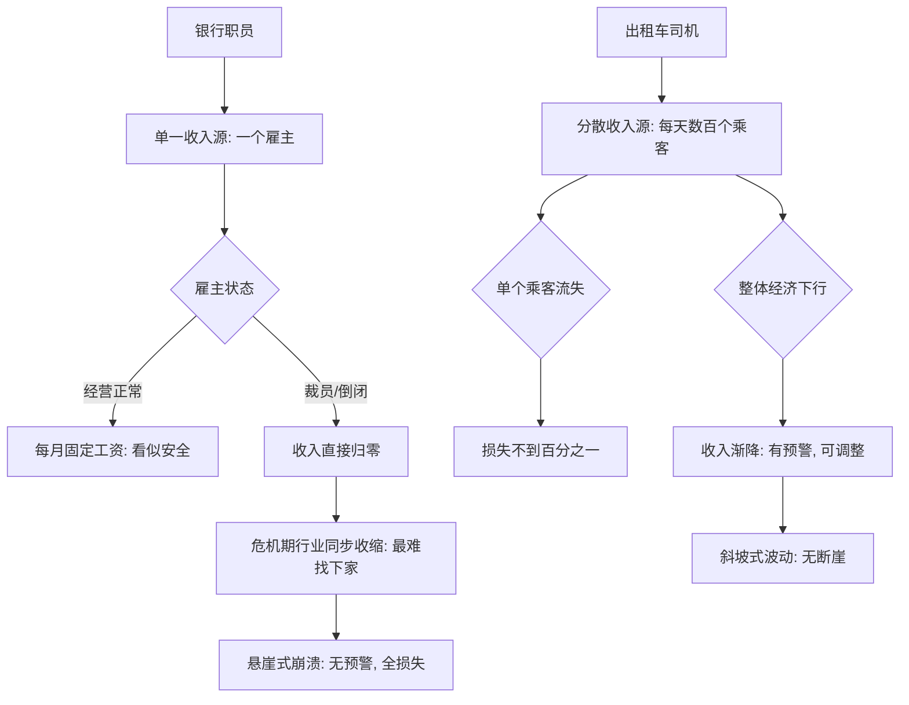

# 12｜为什么出租车司机比银行职员更反脆弱？

> 本文要解决的问题：收入天天波动的出租车司机，为什么反而比拿着稳定高薪的银行职员更扛得住危机？判断一份工作脆弱与否的标准到底是什么？

---

## 一、先说结论

塔勒布给出的答案违反直觉：**看收入高不高没用，要看收入对「单点」的依赖有多深。**银行职员的工资条漂亮，但全部来自一个雇主——一次裁员就归零，而且是在最坏的时刻归零（危机里大家一起被裁，没人招聘）。出租车司机每天收入忽高忽低，但波动分散在成百上千个乘客身上，没有任何一个乘客能解雇他。前者像一支被举得很高的玻璃杯，后者像一片被反复踩踏的草地。波动不等于脆弱，**集中才是**。

## 二、我们先理解一个问题

想象两个人。甲在大银行做职员，年薪三十万，十年没涨也没跌，工资每月一号准时到账。乙开出租车，今天赚八百，明天赚三百，刮风下雨还可能颗粒无收。

问：谁的收入更「安全」？

几乎所有人的第一反应都是甲。工资条的「稳定」给了我们极强的安全感——每月固定数字，像一条直线。塔勒布要拆的正是这个直觉：**直线不是安全，是没有信号的心跳。**他让我们换一把尺子：不看收入曲线平不平，看把它清零需要多大的力气。

## 三、作者到底提出了什么观点？

塔勒布的观点有三个层次。

第一，雇员的「稳定」是一种幻觉结构。一份工资只依赖一个支付者，这个支付者既是收入来源，也是风险来源——你和雇主的关系是「全有或全无」：在职时一切安好，被解雇那一刻收入不是减少，是**消失**。而且解雇往往发生在行业下行时，恰恰是你最难找到下家的时刻——风险和难度同步放大，这是最坏的组合。

第二，自雇者和手艺人（出租车司机、水管工、理发师）的收入结构相反：收入由大量小额、互不相关的支付构成。失去任何一个客户损失都不到百分之一；经济变差时收入是**渐降**而不是**清零**——波动本身就是预警系统，让你有时间调整，而雇员的崩塌是没有预警的。

第三，塔勒布还指出一个隐蔽好处：波动是信息。出租车司机每天都知道市场在发生什么——客人少了、单价变了、哪个区域活了——他在持续接收反馈并微调。银行职员在围墙里，市场信号被屏蔽，直到裁员信发下来才第一次直面现实。**平稳的代价是失明。**

## 四、把这个观点翻译成人话

一句话：**雇员的收入是「悬崖」，自雇者的收入是「斜坡」。**

悬崖的意思是：平时完全平坦，掉下去那一刻落差是百分之百。你不知道自己站在崖边，因为没有任何颠簸提示你。

斜坡的意思是：路一直有点颠，但没有断崖。颠簸本身每天告诉你坡度在哪、该往哪调整。

所以「铁饭碗」真正的定义不该是「每月固定打钱」，而该是「没人能一次把你的饭碗打翻」。按这个定义，客户分散的水管工手里那个破碗，比银行职员的金碗结实得多。

## 五、为什么会这样？

把两种收入结构画出来，差异一目了然：

底层逻辑还是上一篇说的层级问题：银行作为一个系统是反脆弱的——它可以从客户、市场、甚至政府救助里获益；但系统内部的雇员是**纯粹的脆弱方**，他的全部风险集中在「雇主是否继续雇我」这一个二元事件上。出租车司机把自己直接暴露在市场波动里，看似风雨飘摇，实则把风险摊成了碎片——**每一个碎片都小得不致命**。

塔勒布认为，这里还有一个数学上的要害：脆弱性取决于「最大单次损失」，不是「平均波动」。银行职员日常波动为零，最大损失是百分之百；出租车司机日常波动百分之几十，最大损失趋近于零。黑天鹅来临时，前者被一击毙命，后者只是收入缩水的又一格刻度。

## 六、举一个现实生活中的例子

塔勒布在书里的对照非常具体。

先看银行职员。他收入高、社会地位体面，但这份高薪建立在一个脆弱支点上：一个雇主。2008 年金融危机是历史事实——雷曼兄弟这样的大机构破产，全球金融业大规模裁员。那些职员前一天还是「高薪金领」，后一天收入归零；而且因为全行业都在收缩，再就业的难度反而最大。**高薪没有买来安全，只买来了「掉得更重」。**更隐蔽的是，多年的稳定让他丧失了应对波动的能力——简历十年没更新、技能只适配内部流程、心理从没演练过失业。平稳把他的反脆弱肌肉也一起养废了。

再看出租车司机或水管工。他们每天的收入确实有波动——周一和周末不一样，旺季淡季不一样。但注意波动的结构：分散在无数互不相识的客户身上。没有任何一个客户走掉能「解雇」他；经济差的时候收入是慢慢降的，他看得见、调得动——换时段、换区域、接别的活。他的工作无法被「一次解雇」杀死，因为要杀死他的收入，得让整座城市的乘客同时消失。

这就是塔勒布的判据：**脆弱的反面不是收入高，是无法被单点击杀。**

## 七、回到书中重新理解

带着这个判据重读，会发现塔勒布其实在完成上一篇埋下的那步棋：系统靠个体脆弱变强——那聪明的个体该怎么办？答案是：**别做那个被系统一次性牺牲的零件。**

雇员的困境在于，他把自己的反脆弱外包给了雇主。公司这个系统确实反脆弱——市场波动它扛得住，扛不住还能裁掉你转嫁风险——但你把「系统的强韧」错当成了「自己的强韧」。出租车司机制没有任何系统替他扛，他自己暴露在波动里，反而每天在为波动定价。书里那句话的意思在这里显形：火需要风——前提是你自己得是火，不是给火堆添柴的那根柴。

## 八、这个观点背后还有什么？

第一，它把「风险」这个词洗了一遍。通常我们认为「波动大＝风险高」，塔勒布说正好相反：**真正危险的是看不见的集中暴露。**波动是可观察的风险，集中是不可观察的炸弹——这与他「黑天鹅」的思想一脉相承：杀死你的从来不是天天晃的那些小浪。

第二，它给「职业选择」加了一条新坐标轴。传统的轴是「收入高低」「体面与否」，塔勒布的轴是「收入结构对单点的依赖度」。一个人可以用这把尺子审视自己：我的技能依赖几个客户？我的收入归零需要什么条件？这个条件发生的概率有多大？

第三，它顺带解释了为什么「手艺人」这个古老职业类别历经千年不亡——理发、修理、个体行医的收入结构天然是多点的，它们熬过了所有雇主的兴亡。这为后面「时间筛选」的论述埋了伏笔。

## 九、这个观点有问题吗？

有说服力的部分很硬：收入集中确实等价于单点故障风险，这是工程和金融里公认的常识；金融危机中高薪雇员大面积失业、而大量个体户收入缩水却存活下来，符合历史观察；「波动提供信息、平稳屏蔽信号」也有扎实的决策学依据。

但过度简化和争议同样清楚。第一，「出租车司机 vs 银行职员」是塔勒布刻意选的极端对照：很多自雇者的实际处境是被平台绑架——网约车司机的收入其实高度依赖单一平台算法，「多客户」的结构被平台重新收束成了「单点」。第二，雇员并非全无缓冲：遣散补偿、失业保险、可迁移的行业技能，都降低了「归零」的残酷程度，塔勒布对社会保障网的讨论偏少。第三，一些学者认为他把「雇员」说得过于被动——在现代组织里，资深雇员对雇主也有议价能力，「全有或全无」的刻画更接近底层雇员处境而非全部。第四，收入分散也有代价：没有带薪病假、没有雇主分担的养老和医疗，「无法被单点击杀」的另一面是「没有任何安全垫被集体提供」——塔勒布承认这一点，但笔墨不多。

所以准确的读法是：**判据成立，案例是极端化演示。**真正的要点不是「都该去开出租」，而是「数一数你的收入吊在几根绳子上」。

## 十、今天再看这个观点

以下部分是基于作者思想的现代延伸，不是作者原话。

零工经济把这个判据变成了一面双面镜。一方面，外卖骑手、自由职业者、多平台接单的手艺人确实拥有「多点收入」的结构；另一方面，平台把所有流量重新汇进单一入口——算法一改、账号一封，分散的表象下还是那个单点。用塔勒布的尺子量今天的工作，要问的不是「我是不是自由职业」，而是**「切断我收入需要几个主体的同意」**——答案越接近「一个」，越脆弱，不管头衔叫什么。

疫情又补了一课：裁员潮里最惨的不是收入最低的，是收入完全依赖被冻结行业单一雇主的；而早就在线上多点经营的人，波动很大但没有归零。「分散」从古典手艺人的被动属性，变成了今天可以主动设计的架构——多技能、多渠道、多客户，本质都是给自己加绳子。

## 十一、这一篇真正应该记住什么？

1. 职业反脆弱的判据：不看收入高低，看收入对单点的依赖——归零需要多大的力气。
2. 雇员的工资是悬崖：平时平坦，跌落即百分之百，且发生在最难翻身的时候。
3. 自雇者的收入是斜坡：天天颠簸，但没有任何一次颠簸能把你摔死。
4. 波动是信息，平稳是失明——屏蔽了信号的稳定，只是延迟了结账的时间。
5. 别把系统的反脆弱错当成自己的：公司扛得住波动的方式，可能恰恰是裁掉你。

## 十二、留一个问题

数完自己的绳子，还有一把更长的尺子没拿出来：出租车司机这门营生，为什么几百年了还在？而当年风光的「铁饭碗」单位，多少已经消失？塔勒布发现，**时间本身就是最严格的反脆弱测试**——活得越久的东西，往往越可能继续活下去。这条被称为「林迪效应」的规律，是怎么运作的？下一篇，我们来看时间这位裁判。
