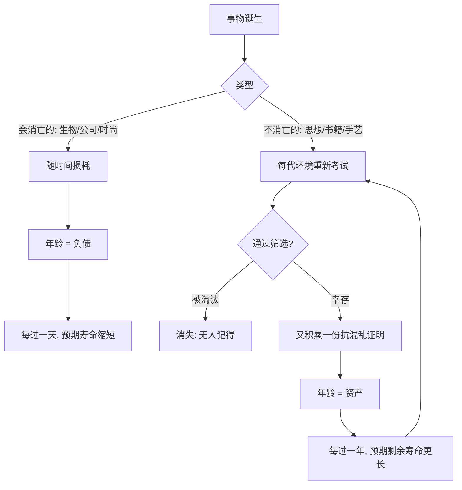

# 13｜林迪效应：为什么时间是反脆弱的裁判？

> 本文要解决的问题：为什么一本书、一门手艺、一个设计活得越久，就越可能继续活下去？「时间是反脆弱的裁判」这句话到底在说什么？

---

## 一、先说结论

塔勒布借用了「林迪效应」这条规律：**对会消亡的事物（人、组织、时尚），每多活一天就离死近一天；但对不会消亡的事物（思想、书籍、技术范式），每多活一年，预期剩余寿命反而更长。**一本书已经印行两千年，它大概率还能再印两千年；一本上周上架的畅销书，预期寿命可能就剩几周。原因很朴素：活到今天的东西，已经在不知不觉中通过了混乱对它的上千次考试——战争、禁毁、技术换代、口味变迁——每一次都没杀死它。时间不是仁慈的老者，是最冷酷的筛选器；而被它筛剩下的，就是反脆弱本身的样子。

## 二、我们先理解一个问题

猜一个游戏。两个东西摆在你面前：一个是刚上市、销量爆火的新产品；另一个是已经存在了一百年、形态几乎没变的老物件。问你哪个十年后还在？

直觉会替新产品说话——它火、它新、它代表未来。但塔勒布让我们反着想：**老物件已经付过一百年的「存活证明」，新产品一张证明都没有。**未来的混乱长什么样没人知道，可对付混乱的最好凭证，恰恰是已经对付过混乱的记录。

问题的关键是：我们平时判断东西能活多久，习惯看「它现在多强」；林迪效应提供了一个完全不同的判据——看「它已经活了多久」。为什么年龄能当寿命的预言家？这就是这一篇要拆的东西。

## 三、作者到底提出了什么观点？

塔勒布的论述分三层。

第一，事物分两类，老化方向相反。第一类是**会消亡的**：生物、公司、机型、时尚——它们随时间损耗，年龄是负债，每过一天预期寿命缩短一天。第二类是**不消亡的信息型存在**：思想、书、食谱、手艺、宗教——它们不磨损，反而被时间打磨；对这一类，年龄是资产，存在越久，预期剩余寿命越长。

第二，他给出机制解释：能穿越时间的东西，必然具备某种对混乱的免疫力。一本书能活两千年，说明它扛住了战争、语言变迁、审查、载体换代（从莎草纸到印刷到屏幕）——每一代环境都重新考过它一次，它每次都及格。**时间筛选不是隐喻，是真实发生过的亿万次淘汰赛。**

第三，塔勒布把这个推到预测层面：预测未来最可靠的启发式不是「想象新东西」，而是「尊重旧东西」——存在了很久的事物很可能继续存在，而「新」本身就是一张没有信用记录的履历。他甚至说，这是对现代性崇拜的一剂解毒药：**我们高估了新颖，低估了幸存。**

## 四、把这个观点翻译成人话

一句话：**对于不会死的东西，年龄就是体检报告——活得越久，证明底子越硬。**

好比招人。一个应聘者拿来的简历金光闪闪但全是这周写的，另一个应聘者材料普通但二十家公司都干了三年以上。你信谁？林迪效应说信后者——不是因为他旧，是因为「活下来」这件事本身需要真本事，而时间已经替你把考试做完了。

反过来，「全新」「颠覆」「史上未有」这些词，在林迪的词典里全是减分项——它们等于在说：此物从未经历过任何一次真正的危机。

## 五、为什么会这样？

机制可以画成这样：

关键点有两个。第一，**幸存本身就是证据**。一本书能活两千年，不是靠运气——两千年的时间窗口里它必然遭遇过无数次可能消灭它的事件，每一次存活都在「抗打击记录」上加一笔。我们看到的是「它老」，实际上是「它考过的试多」。

第二，**这是幸存者偏差的正向用法**。平时我们被警告「别迷信幸存者」；林迪效应反过来：正因为只剩幸存者，它们身上浓缩了全部的抗打击信息。时间替我们做完了一个我们自己做不起的实验——把一样东西扔进几百种不同的混乱环境，看它死不死。

## 六、举一个现实生活中的例子

塔勒布最顺手的就是书的对照。

两千五百年前的荷马史诗，今天还在被阅读、被翻译、被改编；而机场书店里摆在最显眼位置的畅销榜新书——请回忆去年你在机场买的那本，现在还在印吗？大概率已经绝迹。历史事实摆在那里：绝大多数畅销书的生命周期以月计，而《伊利亚特》以千年计。差别不在文笔运气，在**经历的筛选次数**：荷马被几十个文明、几十种语言、无数次禁毁潮考过，每考过一次就多一点「这东西杀不死」的证据。

再看物件。椅子的基本设计——四条腿、一个面、一个靠背——几百年没怎么变，因为它早已被无数次使用场景验证为「够用」，没有一种新生活能把它淘汰。手机呢？机型以年甚至以季度换代，去年旗舰今年过时。**会消亡的技术每过一天就更接近淘汰，经过时间打磨的设计每过一年更巩固位置。**同一逻辑，塔勒布推到一个很实用的结论：想知道十年后什么还在，别看发布会，看博物馆和旧物店——那里陈列的都是考试及格的东西。

## 七、回到书中重新理解

这时回看全书，林迪效应其实是「反脆弱」的时间维度的显影。

第一篇说：反脆弱的东西随时间变好。林迪效应把这句话变成了可操作的判据——**一个东西随时间变好的证据，就是它居然还在。**这也给「为什么要尊重传统」提供了一个不诉诸情怀的理由：传统是时间筛选的结果集，里面是无数被淘汰选项的尸体堆出来的经验。塔勒布并不是守旧派——他只是指出，「新」和「好」之间没有逻辑通道，而「久」和「韧」之间有。

## 八、这个观点背后还有什么？

第一，林迪效应把反脆弱从空间扩展到时间：杠铃是空间上的配置（两头押注），林迪是时间上的配置（押注已被时间证明的东西）。两者合起来是同一个哲学——**不预测，用幸存当证据。**

第二，它隐含一种知识观：古老的做法能留存，往往因为其中包裹着我们还说不清原理的合理性——比如各地饮食里的发酵、腌制、斋戒，科学很晚才追上。这为塔勒布「实践先于理论」的立场又加了一块砖：时间知道得比理论多。

第三，它给「快时代」提供了一个减速的判据。在追逐新事物的狂热里，林迪是一盆冷水：绝大多数「新」会在第一次危机里消失，而你为追逐它付出的成本收不回来。

## 九、这个观点有问题吗？

说服力方面：数学上「林迪效应」有严格对应——对某些没有内在寿命上限的对象，条件预期寿命确实随年龄增长；畅销书与经典的存活率对比符合出版业数据；「幸存当证据」的推理在统计上站得住。

但争议和简化同样明显。第一，林迪效应**不适用于会消亡的事物**——一个人活了八十岁不代表还能再活八十岁；塔勒布自己强调了这条边界，但读者极易把「老公司」「老制度」也套进林迪，而实际上组织是会消亡的，老公司可能只是「还没死」而非「杀不死」。第二，「幸存当证据」有自证循环的风险：有些旧物存续是因为权力保护、路径依赖或纯粹惯性，而非内在的抗混乱性——一部作品靠教科书强制阅读续命，和靠真实价值流传，是两种完全不同的幸存。第三，一些学者认为塔勒布对「新」的贬低不对称：林迪能告诉你什么会留下，但无法告诉你什么会诞生——如果人人都按林迪配置，创新和革命将无从谈起，而历史上恰恰是「未经时间检验的新东西」改写了世界。第四，预测意义上的林迪是启发式而非定律：「预期寿命更长」不等于「永生」，经典也会死，只是死得慢。

所以准确读法是：**林迪是给「旧」的信用背书，不是给「新」的死刑判决**——它擅长识别「什么大概率还在」，不擅长识别「什么值得开始」。

## 十、今天再看这个观点

以下部分是基于作者思想的现代延伸，不是作者原话。

信息过载时代，林迪效应几乎成了一种信息节食法：面对每天涌来的热搜、爆文、新概念，一个简单的过滤器是「这东西五年前存在吗？五年后还会存在吗？」大部分内容两个答案都是否——这提示我们可以安心忽略它们。把时间当筛选器，等于免费雇用了史上最严的编辑。

技术圈也在重新发现它：选择技术栈时「选 boring technology（无聊但成熟的技术）」的思潮，本质是林迪的工程版——经受过十年生产环境拷打的工具，大概率还能再扛十年，而上周刚发布的新框架没有任何危机记录。同样，加密货币狂热中「比特币已存活十五年」被其支持者反复引用为林迪证据——这是把它当论战武器的典型用法，也提醒我们：林迪是概率论证，不是存活的保票。

## 十一、这一篇真正应该记住什么？

1. 两类事物老化方向相反：会消亡的每过一天接近死亡，不消亡的每过一年预期寿命更长。
2. 林迪效应的机制：活到今天 = 已经通过上千次混乱的考试，幸存本身就是抗打击的证据。
3. 荷马两千年后还在读，机场畅销书一年后绝迹；椅子百年不变，手机年年换代。
4. 「新」是没有信用记录的履历，「久」是被时间盖章的韧性——预测未来，先看博物馆。
5. 林迪是启发式不是定律：它不适用于会消亡的对象，也不为「新」判死刑。

## 十二、留一个问题

时间这把尺子量的是身外之物——书、技术、制度。那内心呢？当失业、破产、失去真正砸到头上，有没有一套方法，能让「我」这个会消亡的个体在心理层面也变得反脆弱？塔勒布翻出了一套两千年前的手册——斯多葛派。他们为什么教人在睡前预演失去？下一篇，我们来看这套经受住林迪考验的心理体操。
