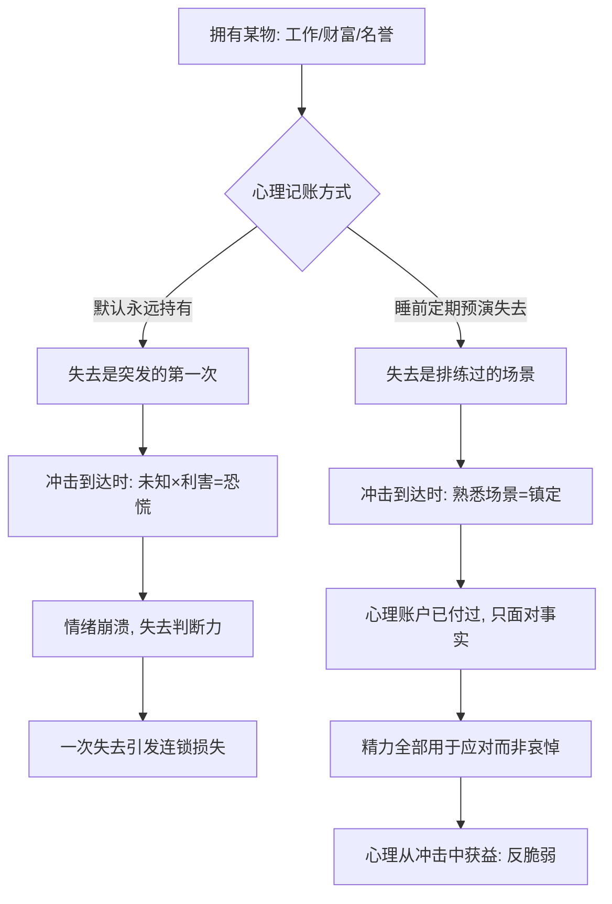

# 14｜斯多葛派手册：为什么「先想象失去」让你更强？

> 本文要解决的问题：斯多葛派睡前「预演失去」的练习到底是什么？为什么塔勒布认为它能把人的心理从脆弱改造成反脆弱？

---

## 一、先说结论

斯多葛派最反直觉的练习是：**在一切安好的时候，主动想象失去**。睡前花几分钟，把工作、财富、名誉、健康在脑海里「先亏掉一遍」。塔勒布认为，这不是悲观，而是一套把心理改造成反脆弱的技术：失去一旦被反复预演，就从「未知的恐惧」变成「熟悉的场景」——真出事时，心理账户已经付过这笔钱，现实里就再无可失。这和杠铃是同一个结构：情绪上先接受最坏的一头，行动上反而能放开手脚。

## 二、我们先理解一个问题

先想清楚：我们到底在怕什么？

被裁员可怕，但仔细拆，可怕的不完全是「没收入」这个结果，而是它的突然、陌生、失控。同一件事，第一次撞上是灾难，第一百次撞上只是流程。恐惧的能量，很大一部分来自「从未见过」——它是未知场景乘以利害程度的乘积。

问题在于，大多数人的心理是脆弱的：每一份资产、每一段关系，都默认「永远不会失去」地持有。于是任何一次失去都是第一次，每次都要从零开始学习面对。损失本身有下限——最多失去这份工作；但对损失的想象没有下限——它可以整夜整夜地发酵。

有没有办法，把「第一次」提前到安全的时刻？

## 三、作者到底提出了什么观点？

塔勒布在书中给了斯多葛派整整一章的篇幅，而且态度少见地赞赏。他认为，斯多葛派不是教人「忍耐痛苦」的哲学，而是一套**驯化下行风险的情绪工程学**。

其核心练习，后人称为「消极想象」（预演恶事）：定期在想象中失去你拥有的东西——财产、地位、健康、亲人——然后问自己：真发生了，会怎样？

塔勒布对这一练习的解读很关键：斯多葛哲人的做法是**先在心理上把一切都注销**。当你在心里已经「失去」了财富，现实中持有它就变成了纯粹的额外收益——不可能亏，只可能赚。他称之为一种心理上的杠铃：把最坏结果先在情绪里结清，剩下的就全是上行空间。

他还强调一个容易读漏的点：斯多葛派并不主张消灭情绪，而是主张**驯化情绪**——把恐惧转化为谨慎，把痛苦转化为信息，把愤怒转化为修正的动力。情绪不是敌人，未经训练的情绪才是。

## 四、把这个观点翻译成人话

用大白话说：**心理先亏一遍，现实就亏不到你。**

这就像消防演习。大楼从没失过火，为什么还要定期拉警报？因为真正的火灾里，死人的往往不是火，是慌乱——找不到出口、挤成一团、大脑空白。演习的作用不是防火，是让「火灾」这个场景在你脑子里先跑过几百遍，真出事时身体知道往哪走。

斯多葛的睡前练习是同一套逻辑：在安全的床上，让「失去」这场火灾先在脑海里烧一遍。烧过几十次之后，恐惧被脱敏了——不是因为你变麻木了，而是因为那个场景对你来说已经不再是「未知」。

还有一层更精明的账：凡是你在心里已经注销的东西，现实中它就伤不到你第二次。恐惧按次收费，预演是一次性买断。

## 五、为什么会这样？

塔勒布的推理链条大致是：

机制上拆两层。

第一层是**脱敏**：恐惧的大小取决于场景的陌生程度。反复想象同一个坏结果，它的「冲击值」会逐次递减——这叫习惯化，是暴露疗法的底层原理。

第二层是**记账方式的重构**：行为经济学的研究（卡尼曼等人的损失厌恶研究）表明，人对损失的痛苦远大于同等收益的快乐。斯多葛练习的狠处在于，它把「潜在损失」提前转记为「已发生损失」——你不再「持有」那份工作，而是「曾经失去、如今暂借」。参照点一旦下移，现实里发生的任何事都只会好于预期。

塔勒布认为，这就是情绪层面的凸性：最坏结果已在心理账户结清，剩下的全是不对称的上行。

## 六、举一个现实生活中的例子

看塞内卡本人怎么做——这是塔勒布最爱用的例证，而且是历史事实。

塞内卡是罗马巨富、皇帝的顾问，按说全世界最有资格躺平的人就是他。但在他写给卢西利乌斯的信（《道德书简》）里，他记录了自己的日常练习：**定期过几天贫困生活**——睡硬板床，吃最粗的面包，穿粗糙的衣服，然后问自己一句：「这就是我所害怕的吗？」

注意这个设计的精妙处：他不是想象贫困，是**真实演练贫困**。几天下来他发现，最坏的那个场景住进去也不过如此——能睡、能吃、能思考。恐惧最怕被「实地勘察」，一勘察就发现它标注的灾难区其实可以住人。

另一件事是睡前的「心理结算」：躺下后过一遍——如果明天失去工作怎么办？失去财富呢？名誉扫地呢？不是祈祷这些不发生，而是把每一种「发生」都在脑子里走一遍，走到能接受的那一步再睡。日复一日，每件可怕的事都从「没见过的怪物」变成「见过的邻居」。

后来塞内卡被尼禄赐死。史载他死得相当镇定——一个演练了一辈子失去的人，最后连死亡也是赴约，不是受袭。

## 七、回到书中重新理解

现在再看塔勒布为什么给斯多葛派单独立传，就清楚了：他需要的不是一套道德哲学，而是一个**已经运行了两千年的反脆弱操作系统**。

斯多葛练习的结构和全书所有工具是同一个：杠铃是把资产配置成「极安全＋极激进」，预演失去是把心理状态配置成「最坏已接受＋现实全参与」；减法是从生活里删掉有害物，消极想象是从恐惧里删掉「未知」这个成分；毒物兴奋效应是给身体小剂量压力，睡前演练是给情绪小剂量压力。

所以塔勒布那句反复出现的判断在这里落地了：反脆弱不是一种性格，是一套协议。塞内卡并不比你我天生淡定，他只是每天给心理上一次「小剂量的失去」。

## 八、这个观点背后还有什么？

往下挖有三层。

第一，它揭示了恐惧的账本结构。未发生的损失之所以比已发生的损失更折磨人，是因为「潜在」可以无限繁殖——一个未发生的失业能衍生出一百种想象。预演的作用是把无限的「潜在」压缩成有限的「场景」，心理账目从不可计算变成可计算。

第二，它是杠铃策略在情绪维度的投影。杠铃要求一头极端安全、一头极端激进，拒绝中间；消极想象要求心理上极端悲观（全部亏掉）、行动上极端投入，拒绝「半担心半持有」的黏糊状态——那种状态两头的好处都拿不到，两头的坏处都占全。

第三，关于它的现代传承，学界有相当一致的考证：认知行为疗法的创始人们公开承认受斯多葛派影响，爱比克泰德那句「困扰人的不是事情本身，而是人对事情的看法」几乎是认知疗法的纲领。一些学者认为，斯多葛是古代世界里最接近现代临床心理学的一脉。

## 九、这个观点有问题吗？

有说服力的地方是实的：脱敏和习惯化是心理学里证据最硬的机制之一；「参照点下移」确实能改变损失的主观体验；练习本身零成本、门槛极低，且在表演心理学、竞技体育里早就是常规动作。

但边界也要说清。第一，**脱敏和反刍只有一线之隔**：对容易焦虑、有抑郁倾向的人来说，反复想象坏结果可能不是在脱敏，而是在喂养反刍思维——同一个动作，对不同的心理结构效果相反。第二，有些失去无法被预演。关于丧亲之痛，学界存在不同解释：有研究认为预期性悲伤能缓冲冲击，也有研究认为它对真实悲伤的缓冲非常有限——想象失去亲人，和真的失去，中间的沟壑可能填不平。第三，存在替代解释：消极想象带来的收益，也许不主要来自「恐惧脱敏」，而是来自感恩——想象失去让你重新意识到「现在还有」，这是当下幸福的增强器，机制完全不同。第四，塔勒布对斯多葛的征用是选择性的：一些古典学者指出，历史上的斯多葛主义还有顺从命运、看淡世俗的一面，曾被批评为给权贵阶层的心理安慰剂；塔勒布取的是「下行风险管理」这一工具面，扔掉了它的形而上学底盘——这个读法有用，但不是完整的斯多葛。

所以准确的定位是：它是一套针对「可控想象」的情绪训练协议，不是对一切心理痛苦的通用解药。

## 十、今天再看这个观点

以下部分是基于作者思想的现代延伸，不是作者原话。

这套练习在今天换了几套马甲，但都活着。管理学里的「事前验尸」——项目启动前先假设它已经失败，倒推死因——就是消极想象的组织版。运动员和外科医生的「心理演练」、谈判前的「最坏情况清单」、消防员和飞行员的模拟训练，全是同一个协议：在安全的时刻，先付一遍失败的账。

也有一种温和版的当代实践：写「失去日记」，每周记录一件「如果它没了会怎样」的事。它的收益也许不是脱敏，而是前面说的感恩效应——但无论走哪条机制，效果同向：被认真想象过失去的东西，会被更认真地持有。

## 十一、这一篇真正应该记住什么？

1. 斯多葛的核心练习是「预演失去」：在安好的时候，主动想象失去拥有的一切。
2. 恐惧 = 未知 × 利害；预演消灭的是「未知」那一项，利害不变，恐慌大减。
3. 心理上先把最坏结果结清，现实里就只剩上行空间——这是情绪的杠铃，也是情绪的凸性。
4. 塞内卡身为巨富仍定期睡硬床、吃粗粮，问「这就是我所怕的吗」——恐惧最怕实地勘察。
5. 它对容易反刍的人可能适得其反，对无法预演的失去作用有限——是协议，不是万灵药。

## 十二、留一个问题

今晚睡前，试着做一遍：你最依赖的一样东西——工作、关系、身份——如果明天没了，你的第一个小时会做什么？能想到答案，说明那个场景已经开始脱敏；想到一片空白，说明你正抱着一笔从未被审计过的心理负债。

到这里，反脆弱的最后一块拼图落了位：身体可以靠小剂量压力变强，资产可以靠杠铃配置变强，心理可以靠预演失去变强。但单个零件都强还不够——如果整个生活、整个组织本身就被设计成「讨厌混乱」的结构呢？下一篇，也是收尾的一篇，我们把全书收拢成一个问题：怎样设计一个欢迎混乱的系统？
