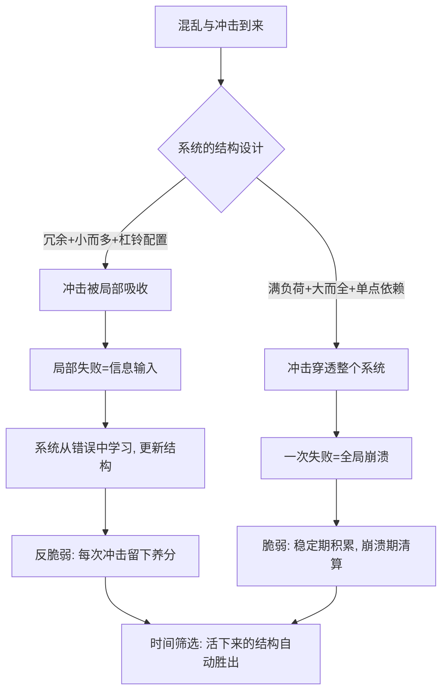

# 15｜如何设计一个欢迎混乱的系统？

> 本文要解决的问题：把《反脆弱》全书收拢成一句话——怎样让混乱为你工作，而不是对抗你？

---

## 一、先说结论

一个欢迎混乱的系统，长这样：**留有冗余而不是满负荷运转，用杠铃配置代替温和中庸，由小而多的单元组成而不是大而全的整体，让局部的小失败给整体输送信息，最后让时间来裁判。**这五条是同一个原则的五个侧面：既然无法预测冲击何时来、从哪里来，就把结构设计成「任何方向的冲击都代价有限、收益可能无限」。混乱不是要规避的风险，是要接入的能源。

## 二、我们先理解一个问题

先承认一个反复上演的悖论：我们拥有的控制手段越来越多，系统却似乎越来越脆。

精心优化的供应链，被一艘搁浅的船卡断；满负荷运转的医院，被一波流感挤穿；杠杆拉到极限的金融体系，被一次房价回调推倒。每一次，设计者都在解决上一个问题，却让系统对下一个问题更脆。

根子在设计的出发点错了：我们习惯问「怎样防止坏事发生」，这个问题预设了坏事可以被预知。但塔勒布的整个论证是：真正伤你的事，恰恰是你没预见的那些。防得住的不叫黑天鹅，黑天鹅永远来自名单之外。

那正确的问题是什么？——「无论发生什么，怎样让结果对我有利？」把问题从「预测」换成「结构」，这就是反脆弱系统设计的全部起点。

## 三、作者到底提出了什么观点？

塔勒布没有给出一张「设计图纸」，但全书散落的原则收拢起来是一套清晰的设计哲学：

第一，**冗余优于效率**。大自然是最资深的反脆弱工程师，它的方案从来不是「刚刚好」——两个肾、两个肺、超额的大脑容量。冗余在平时是浪费，在危机里是命。满负荷的系统没有应对意外的余量。

第二，**杠铃优于中庸**。把资源压在两头——极端安全打底，极端冒险博上限——避开那个「看起来稳健、实则两头不靠」的中间地带。

第三，**小而多优于大而全**。规模是脆弱性的放大器：大系统死一次是全灭，小单元死一个是迭代。把系统拆成可以独立失败、独立替换的模块。

第四，**让局部失败供养整体**。错误不是要避免的，是要「便宜地犯」的——每一次小失败都是一条信息，喂给系统学习。代价是：必须接受个体单元的牺牲。

第五，**选择权优于预测**。不去猜未来，而是占据「赌错代价小、赌对赚翻天」的位置——保留多个可切换的选项，让未来自己揭示哪个对。

第六，**时间优于论证**。一个设计好不好，不看理论多漂亮，看它能活多久、经历过多少次混乱。活得久的结构里已经写满了答案。

## 四、把这个观点翻译成人话

用一句话说：**不要对着风暴修墙，要对着风暴造风车。**

一个欢迎混乱的系统像一套好的健身计划加一份好的投资组合：它平时故意保留余力（冗余），大部分资产放在死也亏不掉的地方、小部分放在能赚翻的地方（杠铃），由很多个互不牵连的小单元组成（小而多），每次小磕小碰都让它学到东西（局部失败喂养整体），并且它的一切设计都交给时间来验证。

反过来，脆弱系统的画像也很好认：预算精确到分、日程排满到分钟、所有环节环环相扣缺一不可、任何意外都算「计划外」——它的高效，本质是把所有弹性都提前消费掉了。

## 五、为什么会这样？

设计原则的底层是一条统一的逻辑：

链条上的关键是三处不对称。

第一处：**错误的不对称**。小而多的系统里，错误的代价是有上限的（死一个单元），信息的收益是没有上限的（教训推广到全体）。大而全的系统正好倒过来：错误代价无上限，学到的教训却常常因为「系统太大改不动」而无法变现。

第二处：**时间的不对称**。冗余和余量在太平年月里显得像成本，所以效率导向的设计总倾向于把它砍掉——这就是脆弱性积累的过程。冗余的真实身份是期权费：平时付一点溢价，买的是黑天鹅来临时「还能继续玩」的权利。

第三处：**方向的不对称**。脆弱系统需要环境配合它（别波动），反脆弱系统可以配合任何环境（波动是输入）。前者是把自己的命运外包给了世界的稳定性，后者是把命运收回自己手里。

## 六、举一个现实生活中的例子

把这几条原则装进三个最日常的系统，长这样：

**家庭财务的杠铃**。塔勒布给出的建议大致是：把大部分钱放在极端安全的地方——现金、短期国债这类「怎么折腾都不会归零」的资产；剩下的一小部分，投进高风险、高上限的地方。这个结构里，最坏情况是小比例全亏光——上限已知、可承受；最好情况没有顶。而绝大多数人的实际配置落在中间：半安全的理财、半冒险的股票——既不够安全扛住崩盘，也不够激进抓住惊喜。中庸在这里是最脆弱的位置。

**身体的毒物兴奋效应**。身体的训练就是一台「欢迎混乱」的机器：举重用撕裂换肌纤维增粗，间歇性禁食和寒冷暴露用小剂量的代谢压力换修复系统升级。每次训练都是一次可控的「局部失败」，恢复之后身体比上次强一点。反面教材是熬夜加班——那不是压力训练，是不间断的损耗：没有剂量、没有恢复、没有超额修复。

**职业与技能的多选择权**。不把人生押在一个雇主、一个行业、一种技能上。一份保底的主业打底，加上若干低成本试错的方向——副业、跨领域技能、随时能变现的手艺。这样布局的实质是持有一把期权：任何一个方向爆发都能接得住，任何一个方向塌方都不至于归零。塔勒布反复强调，单点押注的问题不在风险高，在于**错误不可逆**——可逆性是反脆弱设计的硬指标。

三个例子里同一个动作反复出现：先给最坏情况封顶，再对最好情况敞开。

## 七、回到书中重新理解

读到这里再回看全书，会发现塔勒布的每一个工具都是这套设计哲学的一个切面：

凸性回答「目标形状」——损失有下限、收益无上限；杠铃回答「资源配置」——两头下注、放弃中间；减法回答「改进路径」——删掉坏的比加进好的更确定；无为回答「干预纪律」——系统的自愈比你的聪明可靠；林迪效应回答「验收标准」——交给时间，不看广告看寿命。

换句话说，《反脆弱》不是一本讲「某种性质」的书，是一套设计语言的语法书。脆弱和反脆弱的区别，到最后不是运气好坏，是**架构差异**——一个在建造时就决定了它怎么对待意外。

## 八、这个观点背后还有什么？

三层。

第一，它其实是一种认识论立场。接受「无法预测」不是认输，是更诚实的起点：既然算不出未来，就把精力放在能控制的东西上——结构、配置、可逆性。塔勒布反复说，他不需要知道哪匹马会赢，只需要保证无论哪匹赢自己都亏得起。

第二，它把效率与韧性重新摆上了天平。过去几十年的主流设计哲学是效率优先——准时制生产、精益管理、零库存。反脆弱视角指出，这些优化的本质是**把冗余变卖成当期利润**：账好看了，命变薄了。效率和韧性不是免费共存的，每个系统都在两者之间选了一个点，只是大多数人不知道自己选过。

第三，它埋着一根没拔掉的伦理刺：「让局部失败供养整体」在抽象层面很漂亮，但落到地面上意味着有人要当那个「局部」。餐馆倒闭成就餐饮业的繁荣，可倒闭那家的员工不这么看。设计一个欢迎混乱的系统，绕不开一个问题：混乱的账单寄给谁？

## 九、这个观点有问题吗？

这套设计哲学有相当的说服力：韧性工程、生态学、演化生物学的独立研究都得出了高度同构的结论——冗余、模块化、多样性是真实系统扛住冲击的共同特征。这不是塔勒布一家的洞见，是多学科交叉验证过的规律。

但几处必须敲一敲。

第一，**冗余不是免费的**。冗余意味着闲置产能、资金占用、机会成本——对资源本就紧张的家庭和组织，「留冗余」可能是奢侈品。塔勒布对冗余成本的讨论偏原则化，具体留多少、留在哪里，没有公式。第二，「小而多」有一个致命例外：**相关性问题**。一万家小银行如果持有同样的资产、暴露在同样的风险下，危机来临时会一起倒——单元多不等于风险分散，2008 年就是无数小单元高度同质化后的大崩溃。第三，「局部失败供养整体」存在幸存者偏差：我们看到的是失败供出了繁荣的行业，看不到的是失败供出一地鸡毛的行业——失败能不能变成信息，取决于系统有没有能力「读取」它，这一点塔勒布讲得不够。第四，关于毒物兴奋效应，学界存在不同解释：小剂量压力的获益窗口在毒理学上至今争议不断，把它从特定物质推广到「一切压力皆营养」，是过度外推。第五，这套框架对个人处境的假设偏高：它预设你有足够的资源、时间和心理余量去「布局选择权」，而对被生存线追着跑的人来说，单点押注常常不是选择，是没得选。

所以更准确的说法是：这是一套对有资源、有选择权的人极其有效的设计启发式，不是普适的生存指南。

## 十、今天再看这个观点

以下部分是基于作者思想的现代延伸，不是作者原话。

成书之后的十几年，这套设计哲学在好几个领域长出了自己的工程实践。软件业的「混沌工程」是最直白的后代：奈飞主动在生产环境里随机关掉服务器，用人为制造的小混乱逼系统长出容错——「让局部失败供养整体」的直接产业化。供应链领域在疫情后集体转向：从极致精益改回多供应商、安全库存、产地分散——冗余重新被写进设计标准。职业发展上，「多技能组合」「可迁移能力」成了对抗行业震荡的主流建议，本质是选择权思维在简历上的落地。

值得注意的一个新问题是：当「反脆弱」成为流行词，它也面临被稀释成口号的风险——挂个新名词不代表留了真冗余。检验标准仍然是塔勒布式的：看一次真的混乱来了，它是胖了还是瘦了。

## 十一、这一篇真正应该记住什么？

1. 欢迎混乱的系统五条原则：留冗余、用杠铃、小而多、让局部失败供养整体、把时间当裁判。
2. 设计问题的正确提法不是「怎样防止坏事」，是「怎样让任何事的结果对我有利」。
3. 冗余是期权费不是浪费；中庸两头不靠，是最危险的位置；可逆性是硬指标。
4. 三个日常落地：财务杠铃、身体小剂量压力、职业多选择权——共同动作是先给最坏封顶、再对最好敞开。
5. 这套哲学有边界：冗余要付费、小单元会共振、失败不自动变信息——它是启发式，不是自动提款机。

## 十二、留一个问题

环顾你手边最大的三个系统——钱、身体、工作——各自问一遍：最坏情况封顶了吗？有任何一次小失败能让它学到东西吗？如果明天来一场意料之外的混乱，它是蜡烛还是火？

问到这里，其实已经不是在问系统了，是在问你愿意成为哪种东西。风不会停，问题只剩下：你要做被吹灭的那个，还是被助燃的那个？

## 系列收束

一路走到这里，回到最初的那句话：风可以吹灭蜡烛，却助燃烈火。

全书的第一块基石，是修正一个几乎人人默认的错觉——**脆弱的对立面不是坚固，是反脆弱**。坚固只是「扛住」，最多原地踏步；反脆弱是「利用」，才在时间中增值。一字之差，隔的是两种世界观：一种把未来当敌人，一种把未来当礼物。

沿着这条主线，塔勒布给出的其实是一套完整的方法：用凸性保证「错得起、赢得大」，用杠铃配置风险，用减法和无为戒掉自作聪明的干预，用「小而多」换取可逆性，用时间的筛选代替论证的雄辩，最后用斯多葛的练习把心理也纳入同一套协议。每一步都在重复同一个动作：**停止预测，开始设计。**

但合上书之后，真正的工作才刚开始——这本书最不该被当成新的教条。塔勒布本人最反感的就是不经检验的权威，包括他自己。所以更好的读法是：把这些问题带回你自己的生活里逐一验证——你的财务、身体、职业、组织，分别在蜡烛与火的光谱上站在哪里？哪些「保护」其实是在抽走压力？哪些「效率」其实是在变卖冗余？

答案不会从书里长出来，要从你下一次真实的混乱里长出来。风一直在吹。祝你是火。
