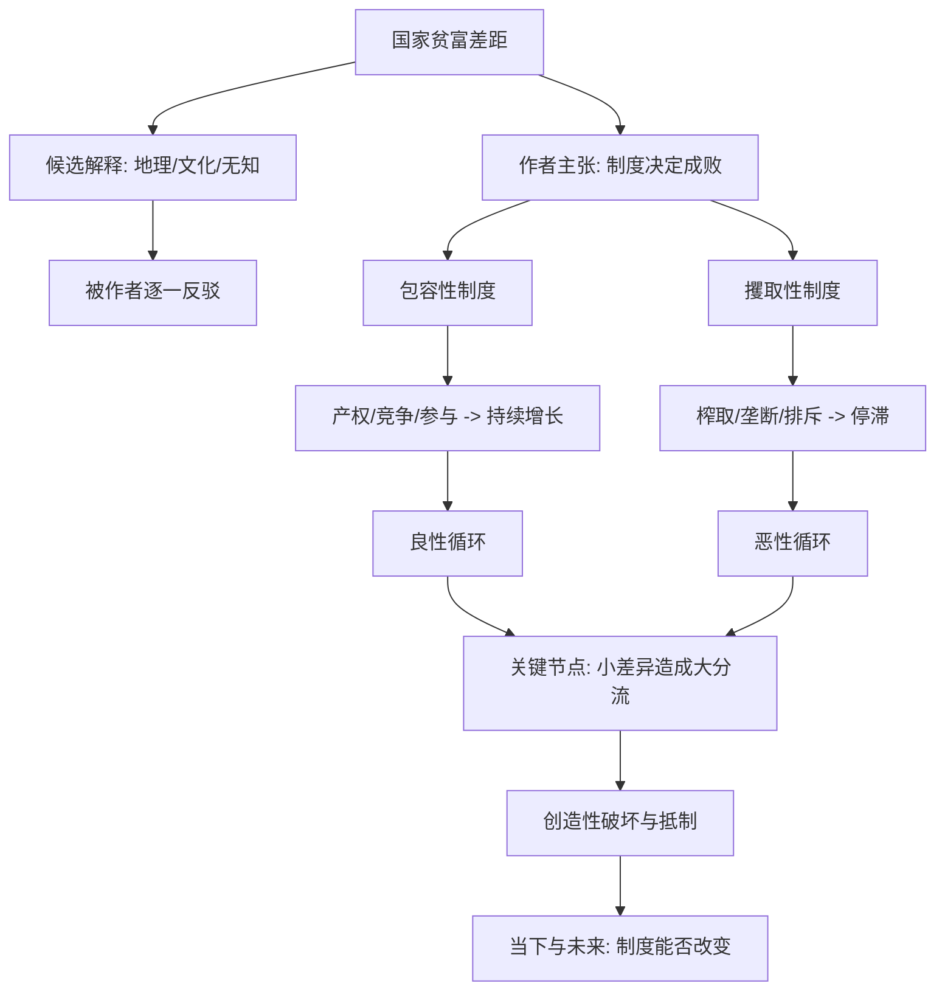

# 《国家为什么会失败》深度解读系列

## 系列简介

《国家为什么会失败》是诺奖经济学家阿西莫格鲁与政治学家罗宾逊的代表作（2024 年诺奖使这本书再度大热）。它要回答的是一个最古老、也最要紧的问题：**为什么有的国家富裕，有的国家贫穷？**

作者的答案锋利而单一：**制度决定成败。** 他们用一对核心概念解释世界——"包容性制度"让多数人参与并分享成果，"攫取性制度"让少数人榨取多数人。前者带来持续增长与创新，后者带来停滞与内耗。地理、文化、气候、乃至"统治者不懂经济"，都被他们逐一驳为次要解释。

他们还解释了一个更难的谜题：坏制度为什么能长期维持？答案是恶性循环；好制度又为何能延续？答案是良性循环；而真正打开分岔口的，往往是历史中的"关键节点"。

本系列围绕 **16 个核心问题**，从问题的提出、制度的力量，讲到制度如何形成、如何反驳其他解释，最后落到当下与未来。需要注意的是：书中涉及中国的部分争议很大，本系列会**明确区分作者观点与学界争论**，不替任何一方下结论。

---

## 全书核心问题

| 层次 | 问题 |
|---|---|
| 问题问题 | 为什么有的国家富、有的国家穷？ |
| 解释问题 | 地理、文化、气候能解释贫富差距吗？ |
| 制度问题 | 包容性/攫取性制度如何决定成败？ |
| 形成问题 | 好制度与坏制度如何产生、又如何自我延续？ |
| 争论问题 | 这些解释有多大说服力，又有哪些争议？ |

---

## 全书知识地图



---

## 全系列目录

### 第一部分：问题的提出

#### 01｜为什么有的国家富、有的国家穷？

核心问题：全球贫富差距到底有多大，又为什么如此顽固？

核心观点：同一天空下，韩国与朝鲜、诺加利斯两侧的美国与墨西哥，收入与生活水平判若两个世界。作者指出：这种差距不能简单归因于人的聪明与否，而要从"他们生活在什么规则之下"去解释。全书的核心命题由此展开：贫富的根源是制度。

理解难度：★★☆☆☆

关键词：贫富差距、韩国与朝鲜、诺加利斯、制度

---

#### 02｜地理、文化、气候能解释贫富差距吗？

核心问题：富国多在温带、穷国多在热带，这是巧合还是原因？

核心观点：作者逐一检验三大流行解释——地理假说（气候、资源、疾病）、文化假说（价值观、宗教、勤奋）、无知假说（统治者只是不懂正确政策）——并认为它们都无法解释关键证据。热带国家有富的（新加坡），资源丰富的国家有穷的，文化相同的地区结果也可能相反。

理解难度：★★★★☆

关键词：地理假说、文化假说、无知假说、反例

---

#### 03｜“制度决定论”到底在说什么？

核心问题：为什么作者把一切归结到"制度"这一个变量上？

核心观点：作者主张：决定国家命运的是人为设定的规则——包括经济制度（产权、竞争、准入）与政治制度（权力如何分配、如何约束）。这些规则决定人们是"努力做大蛋糕"还是"想方设法分蛋糕"，进而决定长期增长。这是一个大胆而集中的解释。

理解难度：★★★★☆

关键词：制度、规则、激励、决定论

---

### 第二部分：制度的力量

#### 04｜什么是“包容性制度”？

核心问题：什么样的制度能让一个国家持续繁荣？

核心观点：包容性制度包括：保护产权、允许自由竞争与新企业进入、让多数人有机会参与经济并分享成果，以及与之配套的政治参与和权力制衡。它的核心是**让创新有利可图、让成果被广泛分享**，从而把个人逐利转化为社会增长。

理解难度：★★★☆☆

关键词：包容性制度、产权、竞争、参与、共享

---

#### 05｜什么是“攫取性制度”？

核心问题：坏制度为什么短期内也能让少数人暴富，却让整体停滞？

核心观点：攫取性制度的设计目标不是把蛋糕做大，而是**把蛋糕从多数人手里转移到少数人手里**：垄断、强制劳动、准入限制、排斥多数人参与政治。它能在短期榨取大量财富，却压制创新与投资，最终让国家失去长期增长的能力。

理解难度：★★★★☆

关键词：攫取性制度、榨取、垄断、排斥、停滞

---

#### 06｜为什么一墙之隔，却天差地别？

核心问题：同一片土地、同一群人，为什么会有截然不同的命运？

核心观点：诺加利斯横跨美墨边境，同一座城市的两侧，一侧富裕安全、一侧贫困动荡。作者用它说明：差别不在人种、气候或文化，而在**两侧运行的法律、产权、公共服务等制度不同**。这是全书最有冲击力的自然实验。

理解难度：★★★☆☆

关键词：诺加利斯、边界、对照、制度差异

---

#### 07｜政治制度和经济制度是什么关系？

核心问题：经济制度由谁决定？为什么政治制度更根本？

核心观点：作者强调，经济制度并非自然形成，而是由政治制度决定——谁掌握权力、权力如何被约束，决定了经济规则会偏向多数人还是少数人。因此，要理解一个国家的经济失败，往往要回到它的政治结构。攫取性政治制度与攫取性经济制度常常互相支撑。

理解难度：★★★★★

关键词：政治制度、经济制度、权力、制衡

---

### 第三部分：制度如何形成

#### 08｜什么是“关键节点”？

核心问题：为什么相似的社会，会在某一刻走向完全不同的道路？

核心观点：关键节点指那些打破现有平衡的重大冲击（瘟疫、战争、革命、技术变革）。它让社会面临"重新选择规则"的窗口；此时微小的差异都可能被放大成长期的分流。黑死病后西欧与东欧的不同走向，是经典案例。

理解难度：★★★★☆

关键词：关键节点、冲击、分岔、路径依赖

---

#### 09｜为什么坏制度会自我强化？

核心问题：攫取性制度明明是坏的，为什么能维持那么久？

核心观点：恶性循环：既得利益者用攫取的资源巩固权力、排斥对手、压制竞争；权力又让他们继续攫取。于是制度越坏，越难被推翻。打破它，往往需要外部冲击或"关键节点"。

理解难度：★★★★☆

关键词：恶性循环、既得利益、路径依赖、固化

---

#### 10｜为什么好制度也会延续？

核心问题：包容性制度凭什么能稳定地维持下去？

核心观点：良性循环：包容性政治制度分散权力、限制任意掠夺，从而保护了经济上的包容性；经济繁荣又让更多人支持这套规则，形成正反馈。它不完美，但比攫取性制度更有韧性。

理解难度：★★★★☆

关键词：良性循环、正反馈、权力分散、韧性

---

#### 11｜“创造性破坏”为什么会被抵制？

核心问题：技术进步明明是好事，为什么总有强大的力量反对它？

核心观点：创新是"创造性破坏"——它创造新产业，也摧毁旧利益。因此既得利益者会动用政治力量抵制新技术（从历史上的手工业者到今天的垄断行业）。包容性制度的价值之一，就是**让抵制无法轻易成功**。

理解难度：★★★★☆

关键词：创造性破坏、抵制、既得利益、创新

---

### 第四部分：反驳与案例

#### 12｜地理假说为什么站不住脚？

核心问题：如果财富来自资源与气候，为什么同样的资源会带来相反的命运？

核心观点：作者用反例反驳地理决定论：博茨瓦纳依靠钻石走向稳定与发展，塞拉利昂的钻石却引发了内战；新加坡资源匮乏却极度繁荣。可见资源本身不决定结果，如何分配与使用资源的制度才决定结果。

理解难度：★★★☆☆

关键词：地理假说、资源诅咒、博茨瓦纳、塞拉利昂

---

#### 13｜文化假说为什么站不住脚？

核心问题：如果贫穷是文化的错，为什么"同文同种"会走出不同结果？

核心观点：作者指出：东德与西德、韩国与朝鲜，文化、语言、出身几乎相同，却因制度不同而结果迥异。文化会变化，也会被制度塑造，因此很难成为财富差距的根本解释。这一判断在学界仍有争议。

理解难度：★★★★☆

关键词：文化假说、东德西德、韩国朝鲜、争议

---

#### 14｜为什么援助常常失败？

核心问题：外来援助那么多，为什么很多穷国依然穷？

核心观点：作者认为：如果援助被投入攫取性制度中，它只会强化既得利益、被少数人截留，甚至加剧冲突。有效的援助必须与制度改革配合——否则就是往坏规则的漏斗里倒钱。

理解难度：★★★★☆

关键词：援助、制度环境、截留、改革

---

#### 15｜威权体制能实现持续增长吗？

核心问题：一些威权国家经济高速增长，是否推翻了"制度决定论"？

核心观点：作者认为：威权体制可能通过集中资源实现"追赶型"增长，但由于压制创造性破坏与创新，长期难以持续。这一判断极具争议——支持者认为它解释了增长的天花板，批评者则认为它低估了不同体制的适应能力。

理解难度：★★★★★

关键词：威权增长、追赶、创新、可持续性、争议

---

### 第五部分：当下与未来

#### 16｜贫富差距能缩小吗？

核心问题：制度既然决定成败，那么落后国家还有没有机会翻身？

核心观点：作者给出的路径是：在关键节点上推动制度向包容性转变——扩大政治参与、约束权力、保护产权与竞争。这不是自动发生的，需要内部力量与有利条件的结合。他们既不乐观也不悲观：制度可以改变，但从不轻松。

理解难度：★★★★☆

关键词：制度改革、包容性转变、关键节点、可能性

---

## 推荐阅读顺序

**主线顺序（推荐）：01 → 16。**

```text
第一段｜问题（01–03）     贫富差距 → 三种假说 → 制度决定论
第二段｜制度（04–07）     包容性 → 攫取性 → 诺加利斯 → 政治与经济
第三段｜形成（08–11）     关键节点 → 恶性循环 → 良性循环 → 创造性破坏
第四段｜反驳（12–15）     地理 → 文化 → 援助 → 威权增长
第五段｜未来（16）        贫富差距能缩小吗
```

**阅读建议：**

- **想先抓住骨架**：读 01、04、05、06、08、11 六篇。
- **对中国议题感兴趣**：重点看 07、15，注意作者观点与学界争议的区别。
- **想练习批判性阅读**：重点看 03、13、15 三篇。

---

## 全系列状态

> 本系列共 16 篇，正文生成中。
