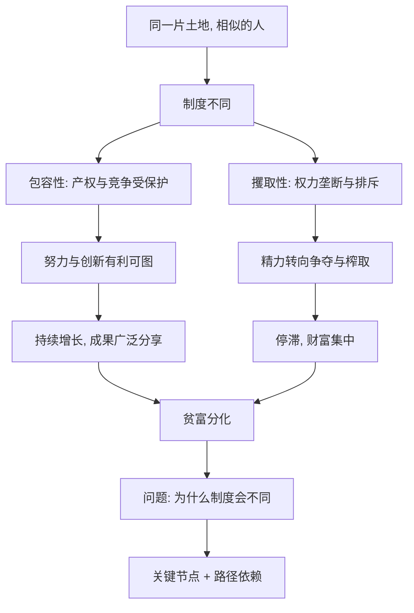

# 01｜为什么有的国家富、有的国家穷？

> 全球贫富差距到底有多大，又为什么如此顽固？

---

## 一、先说结论

阿西莫格鲁与罗宾逊给出的答案，集中到一个词：**制度。**

在他们看来，国家贫富的根本原因，不是人种、气候或文化，而是一个社会"运行规则"的差异——谁可以拥有财产、谁能自由创业、谁有权参与决策、权力是否被约束。好规则让多数人愿意创造财富并分享成果；坏规则让少数人忙于把财富从别人手里拿走。

全书的使命，就是把这个判断，用一堆铁证与反例钉牢。

---

## 二、我们先理解一个问题

先看一组几乎人人皆知、却很少细想的对比。

朝鲜半岛上，南北两侧的人，讲同一种语言，有高度相似的历史与文化传统，甚至很多家庭本就同源。可今天，一侧是经济发达、技术领先的民主国家；另一侧长期面临贫困与粮食短缺。

如果"穷"是因为人不够聪明、不够勤劳，那这个例子就无法解释——**同一群人，为什么会有两种命运？**

这就引出了全书真正要问的问题：

> 如果不是人不行，不是气候不行，也不是文化不行——那到底是什么，在决定一个国家的贫富？

---

## 三、作者到底提出了什么观点？

两位作者提出一个大胆而集中的主张：**决定国家成败的，是制度（institutions）。**

他们把制度分成两类：

- **包容性制度**：保护产权、允许竞争与新企业进入、让多数人有机会参与经济活动并分享成果，并配套以相对开放的政治参与与权力制衡。
- **攫取性制度**：由少数人设计，目标是垄断、排斥、把财富从多数人手里转移到少数人手里。

他们的核心推理是：**制度塑造激励。** 在包容性制度下，努力、创新、投资都是划算的，于是社会持续增长；在攫取性制度下，最有回报的事往往是"争夺再分配的权力"，于是社会陷入停滞与内耗。

他们也承认，答案不是"制度好就万事大吉"，而是：**在众多解释中，制度是那个最稳定、最能解释反例的变量。**

---

## 四、把这个观点翻译成人话

把国家想象成一栋楼里的两户邻居。

两家的住户能力差不多、学历差不多、家人性格也差不多。差别在于**规矩不同**：

- 甲家的规矩是：谁挣的钱归谁，谁想开个小店都行，家里的事大家商量着定。
- 乙家的规矩是：挣的钱要上交一部分给家长，开店要看家长脸色，家长说了算。

结果几年下来，甲家越来越有干劲、越来越富；乙家的人呢？能干的人想着怎么讨好家长或偷偷多留点，剩下的人索性躺平。

**不是乙家的人更笨或更懒，而是这套规矩让他们觉得：努力不划算、创新有风险、讨好权力最有用。**

国家层面的逻辑完全一样。制度不直接生产财富，但它决定了——**一个社会里的人，会把精力用在创造，还是用在掠夺。**

---

## 五、为什么会这样？

把作者的推理拆成链条：

关键在于 **B → E vs B → G** 的分岔。

制度本身不产生粮食和芯片，它改变的是**人的行为激励**。当人们相信"创造的收益归自己"，他们就会去创造；当他们相信"创造可能被夺走、而攀附权力更划算"，他们就会去争夺。

而这两种行为模式一旦形成，就会互相强化——这正是作者后面要解释的"恶性循环"与"良性循环"。

---

## 六、举一个现实生活中的例子

回到韩国与朝鲜。

它们最接近的地方，是**起点**：同一种语言，同一段历史，相近的文化传统，甚至许多家庭被战争生生分开。按"文化假说"，它们应该表现相似；按"地理假说"，它们共享同一片半岛、相似的气候与资源，也不该差出一个数量级。

可结果摆在眼前：一边是全球领先的半导体、汽车、文化产业；一边是长期的经济困难与粮食问题。

两位作者会指出：差别不在人和土地，而在**两侧运行的规则**——

- 一侧保护产权，允许创办企业、自由交易，并存在对权力的约束；
- 另一侧由单一权力中心掌控经济与分配，个人缺乏稳定产权与参与空间。

**同样的原材料——人、土地、文化——放进不同的制度模具，长出了完全不同的国家。**

---

## 七、回到书中重新理解

现在再回看两位作者为什么开篇就抛出"制度决定论"，就顺了。

他们要对抗的是一种流传很广、却容易导向宿命的直觉：穷国穷，是因为地理不好、文化落后、人民素质不高。如果接受这种解释，那么穷国几乎被判了"慢性死刑"——气候不能改、文化改不了、人种更不能提。

而制度论提供的是另一种可能性：**贫困不是宿命，而是规则的结果；规则是可以被改变的。** 这既是这本书的学术主张，也是它想传递的、带有现实关怀的判断。

---

## 八、这个观点背后还有什么？

**第一，"制度"在这里是广义的规则。** 它不只是法律条文，还包括实际执行、权力结构、政治参与方式，以及人们的预期。

**第二，作者并非说制度是唯一变量。** 他们承认地理、文化、偶然事件都有影响，只是主张制度在解释长期贫富时"权重最大、最能解释反例"。

**第三，制度需要被执行才有意义。** 纸面上写"保护产权"不难，难的是让它在现实中、对权贵也一视同仁。

**第四，它为全书定下方法：用反例说话。** 后面每一章几乎都在做同一件事——找出一个地理/文化假说解释不了的案例，用制度差异去解释它。

---

## 九、这个观点有问题吗？

有，而且争议相当大。

**第一，"制度决定论"被批评为把复杂问题单一化。** 一些学者认为，影响国家发展的因素（地理、技术、国际环境、历史偶然）高度交织，把成败几乎全部归给制度，可能是一种"过度干净的叙事"。

**第二，因果关系可能被反向理解。** 是制度带来繁荣，还是繁荣促成了好制度？现实中二者往往互相强化，要辨明先后非常困难。

**第三，部分案例被指选择性使用。** 批评者指出，作者对反例的处理（例如某些资源国的表现、某些快速增长的威权经济体）可能带有挑选性，对不利于结论的证据解释得较牵强。

**第四，它仍提供了一个极有价值的视角。** 即便机制细节有争议，"制度塑造激励、激励决定长期表现"这个核心逻辑，依然是理解发展问题最有力的工具之一。

**所以更准确的说法是**：制度是解释国家成败的一个极关键变量，而"制度几乎解释一切"则是一种需要保留的判断。本系列涉及中国的部分，尤其要区分**作者观点**与**学界争论**，不宜照单全收。

---

## 十、今天再看这个观点

以下部分是基于本书思想的现代延伸，不是两位作者的原话。

在技术变革加速的今天，这套框架有了新的用武之地。面对人工智能、平台经济、气候转型这些"创造性破坏"，各国真正的差距，往往不体现在谁先掌握了技术，而体现在**谁能让新技术顺利落地，而不被既得利益拖住**。

换句话说，制度竞争在今天的形式，是：**一个社会能不能持续地让创新战胜守成。** 允许新事物出现、允许旧利益被替代、允许失败与退出——这些看似抽象的制度安排，正在决定各国在新一轮技术周期里的位置。

---

## 十一、这一篇真正应该记住什么？

1. **贫富差距的根源，被作者归结为制度。** 不是人种、气候或文化，而是社会运行的规则。
2. **制度通过"激励"起作用。** 好规则让创造划算，坏规则让争夺更划算。
3. **同文同种也可能天差地别。** 韩国与朝鲜是全书最直观的例证。
4. **这一主张带有现实关怀。** 它反对"穷国命该如此"，主张贫困是规则的结果、并非宿命。
5. **但它需要保留地看。** 制度是极关键的变量，未必是唯一变量；对争议案例应区分作者观点与学界争论。

---

## 十二、留一个问题

> 如果同一种语言、同一片土地的人，会因规则不同而走向两种命运，
> 那么，你现在身处的规则，
> 是在奖励你创造，还是在奖励你"看懂权力比努力更有用"？

---

**下一篇**：制度决定论一出，第一个要面对的就是三个强大的对手——地理、文化、气候。它们真的能解释贫富差距吗？作者准备用一堆反例来反驳。

下一篇我们就来拆开这个问题——**地理、文化、气候能解释贫富差距吗？**
