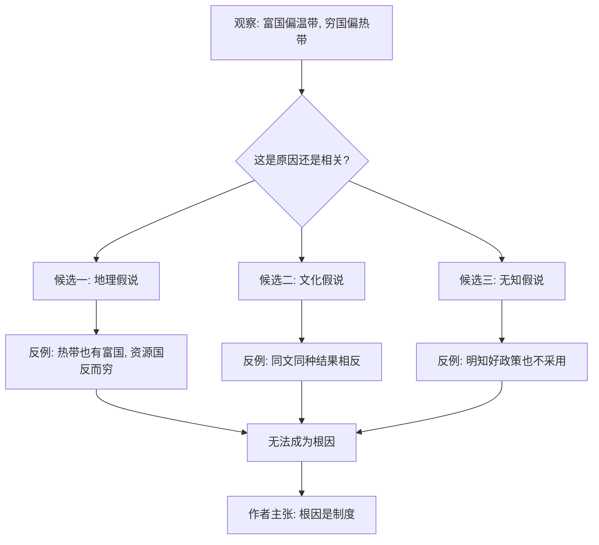

# 02｜地理、文化、气候能解释贫富差距吗？

> 富国多在温带、穷国多在热带，这是巧合还是原因？

---

## 一、先说结论

阿西莫格鲁与罗宾逊认为：地理、气候、文化都解释不了贫富差距的根本原因。

打开世界地图，确实有一个扎眼的规律——富裕国家多集中在温带，贫困国家多在热带。正因为这个规律太显眼，地理假说才格外有吸引力。但两位作者主张，这更像是**相关**，而不是**原因**。真正决定一国贫富的，仍然是它运行的规则，也就是制度。

他们的做法很直接：把地理假说、文化假说、无知假说这三张"解释王牌"逐一摆上桌，然后用反例一张张拆掉。热带也能富、温带也能穷，资源丰裕反而可能更穷，文化相同也可能走向相反——这些反例构成了本篇的核心。

## 二、我们先理解一个问题

先把那个直觉说清楚。

看世界，北美、西欧、日本、韩国这些富裕地区，大多处在中高纬度，冬天会下雪；而撒哈拉以南非洲、中美洲、南亚的许多贫困地区，则处在炎热多雨的热带。于是很多人自然推论：是不是气候决定了人的勤劳程度、健康水平，进而决定了贫富？

这条思路并不荒唐。炎热潮湿的环境确实更容易滋生寄生虫与传染病，历史上也影响过农业生产率与人的体力。所以地理假说看上去既有"规律支撑"，又有"机理支撑"。

问题就出在这里：**一只温度计显示房间里冷，不代表温度计制造了寒冷。** 纬度和贫富同时出现，只能说明它们常一起出现，不能说明纬度造成了贫富。要判断是不是原因，最有效的办法是找反例——找出那些"规律应该成立、结果却相反"的国家。本篇要做的，正是这件事。

## 三、作者到底提出了什么观点？

两位作者要反驳的，其实是三种流行的"宿命论解释"：

**一是地理假说。** 它认为气候、地理、疾病、资源的分布决定国家命运——热带病多、土壤差、资源被诅咒，所以穷。

**二是文化假说。** 它认为某些文化或宗教更崇尚勤奋、节俭、创新，因此更富有；另一些文化则相反。

**三是无知假说。** 它认为穷国的统治者只是"不懂经济"，不知道正确的政策，一旦有人把正确药方递上去，问题就能解决。

作者的判断非常一致：这三者至多能解释**局部**，无法解释**关键证据**。他们认为，如果地理才是根本，那么处在同一片地理环境、甚至同一座城市两侧的人不该有巨大差异；如果文化才是根本，那么同文同种的族群不该走向相反；如果只是"无知"，那么现实中统治者明知好政策却偏不采用的现象就无法解释。

换句话说，他们要给这三种解释各自贴上一张标签：**看似相关，实则不是根因。**

## 四、把这个观点翻译成人话

可以用一个生活比喻。

假设有人统计了某个小区，发现"楼上住户普遍比楼下住户有钱"。于是有人得出结论：住得高更容易发财。这话听起来好像有点道理——高楼层采光好、视野好，心情好。

但真正的原因，可能是这个小区高楼层是后建的大户型，价格本来就贵，买得起的家庭本来就更富裕；而低楼层是老楼、小户型，住户收入本来就低。**楼层只是把贫富"显示"了出来，并没有制造贫富。**

地理假说犯的正是这个错误。热带确实和贫穷高度重合，但很可能不是炎热本身在制造贫穷，而是**历史上在热带形成的那套规则**——殖民者建立的掠夺型秩序、少数人垄断土地与资源、多数人被排除在参与之外——把热带"标记"成了贫穷。

把因果搞反，是一件代价很大的事。因为它会导向一种绝望的结论：既然穷是因为天太热、地不好、文化不行，那就只能认命。而两位作者想说的恰恰相反：**如果根子在规则，那么规则是可以改的。**

## 五、为什么会这样？

把作者的推理画成一张检验流程图，会比文字更清楚：

关键在于中间那一列：**每一个候选解释，都要先过"反例检测"这一关。**

地理假说过不了——因为热带里有极度繁荣的经济体，也有一些资源丰裕的国家长期陷于贫困，资源和气候本身并没有给出统一答案。

文化假说过不了——因为语言、宗教、族群都相近的人群，在不同制度下会走出完全不同的命运。

无知假说过不了——因为很多统治者的"不懂"其实是一种"懂"：他们清楚某项改革能做大蛋糕，但那会威胁到自己分蛋糕的权力，于是选择不做。

三个都过不了关，才轮到作者自己的答案登场。

## 六、举一个现实生活中的例子

拿"热带"和"资源丰裕"这两个词做一次反向检验。

按地理假说的逻辑，越靠近赤道、天气越炎热，理应越穷。可是现实中，恰恰有一些地处热带、面积不大、资源也不丰富的经济体，做到了高度繁荣——新加坡就是最常被提起的例子。它靠近赤道，没有可耕地优势，也没有矿产可以依靠，却能跻身世界最富裕的地区之列。如果"热带"本身就是贫穷的原因，这个反例就很难解释。

再看资源。按常识，家里有矿、有石油应该更容易富。但现实里，**许多资源丰裕的国家反而长期贫穷**：地底下埋着值钱的石油或矿产，老百姓却过着拮据的生活，财富高度集中在少数人手里。资源没有变成全民的财富，反而成了争夺的对象。

这两个现象放在一起，指向同一个结论：**地理给的是"牌面"，制度决定的是"怎么打这副牌"。** 同样是热带，可以是新加坡，也可以是长期停滞；同样是资源丰裕，可以是繁荣的起点，也可以是冲突的引信。决定差别的，是资源带来的收益归谁、由谁支配、按什么规则分配。

## 七、回到书中重新理解

现在再看作者为什么花那么大力气去"打假"地理、文化、无知这三种解释，就明白了。

因为这本书要立的是一个更大的主张：**贫富的根因是制度。** 而要立住这个主张，就必须先证明其他"更省事"的解释站不住脚。如果地理或文化就能解释一切，那制度理论就没有出场的机会。

所以这部分内容不是枝节，而是全书的"清场"。作者先把地理、文化、无知这些对手请下场，再让制度站到聚光灯下。理解了这一层，才能理解他们后面为什么反复使用同一个手法——**找反例、拆假说、换解释。**

也可以说，这一篇是从"问题"走向"制度主论"的必经跳板。

## 八、这个观点背后还有什么？

**第一，反例方法有代价。** 用反例驳倒一种假说，只能说明"它不是唯一原因"，不能直接证明"制度才是唯一原因"。作者的论证力度很强，但严格来说，他推翻的是对手的"充分性"，而不是把制度之外的变量全部排除。

**第二，地理并非完全无关。** 作者自己也承认地理有影响，只是反对把它当成根源。疾病环境、可通航河流、农业条件确实会影响发展，只是这些影响往往通过制度起作用。

**第三，文化是会变的。** 作者反对的是把文化当成铁板一块的宿命。他们认为文化会被制度塑造——同样的族群，换一套规则，行为与观念会慢慢改变。

**第四，"资源诅咒"其实是一种制度现象。** 资源之所以常常带来冲突而非繁荣，关键不在资源本身，而在收益由谁掌控、是否被少数人垄断。

## 九、这个观点有问题吗？

关于地理与气候的作用，学界存在不同解释，这里必须两边都说。

**支持作者的一边认为**：如果把地理当根因，就无法解释同一片土地上、同一种气候里的人为何命运迥异；也无法解释资源丰裕国之间的巨大差异。

**批评者则指出几个保留：**

第一，地理的影响可能被作者**低估**了。一些经济史学家认为，热带疾病环境、土壤与农业条件对长期发展有独立且持久的作用，这种作用未必能完全还原为"制度"。殖民者在哪里建立什么制度，本身也受地理条件影响——这恰恰说明地理可能通过制度间接发挥很大作用。

第二，反例方法有**选择性**风险。批评者担心，作者选用的都是对自己有利的反例，而对"地理确实长期起作用"的案例解释得较牵强。

第三，"文化假说被驳倒"这个结论，学界也有争论。文化会变，不等于文化不重要；价值观念可能同时被制度和历史共同塑造。

**所以更准确的说法是**：地理、气候、文化都可能是影响贫富的因素，只是在两位作者的框架里，它们不是**最根本**的那一个。这种判断有其说服力，但也有需要保留之处，不宜把"地理文化无用"当作定论。

## 十、今天再看这个观点

以下部分是基于本书思想的现代延伸，不是两位作者的原话。

在今天的语境里，"地理决定论"换了一身衣服重新出现。人们会说：某地气候恶劣、资源匮乏、位置偏远，所以注定发展不起来。这套说辞听起来比种族论温和，但结构是一样的——**把一个可以改变的结果，说成不可改变的宿命。**

作者视角的价值在于提醒我们：真正该问的不是"这块地方怎么样"，而是"这块地方的规则怎么样"。同一片土地，换个规则，可能就换一个结果。基础设施可以修、产业可以引、气候可以适应，但如果规则让人不敢投资、不愿创新、无法参与，那么再好的地理条件也会被浪费。

反过来，资源丰裕也从来不是自动的祝福。**资源是祝福还是诅咒，取决于它落在什么样的制度里。**

## 十一、这一篇真正应该记住什么？

1. **相关不等于因果。** 富国多温带是事实，但温带不是富的原因。
2. **反例是作者最锋利的工具。** 热带可以富、资源丰裕反而穷、同文同种结果相反，都在削弱地理与文化假说。
3. **三大假说各有软肋。** 地理解释不了热带富国，文化解释不了同族殊途，无知解释不了"明知而不为"。
4. **资源是祝福还是诅咒，看制度。** 关键在收益归谁、如何分配。
5. **结论要保留地看。** 地理、文化未必无用，学界对此仍有争论；作者反驳的是它们的"根因地位"，而非"全部作用"。

## 十二、留一个问题

> 如果你所在的地方发展得不够好，
> 你更愿意相信"是我们这里条件太差"，
> 还是愿意先问一句："这里的规则，让努力的人划不划算？"

---

**下一篇**：打完地理、文化、无知这三张牌，作者终于要亮出自己的底牌——制度。但"制度决定论"这个说法本身，就让人心里发毛：一个变量，真能解释整个世界的贫富吗？它到底在说什么，又有多少道理？

下一篇我们就来拆开这个问题——**制度决定论到底在说什么？**
