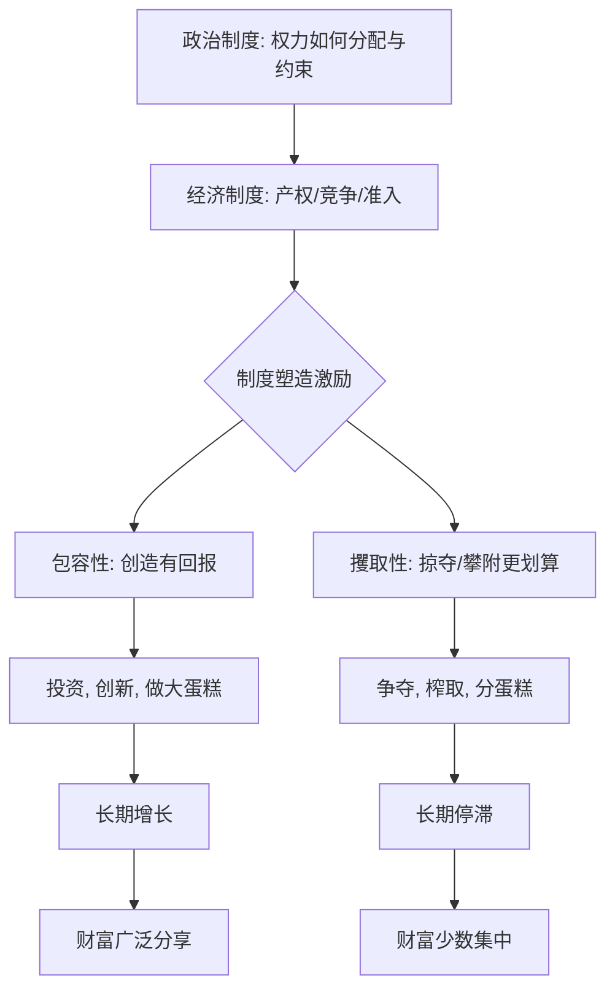

# 03｜“制度决定论”到底在说什么？

> 为什么作者把一切归结到“制度”这一个变量上？

---

## 一、先说结论

阿西莫格鲁与罗宾逊的核心主张可以压成一句话：**国家的长期命运，由制度决定。**

这里的“制度”不是我们日常说的“体制”或“政治立场”，而是一个更朴素的东西——**一个社会里人人为事的规则**：谁拥有财产、能不能自由创业、谁能进入市场、权力由谁掌握、掌权者是否被约束。两位作者认为，这些规则决定了人们会把精力用在“把蛋糕做大”，还是用在“想方设法分蛋糕”。

这是一个非常大胆、非常集中的解释。大胆在于它把地理、文化、气候都降为次要；集中在它几乎把一切答案都压到同一个变量上。所以理解这本书，关键不是记住“制度重要”，而是搞清楚：**“制度决定”到底决定了什么，又是通过什么机制决定的。**

## 二、我们先理解一个问题

先面对一个最自然的疑问：**一个变量，真的能解释整个世界吗？**

现实太复杂了。影响一国贫富的因素多得数不清：地理位置、自然资源、人口结构、技术水平、国际环境、历史巧合、领导人的性格……在这样的复杂度面前，说“制度决定一切”，听起来很像一种过度简化的口号。

但作者要说的，其实不是“其他因素不存在”，而是另一层意思：**其他因素要么通过制度起作用，要么无法解释最关键的那部分差异。**

举一个思想实验。假设有两个条件完全相同的社会——同样的土地、同样的人口、同样的气候。两者唯一的差别是规则不同：一个允许任何人开公司、保护他赚到的钱；另一个规定做生意必须得到许可，赚的利润大头要上交。几十年后，两者的贫富会一样吗？

几乎可以断定不会。**条件相同、规则不同，结果就会不同。** 作者正是从这类对比里，抽取出“制度”这个变量的分量。

## 三、作者到底提出了什么观点？

两位作者把制度分成两个层面来谈：

**一是经济制度。** 它管的是经济活动的规则：产权是否受保护、契约是否被履行、竞争是否被允许、新企业能否自由进入。这些规则决定了努力、投资、创新是否有回报。

**二是政治制度。** 它管的是权力的规则：谁有资格参与决策、权力如何分配、掌权者是否受到制约。作者特别强调，**经济制度不是从天上掉下来的，而是由政治制度决定的**——谁掌握权力，谁就能决定经济规则偏向多数人还是少数人。

在这两个层面上，又各自分出两种类型：**包容性的**与**攫取性的**。前者让多数人参与并分享，后者让少数人榨取多数人。作者的主张是：包容性制度带来持续增长，攫取性制度带来停滞与内耗。

而“制度决定论”最锋利的一点在于：**他们不认为国家先富起来、然后顺理成章地有了好制度；恰恰相反，是好制度先出现，财富才随之而来。** 因果关系被他们明确地指向“制度在前”。

## 四、把这个观点翻译成人话

可以把一个国家的经济想象成一场比赛。

有些比赛，规则是**公开的**：谁都能报名，跑道一样长，裁判不偏袒，第一名拿的奖金归自己，第二名也有盼头。这样的比赛，所有人都会拼命跑、练技术、想新招，整体水平越来越高。

另一些比赛，规则是**内定的**：参赛资格要花钱买，跑道上给某些人留了捷径，谁赢早就在赛前定好，奖金大部分被组织者拿走。这样的比赛，聪明的选手不会去练跑步，而会去想怎么搞定组织者、怎么挤掉对手、怎么在赛前就锁定名次。

**两种比赛，选手的能力可能完全一样，但结果天差地别——因为规则决定了“把力气花在哪里最划算”。**

这就是“制度决定论”的人话版本。它不是在说规则直接生产粮食和芯片，而是在说：**规则决定了社会的聪明人会把才华用在创造，还是用在钻营。** 一个社会里，最有本事的人如果都在研究怎么分蛋糕、而不是怎么把蛋糕做大，这个社会就很难长期繁荣。

## 五、为什么会这样？

把这条因果链画出来，会看得更清楚：

这张图有三个关键点。

**第一，起点是政治制度。** 作者认为经济规则不是自然生成的，而是被政治权力塑造的。谁定规则，规则就为谁服务——这是理解全书的钥匙。

**第二，中间是“激励”。** 制度本身不产出财富，它改变的是人的算计：在一个把创造收益还给创造者的规则里，人们愿意投入；在一个创造随时可能被夺走的规则里，人们会转向防守、攀附或掠夺。

**第三，结果会自我强化。** 增长带来更多支持这套规则的人，停滞则让既得利益者更要死守权力。所以两种制度都会沿着自己的方向越走越远，形成作者所说的“良性循环”与“恶性循环”。

## 六、举一个现实生活中的例子

最能说明“制度决定论”的，是**印度与韩国**这对对照组。

把时间拨回二战结束。那一时期，两国都刚从殖民或战乱中脱身，都面临重建，都人口众多、底子薄弱。印度 1947 年独立，朝鲜半岛 1945 年光复后南北分治，韩国在战争的废墟上起步。从“起点条件”看，它们并不是一个天一个地——都是贫穷的、以农业为主的、需要从零搭建工业体系的社会。

可是几十年过去，两条曲线越走越开。**韩国**成长为半导体、汽车、电子等高端制造业的强国，人均收入进入发达国家行列；**印度**虽然体量巨大、也在增长，但长期面临贫困人口多、基础设施不足、人均水平偏低的问题。

为什么同样的起跑线，会跑出这么大的差距？作者的答案不是地理——印度和韩国都不算温带乐园，也都不是资源丰富到可以躺赢的国家。答案落在制度上：

韩国在战后较早推动了**土地改革**，削弱了大地主的垄断，随后走上鼓励出口、保护产权、允许企业竞争的路子，政府与市场形成了一种“你创造、我给支持”的关系。印度独立后则长期实行**许可证制度**——开办企业、扩大产能都要政府审批，层层关卡把经济活动的门槛抬得很高，加上社会身份的限制，很多有才华、有想法的人被挡在门外。

一句话总结：**韩国的规则让创造者有利可图，印度的规则让“拿到许可”比“做出东西”更重要。** 同样的聪明人，在两种规则下做出了不同的事。

（需要说明：印韩对比是作者常用的例证之一，但它并非唯一解释，学界对印度的制度、发展阶段与外部环境也有更细致的分析，这只是理解“制度决定”的一个入口。）

## 七、回到书中重新理解

现在再回头看，“制度决定论”这四个字为什么让作者如此执拗，就清楚了。

他们要对抗的是一种非常流行的思路：把结果当原因。看到穷国教育差，就说“穷是因为教育差”；看到穷国技术低，就说“穷是因为技术低”。但这些往往只是贫穷的**表现**，而不是原因。作者的方法是要往下挖一层，挖到那个能同时决定教育、技术、资本积累的**规则层面**。

所以他们反复强调：**别只盯着结果，要看规则。** 一个国家为什么留不住人才？因为规则让人才得不到应有回报。为什么资本外流？因为产权不安全。为什么新技术落不了地？因为既得利益者能用规则把新来者挡在门外。

理解了这一层，就能明白作者为什么敢把话说得那么满。在他们看来，“制度”不是众多因素中的一个，而是那个**能解释其他因素为何如此**的底层变量。

## 八、这个观点背后还有什么？

**第一，“决定”是一种强主张，不是弱主张。** 作者并不是说“制度有影响”，而是说“制度是根本原因”。这两者在学术上的分量完全不同，理解时要分清。

**第二，制度是广义的、可执行的规则。** 写在纸上的法律不算数，真正起作用的是实际执行下来的规则，包括潜规则、权力结构和人们的预期。

**第三，“制度决定经济，政治决定制度”是一个双层结构。** 作者并不认为经济制度可以脱离政治单独存在。要改经济规则，往往要先动政治结构，这也是这本书最敏感、最有争议的地方。

**第四，它是可证伪的。** 作者自己提出了检验标准：如果制度是根因，那么条件相似、制度不同的案例应该给出不同结果。他们大量使用这类“自然实验”来支撑主张。

## 九、这个观点有问题吗？

有，而且围绕“制度决定论”的争论，是这本书争议最集中的地方之一。

**第一，是否过度简化。** 一些学者认为，把复杂的发展问题几乎全部归到制度一个变量上，是一种“干净的叙事”。现实里地理、技术、人口、国际环境、历史机缘高度交织，很难只用一个变量解释。

**第二，因果方向可能被质疑。** 是制度带来了繁荣，还是繁荣促成了好制度？现实中二者常常互为因果。要证明“制度在前”，需要很细的历史证据，而不只是相关性。

**第三，对“制度”的定义可能过于宽泛。** 批评者指出，如果“制度”既可以指法律、又可以指权力结构、还可以指执行与预期，那它几乎能解释一切，反而失去了可检验性——这被称为“概念拉伸”的风险。

**第四，涉及威权经济体的部分争议尤其大。** 作者倾向于认为，缺少包容性政治制度的经济增长难以长期持续；但关于这一问题，学界存在不同解释：也有学者认为不同体制各有适应能力，不能一概而论。这里只呈现分歧，不作判断。

**所以更稳妥的说法是**：制度是理解国家长期成败的一个**关键变量**，这一点得到了相当的认同；但“制度几乎解释一切”则是一个需要保留的强主张。

## 十、今天再看这个观点

以下部分是基于本书思想的现代延伸，不是两位作者的原话。

在今天，“制度决定”这个框架最重要的应用，可能不是解释历史，而是解释**为什么有些社会能持续自我更新**。当技术、产业、国际格局变化越来越快时，一个社会真正的能力，不在于它此刻有多富，而在于它的规则能不能让问题被及时发现、让旧利益被及时替换、让新力量被及时接纳。

从这个角度看，制度竞争的本质是：**一个社会能不能持续地让“创造”战胜“守成”。** 这不是一劳永逸的状态，而是一种不断进行的动态过程。规则一旦僵化，哪怕曾经辉煌，也可能慢慢失去活力。

## 十一、这一篇真正应该记住什么？

1. **“制度决定论”的核心主张是：长期命运由规则决定。** 不是地理、文化，也不是单纯的“不懂政策”。
2. **制度通过激励起作用。** 它决定聪明人把力气用在创造还是掠夺。
3. **政治制度更根本。** 作者认为经济规则由权力塑造，谁定规则，规则就为谁服务。
4. **因果方向被明确指向“制度在前”。** 好制度带来繁荣，而非繁荣自动带来好制度。
5. **它是一个强主张，争议很大。** “制度重要”较无争议，“制度几乎解释一切”则需要保留地看。

## 十二、留一个问题

> 如果一个社会里最聪明的人，
> 都在研究“怎么拿到许可”“怎么靠近权力”，
> 那么它缺的可能不是人才，
> 而是一套让人才愿意去做事的规则。

---

**下一篇**：既然好制度决定繁荣，那么“好制度”究竟长什么样？它包含哪些具体的安排，又是怎么把一个个只想为自己赚钱的人，变成整个社会增长的发动机的？

下一篇我们就来拆开这个问题——**什么是包容性制度？**
