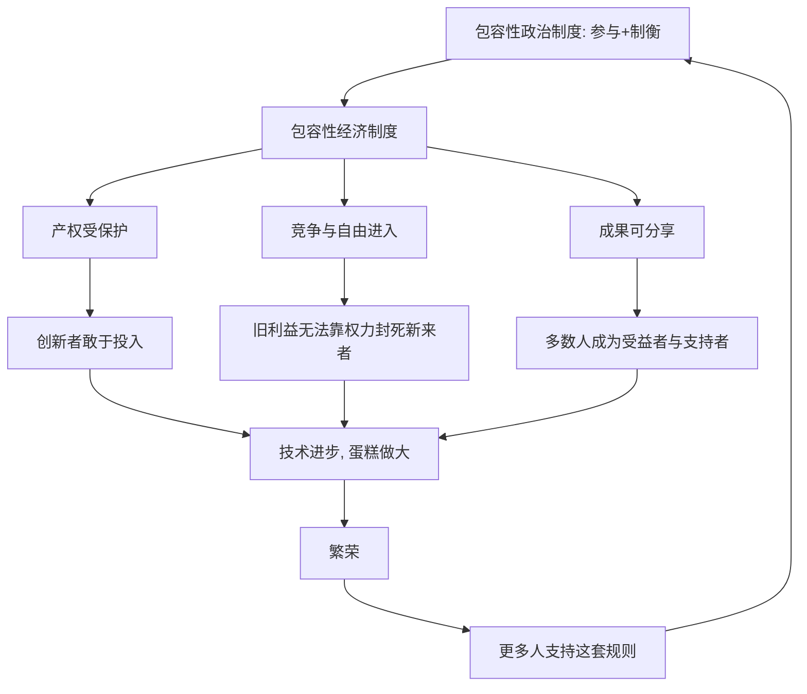

# 04｜什么是“包容性制度”？

> 什么样的制度能让一个国家持续繁荣？

---

## 一、先说结论

阿西莫格鲁与罗宾逊认为，能让一个国家持续繁荣的，是**包容性制度**。

“包容性”这个词，核心意思是**让多数人能够参与，并能分享成果**。在经济上，它包括保护产权、允许自由竞争、让新企业能自由进入、让普通人有机会靠努力改善生活；在政治上，它包括让多数人有权参与决策、让权力受到制约、不让任何一个人或集团独揽大权。

这样一套安排，最终要达到的效果只有一句话：**让创新有利可图，让成果被广泛分享。** 当一个人知道自己的努力和创造能换来回报、而且这份回报不会被随意夺走时，他就会去创造；当千千万万人都这样想、这样做时，整个社会的蛋糕就被做大了。

包容性制度不承诺人人平等，也不承诺没有失败者。它承诺的是**规则上的开放**：谁都可以进来试，赢了不会被抢，输了可以重来。

## 二、我们先理解一个问题

先问一个看起来有点“傻”的问题：**为什么有人愿意去发明一个可能失败几十次的东西？**

想想那些真正改变世界的创新——新药、芯片、软件、新的商业模式。它们几乎都有一个共同点：**投入巨大、失败率高、回报来得晚。** 一个理性的人，如果算一算账，多半会退缩。可历史上总有人前赴后继地去做。

这些人的勇气来自哪里？一部分来自好奇心和信念，但更现实的一部分来自——**他知道如果做成了，成果是自己的；他也知道即使做砸了，自己不会因为一次失败而被抄家、被夺产、被判罪。**

反过来想：如果一个人辛辛苦苦研发出来的东西，转眼就被人拿走；如果他刚把生意做起来，就有更强势的人用权力把它夺走；如果他创业失败一次就背上还不清的债、失去一切——那他为什么还要去冒这个险？

所以真正的问题不是“人有没有创造力”，而是：**这个社会的规则，是在奖励创造，还是在惩罚创造？** 这正是包容性制度要回答的问题。

## 三、作者到底提出了什么观点？

两位作者把包容性制度拆成两个互相支撑的部分：

**一是包容性经济制度。** 它的特征包括：

- **产权受到保护**：你创造的、赚到的、拥有的，不会被随意剥夺。
- **允许自由竞争**：新企业可以进入，旧企业不能靠权力永远霸住市场。
- **准入是开放的**：一个人能不能做某件事，不取决于他的出身、身份或“关系”。
- **成果可以被分享**：增长的红利不是只落在少数人手里，而能扩散到多数人。

**二是包容性政治制度。** 它的特征是**多元与制衡**：权力分散在多个主体手中，多数人有参与和表达的渠道，掌权者受到规则的约束，不能任意掠夺。

作者最关键的一个判断是：**这两者必须配套。** 只有包容性经济制度而权力高度集中，经济成果终究会被权力吞噬；只有政治参与而经济规则被少数人垄断，参与也会变成空壳。二者互为支撑，才能让繁荣持续。

而它们合在一起，形成一个正反馈：**繁荣让更多人支持这套规则，这套规则又继续保护繁荣。**

## 四、把这个观点翻译成人话

用种地打一个比方。

包容性制度就像**一块产权清楚、谁种谁收的田地**。农人知道，自己流多少汗，秋天就收多少粮，多打的粮食归自己。于是他会改良种子、会修水渠、会舍得下本钱——因为这些投入最终都落在自己口袋里。

如果换成另一种田地——**种多收多，但村里有权的人随时可以来拿走一大半**——会发生什么？农人不会去改良种子，也不会去修水渠，因为改得越好、被拿走越多。他只会把精力放在“怎么让有权的人少拿一点”上，比如多送点礼、多攀点关系。

两种田地的土质、气候、农人可能完全一样，收成却会差出许多。**差别不在人，不在土地，在“谁种谁收”这条规则。**

包容性制度就是那个“谁种谁收”的规则体系。它不要求人人都高尚，恰恰相反，它假定人人都在为自己的利益打算——然后设计出一套规则，让每个人在追求自己利益的时候，顺便把整个社会推向前进。

## 五、为什么会这样？

把包容性制度的作用机制画出来：

这张图有两个要点。

**一是循环。** 注意最后一条箭头从 K 回到 A：繁荣不是终点，它会反过来加固建立它的那套规则，形成作者所说的“良性循环”。制度好，不是因为一次选择做对了，而是因为它能不断产生支持自己的力量。

**二是两边都要有。** 保护产权（C）解决“愿不愿意投入”，竞争与自由进入（D）解决“创造成果会不会被既得利益封死”。只有前者没有后者，社会会变成少数老玩家的保护区；只有后者没有前者，谁都不敢做长期投入。两条腿一起走，创新才既能发生、又能持续。

## 六、举一个现实生活中的例子

最贴近生活的包容性制度，是**专利制度与产权保护**。

设想一个发明者，花了多年时间、投入大量金钱，做出一项新技术。这项技术能不能变成造福社会的产品，很大程度上取决于一条规则：**他能不能从中获得回报？**

如果有了专利制度，这个发明者在一定期限内拥有这项技术的专有权利。这意味着：**他敢投入。** 因为他知道，一旦成功，回报大概率归自己，而不是明天就被别人照抄一遍、以更低价格把他的投入变成一场空。

专利之外，产权保护同样重要。它保护的不只是发明，还包括厂房、设备、现金、品牌、契约。一个企业家敢于建厂、敢于长期投资、敢于把利润再投进去，前提是他相信这些资产明天还属于自己。**没有这种确定性，理性的选择就是把钱转走、把规模缩小、把精力用来寻找靠山。**

反过来看就更有说服力：在那些产权得不到保障、抄别人的东西不用付出代价、权力可以随时没收财产的地方，会出现什么？会出现“发明不如山寨”“投资不如套利”“做实业不如搞关系”。**不是那里的人不想创新，而是那里的规则告诉他们：创新不划算。**

专利与产权之所以是包容性制度的典型，正是因为它做了一件很朴素的事：**把“创造”和“回报”用规则连起来，让个人的私心，变成社会的进步。**

## 七、回到书中重新理解

现在回头看作者为什么反复强调“创新”和“创造性破坏”，就更清楚了。

在两位作者的理论里，持续增长的引擎是**创新**，而创新是一种“创造性破坏”——它创造新产业，也摧毁旧利益。因此，一个社会能不能持续繁荣，取决于它能不能让创新顺利发生，而不是被旧势力挡回去。

包容性制度的意义就在这里：**它不是让所有人都满意，而是让创新不必求谁批准。** 产权让人敢投入，竞争让新来者有机会，政治制衡让既得利益者无法用权力封死创新。三者合起来，构成了一台“让创造性破坏得以发生”的机器。

也应该看到，作者并不是说包容性制度等于“小政府”或“没有管制”。他们强调的是**规则的性质**：规则是否开放、是否可预期、是否让多数人受益。管制的存在与否不是重点，重点是它服务于谁、由谁决定。

## 八、这个观点背后还有什么？

**第一，“包容性”的对立面不是“大政府”，而是“排他”。** 判断标准是“谁能参与、成果归谁”，而不是“政府管得多还是少”。

**第二，包容性制度是动态的。** 它不是一朝建成、永远不变的，而是在不断应对新的“创造性破坏”中被维护和更新。历史上不少国家曾一度包容，后来又被既得利益重新封闭。

**第三，它依赖政治制度兜底。** 产权和竞争再漂亮，如果权力不受约束，一次没收、一次改规则就能让一切作废。所以作者把政治制度放在更根本的位置。

**第四，它不承诺结果平等。** 包容性制度奖励成功、也允许失败，成果分布依然不均。它追求的是机会的开放与规则的公平，不是平均主义。

## 九、这个观点有问题吗？

关于包容性制度的说法，本身争议不大——很少有人反对“产权和竞争重要”。真正的争论，在于它**够不够解释现实**。

**第一，边界模糊。** 批评者指出，“包容性”这个标签弹性太大：什么算包容、什么算排他，往往事后才能判断。今天就断定某国制度是包容性的，可能过于武断。

**第二，忽视发展阶段差异。** 一些学者认为，不同发展阶段对制度的需求并不相同，早期工业化国家与后发国家面临的约束不一样，不能简单套用同一套标准。

**第三，案例可能存在选择偏差。** 有学者担心，作者倾向挑选那些支持“包容性带来繁荣”的案例，而对不吻合的例子处理较粗。

**第四，关于政治条件，学界存在不同解释。** 作者倾向于认为包容性经济制度需要包容性政治制度配套才能持久；但也有研究者认为，一些相对集中的权力结构在特定阶段也能推动高速增长，只是这种增长的可持续性存在争论。关于这一点，不同学者给出了不同判断，本系列不作定论。

**所以更稳妥的说法是**：包容性制度是理解持续繁荣的一个非常有解释力的框架，但它的定义边界与适用范围，仍需要结合具体历史情境来判断。

## 十、今天再看这个观点

以下部分是基于本书思想的现代延伸，不是两位作者的原话。

在数字时代，包容性制度面临一个本世纪的新考题：**当“创造性破坏”的核心资产变成了数据、平台和算法，规则还能不能保护新来者？**

传统的产权与竞争规则，是为工厂、机器、专利那套经济设计的。而在平台经济里，网络效应会让赢家迅速垄断，新进入者很难靠产品本身翻盘。这意味着，即使法律上写着“自由竞争”，现实中竞争也可能被技术优势悄悄封死。

于是包容性制度在今天的意义，从“保护某个人敢不敢投入”，扩展到了“**保护一个社会还愿不愿意让新东西挑战旧格局**”。允许数据可迁移、允许平台之间自由选择、允许模仿者合法成长——这些看似技术性的规则，其实都是同一道老问题的新版本：**规则是让多数人有路可走，还是让少数人有钱可守。**

## 十一、这一篇真正应该记住什么？

1. **包容性制度的核心是“参与”与“分享”。** 让多数人有机会进来，让成果能被多数人分到。
2. **它由经济制度与政治制度两部分组成，而且必须配套。** 少了政治层面的制衡，经济上的包容难以持久。
3. **它的作用是改变激励。** 让创新有利可图，让投入有确定回报。
4. **专利与产权保护是典型例子。** 把“创造”和“回报”用规则连起来。
5. **它是动态的、不完美的。** 需要不断维护，也会被重新封闭；判断标准是“谁参与、谁受益”，而非“管多管少”。

## 十二、留一个问题

> 如果一个人的努力和创造能确定地换来回报，
> 他会去创造；
> 如果回报随时可能被拿走，
> 他只会去防守。
>
> 那么你现在身处的规则，
> 让别人敢不敢创造？

---

**下一篇**：既然好制度能让创新者放心投入，那么坏制度呢？它明明让国家整体停滞，为什么却能让少数人短期暴富？这种“坏”，到底坏在哪里，又是怎么运转的？

下一篇我们就来拆开这个问题——**什么是攫取性制度？**
