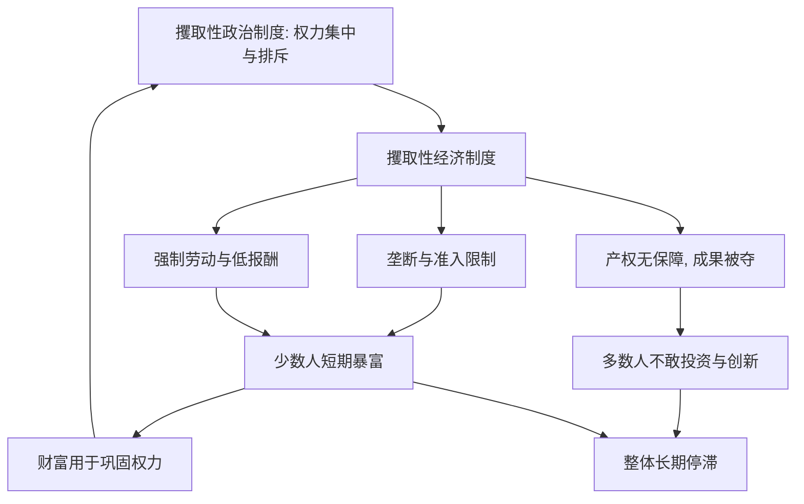

# 05｜什么是“攫取性制度”？

> 坏制度为什么短期内也能让少数人暴富，却让整体停滞？

---

## 一、先说结论

阿西莫格鲁与罗宾逊认为，**攫取性制度**的设计目标从来不是“把蛋糕做大”，而是**把蛋糕从多数人手里，转移到少数人手里**。

它的典型手段包括：垄断、强制劳动、准入限制、把多数人排除在政治参与之外。这套制度在短期内可以榨取惊人的财富，让少数人迅速暴富；但它同时压制了投资、创新和参与，使整个社会慢慢失去长期增长的能力。

所以“攫取性”不等于“没有效率”。恰恰相反，**它常常在榨取上非常高效**——只是这种效率服务的是少数人，挤干的是多数人的未来。理解这一点，是理解这本书另一半的关键。

## 二、我们先理解一个问题

先问一个让人不太舒服的问题：**如果一套制度这么坏，为什么它能长期存在？**

按理说，坏制度让多数人受损，多数人应该反对它、推翻它。可历史上，这类制度往往能维持几十年甚至几百年。这背后的逻辑其实不难懂：

对掌握权力的人来说，**坏制度对他们是有利的。** 他们从这套规则里拿到最大的那份收益，而且他们有能力——通过暴力、法律、宣传或分而治之——让多数人的反对无法组织起来。

于是问题就变成了：一套让少数人获益、让多数人受损的制度，为什么能像生了根一样难以撼动？这就要看它的内部构造了。攫取性制度之所以“有效”，正是因为它把**榨取**做成了一套稳定、可复制、能自我加固的系统。

## 三、作者到底提出了什么观点？

两位作者把攫取性制度同样分成两个层面：

**一是攫取性经济制度。** 它的特征与包容性制度正好相反：

- **产权没有保障**：多数人的财产随时可能被剥夺，只有少数人的利益受保护。
- **竞争被限制**：新企业进不来，市场被少数人垄断，准入需要靠关系或权力。
- **强制劳动与人身控制**：劳动者的报酬被压到最低，甚至失去自由选择的权利。
- **成果高度集中**：增长（如果有）的红利几乎全部流向少数人。

**二是攫取性政治制度。** 它的特征是**权力集中与排斥**：少数人垄断政治权力，多数人被排除在决策之外，没有制约、没有真正的参与渠道。

作者的关键判断是：**这两者也是互相支撑的。** 攫取性政治制度让少数人能制定攫取性经济规则；攫取性经济制度产生的财富，又反过来用来巩固他们的政治权力。于是形成一个闭环——**越攫取，越有力量去攫取。**

而且作者强调，攫取性制度并非“低级错误”或“不会管理”，它往往是**精心设计的结果**：设计它的人很清楚地知道自己在做什么，也知道什么对他们有利。

## 四、把这个观点翻译成人话

可以想象一个村子。

村里有一户人家力气最大、又有武器。他给村子定了规矩：**所有田地名义上归“村里”，实际上由他说了算；大家种地可以，但收成要交给他一大半；想开个磨坊、想做生意，都得先得到他的允许。**

这个规矩对村子整体好不好？不好。因为农人知道自己多打粮食也要被拿走大半，就不会去改良种子、不会去修水渠，能混一天是一天；也没人敢去开店做买卖，因为随时可能被“收走”。**整个村子的产出会越来越低。**

但对那户人家好不好？太好了。他不用干活，就能拿到村里大部分收成；他还把最重要的资源（田地、磨坊、买卖资格）都攥在手里，谁想多赚一点，都得求他。

这就是攫取性制度的逻辑：**它不是“没管好”，而是“管得很好”——只不过是为那一户人家管的。** 它牺牲的是整个村子的长期活力，换来的是少数人的短期暴富。

而最麻烦的是：那户人家手握财富和武器，村里人很难联合起来改变这套规矩。于是这个“坏规矩”就会一直赖着不走。

## 五、为什么会这样？

把攫取性制度的运转逻辑画出来：

这张图有两个要点。

**第一，注意那个回到 A 的箭头。** 榨取来的财富不是终点，它会被用来购买武力、收买盟友、打压对手，从而加固整套政治结构。这就是攫取性制度的“恶性循环”——它用榨取的成果，让自己更难被推翻。

**第二，注意 F 和 I 同时存在。** 少数人暴富（F）与整体停滞（I）不是矛盾，而是同一枚硬币的两面。**正因为财富被抽走，多数人才无力投入；正因为他们无力投入，社会才停滞；而停滞又让少数人更没动力去改革。** 短期看，这套制度“很赚钱”；长期看，它把整个国家的增长潜力一点点耗尽。

## 六、举一个现实生活中的例子

最典型、也最沉重的例子，是**殖民时期的强制劳动与大庄园垄断**。

在美洲殖民地，殖民者建立起一种以掠夺为核心的秩序。土地被大量圈占为**大庄园**，少数殖民者及其后裔垄断了最优质的土地、水源和贸易渠道。与此同时，原住民和被迫迁移来的劳动者，常常被纳入各种形式的**强制劳动**制度——他们被要求为庄园主或矿场无偿或近乎无偿地劳动，人身自由受到严格限制。

这套安排对谁好？对极少数殖民者和大庄园主好。他们凭借对土地、劳动和贸易的垄断，在很短时间内积累了惊人的财富。当地的产出——无论是农产品还是矿产——源源不断地流向少数人，再输送回宗主国。

但对整体社会好不好？不好。被强制劳动的人没有动力去改进技术，因为改进的好处不属于自己；没有自由的人不敢投资，因为他的财产和人身都不安全；没有参与权的人无法改变规则，因为规则就是为压榨他们而设的。结果是：**资源极其丰富，社会却长期陷于贫困与不平等。**

这正是作者想说明的：**问题不在资源多少，而在资源带来的收益归谁、由谁掌握。** 同样的土地、同样的矿产，放进榨取性的规则里，就成了少数人暴富的工具；放进包容性的规则里，才有机会变成全民的财富。

（这里描述的是殖民制度的一般特征，作者用来说明“攫取性”的运作方式。需要说明：殖民史的具体形态与后果，学界有丰富而细致的讨论，此处只是这一概念的一个典型案例，不宜简化为殖民史的完整解释。）

## 七、回到书中重新理解

现在再看作者为什么要把“攫取性制度”与“包容性制度”并列为全书的核心概念，就清楚了。

因为**只有解释清楚“坏”是怎么运作的，才能解释“好”为什么重要。** 如果说包容性制度是那台让创造性破坏得以发生的机器，那么攫取性制度就是那台**阻止创造性破坏的机器**——它通过垄断和准入限制，让新来者进不来、让旧利益守得住、让创新者不敢动。

作者还特别指出一个容易被误解的点：攫取性制度**不是“发展水平低”的同义词**。一个社会完全可能在短时间内拥有高速增长、甚至耀眼的财富，但如果这些财富建立在攫取之上，它的增长就像借来的——不可持续，也无法扩散。**看一个制度好不好，不能只看它此刻有没有在下蛋，要看它有没有把会下蛋的那只鸡留住。**

## 八、这个观点背后还有什么？

**第一，“攫取”是有结构的，不是随机作恶。** 它通常围绕几类核心资产展开：土地、矿产、贸易通道、准入资格。谁控制这些，谁就控制了整个社会的分配。

**第二，攫取性制度也需要“合法性”。** 光靠暴力难以长期维持，所以它往往配合意识形态、身份分层、分而治之等手段，让受损者也觉得“这是理所当然的”。

**第三，攫取性制度未必低增长。** 在特定阶段，集中资源确实能推动某些目标快速实现。作者并不否认这一点，他们质疑的是这种模式的**长期可持续性**，以及成果能否惠及多数人。

**第四，它与包容性制度并非非黑即白。** 现实中的国家往往是两者的混合：某些领域开放，某些领域攫取。这正是分析难点所在。

## 九、这个观点有问题吗？

围绕“攫取性制度”这个概念，学界也有不少讨论，这里两边都呈现。

**作者的判断是**：攫取性制度会压制创新与投资，最终拖垮长期增长；靠榨取维持的繁荣注定难以持久。

**批评者则提出几点保留：**

第一，**二分法可能过于整齐。** 把制度切成“包容/攫取”两格，虽然清晰，但现实中的制度常常是混合的、变动的，一刀切容易丢掉细节。

第二，**对“攫取”的判断可能带有后见之明。** 批评者指出，一个制度事后被判定为攫取，往往是因为它后来失败了；而当时它可能看起来相当成功，这说明判断标准可能受结果影响。

第三，**关于集中权力的经济表现，学界存在不同解释。** 作者倾向于认为，缺少包容性政治制度的经济增长难以持续；但也有学者认为，某些相对集中的制度在特定阶段展现出较强的适应与调整能力，其长期前景仍有争论。这一点本系列只呈现分歧，不作定论。

**所以更稳妥的说法是**：“攫取性”是一个非常有解释力的分析概念，但它更适合当作一把**粗略的标尺**，而不是一把**精确的尺子**；具体到每个国家，还需要结合历史与阶段来理解。

## 十、今天再看这个观点

以下部分是基于本书思想的现代延伸，不是两位作者的原话。

在当代，“强制劳动”和“大庄园”这样的形象似乎离我们很远，但攫取性制度的**逻辑**并没有消失，只是换了形式。

它可能表现为：某些市场名义上开放，实际上被少数关系户把持；某些许可名义上人人可申请，实际上普通人根本够不着；某些资产名义上受法律保护，实际上权力一介入就形同虚设。这些安排往往不流血、不动武，却能起到同样的效果——**把多数人挡在门外，让少数人稳坐收益。**

判断一个制度是不是攫取性的，在今天依然可以用一个很朴素的问题来检验：**如果一个普通人想努力、想创业、想创造，他的路是通畅的，还是处处要“打点”？** 答案在哪里，制度的性质就在哪里。

## 十一、这一篇真正应该记住什么？

1. **攫取性制度的目标是转移财富，而非创造财富。** 它把蛋糕从多数人手里搬到少数人手里。
2. **它不低效，只是效率服务于少数人。** 榨取上它可能非常“高效”，代价是多数人的未来。
3. **少数人暴富与整体停滞是同一枚硬币。** 财富被抽走，社会就失去投入与创新的能力。
4. **它靠恶性循环自我加固。** 榨取来的财富被用来巩固权力，让坏制度更难被推翻。
5. **殖民时期的强制劳动与大庄园垄断是典型例证。** 资源丰富却整体贫困，正说明关键在分配规则，而非资源本身。

## 十二、留一个问题

> 一套让少数人受益、让多数人受损的规则，
> 为什么能维持那么久？
>
> 如果财富可以用来购买权力，
> 而权力又能继续攫取财富，
> 那么，这个圈子靠什么才能被打破？

---

**下一篇**：抽象的制度看不见摸不着，可它真的能造成天差地别的命运吗？世界上恰好有一座城市，横跨两国边界——同一片土地、同一群人，两侧却像两个世界。这是本书最有冲击力的证据。

下一篇我们就来拆开这个问题——**为什么一墙之隔，却天差地别？**
