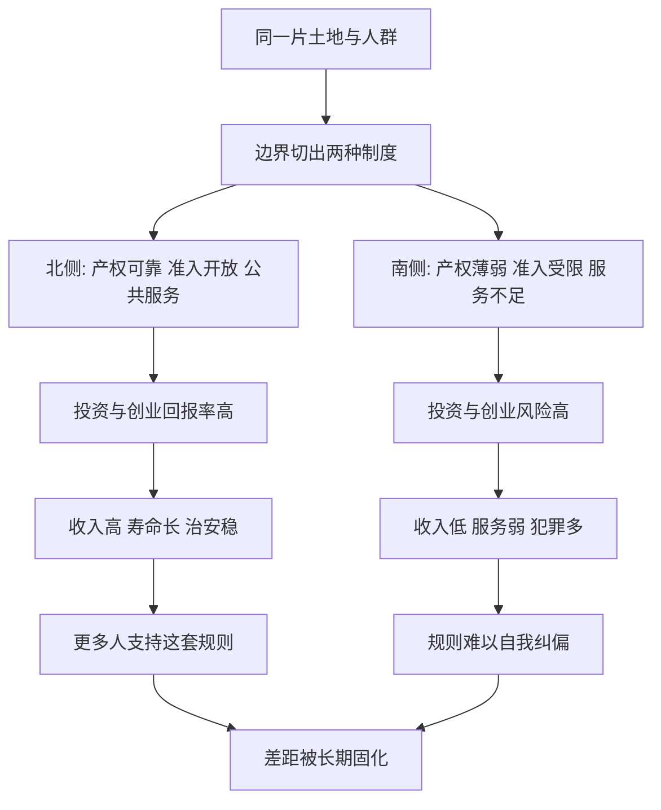

# 06｜为什么一墙之隔，却天差地别？

> 同一片土地、同一群人，为什么会有截然不同的命运？

---

## 一、先说结论

两位作者给出的答案，仍然落在同一个地方：**制度。**

诺加利斯（Nogales）被美墨边界一分为二。同一座城、同一片干燥的土地、相似的气候，往上追几代人甚至可能是同一批移民的后代。可两侧的日子却像两个世界：一侧收入高、寿命长、学校好、治安稳；另一侧收入低、公共服务薄弱、犯罪与贫困更常见。

阿西莫格鲁与罗宾逊认为，真正的分界线不是地理，也不是文化，而是**边界两侧运行的规则**——产权是否可靠、法律是否对所有人一视同仁、政府是否提供公共服务、普通人有没有机会参与和发声。

边界是一条线，但它切开的是两套制度。

---

## 二、我们先理解一个问题

先别急着谈理论，先看一个反直觉的事实。

如果贫富由气候决定，诺加利斯两侧共享同一片沙漠边缘的气候，应该没有差别。

如果贫富由文化决定，那一墙之隔的居民，语言、饮食、宗教、家庭观念高度接近，通婚与往来从未真正断过，也不该出现数量级的落差。

如果贫富由“人的素质”决定，那就更说不通了——他们本来就是同源的人。

可事实是：越过那道栅栏，收入、预期寿命、受教育年限、甚至晚上敢不敢出门，都明显不同。

于是就冒出一个必须回答的问题：

> 当土地、气候、人群几乎被“控制”成一样时，为什么结果仍然天差地别？

这正是作者最喜欢的一类证据：**一个把其他变量大致按住、只剩下制度在变动的“自然实验”。**

---

## 三、作者到底提出了什么观点？

两位作者把诺加利斯当作全书的“开场实验”。

他们的主张是：**当一片土地和一群人的先天条件被边界强行切开，两侧命运的分野，就只能由制度来解释。**

- 边界北侧：产权受到较可靠的保护，合同可以执行，创业与就业面对相对开放的准入，公共服务由税收支撑，政治上有选举与法律救济，权力受到约束。
- 边界南侧：产权保护较弱，非正规经济庞大，创办与经营企业要穿过层层关系与许可，公共服务供给不足，权力对规则的干预更多。

**同一批人、同一片土地，一旦被放进两套规则里，勤奋的回报率就不同，冒险的回报率就不同，守法的回报率也不同。**

作者由此得出那个在全书中反复出现的判断：**决定命运的，不是人的先天条件，而是他们生活在什么样的制度之下。**

---

## 四、把这个观点翻译成人话

想象一条街的两侧各开一家小餐馆，老板是亲兄弟，手艺一样，进货渠道一样。

街的左侧，规定很明确：谁开的店，赚的钱归谁；有人赖账可以告；新店想进就进，没人拦；办执照几天就下来。

街的右侧，规定含糊：赚的钱可能被各种名目拿走；出了纠纷要看关系；想开新店得先“打点”；执照拖上几个月也不一定下来。

同样两个勤劳的人，几年后的状态会完全不同：左边的哥哥敢投资、敢扩张、敢雇人；右边的弟弟只想“够用就好”，不敢投入，也不敢做大，因为他不确定做大的果实能不能保住。

**诺加利斯不是两个民族的对比，而是两种“游戏的说明书”的对比。**

制度不生产财富，它决定人敢不敢去创造财富，以及创造出来的财富最终落到谁手里。

---

## 五、为什么会这样？

把作者的推理画成链条：

关键在于**同一个起点，被两套激励结构推向两个方向**。

制度在这里扮演的角色，像是游戏规则的裁判。裁判公正、规则清晰，玩家就愿意长期投入、下注未来；裁判随意、规则可被关系改写，玩家就倾向于短期套利、随时准备撤。

**人没有变，改变的是人对“努力会不会有回报”的判断。**

---

## 六、举一个现实生活中的例子

回到诺加利斯本身。

它最有力的地方，是“可控”：同一座城、同一种沙漠气候、同一条供应链、甚至很多家庭横跨两侧。作者反复强调，这不是拿两个相隔万里的国家去比较，而是拿**被一条线切开的同一个地方**去比较。

于是结果里的差异，就很难再推给地理或文化：

- 北侧居民收入明显更高，预期寿命更长，受教育机会更多；
- 北侧的商业需要正规注册、缴税、受监管，也因此更容易拿到信贷与法律保护；
- 南侧大量经济活动处在非正规状态，不是人们不勤劳，而是正规经营的成本与不确定性太高；
- 两侧的治安、公共卫生、基础设施水平，长期存在肉眼可见的落差。

**这条边界证明的不是“美国人更聪明”，而是“同样的聪明人，放在不同的规则下，会做出不同的选择、得到不同的结果”。**

---

## 七、回到书中重新理解

现在再看作者为什么把诺加利斯放在全书很靠前的位置，就明白了。

它几乎是一个“去掉了所有借口”的实验。地理假说、文化假说、人种假说，在这座城市面前都不太站得住。剩下的最大变量，就是规则本身。

而且它示范了作者此后反复使用的方法：**找到一个能把其他因素大致固定住的场景，让制度成为那个唯一在动的变量。**

这也解释了全书的结构为什么如此“好斗”——它不是在罗列影响发展的因素，而是在逐一排除竞争者，最后把制度留在台上。

---

## 八、这个观点背后还有什么？

**第一，边界本身就是制度的产物。** 美墨边界的走向、两侧法律体系的差异，不是自然生成的，而是历史与政治博弈的结果。所以诺加利斯真正比较的，是“两套政治安排”。

**第二，制度的作用是累积的。** 一两年的规则差异未必看得出来，几十年累积下来，就会变成收入、健康、教育、治安上的巨大鸿沟。

**第三，作者并不是说边界北侧完美无缺。** 他们强调的是“相对包容”与“相对攫取”，而不是天堂与地狱的二分。

**第四，它把问题从“人”转向“规则”。** 这个转向很关键：一旦焦点从人转到规则，改变就有了可能——规则不像气候那样不可触碰。

---

## 九、这个观点有问题吗？

有，学界对“诺加利斯证明”的看法并不完全一致。

**第一，边界并不是一个完全干净的实验。** 一些研究者认为，两侧的人并非随机分布：更愿意冒险、更有资源、有人脉的人可能选择迁移到某一侧，这种“选择性迁移”会放大差距，让制度的作用被高估。作者会回应说，这种迁移本身就是被制度差异吸引而来的，但这层因果仍值得讨论。

**第二，边境城市本身很特殊。** 诺加利斯靠边境贸易与制造业生存，它的繁荣高度依赖跨境流动与政策优惠。把它的经验推广到整个国家，需要谨慎。

**第三，区域环境会“溢出”。** 北侧的安全与繁荣，部分依赖美国整体的执法能力、市场规模与联邦财政，而不只是这条街的规则。也就是说，制度差异是嵌在更大的制度差异里的。

**第四，它仍是全书最有力的论证之一。** 即便细节可议，“同地同人、规则不同、结果不同”这个核心对照，依然是制度论最直观的证据。

**所以更稳妥的说法是**：诺加利斯强力支持“制度很关键”，但它本身还不足以单独证明“制度解释一切”。

---

## 十、今天再看这个观点

以下部分是基于本书思想的现代延伸，不是两位作者的原话。

边界在今天有了新的形态。数字平台的规则、数据的跨境流动、算法的准入条件，正在制造一类“看不见的边界”——同一件事，在不同规则体系下，回报与风险完全不同。

在人工智能与平台经济时代，真正拉开差距的，可能不再是哪国人更勤奋，而是**哪个体系能让普通人以较低的制度成本参与进来**：注册一家公司要多久，合同能不能被低成本执行，失败之后能不能重来，创新者会不会被旧规则挡在门外。

当年的诺加利斯比的是关税与法律；今天比的，可能是一整套“让新事物能否顺利出现”的制度效率。

---

## 十一、这一篇真正应该记住什么？

1. **一墙之隔的差距，根子在规则。** 同一片土地、同一群人，也能走出两种命运。
2. **诺加利斯是一个“自然实验”。** 它把地理、文化、人群大致按住，让制度成为主要变量。
3. **制度通过激励起作用。** 规则可靠，人敢投资未来；规则随意，人只想短期套利。
4. **边界是累积的。** 几十年的规则差异，会滚成收入、健康与安全上的巨大鸿沟。
5. **它有力但非万能。** 迁移选择性、区域溢出等问题，提醒我们不要把单一案例当成万能证据。

---

## 十二、留一个问题

> 如果你所在的地方也有某种“看不见的边界”——
> 一边是规则清晰、努力有回报，
> 一边是关系为王、创造有风险，
> 你会往哪一侧走？

---

**下一篇**：如果说边界两侧的差别来自制度，那么更根本的问题就浮出来了——这些规则究竟是谁定的？经济规则从来不是天上掉下来的，它背后站着的是权力。

下一篇我们就来拆开这个问题——**政治制度和经济制度是什么关系？**
