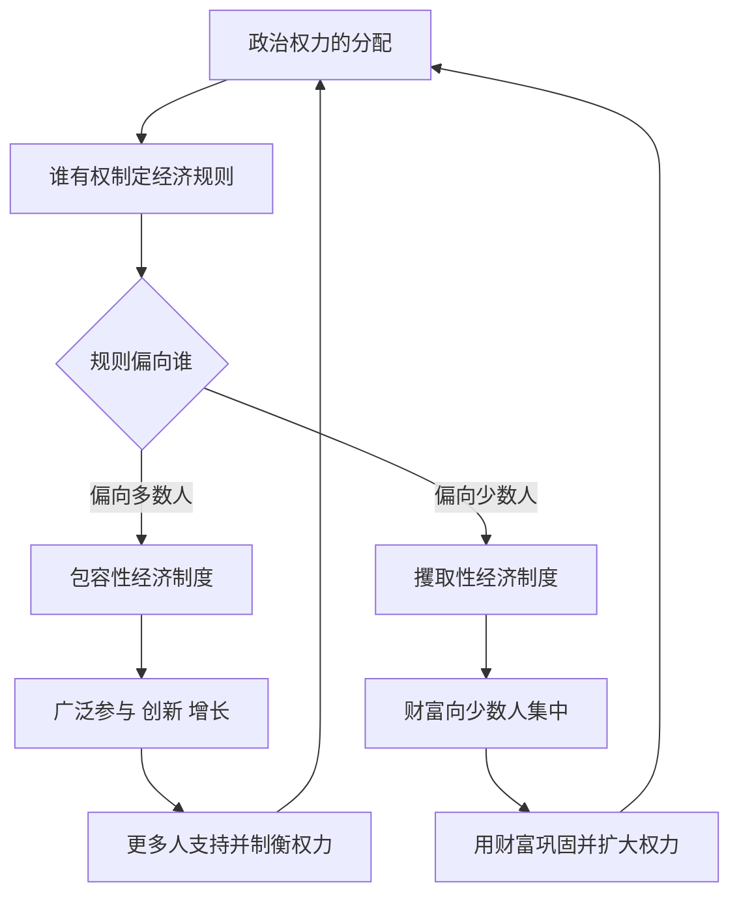

# 07｜政治制度和经济制度是什么关系？

> 经济制度由谁决定？为什么政治制度更根本？

---

## 一、先说结论

两位作者的答案是：**政治制度决定经济制度。**

在他们看来，经济规则从来不是从天上掉下来的，也不是技术或市场自然演化的结果。它是由**掌握政治权力的人**制定和执行的：谁能征税、征多少、向谁征；谁能拿到牌照、谁被挡在门外；产权对谁有效、对谁无效。

因此，要理解一个国家的经济为什么失败，往往不能只盯着经济，而要回到更上游的问题：**权力在谁手里，又是怎样被约束的。**

**谁有权制定规则，规则就会偏向谁。** 这句话是这一篇的核心。

---

## 二、我们先理解一个问题

我们习惯把税收、补贴、准入当成“经济问题”，交给经济学家去算。

但请停一下，问一个更朴素的问题：**税是谁定的？**

不是市场定的，也不是自然规律定的。是某个握有权力的人或机构，用一纸规则定下来的。同样地：

- 谁能开银行、谁能发牌照，是政治决定；
- 土地归谁、能不能买卖，是政治决定；
- 工人能不能组织、能不能谈判，是政治决定；
- 甚至“产权受不受保护”，最终也取决于法院和警察听谁的。

一旦看清这一点，就会发现：**我们以为是经济现象的东西，很多是政治安排的结果。**

真正的问题于是变成：

> 既然规则是被制定的，那么是谁在制定？制定者又为什么要那样制定？

---

## 三、作者到底提出了什么观点？

两位作者把制度拆成两层，并明确了两者的关系。

**政治制度**，管的是权力的分配与约束：谁参与决策、权力如何被制衡、领导人如何产生、更替是否和平有序。

**经济制度**，管的是资源的分配与使用：产权、竞争、准入、契约、税收与再分配。

他们的核心主张是：

- **经济制度由政治制度决定。** 因为规则的制定权，掌握在政治权力的手里。
- **两者常常配套出现。** 攫取性的政治制度，往往对应攫取性的经济制度；包容性的政治制度，往往对应包容性的经济制度。
- **它们互为支撑。** 攫取性政治制度用经济攫取来供养自己；经济上的垄断与排斥，又反过来巩固政治上的少数人掌权。

所以他们才说：**要改变经济规则，就要先改变制定规则的方式。**

---

## 四、把这个观点翻译成人话

想象一个小区要定停车规则。

如果规则由全体业主投票决定，那么你大概会看到：车位分配相对公平，收费透明，管理方被业主监督，谁也不能随便把公共车位划给自己。

如果规则由物业经理一个人说了算，那么大概率会是：好车位先留给“关系户”，收费名目越来越多，业主想查账却查不到，谁不满意就被穿小鞋。

停车规则本身是“经济规则”，可它长什么样，完全取决于**谁有权力定它、谁有能力监督它**。

国家层面的逻辑一模一样：

- 有制衡的政治制度，经济规则就更可能照顾多数人；
- 没有制衡的政治制度，经济规则就更可能服务少数人。

**先有“谁能定规矩”，才有“规矩偏向谁”。前者是根，后者是果。**

---

## 五、为什么会这样？

作者的机制可以用一条闭环来表示：

值得注意的是最下面那条回流线：**经济制度会反过来塑造政治制度的稳定性。**

- 包容性经济让多数人受益，他们会支持并守护这套制度，让权力受到更多约束；
- 攫取性经济让财富集中到少数人手里，他们用这笔财富控制媒体、收买官员、打压对手，让权力更难被约束。

这就是“政治—经济”的双向加固：**好制度互相成就，坏制度互相锁死。**

---

## 六、举一个现实生活中的例子（谁有权制定规则）

最能说明问题的，是**税收权与选举权**这对组合。

在现代政治史上，“谁有权征税”从来不是技术问题，而是权力斗争的焦点。英国历史上，议会与国王长期围绕征税权角力：国王要打仗、要花钱，就得找议会要钱；而议会用“不先解决我们的诉求，就不批钱”作为筹码，逐步把征税权握到自己手里。**“无代表不纳税”喊出的不是经济诉求，而是政治资格——你要拿我的钱，就得先给我发言权。**

这个逻辑一旦成立，规则就开始改变：

- 当选举权只属于少数有产者时，税收与支出自然倾向于保护少数人的利益；
- 当选举权逐步扩大到更广泛的人群时，税收结构、公共教育、公共卫生、社会保障这些“再分配型”的规则，才更可能出现。

**同一件事——收税——背后的规则为什么不同？因为“谁有权拍板”变了。**

这也解释了为什么作者说政治制度更根本：**只要制定规则的权力结构不变，经济规则就很难真正转向多数人。**

---

## 七、回到书中重新理解

现在回看，就能理解作者为什么把大量篇幅放在政治制度上，而不是只谈产权与市场。

如果只谈经济规则，你就会陷入一个死循环：为什么这个国家不保护产权？因为它没有好的经济制度。为什么它没有好的经济制度？因为它没有好的政治制度。

**答案必须落到权力：一个社会的规则由谁制定、对谁负责、被谁监督。**

这也是本书与其他“就经济谈经济”的发展理论分道扬镳的地方。作者认为，**不触及权力结构的改革，往往只是表面文章**——纸面上的好政策，会被实际的权力关系重新扭曲。

---

## 八、这个观点背后还有什么？

**第一，它把政治与经济视为一体两面。** 你很难只要“经济自由”、不要“政治约束”，因为前者需要后者来保护。

**第二，制度是“内生”的。** 规则不是外生给定的最优方案，而是权力博弈的均衡结果。理解这一点，才能理解为什么“明明有更好的政策却没人采用”。

**第三，约束权力本身是一种公共品。** 它保护的不只是穷人，也保护富人免于被任意掠夺——所以稳定、可预期的权力制衡，对长期投资至关重要。

**第四，它给改革指出了方向。** 如果根子在权力分配，那么扩大参与、增强制衡，就不只是“政治理想”，而是经济增长的制度前提。

---

## 九、这个观点有问题吗？

有，而且这一部分是全书争议最集中的地方之一。

**第一，因果方向存在争论。** 一些学者（尤其现代化理论的传统）认为，经济发展本身会催生中产阶级、教育普及与政治参与诉求，从而推动政治制度变化——也就是说，经济也可能塑造政治。关于这一问题，学界存在不同解释：是政治先行，还是经济先行，或是两者互为因果，至今没有定论。

**第二，政治与经济未必总是配套。** 现实中存在“经济上较开放、政治上较集中”的组合，也存在“政治较开放、经济表现平平”的组合。把两者严格绑成一对，可能简化了实际图景。

**第三，关于中国，需要格外小心地区分。** 阿西莫格鲁与罗宾逊倾向于用“攫取性”框架分析高度集中的权力结构，并认为其增长面临可持续性挑战；但不少研究者的看法不同，他们强调不同体制的适应能力、政策执行效率以及特定发展阶段的“追赶效应”，认为不能简单套用这一二分。**这是作者观点与学界争论的分野，本系列不替任何一方下结论。**

**第四，它的价值仍在于视角。** 即便因果细节有争议，“经济规则由政治权力塑造”这一点，提醒我们不要把经济政策当成脱离权力环境的中性工具。

---

## 十、今天再看这个观点

以下部分是基于本书思想的现代延伸，不是两位作者的原话。

今天的规则制定，越来越多地发生在传统国界之外：平台制定交易规则、算法分配流量、数据跨境流动、全球最低企业税谈判。谁能在这些领域“定规矩”，谁就在分配未来的收益。

于是“谁有权制定规则”这个问题有了新版本：**当一个平台同时是市场、裁判和税官时，对它谁来制衡？** 当资本、数据与算力高度集中时，规则会偏向用户与创新者，还是偏向守成者与巨头？

制度竞争在今天的一个关键形式，或许就是：**一个社会能不能把规则制定权保持在可讨论、可监督、可修正的状态。**

---

## 十一、这一篇真正应该记住什么？

1. **政治制度决定经济制度。** 经济规则由政治权力制定，而不是自然生成。
2. **谁定规则，规则就偏向谁。** 这是理解经济失败的关键入口。
3. **两者互相加固。** 攫取性政治与经济互相供养；包容性政治与经济互相成就。
4. **税收权与选举权是最直观的例子。** “无代表不纳税”是政治资格之争，不只是钱的问题。
5. **争议同样存在。** 因果方向、政治与经济的搭配、以及中国的案例，都有学界分歧，须区分作者观点与学界争论。

---

## 十二、留一个问题

> 在你身边，那些真正影响你生活的规则——
> 是经过公开讨论、可被质疑和修改的，
> 还是由少数人关起门来定好、然后通知你的？

---

**下一篇**：如果规则由权力决定，那么当一场巨大的外部冲击突然降临、原有的权力格局被打乱时，会发生什么？为什么相似的社会，会在那一刻走向完全相反的方向？

下一篇我们就来拆开这个问题——**什么是“关键节点”？**
