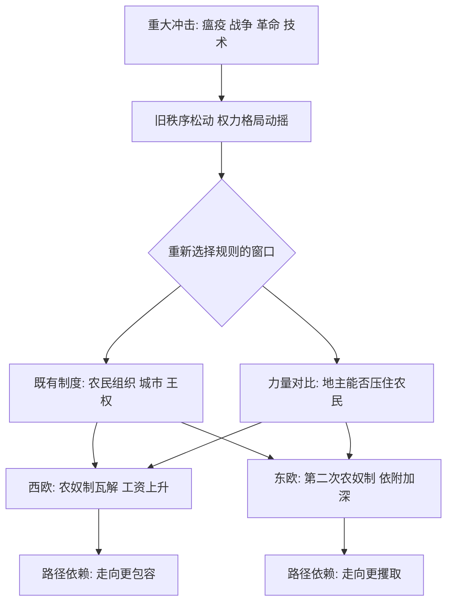

# 08｜什么是“关键节点”？

> 为什么相似的社会，会在某一刻走向完全不同的道路？

---

## 一、先说结论

两位作者提出一个概念：**关键节点（critical juncture）。**

它指的是那些**打破既有社会平衡的重大冲击**——瘟疫、战争、革命、技术变革、大规模移民。这类冲击会动摇旧秩序，让社会短暂地进入一个“规则可以被重新选择”的窗口期。

作者的洞察在于：**在这个窗口期，原本微小的差异会被急剧放大。** 相似的社会可能因为一点点初始条件的不同，做出不同的选择，然后沿着不同的路径越走越远。

冲击本身不决定结局，**在冲击中被激活、被改写的制度，才决定结局。**

---

## 二、我们先理解一个问题

先想一个极端的场景。

十四世纪中叶，一场大瘟疫横扫欧洲，人口在短时间内大量死亡。劳动力的供给突然萎缩——田地没人种，工钱水涨船高。对农民来说，这本来是一件“议价能力变强”的事：地主缺人，就得让利。

可是接下来，欧洲不同地区给出了截然相反的答案。

在西欧，农民的地位总体上升：农奴制逐步瓦解，工资上涨，人身依附松动。

在东欧，情况却反了过来：地主反而把农民更紧地绑在土地上，形成后来被称为“第二次农奴制”的安排。

同一场瘟疫，同一片大陆，为什么走出两个方向？

> 当一场大冲击同时击中许多社会时，为什么它们不会一起往前，而是走向截然不同的岔路？

---

## 三、作者到底提出了什么观点？

两位作者的观点可以概括为三点。

**第一，历史不是匀速前进的。** 大部分时间里，制度是稳定的、自我延续的；改变往往集中在少数几个“关键时刻”。

**第二，关键节点打开了“选择窗口”。** 当重大冲击让旧秩序难以为继，原本被压抑的力量、原本不可能的组合，都有了重新博弈的机会。此时社会面临真正意义上的分岔：走哪条路，并非注定。

**第三，决定走向的是既有制度与力量对比。** 面对同样的冲击，不同社会之所以反应不同，是因为它们**此前的政治制度、阶级关系和权力结构不同**。冲击只是把差别放大了。

所以作者说：**关键节点不是“原因”，而是“放大器”和“岔路口”。**

---

## 四、把这个观点翻译成人话

想象两栋楼同时遭遇一场地震。

房子都被震裂了，接下来都要重建。关键不在于地震本身，而在于：

- 谁来主持重建？
- 是全体住户坐下来商量，还是由原来的房东一个人说了算？
- 重建时，是趁机把旧的不合理格局改掉，还是把旧的格局加固得更结实？

同样的地震，可能让一栋楼改造成人人有份的合作住宅，也可能让另一栋楼变成房东权力更大的“加强版旧秩序”。

**灾难不会自动带来进步，它只是把“重新定规矩”的机会摆到台面上。谁抓住这个机会、按谁的意志来重定，决定了此后几十上百年的走向。**

---

## 五、为什么会这样？

把作者的逻辑画出来：

核心在于 **C 到 D、E** 这一步：**同样的冲击，进入的是不同的“社会结构过滤器”，出来的就是不同的制度选择。**

而一旦选定，又会进入“路径依赖”——今天的制度影响明天的力量对比，明天的力量对比又影响再下一次的选择。**岔路一旦走开，就很难再合上。**

---

## 六、举一个现实生活中的例子

回到黑死病后的欧洲。

瘟疫造成人口锐减，这是整个欧洲共同的冲击。按最简单的推理，哪里都缺劳动力，哪里的农民都该占上风。可历史给出的答案是分岔的。

**在西欧**，农民并非孤立无援：他们有一定程度的村社组织，有正在成长的城市作为退路（逃到城里做工也是选择），有中央王权愿意拉拢农民以制衡地方贵族。当劳动力变得稀缺，农民能把“缺人”转化成实际的谈判筹码——工资上升，劳役减轻，人身依附逐步松动。

**在东欧**，力量的天平压在地主一边。贵族对地方政治的控制更强，王权相对更弱、更依赖贵族支持，城市与农民的议价空间都更小。于是同样的劳动力稀缺，地主的反应不是让步，而是**用政治权力把农民强制留下来**：限制迁徙、加重劳役、把人身自由越收越紧。这就是所谓“第二次农奴制”的由来。

**同一场瘟疫，同样的经济压力，因为政治结构不同，变成了两种截然相反的制度走向。** 一个走向更自由，一个走向更束缚。

---

## 七、回到书中重新理解

现在再回看，就能理解作者为什么要专门讲“关键节点”。

如果历史只是渐进的、连续的，那么贫富差距的起源就只能追溯到很久以前的缓慢积累，很难解释为什么有些社会会在某个时刻突然转向。**关键节点理论给出了另一种图景：制度可以在特定时刻被快速改写。**

它同时解释了作者反复强调的两件事：

- **微小差异为何会导致巨大分流。** 冲击来临前，两个社会看起来差不多；冲击过后，走出两条路。
- **路径依赖为何如此强大。** 关键节点只是一瞬，但它选定的方向，会通过一代代制度与利益结构延续下去。

**历史不是必然的，但它一旦选择，就会变得黏稠。**

---

## 八、这个观点背后还有什么？

**第一，关键节点强调“偶然中的结构”。** 它不是说结局纯属运气，而是说：偶然的冲击加上既有的结构，共同决定了结果。

**第二，它给“制度可以改变”提供了时间窗口。** 改革往往不是随时都能发生的，而是需要危机打开缝隙。

**第三，窗口期也是风险期。** 同一个窗口，也可能被少数人利用，把制度推向更攫取的方向。危机不保证进步。

**第四，它拒绝历史决定论。** 相似的起点、相似的冲击，仍可能通向不同结局——这让“发展”保留了开放性与能动性。

---

## 九、这个观点有问题吗？

有，学界对这个概念本身就有讨论。

**第一，“关键节点”可能定义过宽。** 批评者指出，如果几乎任何重大事件都能被追认成关键节点，那么这个概念就有“事后归因”的风险：先看到结果，再回头指认某个时刻是岔路口。这会削弱它的可验证性。

**第二，与“渐进制度变迁”理论存在分歧。** 一些制度经济学家更强调制度的连续、缓慢演变，认为把变化集中在少数节点上，可能低估了日常演化与边际调整的力量。关于制度究竟如何变迁，学界存在不同解释。

**第三，谁在窗口期真正有决定权，仍有争论。** 是精英博弈、大众动员，还是外部力量？不同研究强调不同主体，作者侧重既有政治结构与权力对比，但这并非唯一视角。

**第四，它仍很有解释力。** 即便概念边界可议，“重大冲击加既有结构，导致制度分流”这一框架，仍然为理解历史的断裂与转向提供了有力工具。

---

## 十、今天再看这个观点

以下部分是基于本书思想的现代延伸，不是两位作者的原话。

我们或许正处在一个新的关键节点上：技术冲击、全球供应链重组、气候转型、人口结构变化，都在动摇旧有秩序。这类时刻的特点，是**旧规则失效、新规则尚未定型**，重新选择的空间短暂地打开了。

历史经验提示我们：**危机越深，越要注意“谁来重定规则”。** 同样的冲击，可能被用来扩大参与和竞争，也可能被用来加固旧有的垄断与依附。窗口期给的不是答案，而是选择。

**能不能在窗口关上之前，把规则推向更包容，而不是更攫取，这往往决定未来数十年的走向。**

---

## 十一、这一篇真正应该记住什么？

1. **关键节点是打破平衡的重大冲击。** 瘟疫、战争、革命、技术变革都可能成为它。
2. **它的作用是打开“重新选择规则”的窗口。** 而不是自动带来好制度。
3. **同样的冲击，因既有结构不同而分流。** 黑死病后的西欧与东欧，是最经典的例子。
4. **微小差异会被放大并锁定。** 关键节点之后，路径依赖让方向难以逆转。
5. **概念本身有争议。** 定义过宽、事后归因、与渐进变迁理论的分歧，都是需要留意的问题。

---

## 十二、留一个问题

> 如果危机真的会打开一扇“重定规则”的窗口，
> 那么在下一次冲击到来时，
> 你希望由谁来写新的规则——以及，你准备好参与了吗？

---

**下一篇**：关键节点解释了“分流”是怎么发生的，但还有一个更让人不安的问题：为什么一旦走上坏的那条路，就很难回头？坏制度明明伤害所有人，为什么它还能长期存在？

下一篇我们就来拆开这个问题——**为什么坏制度会自我强化？**
