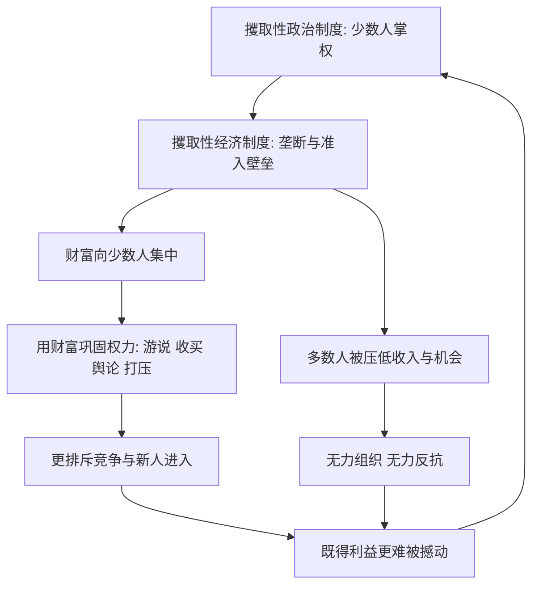

# 09｜为什么坏制度会自我强化？

> 攫取性制度明明是坏的，为什么能维持那么久？

---

## 一、先说结论

两位作者的答案是：**恶性循环（vicious circle）。**

攫取性制度不是靠运气活着的，它有一套自我强化的机制：

- 少数人用现有的权力，制定对自己有利的经济规则；
- 这些规则把财富持续输送给少数人；
- 财富又被用来巩固甚至扩大政治权力；
- 更强的权力，让他们能更彻底地排斥竞争、压制挑战者、阻挡新人进入。

**权力产生财富，财富又买回权力。** 一个闭环就此形成：制度越坏，既得利益越厚；既得利益越厚，制度越难被推翻。

这就是为什么坏制度往往不是“很快崩掉”，而是能熬过一代又一代人。

---

## 二、我们先理解一个问题

先接受一个常识：**一个制度如果长期让多数人受苦，本该被纠正。**

至少在直觉上，事情应该是这样——做得不好就换人，规则不合理就改。市场竞争里，服务差的商家会被淘汰；那为什么政治与经济上，一套明显低效、甚至掠夺性的制度，却能稳稳地存在几十年、上百年？

翻开历史，这样的例子并不少：少数家族长期垄断经济命脉，多数人再怎么勤劳也难以翻身；新人想创业，却总被各种门槛挡住；明明有更好的技术、更好的做法，就是进不来。

于是真正的问题不是“坏制度坏不坏”，而是：

> 一个对多数人不利的制度，为什么不会被多数人改掉？

---

## 三、作者到底提出了什么观点？

两位作者主张：**攫取性政治制度和攫取性经济制度会相互喂养，形成稳定的恶性循环。**

具体来说：

- **政治上**，少数人掌握制定规则的权力，且缺少有效制衡；
- **经济上**，他们用这份权力设置准入壁垒、垄断资源、排斥竞争，把财富集中到自己手里；
- **财富再反哺政治**，用来收买、游说、控制舆论、打压对手，让权力更集中、更难被挑战。

关键的一步是**“阻止 newcomers（新进入者）”**：只要能持续挡住新人，现有的既得利益就永远安全。于是制度的首要任务，不再是做大蛋糕，而是**守住分配蛋糕的资格**。

作者因此说：坏制度的稳定性，恰恰来自它的“坏”——**掠夺来的资源，正是维持掠夺秩序的本钱。**

---

## 四、把这个观点翻译成人话

想象一个只有一家饭馆的镇子。

这家饭馆的老板，同时也是镇上的“规矩制定者”。他定下几条规则：

- 新开饭馆要办一张极难拿到的许可证；
- 卫生检查、消防检查的标准，对别人严格、对自己宽松；
- 镇上有什么纠纷，最后都归他信任的人来说了算。

结果很明显：别的饭馆开不起来，或者开了没多久就被“合规”关掉。老板的生意越做越大，钱越来越多；他再用这些钱，去维持那套“规矩”，顺便让反对他的人不好过。

**没有竞争，不是因为没有市场，而是因为有人用规则把竞争者挡在门外。** 这就是恶性循环最日常的样子：**用权力换财富，再用财富保权力。**

---

## 五、为什么会这样？

作者的机制，可以画成一个越转越紧的环：

这个环有两个关键支点：

- **支点一：财富可以兑换权力。** 只要金钱能影响规则与执法，攫取就会自我壮大。
- **支点二：多数人难以组织起来。** 攫取性制度会刻意压低收入、限制结社、控制信息，让“集体反抗”变得极其困难。

**于是坏制度不是慢慢耗尽自己，而是越用越顺手。想打破它，通常需要来自外部或非常时刻的强冲击。**

---

## 六、举一个现实生活中的例子

最有代表性的，是**寡头与既得利益者联手阻止竞争与 newcomers 进入**。

它的运作方式通常有几层：

**第一层，设置准入壁垒。** 用许可证、牌照、审批、行业标准，把“谁能进场”变成一种被垄断的资源。名义上是为了“规范”和“安全”，实际上常常是让新人进不来、在位者更安全。

**第二层，俘获监管。** 当监管者与被监管者高度重合，规则就会越来越照顾在位者：守法成本对巨头更低，对新人更高；违规被查的往往是挑战者，而不是垄断者。

**第三层，把财富转化为政治影响力。** 游说、捐款、人事网络、“旋转门”，让寡头能影响立法与执法，甚至直接决定谁上谁下。

**第四层，收买或威慑潜在挑战者。** 用合作、分利、收编，或者用法律、舆论、暴力去打压，让新人知难而退。

作者在书中讨论过的许多攫取性体系——从殖民时期的大庄园，到一些国家长期由少数精英把持的经济与政治——都呈现类似结构：**经济上的垄断与政治上的排他，是一个系统，而不是两件事。**

**这正是“坏制度稳定”的秘诀：它把“阻止改变”本身，变成了一门有利可图的生意。**

---

## 七、回到书中重新理解

现在再看作者为什么把恶性循环单独拎出来讲，就清楚了。

它回答的是全书最难、也最关键的一个问题：**如果制度这么重要，为什么坏制度没有被纠正，反而能延续几百年？**

答案不是“人们太笨”或“统治者太坏”，而是：**坏制度创造了一批有强烈动机、也有充足资源去维护它的人。** 他们在现状中获益最多，因此也最有能力阻止改变。

这也让全书的态度更清醒：**制度不是自然向好的，坏制度不会因“不合理”而自动消失。** 要打破它，往往需要关键节点式的冲击，或者外部约束与内部动员的罕见结合。

---

## 八、这个观点背后还有什么？

**第一，它是一种“路径依赖”的具体机制。** 过去的选择塑造今天的力量对比，今天的力量对比又限制明天的选择。

**第二，它解释了贫困为何顽固。** 不是穷国不想发展，而是攫取性秩序会把发展的收益先吸走，让多数人无法积累。

**第三，“改革”在坏制度下先天不利。** 因为改革的受益者分散、力量弱，而改革的受损者集中、力量强。这是一种典型的不对称博弈。

**第四，它给外部世界一个提醒。** 若援助或投资只与既得利益者打交道，很可能只是给恶性循环提供更多燃料。

---

## 九、这个观点有问题吗？

有，而且这一段尤其需要平衡地看。

**第一，坏制度并非永远不倒。** 历史上确实存在坏制度的崩塌——东欧剧变、一些国家的民主化转型、韩国与台湾地区从威权走向开放。这说明恶性循环不是铁的定律，外部冲击、内部抗争与精英分裂都可能打破闭环。问题只是它常常比想象中难、也更慢。

**第二，它可能低估了体制的自我调适能力。** 关于威权体制能否通过自我改革实现长期增长，学界存在不同解释：有人强调压制创新会导致增长见顶（这也是两位作者的倾向），也有人认为不同体制可以通过政策调整、技术追赶与治理能力维持相当长时期的增长。**这属于作者观点与学界争论的分野，本系列不替任何一方下结论。**

**第三，“既得利益”的具体边界并不总是清晰。** 现实中哪些人算寡头、哪些算中产、哪些算改革派，往往互相交织，未必能干净地二分。

**第四，它仍有很强的现实解释力。** 即便不是绝对规律，“既得利益用权力锁死竞争”这个机制，仍是理解许多国家长期停滞的最有用工具之一。

---

## 十、今天再看这个观点

以下部分是基于本书思想的现代延伸，不是两位作者的原话。

恶性循环在今天有了新的载体。平台经济里，头部企业可以用数据、流量与资本构筑壁垒，让新进入者越来越难；可以收购潜在对手，把竞争消灭在萌芽里；还可以通过游说与标准制定，把对自己有利的规则固化下来。**“赢者通吃”叠加“规则被俘获”，正是数字时代的恶性循环模板。**

这提示我们：**竞争的敌人，往往不是竞争本身，而是“制定竞争规则的人”。** 一个社会能否让新事物、新企业、新想法不断出现，很大程度上取决于它有没有能力防止规则被少数人长期把持。

---

## 十一、这一篇真正应该记住什么？

1. **恶性循环是坏制度长期存在的核心机制。** 权力产生财富，财富又买回权力。
2. **阻止新人进入是关键一环。** 只要挡得住挑战者，既得利益就永远安全。
3. **坏制度稳定，靠的正是它掠夺来的资源。** 掠夺的钱，就是维持掠夺秩序的本钱。
4. **打破它通常需要强冲击。** 改革在坏制度下先天处于少数、弱势、分散的一方。
5. **它不是绝对定律。** 坏制度也会被推翻，威权体制的适应能力也仍属学界争论，须区分作者观点与学界争论。

---

## 十二、留一个问题

> 如果把“谁在被规则保护、谁在被规则挡住”这两栏分别列出来，
> 你会把自己放在哪一栏？
> 而那些被挡住的人，是否还相信自己有机会翻栏而入？

---

**下一篇**：既然坏制度会自我强化，那反过来问——好制度是不是也会自我延续？包容性的规则凭什么能稳定地维持下去，而不是被少数人的野心慢慢掏空？

下一篇我们就来拆开这个问题——**为什么好制度也会延续？**
