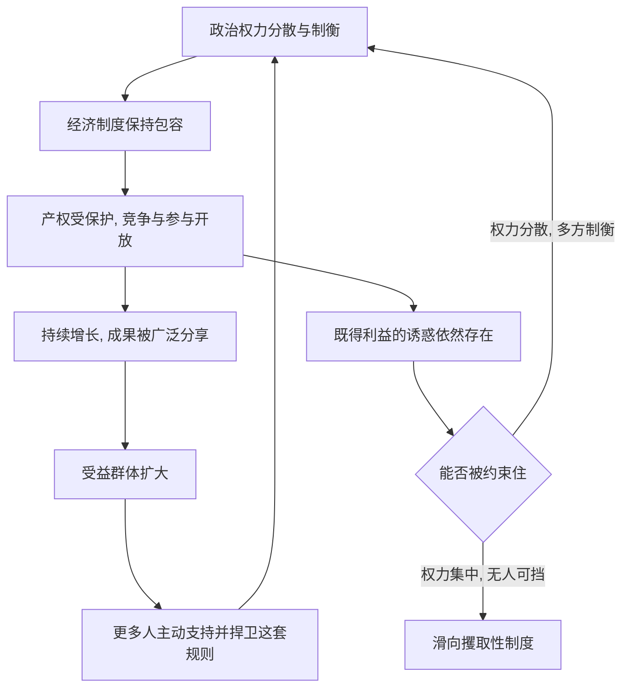

# 10｜为什么好制度也会延续？

> 包容性制度凭什么能稳定地维持下去？

---

## 一、先说结论

阿西莫格鲁与罗宾逊认为：好制度能够延续，靠的是一套"良性循环"。

它的逻辑是这样转动的：包容性的政治制度把权力分散开、限制任何一方随意掠夺，于是经济上的包容性——产权、竞争、参与——得到保护；经济繁荣又让越来越多的人成为这套规则的受益者与支持者，反过来要求政治继续开放。如此首尾相接，形成正反馈。

他们并不认为好制度完美无缺，也不认为它会自动永存。他们的判断是：**在同等的冲击面前，包容性制度比攫取性制度更有韧性。**

---

## 二、我们先理解一个问题

坏制度的维持机制，作者已经用"恶性循环"解释过了：既得利益者用攫取的资源巩固权力，权力又让他们继续攫取，于是越坏越难推翻。

那么问题就来了——

好制度为什么不会自我瓦解？既然权力可以被用来掠夺，手握权力的人为什么不干脆把规则改坏、把好处独吞？历史上被寄予厚望的共和、宪政，也常常在几年、几十年内就滑向独裁。

换句话说：**到底是什么力量，在多数时候挡住了"把好规则改坏"的冲动？**

---

## 三、作者到底提出了什么观点？

两位作者的回答，是与恶性循环对称的"良性循环"。

他们认为，包容性制度的关键不只是"规则写得好"，而是**权力本身被分散、被制衡**。当没有一个单一的权力中心能够单独改写规则时，掠夺就变得困难：想剥夺别人的产权，会有别的力量反对；想关掉竞争、独吞垄断利润，也会撞到约束。

于是形成一条正向链条：

- 政治权力分散、受约束 → 经济制度保持包容；
- 经济包容带来增长与广泛分享 → 越来越多的人从现状中受益；
- 受益者成为这套规则的"利益相关方"，主动捍卫它；
- 捍卫的力量越强 → 政治包容越稳固。

两位作者的核心判断是：**好制度之所以延续，不是因为它道德上更优越，而是因为它造就了一大批有动力维护它的人。**

---

## 四、把这个观点翻译成人话

可以把它想成一场牌局。

如果牌桌上只有一个人能改规则，他迟早会把规则改成对自己有利——因为他改规则的成本几乎为零，收益却全归自己。这就是攫取性制度的常态。

反过来，如果改规则需要好几方都点头，那么想占便宜的一方就会处处受阻。更微妙的是：当规则公平、大家都能靠本事赢牌时，每个人都会觉得"这套规则挺好，别动它"。于是**维护规则本身，就成了一种理性选择。**

这带来一个反直觉的结论：好制度真正可靠的地方，不在于它遇到了好人，而在于它让"想变坏"这件事变得很难办成。**好的规则不依赖圣人，它依赖的是让坏人也不容易得手的结构。**

---

## 五、为什么会这样？

把作者所说的良性循环画出来，就是一条自我加强的回路：

这张图的关键，在于 **F → A** 这条回环。

恶性循环靠"掠夺—权力—再掠夺"闭合，良性循环靠"约束—繁荣—再约束"闭合。两者都是正反馈，所以要改变一个社会，难点从来不是某一条规则，而是**能不能打断那条正在自我强化的回路**。

作者也提醒：这条回路并非铜墙铁壁。**G → H** 那个判断点永远存在——只要约束松动、权力重新集中，回路就可能反向转动。

---

## 六、举一个现实生活中的例子

两位作者多次回到一个转折点：一六八八年的英国光荣革命。

在这场政治变动之前，英国王权与议会长期拉锯，国王随时可能加税、借钱不还、随意更改规则，产权和契约缺少稳定保障。光荣革命之后，权力的天平明显向议会倾斜：国王不能再随意征税，也不能绕开议会立法；司法与议会的独立性增强，对王权的约束逐渐制度化。

两位作者用这一转折说明的不是"英国人更聪明"，而是**权力结构改变带来的连锁反应**：

- 有了对王权的约束，产权与契约更可信，人们敢于投资、放贷、长期经营；
- 政府借债的信用显著改善，因为它不再能随意赖账；
- 更多有产者有动力维护这套规则，因为他们正是受益者；
- 这些力量又反过来加固议会的地位。

于是，一项政治上的权力再分配，慢慢长成一套能自我延续的包容性制度。这正是良性循环的经典样本：**一次关键节点上的权力重组，被后续的繁荣与支持者不断加固。**

---

## 七、回到书中重新理解

现在回看作者为什么在讲完"恶性循环"之后，立刻要讲"良性循环"，就顺理成章了。

因为他们要回答的是一个对称的追问：坏制度能自我强化，好制度靠什么活下去？如果好制度只是运气好、只是某位开明君主的一念之仁，那它随时会崩塌，制度决定论就站不住脚。

良性循环补上了这一环：**好制度的韧性来自结构，而不是来自道德。** 分散的权力、受益的多数、可预期的规则，共同构成了一道"防止逆转"的防线。这样一来，"包容性制度能带来长期繁荣"这句话，才不只是静态的描述，而是一个能自我维持的动态过程。

---

## 八、这个观点背后还有什么？

**第一，"制衡"是良性循环的枢纽。** 在作者的框架里，真正起作用的不是纸面上的权利清单，而是"有没有力量能阻止权力被滥用"。

**第二，繁荣会制造自己的支持者。** 这一点常被忽略：经济增长不只是结果，它还会重塑政治——让更多人愿意为现有规则买单。

**第三，良性循环同样有"门槛"。** 它需要初始条件：权力已经相对分散、存在多元的社会力量。完全集中的权力结构，很难自行启动这条回路。

**第四，它与恶性循环共用同一个机理。** 二者都是路径依赖——制度的自我强化。区别只在于，强化的方向是"越约束越开放"，还是"越掠夺越集中"。

**第五，它暗示了改革的难点。** 既然好制度靠结构维持，那么改革就不能只改条文，还要改变权力的分布。

---

## 九、这个观点有问题吗？

有，学界对"良性循环"的讨论相当充分。

**第一，它可能把"韧性"讲得过于顺滑。** 一些学者指出，历史上不少看似稳固的包容性制度，最终仍被特殊利益集团俘获，或在内部分裂中瓦解。良性循环并非一旦启动就永不逆转。

**第二，"谁是受益者"并不总是清晰的。** 繁荣可能集中在少数人手中，若大多数人的处境没有改善，支持这套规则的社会基础就会变薄，良性循环可能空转。

**第三，它被批评带有欧洲中心色彩。** 关于这一问题，学界存在不同解释：批评者认为，以英国等少数案例归纳出的"标准路径"，可能低估了其他地区在完全不同条件下维持稳定秩序的方式。

**第四，因果关系仍然纠缠。** 是包容性制度带来繁荣，还是繁荣反过来催生了包容性制度？在现实中二者几乎同时发生，要辨清先后极为困难。

**第五，但它仍提供了一个有力视角。** 即便机制细节有争议，"权力分散—繁荣—更广泛支持"这条逻辑，依然是解释长期稳定最值得认真对待的框架之一。

**所以更准确的说法是**：良性循环刻画了一种真实的、可观察的自我强化机制，但它更像是一个"有条件的趋势"，而非"一旦开启就不可逆的定律"。

---

## 十、今天再看这个观点

以下部分是基于本书思想的现代延伸，不是两位作者的原话。

在今天的语境里，良性循环最值得关注的，是它如何面对"新冲击"。技术更迭、全球化退潮、人口结构变化，都会不断冲击既有规则。一个社会能否维持包容性，关键不在于它过去多么成功，而在于**它能不能把新出现的受益者和被冲击者，都纳入规则的调整过程之中**。

如果调整只照顾强者、把被淘汰者排除在外，支持规则的社会基础就会流失；如果调整能够让多数人看到"规则仍然对我不薄"，这条回路才能继续转下去。换句话说，良性循环在今天要回答的，是一个更动态的问题：**规则不仅要保护已经发生的繁荣，还要能承接尚未到来的变化。**

---

## 十一、这一篇真正应该记住什么？

1. **好制度靠良性循环延续。** 政治包容保护经济包容，繁荣又扩大支持者。
2. **韧性来自结构，而非道德。** 权力被分散、被制衡，才能挡住把规则改坏的冲动。
3. **繁荣会制造自己的捍卫者。** 增长不只是结果，它还会重塑政治基础。
4. **良性循环与恶性循环同源。** 都是路径依赖，只是一个越走越开放，一个越走越封闭。
5. **但它不是不可逆的定律。** 特殊利益俘获、受益不均、外部冲击，都可能让回路反向转动。

---

## 十二、留一个问题

> 如果好制度的可靠之处，在于让"想变坏"变得不容易办成，
> 那么你所在的这套规则，
> 是靠结构在自我守护，还是只在靠某一个人的克制？

---

**下一篇**：既然制度会自我强化，那么当新技术出现、旧利益被冲击时，为什么社会内部的抵制力量总是如此强大？创新明明是好事，为什么反而成了最容易被围攻的对象？

下一篇我们就来拆开这个问题——**"创造性破坏"为什么会被抵制？**
