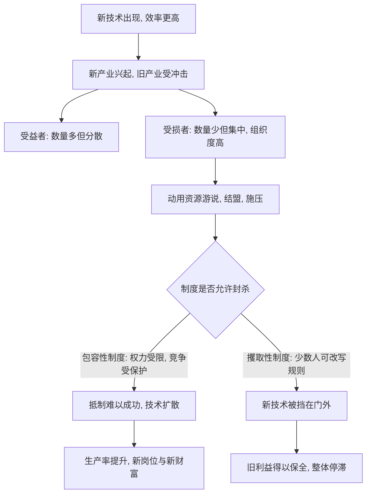

# 11｜“创造性破坏”为什么会被抵制？

> 技术进步明明是好事，为什么总有强大的力量反对它？

---

## 一、先说结论

阿西莫格鲁与罗宾逊认为：创新本质上是"创造性破坏"——它在创造新产业、新财富的同时，也在摧毁旧产业、旧利润、旧饭碗。因此，每一轮技术进步都会同时制造受益者和受害者，而受害者往往会动用政治力量去抵制。

他们的关键判断是：**技术能不能落地，不只取决于它是否先进，更取决于一个社会的制度能不能让抵制"无法轻易成功"。** 这，正是包容性制度最容易被低估的价值。

---

## 二、我们先理解一个问题

如果一项新技术真的更高效、更便宜、更能造福大众，它理应受到欢迎才对。

可现实里，我们一次次看到相反的场景：新事物刚一出现，就遭到强烈的反对。不是因为人们看不出它的好处，而是因为**好处是分散的、属于未来的，代价却是集中的、落在眼前某一群人身上的。**

这引出一个耐人寻味的问题：**为什么"对整体更好"的技术，反而总是要打一场硬仗才能真正普及？**

---

## 三、作者到底提出了什么观点？

两位作者借用了经济学家熊彼特的一个核心概念：**创造性破坏。**

他们的论证有两层。

第一层：创新从来不是"纯增益"。它创造的同时必然摧毁——新产业兴起，旧产业衰落；新岗位诞生，旧技能贬值。新能源车兴起，传统燃油车的整条供应链受冲击；电商兴起，实体零售被重塑。**总账是正的，但账本上的每一行都在剧烈变动。**

第二层，也是作者真正强调的：**抵制是理性的。** 那些被冲击的既得利益者，往往人数集中、组织度高、损失明确，于是有强烈动机去游说、结盟、动用政治权力，把新技术挡在门外。而受益的大众却分散、微弱、难以组织。

因此作者认为，创新能否落地，最终不是技术问题，而是**政治与制度问题**：一个社会的规则，能不能抵挡住既得利益对创新的围堵。

---

## 四、把这个观点翻译成人话

想象一个村子里，只有一户人家会打铁。

他手艺好、收费高，日子过得不错。突然来了个人，带着便宜的机器，能又快又省地做出铁器。对全村来说，这是天大的好事——东西更便宜、更好用。

但对打铁那户人家来说，这是灭顶之灾。他会怎么做？他不会去和机器比效率，他会去找村里的"话事人"：说这机器不安全、说外来人不可信、说自己祖上几代都靠这行吃饭。**他要争取的，不是说服顾客，而是让权力替自己把对手清出去。**

这就是关键：**技术竞争打不过时，利益受损者最有效的反击方式，是把战火烧到规则层面。** 所以真正的问题不是"机器好不好"，而是"规则让不让人动用权力去封杀机器"。

---

## 五、为什么会这样？

把作者的推理拆成链条：

这张图的关键，在 **F** 这个判断点。

技术本身只是"因"，制度才是"闸门"。同一台机器，放进一个允许既得利益封杀竞争的社会，它就是威胁；放进一个保护竞争、约束权力的社会，它就是增长。**创造性破坏是否能转化为繁荣，取决于社会愿不愿意承受它带来的破坏面。**

---

## 六、举一个现实生活中的例子

一个最直观的当代案例，是出租车行业与网约车之间的冲突。

网约车刚出现时，它对乘客意味着什么？叫车更方便、价格更透明、服务可评价。从整体效率看，这是明显的进步。但对传统出租车从业者而言，这是生存冲击：牌照的价值、稳定的客源、行业的准入壁垒，都可能被一夜之间稀释。

于是我们看到，抵制的形态往往不是"提升服务去竞争"，而是**转向规则层面**：要求政府限制网约车的准入门槛、经营范围、数量牌照，理由是安全、秩序、公平竞争。这正是作者所说的逻辑——**受损者高度集中、诉求明确、组织有力，因此最擅长把技术问题变成政治问题。**

而结果因地区而异，恰恰印证了作者的判断：在规则更倾向于保护既得利益的地方，抵制更容易成功，新旧业态长期拉锯；在更强调开放竞争的地方，新业态更快落地，随后旧行业也被迫转型。**同一个技术，不同制度，两种结局。** 技术没有变，变的是"谁能决定它能不能进门"。

---

## 七、回到书中重新理解

现在回看作者为什么要把"创造性破坏"和制度绑在一起讲，就清楚了。

他们要解释一个看似矛盾的现象：为什么有些社会能持续地把新技术变成繁荣，另一些社会却一次次错过机会？如果只看技术能力、教育水平，答案会指向"人"；但作者坚持把镜头移到**政治**上——**创新最大的敌人不是无知，而是既得利益。**

这也解释了为什么"包容性制度"如此重要。它不仅仅是保护产权、允许创业，还包括一项常被忽视的功能：**让抵制创新的人无法轻易得逞。** 一个社会如果允许既得利益随时用权力封杀新事物，那么即便它今天很富，增长也会慢慢熄火——因为旧的繁荣被保护起来，新的繁荣就长不出来。

---

## 八、这个观点背后还有什么？

**第一，抵制未必要靠政府。** 行业标准、准入门槛、行业协会、舆论压力，都可以成为封杀新技术的工具，未必需要一纸禁令。

**第二，"受益者分散"是一个结构性问题。** 新技术的受益者往往多得数不清，却谁也不觉得自己该站出来；受损者人数有限，却个个拼命。这种不对称，本身就是创新必须跨越的门槛。

**第三，作者并不否认技术的重要性。** 他们只是主张：**发明是必要的，但让发明扩散的制度，才是决定长期繁荣的关键。**

**第四，抵抗有时也有正当理由。** 安全、隐私、就业稳定并非无理取闹。真正的难点在于，如何区分"合理的风险规制"与"借规制之名行保护之实"。

**第五，它是理解增长停滞的一把钥匙。** 一个国家失去创新活力，未必是人才枯竭，而可能是既得利益把门关得太紧。

---

## 九、这个观点有问题吗？

有，学界对这个框架的讨论相当热烈。

**第一，它可能过于倾向"创新方"。** 一些学者提醒，现实中相当一部分抵制针对的是真实风险（公共安全、劳动者权益、环境外部性），一概斥之为"既得利益作祟"，可能忽略合理的公共关切。

**第二，技术的影响并非总是"总账为正"。** 关于这一问题，学界存在不同解释：有观点认为，某些技术的替代效应、垄断效应可能长期大于其新增价值，用"创造性破坏"为一切新技术背书并不稳妥。

**第三，讲述可能偏向成功案例。** 批评者指出，被采纳的例子多是"技术最终胜出"，而那些被合理叫停的案例，未必都该被归为落后势力的阻挠。

**第四，转型阵痛常被低估。** 即便长期收益可观，短期失业、技能贬值、社区衰退是真实的代价，只谈效率不谈补偿，容易失之冷峻。

**第五，但它抓住了要害。** 无论具体权衡如何，"既得利益会动用政治力量阻挡创新"这一机制，确实是理解技术扩散差异最有力的工具之一。

**所以更准确的说法是**：创造性破坏是一个深刻的框架，但它描述的是一种**张力**，而不是一张必然正确的判决书。哪些抵制该被打破、哪些顾虑该被尊重，需要具体判断。

---

## 十、今天再看这个观点

以下部分是基于本书思想的现代延伸，不是两位作者的原话。

在人工智能迅速铺开的当下，这套逻辑几乎每天都在上演。新旧岗位的替代、行业准入的重新划定、平台与从业者之间的权力再平衡，都让"谁来承受破坏"成为一个绕不开的政治问题。

今天最值得警惕的，是抵制正变得更加"技术化"和"隐形"：它未必表现为公开反对，而可能藏进资质标准、数据规则、责任认定的层层门槛里。于是，衡量一个社会创新能力的标准也变了——**不是看它能多快开发出新技术，而是看它能不能让新技术的红利穿透既得利益的防线，抵达普通人。**

同时，一个更成熟的判断是：真正的包容，不只是在制度上给新技术放行，也包括**给被替代者提供缓冲与再出发的机会**。否则，破坏的成本越积越多，抵制也只会越来越强。

---

## 十一、这一篇真正应该记住什么？

1. **创新即创造性破坏。** 它创造新利益，也必然摧毁旧利益。
2. **抵制是理性的，不是愚蠢的。** 受损者集中、受益者分散，动机天然不对称。
3. **战场往往从市场转向规则。** 打不过技术，就去争取权力封杀技术。
4. **制度决定抵制能否得逞。** 保护竞争、约束权力，是新技术的护城河。
5. **技术先进不等于能落地。** 决定长期繁荣的，是让创新扩散的制度。

---

## 十二、留一个问题

> 如果真正卡住创新的，往往不是技术不够先进，而是既得利益能把门槛设在哪里，
> 那么你身边那些"迟迟打不开局面"的新事物，
> 卡住它们的，到底是难度，还是位置？

---

**下一篇**：作者说制度才会决定创新能否落地，可还有一整套更流行的解释：也许是先天的地理与资源决定了命运。这个说法听起来很硬——但它真的扛得住反例吗？

下一篇我们就来拆开这个问题——**地理假说为什么站不住脚？**
