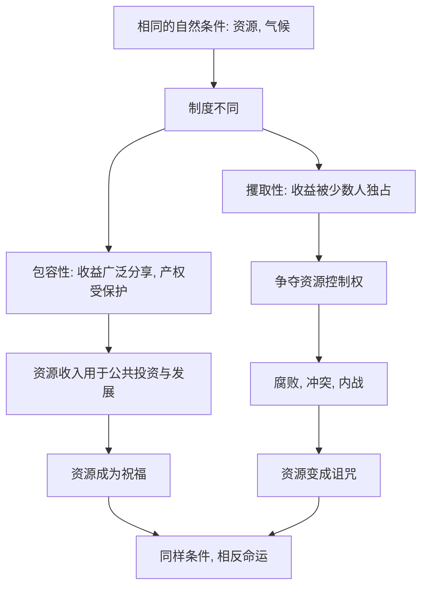

# 12｜地理假说为什么站不住脚？

> 如果财富来自资源与气候，为什么同样的资源会带来相反的命运？

---

## 一、先说结论

阿西莫格鲁与罗宾逊认为：地理假说解释不了国家的贫富。

地理假说主张，财富取决于先天的自然条件——气候、土壤、疾病环境、矿产资源。但作者指出，存在大量"同样条件、相反结果"的反例：同样是钻石资源，博茨瓦纳靠它走向稳定与发展，塞拉利昂的钻石却点燃了内战；新加坡资源匮乏却极度繁荣。

因此他们的结论是：**资源本身不决定结果，决定结果的是如何分配与使用资源的制度。**

---

## 二、我们先理解一个问题

地理假说之所以流行，是因为它有一个很硬的直觉：富国大多在温带，穷国大多在热带；有的国家守着石油和矿产，看上去天生富得流油。

如果财富真的由大自然预先分配，那么穷国几乎被判了"慢性死刑"——气候不能改、矿藏不能移、地理位置不能搬。这个结论听起来既合理又令人绝望。

但恰恰在这里，出现了漏洞：**如果自然条件是决定性的，那么拥有同样自然条件的地方，理应走向同样的结局。** 可现实偏偏不是这样。这，就是作者要抓住的破绽。

---

## 三、作者到底提出了什么观点？

两位作者认为，地理假说犯了"把条件当成原因"的错误。

他们承认，气候、疾病、资源确实会影响一个国家的处境——这不是要否认事实。但他们坚持区分两件事：**自然的初始条件**与**人为设定的规则**。

- 自然的初始条件，是给定的、相对固定的；
- 而制度是人为选择的，会决定资源归谁、收益如何分配、权力如何被约束。

作者的推理是：**同样的自然条件，在不同的制度下会导向完全相反的结局。** 资源可以是祝福，也可以是诅咒，区别不在资源，而在"谁来管、怎么分、有没有约束"。

因此他们认为，地理假说最多解释了"起点"，却解释不了"分岔"——而国家贫富的差距，恰恰发生在分岔处。

---

## 四、把这个观点翻译成人话

可以这样打个比方。

两户人家都继承了一块同样肥沃的地。甲家约定：地的产出按劳动公平分，谁多种谁多拿，账目公开。乙家则由族长说了算：产出先归他，再按亲疏分下去。

几十年后，甲家的地越种越好，家里人争着提高产量；乙家的地却越来越荒，因为干活的人发现，多干多亏，讨好族长才最划算。

地是同一块地，肥力没变。变的只是**分地的规矩**。

地理假说看到的是"这两家都有好地，为什么结果不同"，于是它只能困惑；制度假说看到的则是"地一样，规矩不同"，于是它解释了差异。**资源从来不自动变成财富，它要经过一整套人为规则的加工。**

---

## 五、为什么会这样？

把作者的推理画成对照，会看得更清楚：

这张图的关键，在 **B** 这个分岔点。

自然条件进入社会之后，先要经过制度这道"加工厂"。制度包容，资源收入就会变成公路、学校、医疗；制度攫取，资源收入就会变成争夺的对象、腐败的燃料、内战的军费。**不是资源决定了国家，而是国家决定了资源是福还是祸。**

这也是一个特别有说服力的论证方式：它不需要否认地理的影响，只需要指出——**同样的地理，已经足以产生不同的结果，那么地理就不可能是充分解释。**

---

## 六、举一个现实生活中的例子

两位作者反复引用的经典对照，是博茨瓦纳与塞拉利昂。

先说博茨瓦纳。它地处南部非洲，原本是世界上最贫穷的国家之一。二十世纪后半叶，境内发现了巨大的钻石矿藏。很多资源丰裕的非洲国家在类似情形下陷入腐败与冲突，但博茨瓦纳走出了一条不同的路：它把钻石收入大量用于公共建设与社会发展，保持了相对稳定与持续的成长。作者强调，关键不在于"有钻石"，而在于**这套收入被纳入了相对负责、受约束的分配机制**——这也是博茨瓦纳被反复研究的制度样本。

再看塞拉利昂。它同样拥有丰富的钻石资源，却长期陷入动荡。钻石非但没有带来普遍富裕，反而成为各方争夺的焦点，资源收益与暴力冲突纠缠在一起，把这个国家拖入漫长的战乱与贫困。

同样是钻石，一边被用作发展，一边被用作争夺。地质条件几乎相同，命运却判若两国。

两位作者的解读是：**差别不在矿藏，而在规则。** 博茨瓦纳的钻石是好资产，前提是有人能管住它、让收益惠及大众；塞拉利昂的钻石成了祸根，因为没有人能阻止它被用来争夺与占有。这正是"资源诅咒"的真相——**诅咒的不是资源，而是没有约束的制度。**

---

## 七、回到书中重新理解

现在回看作者为什么要把"地理假说"当作主要靶子来打，就明白了。

地理假说最诱人、也最危险的地方，是它把结果归给无法改变的东西。一旦接受它，穷国就失去了希望——因为它无从改变自己的气候、位置与矿藏。作者要对抗的，正是这种宿命感。

而制度解释给出了另一种可能：**如果决定命运的是规则，那么规则是可以被改变的。** 博茨瓦纳与塞拉利昂证明了，起点相似的两国可以走向两种未来；这背后不是天意，而是选择。

所以，反驳地理假说不只是学术辩论，它承载着这本书最深的现实关怀：**贫困不是被地理判下的刑，而是被制度维持的状态；既然如此，它就不是注定的。**

---

## 八、这个观点背后还有什么？

**第一，"资源诅咒"要被准确地理解。** 它常常被误读为"有资源就不好"，但作者的意思是：资源本身中性，关键在于制度能不能约束对它的争夺。

**第二，地理的影响并未被完全否认。** 疾病环境、交通条件、气候农业确实构成初始约束，只是作者主张它们的作用要经过制度的"中介"才显现出来。

**第三，反例是最有力的武器。** 与"证明地理有影响"相比，作者更想证明的是"地理不足以决定结果"，而一个反例就足以完成这项任务。

**第四，它把问题从"有什么"转成"怎么分"。** 这一转向，是全书方法论的缩影——不问老天给了什么，只问人把规则定成了什么。

**第五，它为发展政策提供了方向。** 如果一个国家的困境源于地理，那外部援助几乎是徒劳；但如果源于制度，改革就有了着力点。

---

## 九、这个观点有问题吗？

有，学界对"地理无用"的解读并不完全认同。

**第一，"地理决定论"本身是一个被简化的对手。** 多数地理学派学者并不主张地理完全决定命运，而是强调它是诸多因素之一。把对方的主张压缩成"极端决定论"，再加以反驳，可能简化了争论。

**第二，地理的影响可能被低估。** 一些经济史学家认为，疾病环境、土壤与运输成本在长期发展中的作用被作者处理得过于轻描淡写，尤其是热带疾病对人力资本的影响，很难简单归入制度。

**第三，反例法有局限。** 找到"同样条件、不同结果"的案例，固然能证明地理不是充分条件，却不足以证明它在多数情况下无足轻重。关于这一问题，学界存在不同解释。

**第四，博茨瓦纳并不平凡。** 有研究指出，博茨瓦纳的成功还与其特殊的政治结构、族群关系、外部环境有关，把它完全归功于"包容性制度"，可能忽略了其他条件。

**第五，但它确实击中了要害。** 无论地理影响多大，"同样的资源可以带来相反命运"这一事实，足以证明**制度至少是决定性的变量之一**，地理无法单独解释贫富。

**所以更准确的说法是**：地理假说大概率解释了某些"起点差异"，而地理决定论（财富由自然条件所决定）则被博茨瓦纳与塞拉利昂这类反例有力地动摇。作者的反驳，针对的是后者。

---

## 十、今天再看这个观点

以下部分是基于本书思想的现代延伸，不是两位作者的原话。

在资源议题之外，这套逻辑今天有了新的战场。数字时代的"资源"变成了数据、算力与关键矿产，围绕它们的地缘博弈正在加剧。作者会提醒我们：**这些东西本身不决定国家命运，真正决定的是各国能不能对它们的使用与分配建立可信的规则。**

同一批锂矿、同一套算力，在一个法治与产权稳定的国家可能催生产业与就业，在另一个权力失序的国家则可能引发掠夺与冲突。资源的技术形态变了，"资源诅咒"的机制却没变——**只要没有约束，任何被认作"财富来源"的东西，都可能成为争夺与腐败的目标。**

同时，一个更务实的推论是：与其哀叹资源禀赋，不如追问规则能否约束争夺。自然资源也许无法选择，但制度是可以经营的。

---

## 十一、这一篇真正应该记住什么？

1. **同样条件，可以走向相反命运。** 这是地理假说最难回答的反例。
2. **资源本身是中性的。** 是祝福还是诅咒，取决于制度如何分配。
3. **博茨瓦纳与塞拉利昂是一对经典对照。** 钻石相同，制度不同，结果迥异。
4. **反例法证明的是"地理不足以决定"。** 它打击的是地理决定论，而非地理的全部影响。
5. **作者真正要反驳的，是宿命论。** 若根源在制度，贫困就不是注定的。

---

## 十二、留一个问题

> 如果同样的钻石，在一种规则下能修学校、铺公路，在另一种规则下却点燃内战，
> 那么你所在的地方——
> 是资源在为多数人服务，还是多数人在为少数人的资源让路？

---

**下一篇**：打掉了地理的宿命论，还有一个更难对付的解释——文化。有人说穷是因为观念落后、宗教保守、不够勤奋。可如果"同文同种"的人也会走向完全不同的结果，这个说法还站得住吗？

下一篇我们就来拆开这个问题——**文化假说为什么站不住脚？**
