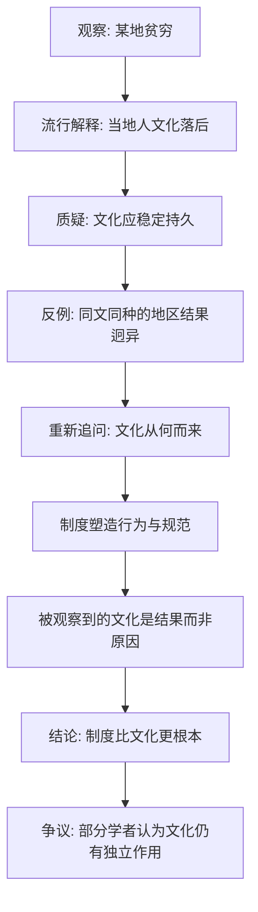

# 13｜文化假说为什么站不住脚？

> 如果贫穷是文化的错，为什么“同文同种”会走出不同结果？

---

## 一、先说结论

阿西莫格鲁与罗宾逊认为，把国家贫富归结为“文化”的解释，是站不住脚的。这不是说文化不重要，而是说：**文化本身会被制度塑造，也会随时间改变，因此它无法成为那个“根源性”的解释变量。**

他们给出的反例非常朴素：东德与西德，同一种语言、同一个民族、被一堵墙分开不到半个世纪，结果却判若两个经济体。如果文化是决定因素，这堵墙就不该有这么大的威力。

---

## 二、我们先理解一个问题

先想一个直觉：我们常说某个地方的人“勤劳”“会做生意”“重视教育”，某个地方的人“懒散”“不守时”“缺乏契约精神”。这种说法流行得惊人——几乎每个国家都有一套关于其他民族的刻板印象。

问题在于：**如果文化真的是根本原因，那它应该稳定、持久、难以改变。** 一个社会的价值观是几百年、上千年沉淀出来的东西，不会因为一次政治变动就翻个面。

可历史偏偏充满了反例：一些被判定为“文化落后”的地区，在制度改变之后，一代人之内就展现出惊人的经济活力；而一些被认为“天生勤奋”的地区，在坏制度下却长期停滞。

于是问题就变成了：**到底是文化决定了制度，还是制度塑造了文化？**

---

## 三、作者到底提出了什么观点？

两位作者对“文化假说”的处理，可以概括为三步。

第一，他们承认文化因素存在，也承认价值观、信仰、社会规范会影响经济行为。

第二，他们指出：**文化难以解释关键的时间与空间差异。** 同一个文化圈里，不同国家、不同时期的命运可以天差地别；而文化背景相差很大的国家，也可能走出相似的成功路径。

第三，他们提出替代解释：**文化很大程度上是内生于制度的。** 当制度鼓励努力、保护产权、允许向上流动时，相应的“勤奋”“守信”“重视教育”的规范就会被培育出来；当制度奖励的是攀附权力与短期套利时，另一套行为模式就会成为理性选择。

换句话说，不是某个民族“天生”如何，而是他们所处的规则，长年累月地筛选出了某种行为方式。

---

## 四、把这个观点翻译成人话

想象两个学生，智商、家庭背景、性格都差不多，只是被分到两所学校。

A 校的规矩是：考试成绩真实有效，抄袭会被严惩，老师认真教，努力就有回报。
B 校的规矩是：成绩可以花钱买，谁跟老师关系好谁得高分，认真读书的人反而被嘲笑。

几年之后，你会发现两校学生的“文化”差异巨大：A 校学生相信“读书有用、规则可信”，B 校学生相信“关系比努力重要、规则是拿来钻的”。

这时候你能说，是 B 校的学生“天生不爱学习”吗？显然不能。**你看到的那种“文化”，其实是学校那套规矩长期筛选出来的结果。**

两位作者想说的正是：把一个国家的贫穷归因于当地人的“文化”，就像把 B 校学生的成绩差归因于他们“人不行”——**因果顺序搞反了。**

---

## 五、为什么会这样？

把作者的反驳拆成一条链条：

关键在于 **C → D** 这一步：一个解释若想成立，它必须经得起“同文化背景、不同结果”这类对照的检验。文化假说在这一关上格外吃力。

而 **E → F** 是作者的正面主张：文化不是天上掉下来的，它在很大程度上是制度长期的产物。要改变文化，往往得先改变人们面对的真实激励。

---

## 六、举一个现实生活中的例子

回到东德与西德。

第二次世界大战之后，德国被分割：西部走上市场经济与民主政治的道路，东部则被纳入计划经济与高度集中的权力体系。两边的人，说的是同一种语言，读的是同一批经典，家庭、血缘、饮食、宗教传统高度一致——**从文化假说的角度看，他们几乎“同文同种”。**

如果文化是决定性的，那么两边的经济水平应该在几十年里保持接近。可现实是：到柏林墙倒塌前，东德的经济效率、技术水平与生活水准，与西德相比已明显落后，尽管东德的起点并不差，战前某些工业领域甚至颇具实力。

更耐人寻味的是墙倒塌之后：同一个民族、同一套文化，一旦接入不同的制度框架，东部地区的生产率与收入就开始向西边靠拢——虽然这个过程漫长而艰难。

两位作者会指出：**这堵墙隔开的不是两种文化，而是两套规则。** 规则变了，人的行为、企业的活力，乃至人们的时间观念与创业意愿，都跟着变。文化相近、制度不同、结果迥异——这正是文化假说最难解释的地方。

---

## 七、回到书中重新理解

现在再回看这本书为什么花力气去反驳文化假说，就清楚了。

如果贫穷真的是文化的错，那结论将非常灰暗：文化是几百年的沉淀，改起来以世纪计，落后国家几乎只能认命。而作者真正想传递的判断是：**贫困是规则的结果，规则是可以改变的。**

这也是他们把“制度”放在“文化”之前的深意——不是要否定文化，而是要把因果链条摆正：**制度在先，文化在后；改变了规则，被称作“文化”的东西，往往也会跟着改变。** 这给落后社会留下了一条现实中可行的出路。

---

## 八、这个观点背后还有什么？

**第一，“文化”在这本书里是一个很宽泛的筐。** 宗教、价值观、信任、社会规范都被装进去。作者的反驳主要针对“文化是根源”这一强主张，而不是否认文化有任何作用。

**第二，作者实际上用了一个方法论原则：** 解释力更强、更可变的变量优先。文化变得慢，制度变得相对快，而快速变化的制度更能解释短期内出现的巨大分化。

**第三，这个赌注与全书一致。** 地理位置不能改，文化又难改，只有制度是人为的、可被重新设计的——这正是作者想让读者接受的落点。

**第四，它为后面的援助与增长讨论埋下伏笔。** 如果问题出在制度而非文化，那么外部力量的作用、以及改革的路径，就要重新思考。

---

## 九、这个观点有问题吗？

有，而且不少学者并不完全接受。

**第一，一些经济史学家与社会学家认为，文化确有独立且持久的影响。** 例如关于信任、社会资本与家族伦理的研究指出，即便制度相似，不同社会的经济表现仍可能长期存在差异，文化可能是其中一部分原因。

**第二，用东德与西德这类案例，也存在解释空间上的争论。** 有学者认为，东西德在战前就存在工业结构与人力资本上的差异，把全部结果都归给制度，可能低估了初始条件的作用。

**第三，可能存在反向因果。** 是制度塑造了文化，还是某些文化特质先帮助了包容性制度的建立？现实中二者往往互相缠绕，先后很难分清。关于这一问题，学界存在不同解释。

**第四，“文化不变”这个前提本身也被质疑。** 一些研究者认为文化并非铁板一块，它可以在几代人之内显著变化，因此“文化不能解释短期分化”的论证，未必像作者说的那样有力。

**所以更稳妥的说法是**：作者成功地证明了“文化决定论”过于简单，但要断言文化只是制度的副产品、毫无独立作用，同样是一种需要保留的判断。

---

## 十、今天再看这个观点

以下部分是基于本书思想的现代延伸，不是两位作者的原话。

在全球化与移民研究里，这个争论有了新的形态。一个常见的观察是：同一批移民在不同东道国的表现差异，常被用来检验“文化”与“制度”谁更重要。若移民在制度更包容的国家更快融入并取得成功，说明规则环境的分量很重；而移民群体内部长期保持的某些差异，又提示文化并非毫无痕迹。

对今天的政策讨论而言，作者视角的价值在于提醒我们：**不要轻易用“文化”去解释贫困，更不要用它去为不作为开脱。** 当人们抱怨某个群体“就是不行”时，更该问的是——他们面对的规则，是否真的允许努力得到回报。

---

## 十一、这一篇真正应该记住什么？

1. **文化假说被作者视为次要解释。** 理由是文化应稳定持久，却难以解释短时间内出现的巨大分化。
2. **东德与西德是最有力的反例之一。** 同文同种、制度不同、结果迥异。
3. **作者主张文化内生于制度。** 被称作“文化”的东西，很大程度是制度长期筛选出来的行为模式。
4. **这一反驳带有解放意味。** 若问题在规则而非文化，贫困就不是宿命。
5. **但它并未终结争论。** 文化是否仍有独立作用，学界存在不同解释，应保留判断。

---

## 十二、留一个问题

> 当你把某个地方的落后，归因于“那里的人就是那样”时，
> 你有没有想过——你看到的“文化”，
> 可能只是一套坏规则筛选出的、被迫的生存策略？

---

**下一篇**：如果贫困的根源是坏制度，那么好心人送去的援助，为什么常常打了水漂？问题可能不在钱，而在钱流进了谁的漏斗。

下一篇我们就来拆开这个问题——**为什么援助常常失败？**
