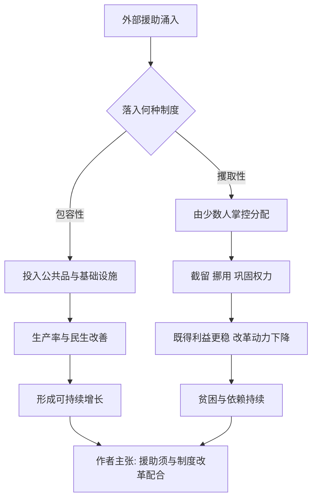

# 14｜为什么援助常常失败？

> 外来援助那么多，为什么很多穷国依然穷？

---

## 一、先说结论

阿西莫格鲁与罗宾逊认为，援助失败的关键，往往不在援助的规模，而在援助落入的制度环境。**如果钱被投入攫取性制度，它非但不能改善多数人的生活，反而会被少数人截留，用来巩固既得利益，甚至加剧冲突与依赖。**

用他们的话说，问题不是“蛋糕不够大”，而是“切蛋糕的刀握在谁手里”。

---

## 二、我们先理解一个问题

先看一个反常识的现象：过去几十年，国际社会向贫困地区投入了规模庞大的资源——资金、粮食、药品、基础设施，以及一次又一次的债务减免。按常理，这么巨量的投入，应该能让不少贫困地区明显翻身。

可现实是，其中不少受援国的人均收入与治理水平，长期没有实质改善，个别地方甚至更动荡。

于是有两种直觉解释流行起来：“援助还是太少”，或者“当地人不会用钱”。

而两位作者提出了第三种解释：**钱到位了，制度却没有变。** 当资源流经一套把财富从多数人转移给少数人的规则时，援助本身也会被这套规则消化掉。

---

## 三、作者到底提出了什么观点？

他们的核心判断可以拆成三层。

第一，**援助的效果取决于它落入的制度。** 在包容性制度中，援助有可能被用于公共品、教育与医疗、基础设施，形成正向回报；在攫取性制度中，援助更容易被权力掌握者当成可自由支配的资源。

第二，**截留是攫取性制度下的理性行为。** 掌握分配权的人，会把援助用于收买支持者、扩充军队、维持统治，或者直接流入私人口袋——因为这样对他们的权力最有帮助。

第三，**援助还可能削弱改革的动力。** 一个不必对本国纳税人负责的政府，只要向援助方交代，就能持续获得资源。援助于是让坏制度活得更久，而不是更快被改变。

正因为如此，他们主张：**有效的援助必须与制度改革配合，否则就是把钱倒进坏规则的漏斗里。**

---

## 四、把这个观点翻译成人话

设想一个村子要给几户困难家庭捐款。

如果这笔钱由村民大会公开讨论、直接分发到户，并且账目公开，它多半真能帮到人。

但如果钱先交给村里那个说一不二的族长，由他“统一安排”——结果往往是他先修了自己的院子，再分给几个亲信，最后象征性地给困难户发一点。捐得越多，族长的势力反而越大。

更麻烦的是：族长从此知道，只要维持“我们很穷、需要帮助”的形象，年年都有人送钱来。他没有动力去改变村里的分配方式，因为那套方式正是他权力的来源。

**这不是在帮困难户，而是在资助族长。**

两位作者想说的正是：在国际援助里，那个“族长”，常常就是掌握攫取性制度的人。

---

## 五、为什么会这样？

关键分岔在 **B**：同样的钱，进入不同的规则，会走向几乎相反的结局。

而 **F → H** 是攫取性制度下的自我强化：援助越多，权力越稳；权力越稳，越不会改变分配规则。援助在不经意间，成了恶性循环的燃料。

---

## 六、举一个现实生活中的例子

设想一个资源丰富、但权力高度集中的受援国——这类情形在书中被反复讨论。

外部资金与物资进入后，名义上用于修路、建学校、发救济。但由于预算不透明、采购由少数人控制、司法缺乏独立，这些款项在实际执行中层层流失：一部分变成豪车与海外房产，一部分用于给关键的支持者发津贴，一部分流入与权力关系密切的企业，真正落到普通人手里的只剩零头。

与此同时，这个政府并不需要为本国公民的税负负责——它的收入很大一部分来自外援与资源租金。于是它既没有压力去改善治理，也没有动力去保护产权、开放竞争。

结果就是：援助的初衷是减轻贫困，实际效果却是让那套制造贫困的规则更加稳固。这正是两位作者所警告的那种“好心办坏事”。

需要说明的是，这里描述的是作者框架下的机制，而非针对某个具体国家的统计数据；不同受援国的情况差异很大，不能一概而论。

---

## 七、回到书中重新理解

把这一篇放回全书，逻辑就完整了。

既然贫富的根源是制度，那么“给钱”自然不是根本解。**援助最多是一笔资源，而资源如何使用，由制度决定。** 制度坏，资源会被用来加固坏制度；制度好，资源才可能变成公共品与增长。

这也解释了为什么作者对“技术性援助”与“制度改革”给出不同的评价：前者相对容易交付，后者触及权力，难以推动，却恰恰是关键所在。

---

## 八、这个观点背后还有什么？

**第一，它触及一个两难：** 如果援助可能强化坏政府，那么减少援助，是否会伤害那些无辜的普通人？作者并未给出轻松的答案。

**第二，援助方自身的激励也有问题。** 援助机构需要年度支出与可见成果，往往偏好“能交付的项目”，而回避“触及权力的改革”。

**第三，附加条件未必有效。** 援助方常以改革为条件，但受援方可以在拿到钱后阳奉阴违；缺乏本地问责机制时，外部条件很难真正约束权力。

**第四，它把问题从“道德”转向“机制”：** 不是援助者不够善良，而是激励结构让善意的钱流向了错误的地方。

---

## 九、这个观点有问题吗？

有，而且在发展经济学界，这是一场持续多年的争论。

**第一，一些经济学家认为，援助的成效被低估了。** 例如在公共卫生、疫苗接种、基础教育等领域，有研究显示援助带来了可观的改善；把所有援助一概而论为失败，可能并不准确。

**第二，援助与制度的关系可能更复杂。** 有学者认为，某些援助恰恰帮助了制度建设，比如支持税收系统、统计能力与公共卫生体系的建设。

**第三，具体项目设计的好坏，往往比“援助还是不给”这个二分更重要。** 一些采用随机对照试验方法的研究，就提示了这一点。

**第四，也存在反向因果。** 治理差的国家更可能陷入贫困并需要援助，于是我们观察到“受援多、增长差”，未必说明援助造成了问题。关于这一问题，学界存在不同解释。

**所以更稳妥的说法是**：作者的提醒——“援助必须考虑制度环境，否则可能适得其反”——极有价值；但“援助常常失败”是否是一个普遍规律，仍需具体辨析。

---

## 十、今天再看这个观点

以下部分是基于本书思想的现代延伸，不是两位作者的原话。

在今天，援助的形式已经部分转向“制度与治理支持”：帮助建立税收体系、强化预算透明、支持独立媒体与公民社会、改善产权登记。这些尝试，正是对作者批评的一种回应——不再只问“给多少钱”，而开始问“钱通过什么规则流动”。

同时，数字技术带来了新的监督可能：移动支付、分布式账本、公开采购平台，都可能压缩中间截留的空间。但技术是否真能改变权力的分配，依然取决于制度本身——**工具改变不了规则，规则却能决定工具如何使用。**

---

## 十一、这一篇真正应该记住什么？

1. **作者认为，援助失败的关键在制度环境。** 钱不是问题，钱流进谁的漏斗才是问题。
2. **攫取性制度会把援助变成维持自身的燃料。** 截留与依赖，都是这套规则下的理性行为。
3. **有效援助需要与制度改革配合。** 否则善意会被规则消化。
4. **这一判断影响深远。** 它把发展讨论从“给多少”推向“规则如何”。
5. **但它并非定论。** 援助在公共卫生等领域的作用有目共睹，“援助常常失败”需要具体辨析。

---

## 十二、留一个问题

> 当你向一个地方伸出援手时，
> 你要帮助的，是那里的人，
> 还是恰好握着分配权的那个人？

---

**下一篇**：如果坏制度下的国家很难靠外部援助翻身，那么，一个强有力的威权体制自己集中资源搞增长，能不能跑出一条路？这可能是全书最有争议的一问。

下一篇我们就来拆开这个问题——**威权体制能实现持续增长吗？**
