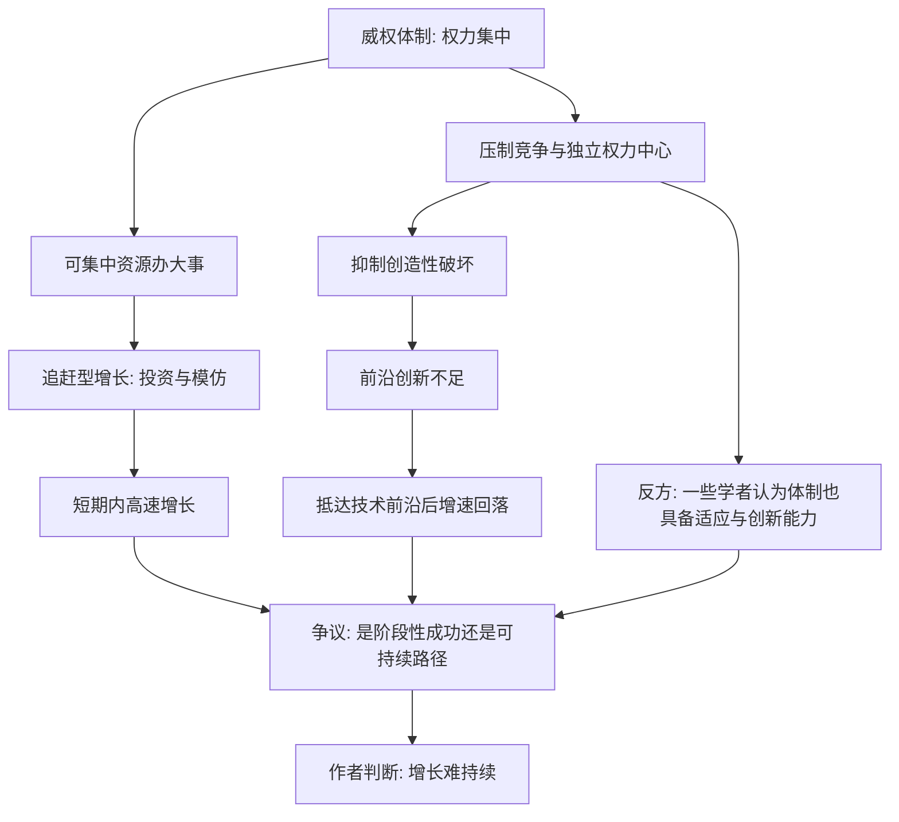

# 15｜威权体制能实现持续增长吗？

> 一些威权国家经济高速增长，是否推翻了“制度决定论”？

---

## 一、先说结论

**两位作者认为：威权体制可以在一段时间内实现高速增长，尤其是“追赶型”增长，但这种增长难以长期持续，因为它压制的恰恰是持续增长最需要的创造性破坏与前沿创新。** 需要强调，这是一个判断，而不是定论。

与此同时，一些学者持有不同看法：他们指出，部分非民主体制在适应新技术、调整政策、动员资源方面展现出相当的能力，因此“威权必然停滞”缺乏足够证据。关于这一问题，学界存在不同解释，本文不替任何一方下结论。

---

## 二、我们先理解一个问题

先承认一个现象：过去几十年，确实有一些权力高度集中的体制，交出了亮眼的经济成绩单——高速工业化、大规模基建、迅速提高的人均收入。它们的增长，看起来并不比许多民主国家逊色。

如果“包容性制度是持续增长的前提”这个命题成立，那这些例子岂不是反例？

于是问题变得尖锐：**威权体制究竟只是暂时的例外，还是确实提供了一条不同的增长路径？** 这正是两位作者必须正面回答的挑战。

---

## 三、作者到底提出了什么观点？

阿西莫格鲁与罗宾逊认为，关键要区分两种增长。

**第一种是“追赶型增长”。** 当一个经济体距离技术前沿很远时，它可以靠引进技术、集中投资、动员劳动力、复制成熟产业来实现快速增长。这类增长主要依赖要素投入与模仿，只要权力能把资源集中到正确方向，就能见效。

**第二种是“前沿型增长”。** 当经济体已接近技术前沿，增长必须来自原创性创新——而这需要允许试错、允许新企业挑战旧巨头、允许旧利益被淘汰，也就是他们所说的创造性破坏。

作者的判断是：**威权体制擅长前者，却难以支撑后者。** 因为持续创新依赖对权力的约束、对产权的稳定保护，以及无法被随意叫停的自由进入与竞争；而这些恰恰是攫取性政治制度的短板。于是增长会在某个阶段碰到天花板。

---

## 四、把这个观点翻译成人话

这就像两个人学画画。

第一阶段是“临摹”：照着现成的名画抄，谁手稳、谁肯下功夫，谁进步快。一个严格的老师逼着所有人反复练，效果可能比自由散漫的课堂还好。这就是追赶型增长。

第二阶段是“创作”：没有标准答案，需要不断尝试、走弯路、推翻自己，还得允许有人画出让老师不舒服的东西。这时候，一个只会说“按我说的画”的老师，就成了最大的障碍。这就是前沿型创新所需要的环境。

两位作者想说的是：**威权体制可能是一个很好的“临摹教练”，但很难成为“创作土壤”。** 它能逼出勤奋，却难以容忍真正的颠覆。

---

## 五、为什么会这样？

图上可以看出，作者的论证依赖 **E → F → G** 这一段：权力集中帮助了追赶，却损害了创新。而 **K** 正是这场争论的焦点——非民主体制能否自我调整、适应新的挑战。

---

## 六、举一个现实生活中的例子

一个被反复引用的案例是苏联。

在 20 世纪中期，苏联经历了令世界瞩目的快速工业化：重工业与军工迅速扩张，从一个落后的农业国变成工业强国，一度在航天等前沿领域取得领先。这看起来像极了威权体制动员资源、实现跨越发展的成功。

然而，从 20 世纪 70 年代前后开始，苏联经济的增速明显放缓，长期陷入效率低下与创新不足的困境，并最终在 1991 年解体。**两位作者会把它解读为追赶型增长极限的体现：** 当模仿的空间耗尽、必须靠自身创新时，那套压制竞争、排斥市场试错、扼杀创造性破坏的体制，就失去了继续前进的动力。

这里必须说明：**上述解释是作者的判断，而不是学界共识。** 苏联的兴衰还有大量其他解释——军备竞赛的消耗、计划体制的信息问题、民族与政治结构、油价波动、改革策略的失误等等，学者们并未达成一致。把它单纯归结为“制度决定”的一种表现，是对复杂历史的简化。

---

## 七、回到书中重新理解

现在再看作者为什么反复强调“创造性破坏”，就明白了。

在他们看来，真正区分体制命运的，不是能不能把资源集中起来，而是**能不能容忍新事物杀死旧事物**。追赶阶段，旧事物本来就少、新事物有现成的模板；而到了前沿，必须不断让既得利益被替换——这对任何权力结构都是痛苦的，对高度集中的权力尤其如此。

因此，他们对威权增长的判断，不是基于道德评价，而是基于一个经济学机制：**创新需要分散决策与自由试错，而这两种东西与不受约束的权力之间存在紧张。**

---

## 八、这个观点背后还有什么？

**第一，它把“增长”与“持续增长”分开了。** 一个经济体可以在几十年里高速增长，却未必具备五十年、一百年持续增长的条件。短期成绩与长期持续性，是两回事。

**第二，它强调“接近技术前沿”是一个转折点。** 增长模式会随发展阶段改变，这为理解增速回落提供了一个分析框架。

**第三，它并未否认威权体制能做成大事。** 集中资源修基建、办教育、推动工业化，这些能力是真实的。

**第四，它把创新条件与政治条件绑在一起。** 在作者那里，创新不只是科研投入问题，更是权力是否受约束的问题——这正是争议的核心。

---

## 九、这个观点有问题吗？

有，而且这里的争论特别激烈。以下两方观点并列，本文不评判高下。

**支持作者的一方认为：**

- 威权体制的快速增长多发生在一国“追赶”阶段，靠的是引进与投资，而非原创。
- 缺乏产权安全与自由竞争，长期会抑制真正的创新，增长终将回落。
- 权力不受约束，决策失误难以被纠错，风险高度集中。

**批评作者的一方则认为：**

- 一些学者指出，不同体制同样可能具备适应与创新能力，能通过政策调整、技术引进与组织变革维持长期增长，不能简单假定“非民主必然停滞”。
- 也有学者认为，“威权”与“民主”的二分过于粗糙，现实中的体制差异是连续的，许多国家处于中间地带。
- 还有人质疑，把长期增长几乎全部归因于制度类型，可能低估了产业政策、人口结构、国际环境与全球产业链位置的作用。
- 关于支撑这类论证的历史数据与案例选择，学界也存在方法上的争论。

可以说：作者提供了一个逻辑自洽、解释力强的框架，但“威权增长不可持续”是一个经验命题，需要在具体国家、具体阶段中检验，而不宜当作普遍定律。关于这一问题，学界存在不同解释。

---

## 十、今天再看这个观点

以下部分是基于本书思想的现代延伸，不是两位作者的原话。

在人工智能与半导体等前沿领域，竞争的焦点正在从“谁能生产”转向“谁能原创”。按作者的框架，越是靠近技术前沿，制度对创新的约束力就越关键——能否自由创业、能否容忍失败、能否让新公司挑战老巨头，直接决定一个经济体在下一轮技术周期中的位置。

但也有理由提醒：技术本身可能改变这个方程。大规模算力、集中式数据与产业政策，有时确实能靠“举国投入”在某些前沿赛道上取得突破。于是真正的问题变成了：**这种突破能否转化为持续的、自下而上的创新生态，还是只在个别方向有效？** 这个问题，值得读者带着作者的框架，也带着怀疑去观察。

---

## 十一、这一篇真正应该记住什么？

1. **两位作者认为，威权体制可以追赶，却难以持续创新。** 这是判断，不是定论。
2. **区分“追赶型增长”与“前沿型增长”是关键。** 前者靠投入与模仿，后者靠创造性破坏。
3. **苏联是作者最常引用的案例。** 但它的兴衰有多种解释，不宜单一归因。
4. **反方观点同样有力。** 一些学者认为不同体制也具备适应与创新能力。
5. **面对这个问题，最诚实的态度是保留判断。** 把它当作一个需要用证据持续检验的经验问题。

---

## 十二、留一个问题

> 如果一个体制能高效地“把已知的事做到极致”，
> 却难以容忍“无人知道该怎么做的新事”，
> 那么，增长的天花板究竟来自技术、资源，
> 还是来自那套不允许被挑战的规则？

---

**下一篇**：如果制度既能拖住增长，也能改变命运，那么最后的问题就落到了每个人身上——那些看起来牢不可破的贫富差距，到底能不能被缩小？

下一篇我们就来拆开这个问题——**贫富差距能缩小吗？**
