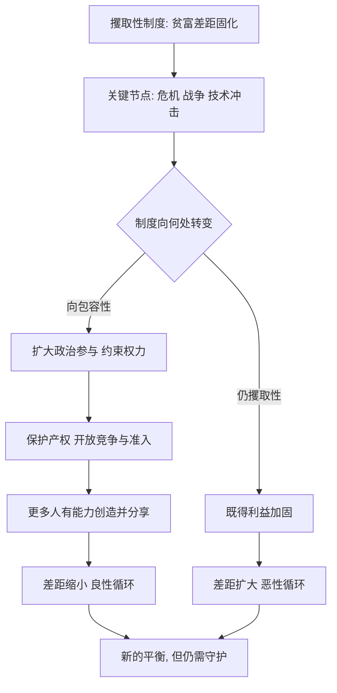

# 16｜贫富差距能缩小吗？

> 制度既然决定成败，那么落后国家还有没有机会翻身？

---

## 一、先说结论

**阿西莫格鲁与罗宾逊认为，贫富差距可以被缩小，但不会自动发生。** 路径是：在关键节点上推动制度向包容性转变——扩大政治参与、约束权力、保护产权与竞争，让更多人有能力也有动力去创造并分享成果。

他们对前景既不盲目乐观，也不彻底悲观：**制度是可以改变的，但改变从来不容易，而且往往伴随着冲突与妥协。**

---

## 二、我们先理解一个问题

沿着全书的逻辑走到这里，一种沮丧感会自然浮现：如果坏制度能自我强化、既得利益者会拼命维持现状，那穷国岂不是被锁死了？

这正是这一篇要处理的张力。作者一方面坚持制度决定成败、路径依赖强大；另一方面又必须回答：**那改变到底是怎么发生的？**

如果不能回答这个问题，整本书就会变成一种宿命论。而两位作者显然不想给出这样的答案——他们从一开始就在反对“贫困是命中注定”。

---

## 三、作者到底提出了什么观点？

他们给出的机制，大致有三条。

第一，**关键节点打开窗口。** 危机、战争、革命、经济崩溃、技术冲击，都会削弱原有的平衡，让“重新选择规则”成为可能。黑死病之后的西欧、光荣革命之后的英国，都是这类时刻。

第二，**改变通常来自内部力量与有利条件的结合。** 仅靠外部施压难以持续，真正推动制度转向的，往往是本国新兴群体、社会运动与政治联盟的成长。

第三，**转变是有方向的：从攫取性走向包容性。** 具体表现为扩大政治参与、约束任意权力、建立对产权的可信承诺、开放竞争与准入，让成果被更广泛地分享。

他们特别提醒：**这不是一条自动的、线性的道路。** 有些国家会在关键节点上走向更包容，也有些会滑向更攫取；同样的冲击，可能带来完全相反的结果。

---

## 四、把这个观点翻译成人话

想象一个被几大家族垄断的镇子：地是他们的，生意要给他们交份子钱，镇上的规矩由他们定。

你想让它变好，光靠外面的人来劝、来捐钱，通常没用——家族们只会把资源变成更强的控制。

真正的变化，往往来自内部的几股力量合流：被压抑的商户想要公平的规则，年轻人想要机会，普通居民想要被听见的声音。当某个契机出现——比如一次经济危机、一场战争、一次统治阶层的分裂——这些力量可能推动规则的改写：账目要公开、准入要放开、权力要受约束。

**不是某一天大家突然变善良了，而是力量对比和制度安排同时发生了变化。**

---

## 五、为什么会这样？

图上最关键的，是 **B → C** 那个分岔：关键节点只是“机会”，不是“保证”。同样的危机，有的社会走向包容，有的走向更严密的控制。**方向取决于当时的力量对比与制度选择。**

而 **G → J** 提醒我们：包容性不是终点，它需要被持续维护，否则也可能倒退。

---

## 六、举一个现实生活中的例子

设想一个长期由少数人垄断经济与政治的社会，贫富差距悬殊。变化可能这样发生：

一部分私营企业主与中产阶层成长起来，他们要求稳定的产权、公平的税负、透明的规则；与此同时，工人与农民希望自己的收入与权利受到保护。这两股诉求，在某个关键节点上形成政治联盟，推动了一系列改革——扩大选举与参与、限制行政的任意性、建立独立的司法、开放行业准入、给中小企业以平等机会。

结果是：产权更可信，创业与投资更活跃，就业与收入随之改善，更多人分享到增长的好处，差距开始收窄。而新的受益者又成为这套规则的稳定支持者，形成良性循环。

需要说明的是：**这只是作者框架下的一种理想化路径，现实中往往崎岖得多。** 改革可能被既得利益反扑，可能半途而废，也可能名义上扩大了参与、实际上换了新的垄断者。关键在于，规则是否真的让多数人获得了创造与分享的机会。

---

## 七、回到书中重新理解

现在再回看这本书的落点，就完整了。

它从“为什么有的国家穷”出发，绕了一大圈——驳斥地理、文化、无知等解释，讲清包容性与攫取性、政治与经济、循环与关键节点——最终回到一个现实问题：**我们能不能改变？**

作者的答案是有条件的“能”：**制度是人为的，所以它可以被人重新设计；但正因为它决定利益分配，所以改变必然遭遇抵抗。** 这既不是浪漫的乐观主义，也不是无力的宿命论，而是一种“可能性存在、但从不轻松”的现实主义。

---

## 八、这个观点背后还有什么？

**第一，因果是双向的。** 包容性制度带来繁荣，繁荣也滋养包容性制度；攫取性制度带来贫困，贫困又加固攫取性制度。循环既能向下，也能向上。

**第二，外部条件很重要，但无法替代内部动力。** 有利的国际环境、外部压力或示范效应，能放大内部变革的可能，却很难独自完成转变。

**第三，改革是有顺序与风险的。** 先政治还是先经济、快改还是渐进，都会影响成败，且没有放之四海皆准的答案。

**第四，它把“发展”从技术问题变为政治问题。** 真正的难题不是“该做什么”，而是“谁有权力决定，以及谁愿意让出权力”。

---

## 九、这个观点有问题吗？

有，这一判断同样面临严肃质疑。

**第一，路径它给出了，概率却没有给出。** 批评者认为，作者能讲出制度如何转变，却难以说明在什么条件下这种转变更可能发生，框架的预测力因此受限。

**第二，部分成功案例的归因仍有争议。** 有学者认为，某些国家的发展依赖了特定的外部机遇、资源条件或地缘位置，制度只是其中一环。

**第三，“包容性”与“攫取性”的边界有时模糊。** 现实中许多体制兼具两者特征，简单地二分，可能遮蔽了内部的复杂与变动。

**第四，改革建议有变成“清单”的风险。** 一些经济学家指出，制度是互相咬合的系统，把产权、法治、参与拆成条款逐项推行，未必能拼出预想的效果。关于这一问题，学界存在不同解释。

**所以更稳妥的说法是**：作者成功地说明了“制度可以被改变、贫困并非宿命”，但改变的条件、路径与代价，依然是一个开放的问题。

---

## 十、今天再看这个观点

以下部分是基于本书思想的现代延伸，不是两位作者的原话。

在今天的全球格局中，缩小差距的战场正在发生变化。技术革命、产业转移、人口结构与气候压力，都是新一轮的“关键节点”。对后发国家而言，机会可能来自新的产业窗口；挑战则在于，旧有的攫取性结构是否会借新技术进一步固化自己。

也许最值得关注的，不是某个国家在某一年增长了多少，而是它能否建立起一套机制——让普通人可以创业、可以竞争、可以在规则面前被同等对待，让失败者仍有退路，让成功者无法垄断规则。**包容性制度的意义，正在于它把“缩小差距”变成一种可以被反复实现的能力，而不是一次性的运气。**

---

## 十一、这一篇真正应该记住什么？

1. **作者认为贫富差距能够缩小，但不会自动发生。** 需要关键节点上的制度转向。
2. **核心路径是扩大政治参与、约束权力、保护产权与竞争。** 让多数人有能力创造并分享。
3. **改变来自内部力量与有利条件的结合。** 外部援助或压力难以独自完成转变。
4. **循环是可逆的。** 好的会变坏，坏的也可能变好，方向取决于力量对比与规则选择。
5. **这是“可能性存在、但从不轻松”的现实主义。** 既不宿命，也不浪漫。

---

## 十二、留一个问题

> 如果贫穷不是宿命，而是规则的结果，
> 那么，你是否愿意接受这个结论的另一半——
> 既然规则是被一部分人选择出来的，
> 它也可以被另一部分人，重新选择一次？

---

十六个问题走下来，我们从一个再朴素不过的问题出发——为什么有的国家富、有的国家穷？两位作者给出的回答始终没有变：**制度。** 包容性制度让多数人愿意创造并分享，攫取性制度让少数人忙于榨取；地理、文化、气候则被他们逐一降格为背景。这条“制度决定论”的线索，从全书开篇一直贯穿到此刻。

但读懂这本书，不只是记住一个结论，而是学会一种提问方式：**当一个地方长期贫穷或动荡时，先别急着归因于“那里的人”“那里的天”，而要去看——规则是谁定的，权力受不受约束，成果由谁分享。**

最后要说的是：任何一部有影响力的著作，都值得被带着敬意地追问。作者的框架锋利、解释力强，却也面对地理、文化、复杂因果与方法论上的持续争论。**制度决定论是不是全部答案？这一判断，请你来做。** 读到这里，你手里已经有了足够多的线索——剩下的思考，交给你自己。
