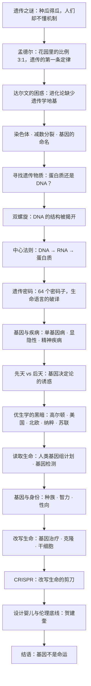

# 《基因传：众生之源》深度解读系列

## 系列简介

基因是什么？这个问题听起来像是生物课的第一课，实际上却是人类花了整整一百五十年才勉强回答的问题。

悉达多·穆克吉是一位肿瘤学家，也是一个遗传学家的儿子。他的家族里，两个叔叔都患有精神分裂症——其中一个在街头流浪，衣服不分季节地裹在身上；另一个反复自残，最终在四十多岁去世。这让他一生都在追问一个私人问题：**我身体里，是否也埋着同一颗种子？我的孩子会不会继承它？**

这个私人问题，最终变成了一本关于基因的「亲密历史」。穆克吉把它写成了一场跨越三代人的接力：从在花园里种豌豆的修道士孟德尔，到在果蝇身上寻找规律的摩尔根，再到拍下那张著名 X 光照片的罗莎琳德·富兰克林；从「基因」这个概念的诞生，到 DNA 双螺旋、遗传密码、人类基因组计划，一直到 CRISPR 和「设计婴儿」。

这本书最重要的主张是：**基因既不是命运的全部，也不是可以被随意摆布的零件。它是我们理解「人是什么」的一把钥匙，也是一面照出人类傲慢与恐惧的镜子。**

本系列不按原书章节复述，而是重建一条认知链：先弄清「遗传的秘密是如何被发现的」，再理解「基因如何在分子层面运作」，然后走进「疾病、优生学与基因决定论的黑暗」，最后讨论这本《众病之王》之后的续作真正想说的：**当人类第一次能够读取和改写生命，我们该如何重新回答「我是谁」。**

---

## 全书核心问题

| 层次 | 问题 |
|---|---|
| 存在问题 | 基因究竟是一种实体，还是一个概念？它真的「存在」吗？ |
| 历史问题 | 人类用一百五十年才破解遗传之谜，为什么这么难？ |
| 机制问题 | 一段看不见的分子，如何决定了生命的形式、疾病与差异？ |
| 命运问题 | 基因在多大程度上决定了我们是谁？先天和后天，谁更重要？ |
| 伦理问题 | 优生学为什么会发生？当人类能「读取」和「改写」基因，边界在哪里？ |
| 终极问题 | 如果基因可以被编辑，那么「人」的定义还剩下什么？ |

一句话版本：

> **基因在多大程度上决定了我们是谁——而当我们能够改写它时，又该如何使用这种力量？**

---

## 全书知识地图



再压缩成一句话：

```text
遗传 = 一场「相似为何产生相似」的谜题
     → 孟德尔发现规律 → 染色体找到载体 → 双螺旋破解结构 → 密码被读出
     → 但读得越多，越发现基因既塑造我们又无法完全决定我们
     → 中间是人类最深的教训：优生学
     → 如今我们能读、能改、能设计
     → 真正的问题回到原点：我是谁，我想成为谁
```

---

## 全系列目录

### 第一部分：遗传之谜——在一个没有遗传学的世界里

#### 01｜为什么「种瓜得瓜」是人类最熟悉也最深的谜？

核心问题：遗传是我们每天都能看到的现象，为什么却成了科学史上最难解的谜题之一？

核心观点：人们早就知道「相似产生相似」，也能通过选育改良作物和牲畜，却始终说不出「为什么」。因为遗传是一个看不见、摸不着、又无法直接观察的**过程**。穆克吉全书的真正起点是：人类用了几千年「使用」遗传，却几乎没弄懂它——而正是这种「会用不懂」，为后来一切误解与滥用埋下伏笔。

理解难度：★★☆☆☆

关键词：遗传现象、选择育种、看不见的机制、谜题的本质

---

#### 02｜一个修道士的花园：孟德尔如何「看见」了基因？

核心问题：在没有显微镜环视分子、没有现代仪器的时代，一个修道士凭什么发现了遗传的基本规律？

核心观点：孟德尔的天才不在于观察得更多，而在于**换了提问方式**。他不问「孩子像不像父母」，而是盯着单一性状，数出精确的比例。他发现遗传不是「混合」而是「颗粒」——性状由不可分割的「因子」携带，会隐藏、会重现，遵循 3:1 的比例。这是遗传学的第一块基石，却在他生前几乎无人理解，沉睡三十多年才被重新发现。

理解难度：★★★☆☆

关键词：孟德尔、豌豆实验、3:1、显性与隐性、颗粒遗传

---

#### 03｜达尔文为什么解不开遗传之谜？

核心问题：提出了进化论的达尔文，为什么会卡在「遗传」这道坎上？

核心观点：达尔文的自然选择需要一个前提——个体之间存在可遗传的差异。但他所处的时代流行「融合遗传」：认为父母的性状像两杯水一样混合。若真如此，任何新出现的变异都会被不断稀释、最终消失，自然选择就无从累积。**达尔文看到了进化，却没有遗传学的地基。** 这个矛盾直到孟德尔被重新发现才被填上——两套伟大理论，本可以互相成就，却在同一个时代擦肩而过。

理解难度：★★★☆☆

关键词：达尔文、自然选择、融合遗传、变异的稀释、理论的缺口

---

### 第二部分：寻找基因——它在身体的哪一部分？

#### 04｜基因究竟藏在哪里？——染色体与「基因」的诞生

核心问题：遗传因子既然看不见，它到底住在身体的什么地方？

核心观点：随着显微技术发展，科学家在细胞核里发现了染色体，并观察到它在细胞分裂前会复制、分配。魏斯曼等人由此划出一道关键界线：**生殖细胞与体细胞分离**，遗传信息只能通过生殖细胞传递（即「魏斯曼屏障」），后天获得的改变无法直接遗传。1909 年，约翰森给这个神秘单位取名——「基因」（gene）。从此，一个概念开始被当作实体来寻找。

理解难度：★★★☆☆

关键词：染色体、细胞分裂、减数分裂、魏斯曼屏障、gene 的命名

---

#### 05｜遗传物质到底是什么？——DNA 与蛋白质的四十年之争

核心问题：染色体里同时有 DNA 和蛋白质，凭什么认定「貌不惊人」的 DNA 才是遗传物质？

核心观点：很长时间里，多数科学家相信遗传物质是**蛋白质**——因为它结构复杂、变化丰富，看起来才「配得上」携带生命信息。DNA 则被视为单调乏味的「结构填充物」。艾弗里的转化实验一步步逼近真相：把「某种物质」从一种细菌转移到另一种，就能改变它的性状，而这种物质是 DNA，不是蛋白质。结论震撼，却遭遇了长期怀疑。**这提醒我们：科学共识的转向从不只是靠证据，还要对抗直觉与偏见。**

理解难度：★★★★☆

关键词：DNA、蛋白质、艾弗里、转化实验、直觉的误导

---

### 第三部分：生命的语言——分子生物学的黄金时代

#### 06｜双螺旋：一张 X 光照片如何揭开生命之谜？

核心问题：DNA 是遗传物质已被确认，但它的结构如何让它既能「储存信息」又能「复制自己」？

核心观点：答案藏在结构里。富兰克林的 X 射线衍射照片（著名的「照片 51 号」）为揭示 DNA 的双螺旋结构提供了关键线索。沃森与克里克据此提出：DNA 是两条互相缠绕、碱基配对的长链——**结构本身回答了功能问题**：碱基配对让它能被精确复制，碱基序列让它能携带信息。这是二十世纪生物学最漂亮的「结构即答案」。但这段历史也伴随着争议：富兰克林的贡献曾长期被淡化。

理解难度：★★★★☆

关键词：双螺旋、碱基配对、富兰克林、照片 51 号、沃森与克里克

---

#### 07｜DNA 如何指挥生命？——中心法则与遗传密码

核心问题：一段静止的分子，如何变成活生生的身体与性格？

核心观点：克里克提出「中心法则」：信息从 DNA 流向 RNA，再流向蛋白质——**DNA 是蓝图，RNA 是抄本，蛋白质是执行者。** 随后，科学家破译了遗传密码：三个碱基对应一个氨基酸，64 个密码子拼出生命几乎所有的蛋白质。至此，从「遗传因子」到「生命语言」的桥梁被彻底打通：基因不是抽象的命运，而是一段可以逐字阅读的指令。

理解难度：★★★★☆

关键词：中心法则、转录与翻译、遗传密码、密码子、生命语言

---

### 第四部分：基因与命运——先天、后天与「我是谁」

#### 08｜一个字母的错误，为什么会改变一生？——单基因病

核心问题：如果基因是一段指令，那么只错一个「字母」，会带来什么后果？

核心观点：镰刀型细胞贫血、囊性纤维化、亨廷顿病——这些疾病都源于极小的基因改变，甚至只是一个碱基的替换。穆克吉借此说明：**生命的信息系统极其精确，也极其脆弱。** 单个基因的突变可以决定一个人一生的健康轨迹。但同时，他也提醒：能由单基因清楚解释的疾病其实是少数，绝大多数「性状」远比这复杂。

理解难度：★★★☆☆

关键词：单基因病、镰刀型贫血、突变、一个碱基、精确与脆弱

---

#### 09｜遗传病为什么有时会「跳过一代」？

核心问题：为什么有些遗传病会神秘地「隔代出现」，而有些则代代相传？

核心观点：关键在于显性与隐性、以及遗传模式（常染色体显性 / 隐性 / 性染色体连锁）。隐性基因可以「潜伏」数代，只有在父母双方都携带时才显现；显性基因则可能代代出现。**「跳过一代」并不是命运在开玩笑，而是概率规律在运作。** 理解这一点，是从「遗传是命」走向「遗传是可计算的概率」的关键一步。

理解难度：★★★★☆

关键词：显性、隐性、携带者、遗传模式、概率

---

#### 10｜疯狂是否写在基因里？——穆克吉的家族之谜

核心问题：精神分裂症、躁郁症这样的精神疾病，有多少来自基因，有多少来自环境？

核心观点：这是全书最私人、也最沉重的一章。穆克吉的两个叔叔都患有严重精神疾病，他从小就活在一个恐惧里：**这会不会遗传给我？** 书中梳理了精神疾病遗传学的研究史——家系研究、双生子研究、至今仍在进行的基因搜寻。结论令人不安也令人清醒：精神疾病有显著的遗传成分，但没有任何一个「疯狂基因」；它是众多基因与环境、成长、偶然共同作用的结果。基因给了概率，却不能决定结局。

理解难度：★★★★★

关键词：精神分裂症、双生子研究、多基因、遗传概率、穆克吉家族

---

#### 11｜基因决定我们是谁吗？——先天与后天的百年之争

核心问题：一个人的智力、性格、疾病与命运，究竟有多少是「天生」，多少是「养成」？

核心观点：这是贯穿全书的中心张力。穆克吉的意见很明确：**基因不是命运，但也不是可以忽略的选项。** 遗传提供的是倾向与可能性，环境决定这些倾向是否、以及如何被表达。智力、身高、疾病风险都是高度「多基因 + 环境」的性状。任何一端——纯粹的决定论或纯粹的环境论——都会被现实证伪。真正的问题是：在多大程度上「可以被影响」，以及在什么条件下影响。

理解难度：★★★★☆

关键词：先天与后天、基因决定论、多基因性状、环境、可塑性

---

### 第五部分：优生学的阴影——当遗传学被政治绑架

#### 12｜「改良人种」：优生学如何成为一门「科学」？

核心问题：一个今天听来荒谬甚至邪恶的观念，为什么曾被视为进步的、科学的？

核心观点：优生学由高尔顿等人提出，主张通过「选择性生育」改良人类。它在当时并非边缘邪说，而是主流学术、进步主义者和许多科学家共同认可的事业——因为它披着「科学」和「公共利益」的外衣。**优生学最危险之处，不是它有多疯狂，而是它看起来有多合理。** 它把「遗传」错误地等同于「命运」，把复杂的人性简化成可以淘汰的性状。

理解难度：★★★★☆

关键词：高尔顿、优生学、选择性生育、伪科学、合理性外衣

---

#### 13｜纳粹的「种族卫生」：遗传学如何沦为屠杀的工具？

核心问题：一门科学，是如何一步步变成大屠杀的理论依据的？

核心观点：纳粹把优生学推向极端：强制绝育、禁止「不健康者」生育、最终演变为对特定群体的系统性灭绝。「种族卫生」把遗传学的语言，改造成划分「值得活」与「不值得活」的裁判工具。**这不是科学与政治无关的例外，而是科学与权力结合时最深的警钟。** 穆克吉反复强调：基因知识本身是中性而宝贵的，真正可怕的是把「基因差异」等同于「人的价值」。

理解难度：★★★★☆

关键词：种族卫生、强制绝育、大屠杀、科学与权力、人的价值

---

#### 14｜美国、北欧与苏联：被遗忘的优生学历史

核心问题：优生学只是纳粹的罪行，还是整个西方世界的共同历史？

核心观点：事实是：美国多州曾立法强制绝育，北欧国家也曾长期实行类似政策；而苏联则走过一条相反的路——在李森科主导下，官方否定经典遗传学，把基因学说打成「资产阶级伪科学」，导致农业与遗传学倒退数十年。**这两个极端指向同一个教训：当意识形态凌驾于证据之上，科学就会变成牺牲品。** 优生学的历史不是某一国的耻辱，而是现代文明的集体记忆。

理解难度：★★★★☆

关键词：强制绝育、美国优生运动、北欧、李森科、意识形态与科学

---

### 第六部分：读取生命之书——基因组时代

#### 15｜人类基因组计划：如何读完一本「30 亿字母」的书？

核心问题：把人类全部遗传信息读出来，为什么曾被视为近乎不可能的工程？它读出了什么？

核心观点：人类基因组约有 30 亿对碱基。人类基因组计划以「大科学」的方式，把分散的研究变成全球协作，也发生了公共计划与私营公司（文特尔）之间的竞赛。最终它完成了「读取」，却也带来了一个反直觉的发现：**人类基因的数量远比预想的少，而大量 DNA 并不直接编码蛋白质。** 读完不代表读懂——「生命之书」被翻开了，但语法仍待研究。

理解难度：★★★★☆

关键词：人类基因组计划、大科学、文特尔、基因数量、读完不等于读懂

---

#### 16｜基因检测：我们能预知自己的命运吗？

核心问题：如果基因可以预测未来，我们该不该去看那张「命运的成绩单」？

核心观点：基因检测能诊断疾病、评估风险、指导用药，但它的能力被大众想象严重高估了。对大多数常见病，基因给出的是**概率，而不是判决**：它告诉你风险略高或略低，却说不准你一定会不会得病。穆克吉提出的伦理困境尤为尖锐：知道了又能怎样？有些命运无可改变，有些改变会带来新的焦虑。**在「知道」与「不知道」之间，是一道没有标准答案的选择题。**

理解难度：★★★★☆

关键词：基因检测、风险概率、亨廷顿病、知情权、命运的不确定

---

#### 17｜种族、智力、性向：有多少写在基因里？

核心问题：那些最容易引发争论的人类差异，究竟有多少是遗传决定的？

核心观点：这是全书最需要小心处理的部分。生物学上，所谓「种族」并不是清晰、封闭的遗传类别——人类内部的基因差异，绝大部分存在于群体之内，而非群体之间。智力、性向等复杂性状受大量基因与环境共同影响，任何「简单归因于基因」的结论都极其危险。穆克吉的立场是：**科学的诚实，恰恰要求我们承认「我们还不完全知道」，而不是用基因去给人群贴标签。** 这直接回响着优生学那段历史。

理解难度：★★★★★

关键词：种族、智力、性向、群体内差异、基因与标签、科学诚实

---

### 第七部分：改写生命——从治疗到设计

#### 18｜基因治疗：从一场悲剧到重新出发

核心问题：既然疾病源于基因，能不能直接把「正确的基因」送进身体里？

核心观点：基因治疗的想法直接而诱人：用正常基因替换或补偿缺陷基因。但早期尝试遭遇惨痛挫折——1999 年，受试者杰西·盖辛格在一项基因治疗试验中死亡，成为这一领域最沉重的警钟。此后多年，安全与伦理被重新审视，基因治疗缓慢而艰难地取得突破。**它证明了一件事：越强大的技术，越需要以最谨慎的敬畏去使用。**

理解难度：★★★★☆

关键词：基因治疗、载体、盖辛格、安全性、谨慎的敬畏

---

#### 19｜克隆与干细胞：创造生命的边界

核心问题：当我们能复制生命、培养细胞，生命的边界还剩下什么？

核心观点：从多莉羊到干细胞研究，人类获得了前所未有的能力：复制一个生命体，或让细胞定向分化成想要的组织。这既有治疗帕金森、糖尿病等疾病的希望，也带来根本的哲学追问：**如果生命可以被复制、被制造，「个体」的独特性意味着什么？** 技术与伦理在这里第一次正面相撞，也第一次迫使社会认真划定「可以做什么」的红线。

理解难度：★★★★☆

关键词：克隆、多莉羊、干细胞、再生医学、个体的独特性

---

#### 20｜CRISPR：一把改写生命的剪刀

核心问题：为什么 CRISPR 被称为「改写生命的剪刀」，它到底革命在哪里？

核心观点：CRISPR 源自细菌的免疫防御系统，被改造后可以**精准地在指定位置切割、修改 DNA**。相比以往笨拙的方法，它廉价、简单、高效，让「编辑基因」第一次成为普通实验室都能做的事。它既是治疗遗传病的希望，也是打开潘多拉魔盒的手。穆克吉的写法透出一种复杂情绪：**知识已经到来，如何接住它，成了全人类的问题。**

理解难度：★★★★★

关键词：CRISPR、基因编辑、细菌免疫、精准、潘多拉魔盒

---

#### 21｜设计婴儿：我们该不该编辑下一代？

核心问题：如果可以，在胚胎阶段修改孩子的基因，我们该做吗？边界在哪里？

核心观点：这里有一道被广泛认可的红线：**体细胞编辑（治疗病人）与生殖系编辑（改变后代，且影响可遗传）性质完全不同。** 前者是治病，后者是改写人类基因库。一旦允许为「增强」而编辑——更聪明、更高、更强——我们将面对一个前所未有的问题：谁来决定什么是「更好」？**「治愈」与「增强」之间，是一道一滑就滑下去的坡。**

理解难度：★★★★★

关键词：设计婴儿、体细胞 vs 生殖系、治疗与增强、基因库、滑坡

---

#### 22｜基因编辑的伦理底线：从贺建奎说起

核心问题：2018 年，一对被编辑过基因的双胞胎诞生，为什么全世界都谴责，而不只是「争议」？

核心观点：贺建奎绕过科学规范与伦理审查，对人类胚胎进行基因编辑并使其出生。这不是「观点分歧」，而是**对共识红线的越界**：它无视安全性、无视知情同意、无视代际权利。这一事件把穆克吉书中的所有追问，一次性推到现实面前：当技术门槛越来越低，约束它的究竟是法律、是规范，还是科学共同体的良知？这本书的预言，在现实中提前发生了。

理解难度：★★★★☆

关键词：贺建奎、基因编辑婴儿、伦理审查、共识红线、代际责任

---

### 第八部分：结语——基因与「人」

#### 23｜基因不是命运：穆克吉最终想告诉我们什么？

核心问题：读完这一整段历史，我们最终该如何理解基因与「人」的关系？

核心观点：穆克吉的答案既不是基因决定论的狂热，也不是对技术的简单拒斥。他说：**基因是我们的底层语法，但不是我们人生的全部文本。** 它给出可能性、倾向与风险，却把「成为谁」留给了偶遇、选择与环境。他回到自己的家族：那些关于「疯狂」的基因，没有毁掉他，而是成为他理解世界的起点。全书的落脚点，是一种克制而深情的信念：在「命定」与「自由」之间，永远留有一块属于人的空间。

理解难度：★★★★☆

关键词：基因不是命运、可能性、选择、人的空间、穆克吉的家族

---

## 推荐阅读顺序

```text
第一板块｜遗传之谜
  01 种瓜得瓜的谜
  02 孟德尔的花园
  03 达尔文的困惑

第二板块｜寻找基因
  04 基因在哪里
  05 DNA 还是蛋白质

第三板块｜生命的语言
  06 双螺旋
  07 中心法则与密码

第四板块｜基因与命运
  08 单基因病
  09 隔代遗传
  10 穆克吉的家族之谜
  11 先天与后天

第五板块｜优生学的阴影
  12 优生学如何成为「科学」
  13 纳粹的种族卫生
  14 美国、北欧与苏联

第六板块｜读取生命之书
  15 人类基因组计划
  16 基因检测
  17 种族、智力、性向

第七板块｜改写生命
  18 基因治疗
  19 克隆与干细胞
  20 CRISPR
  21 设计婴儿
  22 贺建奎与伦理底线

第八板块｜结语
  23 基因不是命运
```

优先关系：

> 01、02、03 是理解后面一切的地基（先知道谜题是什么、孟德尔发现了什么、达尔文卡在哪里）；
> 04、05 依赖 02 建立的「颗粒遗传」，才能理解「寻找物质载体」的意义；
> 06、07 是分子革命的两级台阶，07 的「密码」需建立在 06 的「结构」之上；
> 08、09 需要 07 讲的「基因是一段指令」作为前提；10、11 是第四板块的升华，依赖前面积累的机制认知；
> 12、13、14 是全书的价值重心，须在理解「基因不等于命运」之前先看到「误以为它是命运」的代价；
> 15、16、17 依赖分子与疾病的全部基础；18、19、20、21、22 层层递进，从治疗到设计再到越界；
> 23 是全书的收束，只有读完整段历史才有分量。

---

## 与原书结构的对照

| 原书脉络 | 对应文章 |
|---|---|
| 序言：穆克吉的家族与「疯狂」 | 00、10、23 |
| 遗传谜题与孟德尔、达尔文 | 01、02、03 |
| 染色体、减数分裂与基因命名 | 04 |
| 寻找遗传物质（DNA vs 蛋白质） | 05 |
| 双螺旋、中心法则与遗传密码 | 06、07 |
| 基因与疾病、精神疾病 | 08、09、10、11 |
| 优生学与纳粹、苏联李森科 | 12、13、14 |
| 人类基因组计划与基因检测 | 15、16 |
| 基因、身份与社会争议 | 17 |
| 基因治疗、克隆、干细胞 | 18、19 |
| CRISPR 与基因编辑伦理 | 20、21、22 |
| 结语：基因与命运 | 23 |

> 说明：本对照为「主题性对应」，非原书章节的一一映射。原书以科学史加家族私史的双线推进，本系列按认知难度与逻辑依赖重新编排。

---

## 下一步

以上是第一阶段「拆书」的成果。你可以：

- 说 **「开始写」** → 从第 01 篇开始逐篇生成 Markdown 正文；
- 说 **「写第 8 篇」** → 只生成指定篇目；
- 说 **「调整目录」** → 增删、合并、重排篇目后再动笔。

> 本系列将默认区分「穆克吉的观点」「科学史事实」「学界争议」与「AI 的现代延伸」，不把分析写成作者原话。
