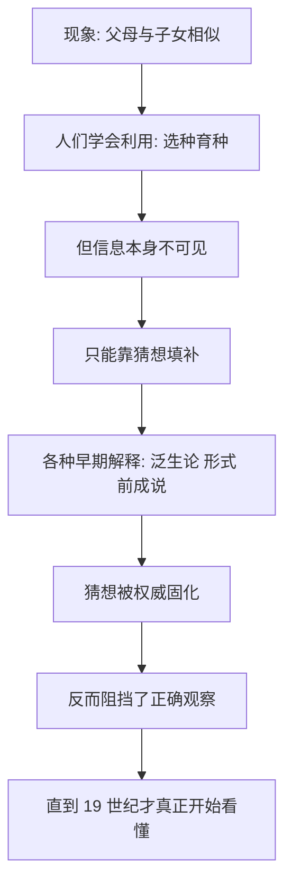

# 01｜为什么「种瓜得瓜」是人类最熟悉也最深的谜？

> 遗传是我们每天都能看到的现象，为什么却成了科学史上最难解的谜题之一？

---

## 一、先说结论

穆克吉的《基因传》并不是从实验室或显微镜写起，而是从一个私人问题写起。

他的家族里，两个叔叔都患有严重的精神疾病：一个在街头流浪，一个反复自残。于是他一生的恐惧和追问都指向同一个问题：**那个「疯狂」，会不会通过某种看不见的方式，传到我身上，甚至传给我的孩子？**

这本书想说的第一件事是：**遗传是我们最熟悉、却最难理解的东西。**

我们每天都能看到「孩子像父母」「种瓜得瓜」，人类几千年前就学会了用选育改良庄稼和牲畜。但「相似为什么会延续」，背后究竟发生了什么，人类直到一百多年前才开始真正看懂。穆克吉提醒我们：一个我们习以为常的现象，可能藏着一整个学科的谜底。

---

## 二、我们先理解一个问题

先做一个小实验。

假设你面前有两种豌豆种子，一种长得高，一种长得矮。让它们杂交，会得到什么？

最直觉的答案是「不好说，也许高矮各一半」。

但事实是：杂交出来的第一代，几乎全是高的。把它们再相互杂交，第二代里高矮又同时出现，而且比例非常接近 **3∶1**。

这个 3 比 1，看起来只是个简单的数字。可它背后藏着一条规律：遗传信息是「颗粒状」的，可以隐藏，也可以重现。

于是真正的问题浮出来了：

> **一个我们每天都能观察到的现象，为什么背后的机制却如此难以看清？**

因为遗传是看不见的。你能看见父母和孩子，却看不见「信息」是怎么从上一代传到下一代的。

---

## 三、作者到底提出了什么观点？

穆克吉的观点可以概括成这样：

> **人类使用遗传的时间长达几千年，理解遗传的时间却只有一百多年。**

在这两者之间，横着一道巨大的鸿沟。会育种，不等于懂遗传；知道「像」，不等于知道「为什么像」。

他进一步指出：正因为人类长期「会用不懂」，才会不断用想象去填补这个空白——于是出现了各种各样听起来合理、其实错误的解释。而这些错误的解释，一旦被权威和习俗固定下来，就会阻挡真正的观察，甚至被用来为等级、种族和命运辩护。

所以《基因传》要从头讲起：**先讲人类在一个没有遗传学的世界里，是如何思考「像」这件事的。**

---

## 四、把这个观点翻译成人话

打个比方。

人类很早就会骑马、养牛、种地，相当于很早就「会开车」。但「汽车是怎么工作的」——发动机、油路、变速箱——要到很久以后才有人真正搞清楚。

在很长一段时间里，人们是靠经验驾驶的：哪种马配哪种马能出好马，哪种麦子留种能高产。经验有效，于是大家以为经验就是全部。

但经验有个问题：它只告诉你「怎么做有效」，不告诉你「为什么有效」。一旦遇到经验之外的情况——比如一个家族突然出现从未有过的病——经验就失效了，人们只好用猜测去解释。

穆克吉说的「没有遗传学的世界」，就是这样一个世界：**人们天天在使用遗传，却对它一无所知。**

---

## 五、为什么会这样？

因为遗传的「传递者」本身是看不见的。

古代并不缺聪明的猜想。

古希腊的希波克拉底一派提出过「泛生论」：认为种子是从身体各个部分汇集而来的，所以孩子会像父母身体的每个部位。这个说法有一定解释力，甚至能解释「为什么父母双方都会像」。

亚里士多德不同意，他认为遗传传递的不是身体碎块，而是一种「形式」或者说「信息」。

还有一派认为，孩子的形象在受精之初就已经完整地「预成」在种子里面，只是慢慢长大——这被称为「前成说」。

这些猜想各有道理，也各有漏洞。但真正的困难在于：**在没有显微镜和实验方法之前，没有人能验证它们。** 于是它们只能长期并存，而无法被真正推翻。

---

## 六、举一个现实生活中的例子

想想一个养狗的人。

几百年来，人类把狗培育成了从吉娃娃到大丹犬这样天差地别的品种。培育者并不懂基因，但他们能说：「这两只狗配，后代大概率是卷毛。」他们的判断来自经验，而且相当准确。

可有意思的是：如果你问他们「卷毛是怎么传下去的」，他们会给出各种各样含糊的说法——血统、品性、「种好」。

这和古人很像。

我们身边也有类似的情况。很多家族会注意到某种病「好像总在这一家人里出现」，于是归结为「祖上的风水」或者「命」。

这些说法都在做同一件事：**给看不见的机制，套上一个看得见的解释。** 它不是愚蠢，而是人在信息不足时的本能。

真正科学的一步，是先承认「我们其实不知道」，然后去设计实验。

---

## 七、回到书中重新理解

现在再看穆克吉的家族故事，就更能理解他为什么这样开头。

他担心的不是抽象的「遗传学问题」，而是一个极其具体的问题：**我叔叔的病，会不会传给我？**

而他发现，人类面对这个问题时，处境其实和几千年前没有本质区别：我们能看到「像」，却看不见「为什么会像」。这种不确定性，是恐惧的温床——它既孕育了《基因传》里那些解释世界的努力，也孕育了后面更黑暗的东西：优生学、血统论、把疾病归咎于「坏血统」。

所以这一篇的意义是：**先把谜题本身看清楚。** 遗传不是显而易见的知识，而是一个需要被解开的过程。

---

## 八、这个观点背后还有什么？

这个观点背后，藏着一个更深的东西：**「会用」和「懂」之间的落差，是危险的。**

人类驯化了小麦、水稻、狗和牛，用了上万年，完全不需要懂遗传——经验足够用了。

但我们还做了另一件事：用遗传去解释人。

谁高贵、谁低贱；谁健康、谁有病；谁该被尊重、谁该被隔离。这些判断一旦建立在「遗传」之上，就变得格外强硬——因为它听起来像「天生如此」「无法改变」。

穆克吉想提醒的正是这一点：**在真正理解遗传之前，人类已经在用它给同类排序了。** 而这种排序，后来酿成了灾难。

---

## 九、这个观点有问题吗？

有一点需要澄清。

「人类很晚才理解遗传」这个说法，很容易被误读成「古人很蠢」。这显然不对。古人生活在一个没有显微镜、没有统计方法、没有实验条件的时代，他们的经验智慧其实非常了不起——选育良种、改良牲畜，都是极其复杂的实践。

真正的限制不是智力，而是工具和方法：没有可以观察遗传物质的仪器，也没有「对照实验」这样的思维工具。

另外，「会用不懂」也不只发生在遗传上。冶金、医药、农业，很多领域都是先会做、后懂原理。所以这在人类认知史上并不特殊——只是遗传的后果，格外深远。

---

## 十、今天再看这个观点

（以下为现代延伸，非穆克吉原文）

今天，我们已经能读取自己全部的基因组，能测出某种疾病的风险，甚至能用 CRISPR 修改基因。按理说，「会用不懂」的时代应该结束了。

但情况也许更微妙：**我们比以往任何时候都更「能操作基因」，却不比以往更「懂该如何面对它」。** 基因检测能给出概率，却给不出答案；基因编辑能改变一个字母，却改变不了一个家庭要面对的伦理选择。

从这个意义上说，穆克吉讲的那个「没有遗传学的世界」，并没有完全过去——它只是换了一件外衣：今天的我们，手握前所未有的遗传学知识，却仍在为「该如何使用它」而困惑。

---

## 十一、这一篇真正应该记住什么？

1. **遗传是「会用了上千年、才看懂一百多年」的领域。** 经验有效，不代表原理已经清楚。

2. **遗传的传递者看不见。** 正是这种不可见，让人类长期只能用猜想填补空白。

3. **古代的猜想不是愚蠢，而是工具不足。** 缺乏仪器和实验方法，是理解遗传最大的障碍。

4. **「会用不懂」是危险的。** 当遗传被用来给人排序，后果远超农业和育种。

5. **穆克吉从家族病史写起，是把科学史和个人命运绑在了一起。**

---

## 十二、留一个问题

人类很早就知道「孩子像父母」，也知道近亲结婚更容易生出有问题的孩子——这些经验甚至写进了很多古老的法律和禁忌。

那么问题来了：

> **如果人类早就在生活里「察觉」到了遗传的规律，为什么真正把它写成科学，却要等到一个在修道院花园里种豌豆的人？**

下一篇，我们就来看看这位修道士——孟德尔：**一个修道士的花园，如何发现了遗传的第一条定律？**
