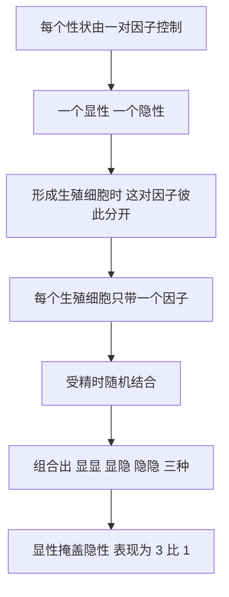

# 02｜一个修道士的花园：孟德尔如何「看见」了基因？

> 在没有分子显微镜的时代，一个修道士凭什么「看见」了遗传的规律？答案不在他的眼睛，而在他提问题的方式。

---

## 一、先说结论

穆克吉在《基因传》里，把孟德尔放在很特殊的位置。他种的豌豆别人也在种，高矮圆皱农民也看得见。真正的问题是：**为什么是他，而不是别人？**

穆克吉认为，孟德尔的天才不在观察得更多，而在**换了一种提问方式**。

别人问：「孩子像不像父母？」这是个模糊的、只能靠描述回答的问题。

孟德尔问：「如果我只盯住一个性状，数足够多的后代，比例是多少？」这是个清晰的、可以用数字回答的问题。

就是这一步转换，让遗传第一次从「像不像」变成了「是几比几」。而答案，是那个著名的 **3∶1**。

孟德尔由此提出：遗传不是把父母的性状搅在一起，而是由一些不可分割的「因子」携带；它们能隐藏、能重现，成对存在，各出一半。这是遗传学的第一块基石。

而讽刺的是：这份工作在孟德尔生前几乎无人理解，发表后沉睡了三十多年，才被人重新发现。

---

## 二、我们先理解一个问题

假设你面前有高豌豆和矮豌豆。让它们杂交，你会预期什么？

一种直觉是「混合」：高的和矮的掺在一起，后代理应不高不矮，居中——像黑墨水加白墨水，得到灰墨水。另一种直觉是「随机」：谁强就随谁，看不出规律。

两种直觉都指向同一个结论——**遗传是模糊的、连续的、说不清的。**

孟德尔的不同，在于他做了个「笨」功夫：不管像不像，只管数。

结果让他惊讶：杂交第一代，几乎全是高的；让第一代自交，第二代里高矮同时出现，比例非常接近 **3∶1**。而且这不是偶然一次，它稳定地、反复地出现在多个不同性状上。

于是问题浮出水面：

> **性状明明看得见，为什么它背后的传递规律，却要靠「数」才能看见？**

因为规律藏在比例里，而比例藏在数量里。你只盯着一两个孩子的家庭，永远看不出 3∶1；你必须种下成千上万株豌豆。

---

## 三、作者到底提出了什么观点？

穆克吉强调的是一件事：

> **孟德尔真正的贡献，是一种新的「眼光」——他看见了别人看不见的「单位」。**

具体有三层。

第一，**性状由「因子」携带，而不是由「浑汤」携带。** 这是「颗粒遗传」的核心，与当时流行的「融合遗传」正相反。

第二，**因子成对，后代从父母各得一份。** 形成生殖细胞时，这一对被拆开，各走一边。

第三，**因子会隐藏，也会重现。** 隐性因子在当代不出现，却能在下一代重新冒出来——这正是 3∶1 的来源。

注意：**孟德尔没有说出「基因」这个词**，他说的是「因子」（factors），「基因」要等到四十年后才被命名。他给出的是概念，不是分子。

---

## 四、把这个观点翻译成人话

「融合遗传」像什么？像两个孩子各拿一杯不同颜色的水，倒进同一个杯子搅一搅。再加再搅，原来的颜色就找不回来了——它被稀释、被冲淡，最终消失。

「颗粒遗传」像什么？像一副扑克牌，每人抓若干张。牌是独立的、不融合的：你手上有黑桃 A，不代表你没有红桃；这一轮没打出红桃，下一轮它可能又出现。

这个差别决定了整个进化论能不能成立。水会被稀释：如果遗传真像水，任何新出现的罕见性状都会在几代内被冲淡，永远积累不起来。牌不会：它可以被盖住，但不会消失。这一代没打出来，下一代还在手里。遗传信息可以**潜伏**，也可以**重现**。

孟德尔用豌豆数出来的，其实就是这副牌的规则。他不是看见了牌，而是从出牌的结果里，反推出牌的存在。

---

## 五、为什么会这样？

为什么「有东西在携带」，就会出现稳定的 3∶1？

关键机制有两条。

第一是**分离**。父方的一对因子中，只有一个进入某个生殖细胞；母方同理。所以第一代看似全是高，其实内部都藏着一个矮的因子。

第二是**随机结合**。两个第一代个体各自产卵、各出精子，因子随机配对，就得到三种组合：显显、显隐、隐隐。前两种看起来都是高，最后一种才是矮。

于是高对矮，正好三比一。

这也解释了隐性性状为什么能「跳过一代」：它没有被消灭，只是被显性盖住了；当两个携带者相遇，它就有四分之一的机会重新露出来。

---

## 六、举一个现实生活中的例子

你可以在自己家里找到类似的「3∶1」。

有些性状是典型的显隐性关系，比如耳垂是否游离、是否有酒窝。假设某个性状由一对因子决定（现实未必这么简单，这里只做示意），父母双方都是「携带者」——自己表现出来是显性，但都藏着一个隐性因子。那么他们的每个孩子，都有四分之一的机会表现出隐性性状。

这就会出现让人困惑的情况：**父母都没有某种特征，孩子却有。** 家里人常说「返祖」，其实不是祖上显灵，而是父母各自藏着的隐性因子在孩子身上凑成了对。

但类比抓住的只是要点，**不能替代真实的解释**——孟德尔真正的证据，是成千上万株豌豆的计数。

---

## 七、回到书中重新理解

现在再看穆克吉为什么花整整一章写这个修道士，就清楚了。他写的不仅是一套定律，而是一个人被时代忽视的命运。

孟德尔在布尔诺的修道院里，用一块小园地种了成千上万株豌豆，做了七年实验。他是个有数学爱好的人——正是这份兴趣，让他想到「要数比例」。1865 年他把结果讲给当地的自然科学学会，1866 年发表成论文。然后，就几乎没有然后了。

当时科学界忙着重大的争论，很少人注意到这篇文章。他后来郁郁而终；直到 1900 年，三位不同国家的科学家几乎同时重新发现了他的工作。

穆克吉的写法带着惋惜：**一个把问题问对了的人，生在了没有人听懂的时代。**

---

## 八、这个观点背后还有什么？

这个观点背后，藏着一条更大的方法论：**科学的进步，有时不靠更强的仪器，而靠更好的提问。**

孟德尔没显微镜，也没见过分子，工具只有铲子、笔和算术。他赢，是因为把一个模糊的问题（「孩子像谁」），换成了可以计数、边界清晰的问题（「单个性状的比例是多少」）。

背后还有两层：一是**统计进入生物学**——偶然背后可以有稳定的概率规律，只要你数得足够多；二是**「看不见的东西可以被推理出来」**——因子没人见过，它的行为却能从结果还原。这正是后来整个基因史的方法：先假定有个单位，再去找它。

---

## 九、这个观点有问题吗？

有三点值得认真对待。

第一，**孟德尔没有提出「基因」。** 他说的「因子」是抽象概念，几乎没有分子含义；把他说成「基因的发现者」，是后见之明的追封。

第二，**他的实验材料可能过于「配合」。** 他挑的七个性状可能恰好彼此独立（或分布在不同染色体上），才会干净地呈现 3∶1；若两个因子在同一条染色体上，就会「连锁」，比例偏离。这里有运气成分。

第三，**数据吻合得有点太好了。** 1922 年，统计学家费舍尔分析孟德尔的原始数据后，提出这些比例「好得不真实」，怀疑有事后挑选甚至美化。争论至今没有定论，但它提醒我们：**科学史人物不是完人，结论需要独立重复。**

还有一个更根本的限制：孟德尔研究的是**离散性状**（高或矮、圆或皱），而现实中大量性状是**连续的**（身高、体重）。要等到多基因概念出现，这个问题才被回答。

---

## 十、今天再看这个观点

（以下为现代延伸，非穆克吉原文）

孟德尔那套「因子成对、分离、随机结合」的规则，今天已成了遗传学的语言。基因检测里的「携带者」，本质上就是孟德尔讲的「藏着没露面的隐性因子」；我们算遗传病概率，用的还是那套四分之一的算式。

但今天的图景也更复杂。第一，**大多数性状不是由一对因子决定，而是由大量基因共同影响，每个只贡献一点点**，这叫多基因性状，3∶1 那套干净的比例在这里基本失效。第二，**连锁现象**说明染色体上的基因往往成串传递，「独立分配」并非总是成立。第三，**表观遗传**说明性状表达还可能被环境「标记」而不改变序列——这是孟德尔视野之外的一层。

所以更准确地说：孟德尔给出了遗传的**底层语法**，现代遗传学则写出了远比 3∶1 复杂得多的句子。

---

## 十一、这一篇真正应该记住什么？

1. **孟德尔的天才在于换问题，而不是看得更多。** 从「像不像」到「几比几」，是遗传学真正的起点。

2. **遗传是颗粒的，不是融合的。** 因子成对、可分离、可隐藏、可重现——这才是 3∶1 背后的东西。

3. **他提出的是「因子」，不是「基因」。** 概念先于实体，命名要等到 1909 年。

4. **一个问对问题的人，可能生在一个听不懂的时代。** 他的工作沉睡三十多年才被重新发现。

5. **任何理论都有边界。** 3∶1 对离散性状有效，对连续性状和多基因性状，需要更复杂的模型。

---

## 十二、留一个问题

孟德尔在 1866 年发表了他的豌豆论文。

同一年，地球另一边，一个已经出版《物种起源》的人也在苦思「遗传」。他比任何人都需要它——因为自然选择必须建立在一个前提上：**后代之间要有可遗传的差异。**

但这个人，几乎从未听说孟德尔。

那么问题来了：

> **写出了进化论的达尔文，为什么会卡在「遗传」这道坎上？他到底缺了什么？**

下一篇，我们就来看看达尔文的困惑：**为什么这个缺口，要等到孟德尔被重新发现，才能被补上？**
