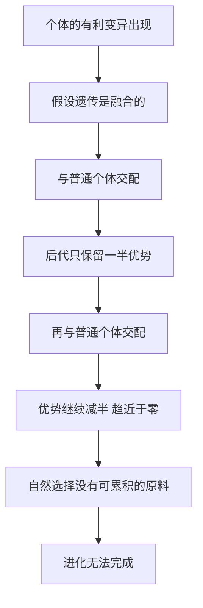

# 03｜达尔文为什么解不开遗传之谜？

> 自然选择需要可遗传的差异，而当时流行的「融合遗传」恰好会把这些差异稀释掉——达尔文看见了进化，却站在一块会融化的地基上。

---

## 一、先说结论

在《基因传》里，穆克吉写到达尔文时，语气是复杂的。达尔文解开了生命史上最大的谜题之一：物种不是被分别创造的，而是在漫长的时间里，由自然选择一点点塑造出来的。但穆克吉提醒我们：**这个学说有一个致命的缺口——遗传。**

自然选择要能工作，必须满足一个前提：个体之间存在**可遗传的差异**。谁更适应环境，谁就留下更多后代，有利的差异于是慢慢在群体里累积。问题恰恰出在「累积」两个字上。

达尔文时代的生物学，普遍相信一种叫「融合遗传」的模型：父母的性状像两种颜色混在一起，后代是不偏不倚的中间值。如果真是这样，任何新出现的有利变异都会在每一代被稀释一半，几代后就消失。

穆克吉的观点是：这不是达尔文笨，而是他生早了一步。他需要的地基，正由另一个种豌豆的人同时打桩，而两人彼此都不知道对方。两套伟大的理论，在同一时代擦肩而过。

---

## 二、我们先理解一个问题

先做个小实验，把「稀释」看清楚。

假设有一群野兔，其中一只因为偶然的变异，比别人更耐寒。寒冷来临时，它活下来的机会更大——这正是自然选择喜欢的变异。

现在假设遗传是「融合」的。这只兔子与普通兔子交配，后代只有一半的耐寒优势；再与普通兔子交配，只剩四分之一；再下一代，八分之一……无论它当年多能扛冻，几代之后，那点优势几乎为零。

于是问题就来了：

> **如果每一代都要打一次折，自然选择还怎么把一个微小的优势，累积成一次真正的改变？**

答案是：不能。融合遗传让「累积」在数学上几乎不可能——就像一个不断存钱、但账户每代都被自动扣掉一半的人，存得再多也攒不起来。达尔文清楚地意识到必须回答这个问题，却找不到答案。

---

## 三、作者到底提出了什么观点？

穆克吉（以及科学史的普遍叙述）强调：**达尔文缺的不是智力，而是遗传学。**

当时最流行、听上去也最合理的解释，是「融合遗传」。1867 年，工程师弗利明·詹金据此发表了对自然选择最有力的批评之一：一个个体的有利变异，会立刻被大量普通个体「稀释」掉，根本来不及被选择累积。

这是科学史上著名的反驳。它逼着达尔文面对一个不愿面对的事实：他的理论在遗传机制上缺少支撑。

达尔文后来提出自己的遗传假设——「泛生论」：身体的每个部分都会释放出微小颗粒，汇集到生殖细胞里，把身体的状态传下去。它看起来聪明，因为能顺便解释「为什么后天的变化也能传给孩子」。但穆克吉指出：**泛生论是一个无法验证的猜想**——达尔文拿不出实验证据，也说不清这些颗粒是什么，只能用更深、更含糊的假设去填补空白。

---

## 四、把这个观点翻译成人话

「稀释」最有画面感的类比是一滴墨：滴进一杯清水，水变灰；再倒进一池水，几乎看不见颜色；再倒进湖里，什么都不剩。达尔文时代的遗传观就是这样看待变异的：**新东西一出现，就被周围的「正常」稀释。**

但进化需要的，恰恰是「稀释不掉」的东西。它更该像一滴油滴进水里——不溶解，漂在那儿，周围水再多，它还是那滴油。

自然选择要的就是那种「能原样传下去」的东西。达尔文却以为它在传播中会被稀释——等于误以为好方法每次交接都要打五折。

---

## 五、为什么会这样？

为什么会「越稀释越没有」？机制很朴素：

关键在于：融合遗传把信息变成了**连续的、会被平均的量**。平均数有一个残酷的性质——它不断向大多数靠拢。少数派的新东西，只要被平均，就会消失。

反之，孟德尔式的颗粒遗传之所以救场，是因为它把信息变成了**离散的、成对的单位**。单位可以盖住、可以潜伏，但不会被平均掉。于是「罕见」可以存在很多代，等到条件合适时重新出现，被选择挑中。

这就是穆克吉把两人放在一起讲的原因：他们看似一个研究豌豆、一个研究雀鸟，其实回答的是同一问题的两端——**变异从哪里来（达尔文），变异怎么传下去（孟德尔）。** 缺了后者，前者就落不了地。

---

## 六、举一个现实生活中的例子

你可能听过家族里这种说法：「我们家祖上出过一个很会读书的人，可惜一代不如一代。」这背后，就是一套朴素的「融合遗传」直觉：好东西会随着一代代的「混合」而变淡。但如果是隐性因子，它会潜伏好几代，再在某个孩子身上重新出现——所以「隔代像祖父」并不神秘。

再想想移民家庭的语言：第一代说母语，第二代还能说，第三代往往只说所在国语言。语言确实「一代比一代淡」，很像融合遗传；但这不是遗传，而是**环境传递的衰减**——语言不会写进生殖细胞，一旦不教，它就断了。像「稀释」这样看似遗传的现象，背后往往只是环境。

---

## 七、回到书中重新理解

现在再看穆克吉的叙述，就能理解他为什么把达尔文和孟德尔并排放在第一批。他写的不只是两个人的故事，而是一个时代的结构性困境：**十九世纪最伟大的两个发现——进化论和遗传规律——在同一时间诞生，却没能接上头。**

达尔文在 1859 年出版《物种起源》，孟德尔在 1866 年发表豌豆论文，两人几乎是同时代的人：一个需要遗传学来补上自然选择的地基，一个给出了地基却没有听众。

直到 1900 年孟德尔被重新发现，达尔文的学说才有了对接的框架；再往后，费舍尔、霍尔丹、赖特等人把两者合在一起，形成了「现代综合」。穆克吉的写法带着遗憾：**如果达尔文读懂了孟德尔，整个遗传学也许会早几十年起步。** 但历史没有如果。

---

## 八、这个观点背后还有什么？

这个观点背后，是科学最容易被忽略的一面：**理论是互相依赖的。** 我们习惯把达尔文想象成孤胆英雄，但实际上，他的学说悬在一个他无法回答的问题上——遗传的机制。一个再伟大的理论，只要脚下的地基不牢，就可能在关键处站不住。

这里面还有「模式」和「机制」的区别：达尔文看到了模式（物种在变、在适应），没找到机制（变异如何产生、如何传递）。只看到模式，可以提出伟大的猜想；要让猜想变成可靠的科学，必须补上机制。而达尔文可贵的一点是——他没有藏起难题，反而公开承认它。**一个真正的科学家，也可以是敢于说出「我卡在哪儿」的人。**

---

## 九、这个观点有问题吗？

第一，**达尔文不是「错」，而是「缺」。** 融合遗传在当时的证据条件下相当合理——身高、肤色看起来确实像连续混合。真正的教训是「现象会骗人」：很多连续性状其实由大量基因叠加而成，看起来像融合，其实不是。

第二，**「擦肩而过」有偶然，也有结构性原因。** 即便达尔文读过孟德尔的论文，也未必能立刻看出价值——在 1866 年，「数豌豆的比例」还完全不像一门能说明进化的学问。

第三，**泛生论也不是纯属荒谬。** 它至少有「信息由身体传向生殖细胞」的模糊直觉。它错在细节和证据，不在「大胆设想」。同时，把困境讲成「只差孟德尔一步」也是过度简化——从「因子」到「群体里变异如何变化」，还需要一整套群体遗传学。

---

## 十、今天再看这个观点

（以下为现代延伸，非穆克吉原文）

现代进化论早就把达尔文和孟德尔缝在了一起：孟德尔提供颗粒——**变异以离散的单位传递，不会被稀释**；达尔文提供选择——**不同单位带来不同的生存繁殖成功率**。两者相加，才有可累积的进化。二十世纪的群体遗传学进一步说明：一个有利基因能否扩散，取决于选择优势、群体规模，以及随机的「遗传漂变」。

但故事也没有止于「选择万能」：进化还有中性理论、漂变、性选择等机制，一个变异能否留下来，也可能只是运气。

更有意思的是「表观遗传」：环境能否在世代之间留下不改变 DNA 序列的印记？已有研究提示这种跨代效应可能存在，但范围、机制和是否稳定遗传，学界仍在争论。**达尔文的缺口被补上了，但「什么算遗传」，这个问题今天又被重新打开了一次。**

---

## 十一、这一篇真正应该记住什么？

1. **自然选择需要可遗传的差异作为原料。** 没有稳定的遗传，进化就无从累积。

2. **融合遗传会让变异被稀释。** 每一代打一次折，新变异就永远站不住脚。

3. **达尔文的问题不是智力，而是缺一门还没诞生的学科。** 他看到了模式，却没拿到机制。

4. **孟德尔和达尔文本可互相成就，却在同一时代擦肩而过。**

5. **理论是互相依赖的。** 一个伟大的学说，也可能卡在它无法解决的邻接问题上。

---

## 十二、留一个问题

孟德尔告诉我们：遗传因子成对、可分离、可隐藏。可这些「因子」究竟在哪里？它总得住在身体的某个地方，才会在每次细胞分裂时被复制、被分配。

但孟德尔的论文里没有地址，达尔文的泛生论也只是一个模糊的猜想。

那么问题来了：

> **遗传因子既然看不见，它到底住在身体的哪个角落？科学家是怎么把它「找」出来的？**

下一篇，我们就来看看这些看不见的东西，如何在细胞里被找到——**染色体、细胞分裂，以及「基因」这个名字的诞生。**
