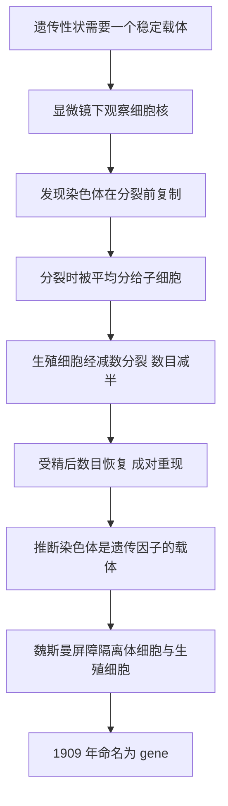

# 04｜基因究竟藏在哪里？——染色体与「基因」的诞生

> 孟德尔给了遗传一个概念，却没说它住在哪儿。答案，藏在细胞核里那些会被染色的丝状物中。

---

## 一、先说结论

孟德尔告诉我们：性状由成对的「因子」决定，会隐藏、会重现。但他没说这些因子到底在哪里。

在《基因传》里，穆克吉把接下来这几十年的科学史写成了一场「把概念变成实体」的追踪：因子既然在每一代稳定传递，就必然有一个物理载体，而且它必须在细胞分裂时被精确复制、被平均分配。

显微镜帮了大忙：科学家在细胞核里看到一些容易被染料染色的丝状物，把它们叫作**染色体**。更关键的是，细胞分裂前染色体先复制自己，分裂时又被均匀分到两个子细胞里——这种「先复制、再均分」的行为，简直像为遗传物质量身定做的。

与此同时，奥古斯特·魏斯曼划出一道界线：**体细胞和生殖细胞是分开的**，遗传信息只能通过生殖细胞传给下一代，后天获得的改变不能直接写进遗传。这道界线被称为「魏斯曼屏障」。

到 1909 年，学者威廉·约翰森给这个单位取名——**基因（gene）**。从此，一个只存在于推理中的概念，开始被当作实体去寻找。

---

## 二、我们先理解一个问题

一个看不见的东西，怎么找？

你可能以为科学家是「先看到它，才认识它」。但科学的实际路径往往相反：**先意识到「有东西必须存在」，再去找它的痕迹。**

遗传因子就是这样。孟德尔已经证明它存在，而且行为有规律：成对、分离、随机结合。那么它一定有某种物理形态。问题只是：**它长什么样？住在哪里？怎么在细胞分裂的混乱里保持精确？** 于是研究者开始寻找一个「行为模式」：什么东西会在细胞分裂前复制自己，又在分裂时被平均分给两个子细胞？答案指向了染色体。

---

## 三、作者到底提出了什么观点？

穆克吉在这一段的叙述，可以概括成一句话：

> **染色体不是「基因的家」，而是让基因从抽象走向实体的那座桥。**

具体有四个关键点。

第一，**染色体的发现与命名。** 十九世纪后期，显微和染色技术进步，科学家观察到这些丝状结构，因其分裂时有规律而命名为染色体（chromosome，意为「带颜色的小体」）。

第二，**有丝分裂的观察。** 染色体在分裂前复制成两条，再各自分向两个子细胞——这解释了生长与组织更新为何能稳定。

第三，**减数分裂的发现。** 生殖细胞形成时染色体数目先减半，受精时由双方各补一半。正因为减半，成对的因子才会各走一边，这正好解释了孟德尔的「分离」。

第四，**魏斯曼屏障。** 魏斯曼把生殖细胞和体细胞明确分开：遗传信息只在专门的「生殖质」流水线上传递，身体获得的改变不会反过来改写它。

最后，**约翰森在 1909 年命名「gene」，** 并提出「基因型」与「表现型」的区分——前者是内在的遗传构成，后者是外在表现。

---

## 四、把这个观点翻译成人话

可以用图书馆来理解。细胞核是一座图书馆，染色体是一套套编了号的书。扩建分馆时规矩很严：**先复印整套，再平均分给两个新馆。** 有丝分裂就像两个分馆各拿一份完整缩印本；减数分裂则像「发牌前先洗掉一半」，每个生殖细胞只拿半套，等精卵结合再拼成完整的一套——正对应孟德尔说的「父方给一个、母方给一个」。

魏斯曼屏障则像：**生殖细胞是保险箱，体细胞是临时账本。** 账本上怎么涂改，都不影响保险箱里的原件——这第一次把「遗传」和「养成」分开。约翰森的命名，则像给一个只有代号的神秘人物上了户口。

---

## 五、为什么会这样？

从「看不见的因子」到「被命名的基因」，这条推理链是这样的：

每一环都依赖前一环。没有孟德尔的「颗粒遗传」，人们不会想到去找独立载体；没有显微技术，染色体根本看不到；没有「复制加均分」这种精准到不自然的行为，人们不会怀疑它就是遗传物质的所在；没有魏斯曼，遗传就会被无数后天因素搅乱。

这正说明：**科学的突破常常是「技术」和「概念」互相咬合的结果。**

---

## 六、举一个现实生活中的例子

魏斯曼做过一个常被引用的实验，检验「后天获得的改变能不能遗传」：他把小鼠的尾巴一代代剪掉，连续剪了很多代，结果**后代照常有尾巴**。如果后天改变能直接遗传，剪了二十多代，后代多少该短一点。这常被用来说明：**身体的损伤不会自动写进遗传信息。**

你也可以把它想成公司的制度：门店为应对当地情况临时改了价目表、调整了营业时间，这些「后天调整」不会自动变成总部的制度，总部存档的原始规章只通过专门渠道往下发——这就是魏斯曼屏障的意思。**影响可以很大，但方式和遗传是两回事。**

---

## 七、回到书中重新理解

前面几篇里，遗传因子只是一个推理出来的存在。孟德尔从比例里反推出它，达尔文为它焦头烂额，却谁也没见过它。到了染色体这一步，**遗传学第一次有了「地址」。**

穆克吉想让我们看到，这是一次身份的跃迁：从「一个必须存在的概念」，变成「一个可以被定位、被观察、被追踪的实体」。而一旦基因成了实体，后面的一切才成为可能——追问成分、拍出结构、读出序列，甚至改写它。

但这段历史也埋下伏笔：**当我们把一个概念当作实体，就容易相信它「决定」了什么。** 基因有了地址，也更容易被误解为命运。

---

## 八、这个观点背后还有什么？

这个观点背后，有两条更深的线索。

第一条是**命名与语言的力量**。约翰森造出「gene」之后，科学讨论的颗粒度变了：之前「因子」「遗传倾向」含义模糊，有了这个名字，研究就有了共同对象。「基因型」与「表现型」的区分同样重要——它提醒我们：**内在的遗传构成，和外在表现的样子，不是一回事。**

第二条是**「边界」的双重性**。魏斯曼屏障划清了遗传与后天，这对科学是好事。但它也容易被误读成「后天不重要」「一切都是天生的」，为后来的基因决定论甚至优生学提供了话柄。**一个正确的科学区分，如果被过度延伸，也可能变成危险的简化。**

---

## 九、这个观点有问题吗？

第一，**魏斯曼屏障并非绝对。** 某些环境造成的「表观遗传」标记，可能在一定程度上影响后代。常被提到的例子是荷兰「饥饿冬天」的队列研究：孕期经历饥荒的母亲，其子女甚至孙辈在代谢和健康上似乎留下了痕迹。这类跨代效应是否稳定、机制为何，学界仍有争论，但足以说明：**「后天绝对不遗传」是过强的说法。**

第二，**「基因」是抽象还是实体，约翰森本人也很谨慎。** 他造这个词，更多是为描述和计算方便，并不认为它是一个已被看到的分子。后来人们把它当成实实在在的「东西」去找，既有推动力，也有风险：**概念一旦被物化，就容易忘记它只是一种理解现象的工具。**

第三，**拉马克并非全然荒谬。** 他的核心主张方向错了，但他关注「环境如何影响生物」并没有错——今天我们知道环境确实能影响基因表达，只是方式不同。把拉马克一棍子打成笑话，也简化了科学史。

---

## 十、今天再看这个观点

（以下为现代延伸，非穆克吉原文）

今天，基因的物理位置早已被彻底弄清：它就是染色体上的一段 DNA 序列，甚至能画到精确到碱基的坐标上。染色体本身也成了医学对象：唐氏综合征就是 21 号染色体多了一条；许多反复流产和出生缺陷，源于减数分裂时染色体分配出错。

表观遗传学则部分改写了魏斯曼屏障：DNA 上的化学修饰、染色体上蛋白质的包装方式会被环境（饮食、压力、毒素）影响，某些修饰还可能传给下一代。它不改变 DNA 序列，却改变「哪段序列被打开」——这道屏障因此更像一扇有缝隙的门。

一个耐人寻味的回响是：约翰森当年很清楚，「基因」更多是方便研究的抽象单位；而今天我们找到了分子，却也发现——**一个基因往往不是一个东西，而是一段可以被剪接、被调控、被环境改写的复杂区域。**

---

## 十一、这一篇真正应该记住什么？

1. **遗传因子需要一个物理载体。** 科学家靠「复制加均分」这种行为特征，锁定了染色体。

2. **有丝分裂保持稳定，减数分裂保证成对因子各走一边。** 这解释了孟德尔讲的「分离」。

3. **魏斯曼屏障划清了体细胞与生殖细胞。** 后天获得的改变，不会自动写进遗传信息。

4. **1909 年约翰森命名「gene」。** 从此，概念被当作实体来寻找——这是推动力，也是风险。

5. **科学区分一旦被过度延伸，就可能变成危险的简化。** 遗传与后天有别，不等于后天不重要。

---

## 十二、留一个问题

到这一步，基因有了名字，也有了地址。但问题反而更尖锐了：科学家把染色体拆开一看，发现里面主要有两种东西——**蛋白质和 DNA。**

按当时大多数人的直觉，携带遗传信息的应该是蛋白质：它结构复杂、样式繁多，看起来才「配得上」承载丰富的生命信息。而 DNA 被看作单调、重复的「填充材料」，似乎不可能承担这样的任务。

那么问题来了：

> **遗传物质到底是什么——是复杂多样的蛋白质，还是貌不惊人的 DNA？科学家凭什么推翻自己的直觉？**

下一篇，我们就来看看这场持续四十年的争论：**DNA，还是蛋白质？**
