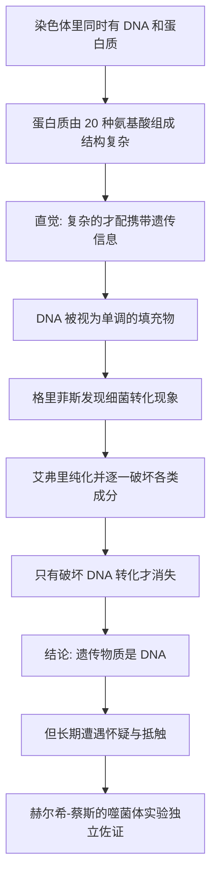

# 05｜遗传物质到底是什么？——DNA 与蛋白质的四十年之争

> 染色体里同时有 DNA 和蛋白质，凭什么认定「貌不惊人」的 DNA 才是遗传物质？

---

## 一、先说结论

上一篇，我们跟着科学家把基因「安放」到了染色体上。但故事没有结束，反而变得更棘手了。

因为染色体并不是一种纯净的东西。把它拆开看，主要成分只有两样：**DNA** 和**蛋白质**。

于是问题立刻变得非常具体：遗传信息，究竟写在哪一样里？

穆克吉在《基因传》里讲了这段著名的公案。他想让我们看到的不只是「DNA 胜出」这个结果，而是一个更微妙的过程：**在过去很长时间里，多数科学家其实相信遗传物质是蛋白质。** 他们觉得 DNA 太平淡、太单调，不配承担「生命说明书」这样的重任。直到一系列实验把证据一点点逼出来，共识才缓慢地转向。

而这段历史最耐人寻味的地方在于：**证据出现之后，怀疑并没有立刻消失。**

---

## 二、我们先理解一个问题

先做一个思想实验。

假设桌上有一个盒子，里面放着两样东西：一块结构精密、齿轮咬合、能显示时间的手表；和一根看起来只是不断重复同样花纹的长绳子。

现在我问你：这两样里，哪一样更可能藏着一段复杂的「说明书」？

几乎所有人都会选手表。为什么？因为它复杂、精巧、有设计感。而那根绳子那么单调，重复来重复去，怎么装得下丰富的信息？

这就是二十世纪上半叶很多科学家的直觉。

那么，要当「遗传物质」，得满足哪些条件？

第一，它得**能储存海量信息**——一个人的所有性状，都要写在里面。
第二，它得**能精确复制**——细胞分裂时，信息要能一份变两份，几乎不出错。
第三，它得**能稳定，又能偶尔改变**——完全不变，就无法进化；变得太随意，又无法遗传。

再看这两位候选者。

蛋白质由 20 种氨基酸组成，可以折叠成各种形状，变化极其丰富。20 种「零件」，能搭出的花样远超想象。

DNA 呢？它由 4 种碱基组成。而在当时的化学分析里，四种碱基的比例看起来大致相等，于是有人提出一个假说：DNA 不过是这四种碱基重复排列的「四核苷酸」，像一根单调的项链。

4 种零件，而且还总是重复——拿什么跟 20 种零件比？

答案似乎很明显。

---

## 三、作者到底提出了什么观点？

穆克吉想说的观点，可以概括成这样：

> **我们很容易把「复杂」等同于「重要」，把「丰富」等同于「能携带信息」——但这恰恰是一种会误导科学的直觉。**

在这段历史里，主流判断一度是：遗传物质必须是蛋白质，因为只有蛋白质足够复杂、足够多变，才「配得上」承载生命的全部信息。DNA 则被当成一种结构填充物、一个无趣的支架，甚至被形容为单调乏味的分子。

而艾弗里的工作，就是把这个「想当然」一步步掀翻。

他没有靠更聪明的猜测，而是靠一个笨办法：**把可能携带信息的物质，一样一样地破坏掉，看哪一种破坏会让「遗传」停止。**

结果是：破坏蛋白质，转化照常发生；破坏 DNA，转化立刻消失。

证据指向 DNA。

但穆克吉强调：**结论震撼，接受却极其缓慢。** 很多人宁愿相信是实验里的蛋白质杂质在起作用，也不愿接受那个「单调的分子」才是答案。

所以这一篇真正的主角，其实不是 DNA，而是**人的直觉如何抵抗证据**。

---

## 四、把这个观点翻译成人话

这里有一个特别重要的认知误区，值得把它说清楚。

我们习惯性地认为：**能装很多信息的东西，本身一定很复杂。**

但这在现代世界里早就被打破了。

想想计算机。所有信息——一篇文章、一张照片、一段音乐、一个游戏——在底层都只是 0 和 1。只有两个符号，却能表达整个世界。为什么？因为信息的关键不在「零件有多少种」，而在**组合方式有多少种**。

一句话如果只有两个字可选、写得很短，信息量有限；但只要句子足够长，即使每个位置只有 4 种可能，组合数也会变成天文数字。

DNA 就是这样的系统：**4 个字母，够长了，就够写一切。**

所以当年的误判，本质上是把「化学上的花样多」当成了「信息上的容量大」。这两件事，根本不是一回事。

---

## 五、为什么会这样？

把这段历史画成一条链，会更清楚。

这里面有两个关键节点。

一个是格里菲斯的发现。他观察到：把一种细菌的某些物质加到另一种细菌里，后者的性状竟然被「转化」了——而且这种改变还能传给下一代。这说明，确实有某种东西在细菌之间传递了遗传信息。

另一个是艾弗里的坚持。他把这套「转化」的能力当作追踪线索，一步步把混合物分离、纯化，再用不同的酶去破坏：专门消化蛋白质的酶、专门消化 DNA 的酶、专门消化 RNA 的酶。

他发现，只有**专门破坏 DNA** 的那一次，转化能力消失了。

换成侦探的语言：现场有很多嫌疑人，艾弗里把他们一个个带走，只有带走 DNA 时，案子破不了了。那 DNA 就是关键。

---

## 六、举一个现实生活中的例子

想想一家公司。

外人看一家公司，往往看谁最「光鲜」：谁在发布会上演讲，谁的 PPT 最漂亮。于是很容易得出判断——核心就是那个站在台上的人。

可真正了解内情的人知道，公司能不能运转，可能取决于一个毫不起眼的角色：一份写得清清楚楚的流程文档，或者一个管着所有权限的普通后台账号。

它不炫目，甚至有点枯燥，但**信息和能力都藏在它那里**。

DNA 当年就是那个「不起眼的后台账号」。

而更现实的教训是：当某个新人说「真正重要的是那份文档」时，很多人第一反应不是去核对，而是觉得「怎么可能，它看起来那么普通」。**这正是艾弗里当年遇到的气氛。**

我们自己在生活里也常犯这种错：凭「看起来像不像」判断「是不是」——招聘时看简历排版，选方案时看谁的演示更华丽。这些直觉有时有效，但它们不是证据。

---

## 七、回到书中重新理解

现在再看穆克吉为什么要用不少篇幅写艾弗里，就容易懂了。

第一，这是「寻找基因」这条线上最关键的一次「认领」：基因终于有了一个具体的物质身份——DNA。

第二，它示范了一个更普遍的道理：**科学的转向，从来不只靠一个漂亮实验，还要对抗一整套先入为主的观念。**

第三，它和穆克吉自己的家族追问暗暗呼应。他想知道，那个「疯狂」会不会传给他。而这一篇告诉他：承载这一切的，可能只是一个看上去毫不惊人的分子。**命运的信息，写在最朴素的地方。**

---

## 八、这个观点背后还有什么？

这个观点背后，站着一个巨大的观念转变：**生命的信息，可以是一种「符号序列」，而不必是一台「精密的机器」。**

在蛋白质派看来，遗传物质应该像一台复杂的仪器，靠自己的形状和功能干活。而在 DNA 这里，遗传物质更像一段文本：它本身不做什么，它只是**被读取**。

这个转变的意义远远超出生物学。它意味着：生命的核心机制，居然和信息、编码、复制这些概念有关。

而这，正是后面双螺旋、遗传密码要展开的故事。

---

## 九、这个观点有问题吗？

需要诚实地指出几点。

**第一，当年的怀疑并不全是偏见。** 艾弗里的实验在技术上有限制：他很难百分之百证明 DNA 样品里没有极微量的蛋白质污染。对当时的化学水平来说，「是不是杂质在起作用」是一个合理的技术疑问。所以抵制里既有保守，也有真实的科学谨慎。

**第二，「DNA 单调」在当时也算不上愚蠢。** 四核苷酸假说是基于当时化学数据提出的、看上去合理的模型，只是后来被更精确的测量推翻。把这段历史讲成「聪明人早就看穿、守旧派顽固不化」，是事后诸葛。

**第三，严格说，故事并没有止于艾弗里。** 真正让共识大幅转向的，还有后来的赫尔希-蔡斯实验：用噬菌体把蛋白质和 DNA 分别做放射性标记，看哪一种物质真正进入细菌、指挥了下一代。这是另一条独立证据。把功劳全归给一次实验，会让历史过于戏剧化。

所以更准确的说法是：**证据是逐步累积的，共识是逐步移动的。** 这也正是穆克吉叙事里那种不轻易把科学写成「英雄史诗」的克制。

---

## 十、今天再看这个观点

（以下为现代延伸，非穆克吉原文）

从今天的视角看，这段公案还有一个更有意思的续集。

我们已经知道，DNA 确实是绝大多数生命的遗传物质，但它并不是唯一的答案。有些病毒用 RNA 当遗传物质；还有一些更奇特的「传染性蛋白质」（朊病毒），靠改变蛋白质的折叠形状来传递信息，引发了疯牛病这类疾病。

也就是说，「信息只能写在 DNA 里」并不是一条绝对的自然法则。**大自然常常比我们的直觉更不守规矩。**

另一方面，这段历史像极了一个今天仍在发生的故事：**我们总是倾向于相信「复杂华丽的那个才是答案」。** 在信息时代，真正重要的东西往往藏在不起眼的编码里——一段源代码、一套数据结构。谁能放下「看起来像不像」的直觉，谁就更接近真相。

---

## 十一、这一篇真正应该记住什么？

1. **染色体的两大成分是 DNA 和蛋白质**，「谁是遗传物质」曾是一个真实且长期悬而未决的问题。

2. **当时的主流更相信蛋白质**，因为直觉把「复杂、丰富」等同于「能携带信息」。

3. **信息容量的关键在组合方式，不在零件种类**，就像计算机只用 0 和 1 也能表达一切。

4. **艾弗里的转化实验把证据指向 DNA**，但共识的转向缓慢，因为它还要对抗直觉与偏见。

5. **怀疑不全是坏事**：其中既有保守，也有合理的技术谨慎；证据是逐步累积的。

---

## 十二、留一个问题

到这里，DNA 终于被「指认」为遗传物质。

但一个更深的谜题紧跟着来了：我们知道它是遗传物质了，可它**凭什么**能既储存海量信息，又能在细胞分裂时精确地复制自己？

毕竟，一根单调的分子，听起来还是不太像能做到这件事。

> **它的秘密，会不会就藏在「结构」里？**

下一篇，我们来看那张改变了生物学历史的 X 光照片——双螺旋：**一张「照片 51 号」，是如何揭开生命之谜的？**
