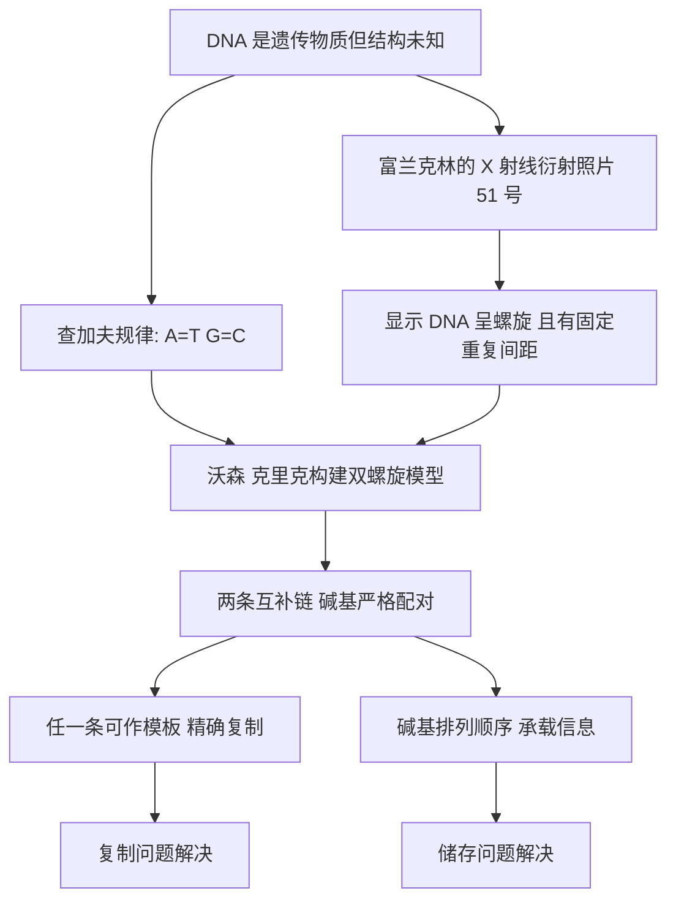

# 06｜双螺旋：一张 X 光照片如何揭开生命之谜？

> DNA 是遗传物质已被确认，但它的结构如何让它既能「储存信息」又能「复制自己」？

---

## 一、先说结论

上一篇，DNA 终于被指认为遗传物质。可这只是回答了「是谁」，还没回答「怎么做到的」。

一根单调的分子，凭什么既装得下海量信息，又能在细胞分裂时精确复制自己？

穆克吉在《基因传》里告诉我们：答案不在化学反应里，而在**结构**里。

线索来自两处。一处是化学家查加夫发现的规律：DNA 里四种碱基的含量总是**成对相等**——A 的量约等于 T，G 的量约等于 C。这像一条刻意留下的暗号，却没人知道它对应什么。

另一处，是罗莎琳德·富兰克林拍下的一张 X 射线衍射照片——后来被称为「照片 51 号」。它让 DNA 的螺旋轮廓第一次显形。

沃森和克里克把这两条线索拼在一起，提出了**双螺旋**模型：两条互相缠绕的长链，碱基两两配对，像一架旋转的梯子。

**结构本身，就是答案。** 但这个漂亮的答案背后，还压着一段并不光彩的争议。

---

## 二、我们先理解一个问题

先想清楚：遗传物质到底要完成两个任务，而且这两个任务看起来有点互相矛盾。

任务一，**储存信息**。信息必须能写下来、读出来，还要能容纳极大的变化——因为人和其他人的差异太多了。

任务二，**复制自己**。每次细胞分裂，这份信息都要被完整复制一份，而且几乎不能出错。

矛盾在哪里？

如果信息只是写成一长串符号，那复制它就需要「照着抄」。可抄写总有出错的风险，越长越容易错。有没有一种结构，能让复制变得**自动、精确、不容易走样**？

这就是关键问题。

后来的人们意识到：如果分子本身是一种**互补**的结构——这一半的内容，天然地决定了另一半的内容——那么复制就不需要「理解」，只需要「配对」。揭开一半，另照着配一半，一份就变成了两份。

就好比一副拼图：如果每块拼图的形状都唯一对应另一块，那么你只要留下其中一半，就能把另一半完整地拼回来。

DNA 的秘密，正藏在这种「两两对应」里。

---

## 三、作者到底提出了什么观点？

穆克吉讲述这段历史时，核心观点可以概括成一句：

> **在生物学里，有时候「结构即答案」——把一样东西的形状看清楚，它的功能就不用再猜了。**

DNA 的双螺旋结构，一次性回答了前面那两个任务：

- 两条链互相**互补配对**，所以任何一条都能作为模板，复制出另一条。复制因此变得既简单又精确。
- 碱基的**排列顺序**，可以像字母一样变化无穷，所以它能承载海量信息。

储存和复制，原本像两个难题，被一个结构同时解决了。

而穆克吉同时提醒我们：这个「漂亮的答案」并不是某一个人凭天才独立完成的。它集合了化学规律、X 射线晶体学的数据，以及许多人反复试错的成果。

更重要的是，他也没有回避这段历史的阴影：**富兰克林的贡献，曾长期被淡化。** 她是拍出关键照片的人，却在很长时间里只被当作「提供数据的助手」。

---

## 四、把这个观点翻译成人话

用一个最日常的东西来理解双螺旋：**拉链**。

一条拉链分成左右两排齿，每一对齿恰好能咬合。现在想象两件事。

第一，假设你把拉链从中间拉开，每一半都还完整保留着自己的齿。因为你清楚每一颗齿该配什么样的齿，你就可以照着这一半，重新配出一条对应的另一半。**这就是复制**——不需要记住整条拉链的样子，只需要遵守「配对规则」。

第二，拉链上每一对齿的「型号」可以不同。这一对是 A，那一对是 G，下一对是 T……型号的排列顺序，就是信息本身。**这就是储存**——同样的拉链长度，不同的齿序，就是不同的内容。

DNA 就是这样的拉链：两条链方向相反地缠绕成螺旋，中间的「齿」是碱基，而且配对规则非常严格——A 只配 T，G 只配 C。

正因为严格，复制才准；正因为有顺序，信息才多。**一个设计，同时干了两件大事。**

顺便说一句，A 配 T、G 配 C，正好解释了查加夫那个奇怪的规律：A 的总量自然等于 T，G 的总量自然等于 C。那个没人看懂的暗号，原来就是结构留下的指纹。

---

## 五、为什么会这样？

把「结构如何变成功能」画成一条链，就清楚了。

这条链里，有两个特别值得注意的地方。

一个是**数据的作用**。照片 51 号不是一张「图片」那么简单，它是一组精确的测量：它显示 DNA 具有螺旋结构，而且沿轴向有规律的重复间距。没有这些数字，模型就会像凭感觉搭积木，怎么搭都可能。

另一个是**模型的威力**。沃森和克里克并不是靠一次实验「看到」双螺旋，而是靠反复搭建、推翻、再搭建。他们用已知的化学规则去约束模型：碱基怎么配、链怎么绕、间距对不对。**当所有约束同时满足时，结构自己「站」了起来。**

这就是为什么人们说这是二十世纪生物学最漂亮的「结构即答案」。

---

## 六、举一个现实生活中的例子

想象两个同学合抄一份笔记。

如果只是各自埋头抄，抄到最后很可能对不上，谁也不知道错在哪。但如果他们约定一套规则：**我写 A 的地方，你就写 T；我写 G 的地方，你就写 C。** 那么无论谁先写完，另一个人都能「翻译」出完整的一份，而且几乎不会出错。

这就是互补配对的巧思：**它把「记忆」变成了「规则」。**

再想想钥匙和锁。钥匙能开锁，不是因为它「懂」锁的道理，而是因为它的齿形恰好和锁芯互补。两份互相校验的账本、互为备份的服务器，都是同一个思路：**当系统能够「自我校验」，它就不需要每次都依赖外部的聪明才智。**

DNA 就是这样一套能自我校验的系统。它不需要「知道」自己在复制什么，它只需要遵守配对规则。这让生命的延续变得极其稳定——稳定到可以跨越几十亿年。

---

## 七、回到书中重新理解

回到穆克吉，他为什么要把这段写得既有光彩又有阴影？

因为双螺旋是全书的关键转折：**从这一刻起，遗传学从「找物质」进入了「读机制」。** 前面所有的寻找——孟德尔的因子、染色体、艾弗里的 DNA——都在这一刻汇合。信息，终于有了一个可以画出来、可以讲解的物质形状。

但同时，他也想让我们看到科学真实的样子：它有合作，也有竞争；有天才的洞见，也有不对称的功劳分配。

富兰克林拍出了那张关键照片，却在很长时间里几乎没有被提及。她与同实验室的威尔金斯关系紧张，那张照片在未经她同意的情况下被展示给了沃森。后来她因病早逝，而诺贝尔奖只颁给在世者，于是她的名字被排除在聚光灯之外。

穆克吉写这些，不是在给历史下判决，而是在提醒：**「科学结论」和「科学故事」往往是两件事。** 结论属于证据，故事却常被胜利者书写。

---

## 八、这个观点背后还有什么？

这个观点背后，站着两股更大的潮流。

第一，是**物理学家的入场**。二十世纪中叶，一批原本研究物理的人转向生物学，他们带着一种信念：生命也许可以还原成分子层面的结构问题。这种「还原论」的勇气带来了双螺旋，也在后面引出了「基因决定一切」的危险想象。

第二，是**「模型」作为一种方法**。生物学家不再只是观察和描述，而是开始像工程师一样搭建模型、用约束去检验它。这个传统一直延续到今天的蛋白质结构预测和合成生物学。

---

## 九、这个观点有问题吗？

需要非常谨慎地说几句。

**第一，功劳争议远不是「谁对谁错」那么简单。** 富兰克林的贡献曾被严重淡化，这是事实；但把她简单塑造成「被偷走成果的受害者」，也会把复杂的科学史简化成道德剧。她和威尔金斯关系长期紧张；沃森和克里克也确实做了大量整合工作，并非只靠一张照片。承认偏见，不等于把所有人都变成反派。

**第二，「结构即答案」这个说法本身有被过度美化的风险。** 结构确实解释了复制和信息储存，但它没有解释「信息如何变成性状」——那是下一篇的主题。把它讲成「生命之谜就此解开」，是夸大。

**第三，科学发现的「英雄叙事」本身值得警惕。** 双螺旋建立在查加夫的规律、富兰克林的晶体学数据和鲍林等人的模型尝试之上。**没有一个人是孤岛**，而我们之所以只记住两个名字，很大程度上是传播的结果。

---

## 十、今天再看这个观点

（以下为现代延伸，非穆克吉原文）

双螺旋提出后不到十年，科学家就用实验证明了 DNA 是**半保留复制**：复制时，双链先打开，各自作为模板配出一条新链，所以每个「子代」DNA 里都保留了一半原来的链。这印证了结构所预言的方式。

但现代生物学也修正了当年的天真：DNA 并不是一份说一不二的「命运脚本」。同一段序列可能因为化学修饰而「被关掉」或「被打开」，这就是表观遗传学关注的领域。环境与经历，都能在 DNA 之上留下可读的标记。

所以，双螺旋回答的是一个极其重要的**底层机制**问题，但「生命如何运行」的故事，才刚刚翻开。

---

## 十一、这一篇真正应该记住什么？

1. **双螺旋是「结构即答案」的典范**：一个结构同时解决了信息储存与精确复制两个难题。

2. **查加夫规律是结构留下的指纹**：A=T、G=C 的成对相等，正是因为碱基两两互补配对。

3. **照片 51 号提供了关键测量数据**，让模型从猜测变成有约束的推理。

4. **互补配对把「记忆」变成了「规则」**，像拉链、像钥匙和锁，让复制既简单又精确。

5. **这段历史也提醒我们**：科学结论可靠，科学故事却可能不公平；富兰克林的贡献曾长期被淡化。

---

## 十二、留一个问题

现在我们知道，DNA 能储存信息，也能复制信息。

可是，一个安静躺在细胞核里的分子，究竟是怎么变成活生生的身体的？它凭什么决定你的眼睛颜色、你的身高，甚至你的性格倾向？

换句话说：**「写下来的信息」和「活出来的生命」之间，还缺一座桥。**

> **这座桥，是由什么搭起来的？**

下一篇，我们来看克里克的「中心法则」，以及那套被誉为「生命语言」的遗传密码：**DNA 究竟是如何指挥生命的？**
