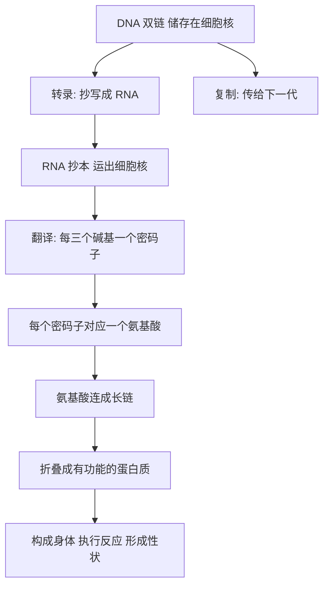

# 07｜DNA 如何指挥生命？——中心法则与遗传密码

> 一段静止的分子，如何变成活生生的身体与性格？

---

## 一、先说结论

双螺旋解决了 DNA「怎么存、怎么复制」的问题。但还有一个更大的疑问摆在那里：

**DNA 只是一段躺在细胞核里的分子，它凭什么变成眼睛的颜色、身高、血型，甚至性格倾向？**

穆克吉在《基因传》里讲了接下来这一步——二十世纪生物学最激动人心的破译过程。

克里克提出了后来被广泛称为「中心法则」的框架：**信息从 DNA 流向 RNA，再流向蛋白质。** DNA 是总图，RNA 是抄本，蛋白质是真正干活的执行者。

随后，科学家又破译了遗传密码：**三个碱基对应一个氨基酸**，64 个「密码子」拼出了生命里几乎所有的蛋白质。

至此，从「遗传因子」到「生命语言」的桥梁被打通了。基因不再是抽象的、玄乎的命运概念，而是一段**可以逐字阅读的指令**。

---

## 二、我们先理解一个问题

先把问题问准。

如果 DNA 是说明书，那它为什么不能直接用来「造人」，非要绕一道弯，先变成 RNA，再变成蛋白质？

关键原因有两个。

第一个是**位置**。对真核生物来说，DNA 待在细胞核里，而蛋白质是在细胞质里合成的。两者被核膜隔开：总图锁在保险柜里，车间在另一栋楼。

第二个是**保护**。DNA 是宝贵的原件，是能传给下一代的「母本」。如果每次都把它拖到车间里使用，磨损、出错的风险太大。**越重要的东西，越不能天天拿去用。**

所以细胞需要一个中间角色：它能把总图的某一段「抄」出来，带着抄本去车间干活，而原件安全地留在原地。这个中间角色，就是 RNA。它和 DNA 长得很像，但它是**一次性的抄本**：用完就销毁，不承担传承的任务。于是逻辑就顺了：**DNA 负责保管，RNA 负责跑腿，蛋白质负责干活。**

---

## 三、作者到底提出了什么观点？

穆克吉讲这一段时，核心观点可以概括成：

> **生命不是靠神秘的力量运行的，它靠的是一套可以被读写的「语言」。**

克里克的贡献，是把信息流动的方向说清楚。他提出的框架大体是这样：

- 信息可以从 DNA 流向 DNA（复制）；
- 可以从 DNA 流向 RNA（转录）；
- 可以从 RNA 流向蛋白质（翻译）；
- 但信息不会从蛋白质倒流回核酸。

换句话说，**蛋白质是信息的终点，不是起点。** 一旦信息变成了蛋白质，它就走到了这条路的尽头。

而接下来的问题更令人着迷：DNA 只有 4 种碱基，蛋白质却有 20 种氨基酸。4 种符号，怎么写出 20 种「字」？

科学家很快意识到，答案一定是**组合**：用几个碱基编一个「字」。两个碱基只能有 4×4=16 种组合，不够 20；三个碱基则有 4×4×4=64 种组合，绰绰有余。

实验证明了这一点：**每三个相邻的碱基构成一个密码子，对应一个氨基酸。** 64 个密码子里，有的负责「开始」，有的负责「结束」，其余的大多对应具体的氨基酸——而且不止一个密码子可以对应同一种氨基酸。

这就是「生命的语言」：**一本只有四个字母、却能写出万物的字典。**

---

## 四、把这个观点翻译成人话

想象一座巨大的图书馆。

馆里藏着一份独一无二、绝不出借的珍贵手稿，那就是 DNA。谁也不能把它带出去，因为一旦损毁，整个图书馆就完了。

可图书馆又必须让外面的工人照着它盖房子。怎么办？

办法是：**派一个抄写员进去，把手稿里需要的那一页抄一份出来。** 抄本可以带出去、可以复印、可以随便用，用完就扔。手稿本身始终完好无损。

这份「抄本」，就是 RNA；这个「抄写」的过程，叫转录。

抄本送到工地后，还需要有人把它翻译成工人的行动指令。工人看不懂手稿上的文字，但他认识另一种「语言」——蛋白质的语言。于是翻译发生了：**每三个字母一组，对应一个动作。**

这就像一本双语词典：左边是三个字母组成的密码词，右边对应一个氨基酸。工人一行一行往下读，氨基酸一个接一个接上，最后连成一条长链，折叠成能干活、能催化、能构成身体的蛋白质。

所以，从 DNA 到生命，其实是一次**跨语言的翻译**：核酸的语言，被翻译成蛋白质的语言。

---

## 五、为什么会这样？

把这条信息流画出来，会看得更清楚。

这条链上有几个特别漂亮的点。

第一，**方向是单向的**。信息从 DNA 出发，经过 RNA，落到蛋白质，然后停住。这让「遗传」和「日常运作」分了工：能传下去的只有核酸里的信息，身体后天锻炼出来的肌肉，不会因此写进基因里。

第二，**密码是三重编码的**。三碱基一组，从数学上刚好够覆盖 20 种氨基酸，这种「不多不少刚好够用」的巧思，让科学家在破译之前就猜到了答案的形状。**数学先给出了题目的轮廓，实验再填上细节。**

第三，**密码是简并的**。同一种氨基酸可以有多个密码子，像语言里的近义词，增加了容错空间——偶尔一个字母变了，结果可能还是同一个氨基酸。这是生命自带的「防错机制」。

---

## 六、举一个现实生活中的例子

想想一家跨国公司的运作。

总部（DNA）里锁着核心战略原稿，任何人不能随便带走。于是总部把其中某一章「转录」成一份内部邮件（RNA），发给执行部门。部门再把邮件「翻译」成具体的工作安排——谁做什么、按什么顺序做（蛋白质）。

有意思的是，公司里谁也不能靠「干活干得好」来改写总部的战略原稿。**你在车间里做出的成绩，不会自动变成战略文件的一部分。** 这就是「信息不回流」的现实版本。DNA 也是这样：它不「理解」自己在编码什么，只是按配对和查表运行。**它不需要聪明，它只需要精确。**

---

## 七、回到书中重新理解

回到穆克吉，这一段在全书里的位置非常关键。

前面几篇，我们一直在解决「基因是什么」。到了中心法则和遗传密码，答案终于完整：**基因是一段可读的指令。**

这句话的分量，怎么强调都不过分。

因为在此之后，「基因决定」这件事就变得具体而可怕了。如果基因只是神秘的力量，人还能对它保持敬畏和距离；可一旦它变成一段**可以逐字阅读、逐字比对**的文字，那么「你哪个字写错了」就成了一个可以被指出来的事实。

这既带来了医学的希望——可以查找错误、设计对策；也埋下了基因决定论的诱惑——似乎一个人的一切，都能从这段文字里读出来。

穆克吉贯穿全书的立场在这里已经隐隐成形：**读得懂，不等于读得全；读得全，更不等于能下判决。** 生命语言的破译，是理解的胜利，也是新一轮误解的起点。

---

## 八、这个观点背后还有什么？

这个观点背后，有一件极其震撼的事：**地球上几乎所有生命，共用同一套遗传密码。**

这意味着什么？它意味着，如果生命是各自独立「发明」的，那么它们用同一本字典的概率低到几乎不可能。最合理的解释是：**所有生命来自一个共同的祖先**，这套密码在极早的年代就被固定下来，然后被所有后代继承。

中心法则和遗传密码，因此不只是一套机制，它还是**「万物同源」最有力的分子证据之一**。

另一层含义更微妙：如果生命是一套可读写的语言，那它原则上就可以被**编辑**。这条线索，会在后面的 CRISPR 那里达到高潮。

---

## 九、这个观点有问题吗？

有，而且需要认真对待。

**第一，「中心法则」这个词本身容易被误读。** 它听起来像不可违抗的教条，但克里克当年的表述更谨慎：他谈的是信息流动的方向性，而不是「绝对禁止任何反向路径」。后来发现的逆转录现象（RNA 可以反向合成 DNA）常被误传为「中心法则被推翻」——严格说，它挑战的只是通俗简化版，而非最核心的命题：蛋白质序列不会反过来决定核酸序列。

**第二，密码并没那么「一一对应」。** 一个氨基酸对应多个密码子，而且基因到性状的关系远不是「一个基因一个性状」。同一段基因经过不同的剪接，可以造出不同的蛋白质；环境也会影响它是否被表达。**从「读出一个基因」到「预测一个性状」，中间隔着大量尚未讲清的环节。**

**第三，也存在一些特殊的例外。** 比如朊病毒那样的「传染性蛋白质」，靠改变蛋白质折叠来传播信息，像是对「蛋白质不能携带可遗传信息」的反例。所以更准确的说法是：**中心法则描述的是主流路径，而不是自然界的全部可能。**

---

## 十、今天再看这个观点

（以下为现代延伸，非穆克吉原文）

中心法则和遗传密码，今天已经渗透进我们生活的每个角落。

mRNA 疫苗就是一个直接应用：它不注射病毒，而是把一段设计好的 RNA 抄本送进细胞，让细胞照着它造出目标蛋白质，训练免疫系统。这等于把人体的「翻译车间」当作生产平台。

而现代研究还告诉我们，当初那幅简图只是主干道：细胞里还有大量不编码蛋白质的 RNA 在调控开关，同一段 DNA 也会因为化学修饰而沉默或启动，「读」一个基因的方式会随环境而变。

所以更完整的图景可能是：**DNA 是一份底稿，但生命的成品，是在无数开关、抄写方式和翻译选择中动态生成的。** 底稿很重要，却不是全部。

---

## 十一、这一篇真正应该记住什么？

1. **中心法则描述了信息的方向**：DNA 到 RNA 到蛋白质，蛋白质是终点而非起点。

2. **RNA 是抄本，不是原件**：它负责跑腿和干活，DNA 则被保护在细胞核里传承下去。

3. **遗传密码是三重编码**：三个碱基一个密码子，64 个组合覆盖 20 种氨基酸，数学上刚好够用。

4. **密码的简并性是容错机制**，让生命对偶尔的字母错误有一定缓冲。

5. **同一套密码通行于几乎所有生命**，这是所有生物同源的最有力证据之一。

---

## 十二、留一个问题

到这里，我们已经知道：基因是一段用四个字母写成的指令，每三个字母对应一个动作，精确、可读、又能自我复制。

可正因为如此，一个令人不安的想法出现了。

如果生命是一段文字，那么**只要写错一个字母**——不是整段丢失，不是大段错乱，只是**一个字母**——会怎样？

听起来不过是笔误而已。可现实是，有些这样的「笔误」，会改变一个人的一生。

> **一个字母的错误，为什么能有这么大的力量？**

下一篇，我们就来看看镰刀型细胞贫血这些单基因病：**当 DNA 上错了一个字母，生命会发生什么？**
