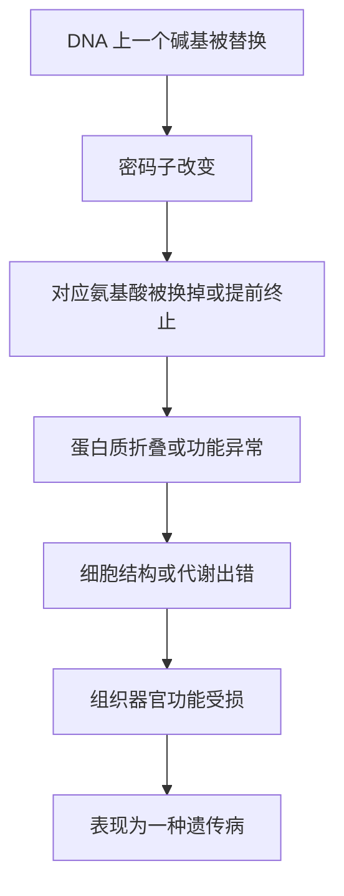

# 08｜一个字母的错误，为什么会改变一生？——单基因病

> 如果生命是一本只用四个字母写成的书，那么抄错一个字母，究竟会带来什么后果？

---

## 一、先说结论

基因不是一团模糊的「血脉」，而是一段可以被逐字阅读的指令。

这一篇要处理的，正是指令出错之后的后果。

穆克吉给出的结论有两层，而且方向相反。

第一层：**生命的信息系统极其精确，也极其脆弱。** 一个碱基的改变——注意，是「一个字母」——就足以让一种蛋白质报废，让一个人从出生起走上完全不同的人生轨迹。镰刀型细胞贫血、囊性纤维化、亨廷顿病，本质上都是这样的小小错误。

第二层，也是更容易被忽略的一层：**能用单个基因清楚解释的疾病，其实是少数。** 大多数我们熟悉的「性状」——身高、血压、性格、常见病的风险——都不是一个字母能讲完的故事。

一句话：单基因病让我们看清了基因的威力，也划出了这种威力的边界。

---

## 二、我们先理解一个问题

先想象一本说明书。

这本书很薄，只有四个字母：A、T、G、C。它用三个字母拼成一个词，比如 `ATG`、`GAG`、`TGA`，每个词对应一个氨基酸；一串词连起来，就是一个蛋白质；许多蛋白质协同工作，就是一个活人。

这就是中心法则给我们的比喻：DNA 是蓝图，RNA 是抄本，蛋白质是执行者。

现在问题来了：假设这本书里有三十亿个字母，抄写员在某一页抄错了一个字母，会发生什么？

直觉上我们会说：三十亿里错一个，概率那么小，应该没事。

但真实答案是：**有时候没事，有时候天翻地覆，取决于错在哪一行。**

这就引出了真正的问题：

> **为什么一个几乎可以忽略的错误，有时会决定一个人的一生？**

---

## 三、作者到底提出了什么观点？

穆克吉想说的，可以概括成这样一句：

> **遗传信息是离散的、可逐字阅读的代码，而不是模糊的、可以被稀释的「血」。**

这个观点有两面。

一面是好消息：因为信息是离散的，所以我们能精确地指出「错在哪里」——不是笼统地怪「血统不好」，而是能定位到某个基因、某个位置、某个字母。

另一面是坏消息：同样因为信息是离散的，**一个字母的错误不会被平均掉，也不会被稀释掉。** 它会原样传下去，原样执行，造成原样的后果。

穆克吉在梳理这些疾病时反复强调的，是这种「精确」与「脆弱」的并存：**系统越精密，单点故障的代价就越大。**

同时他也提醒读者不要被这几个漂亮的例子带偏：镰刀型贫血、囊性纤维化、亨廷顿病之所以成为教科书案例，恰恰因为它们**罕见地简单**。它们是遗传学里的「理想实验室」，而不是生命的常态。

---

## 四、把这个观点翻译成人话

我们用一个更日常的比喻。

假设你要给朋友指路，写的是门牌号：「中山路 123 号」。

如果你把 3 写成 8，变成「中山路 128 号」——这个错误不大，但朋友会敲到别人家去。地址仍然是一个有效的地址，只是住的人不对。

基因的错误就是这样。它不是把一杯浓咖啡兑淡，而是**把一个字换成了另一个字**。翻译机器照样往下读，读到那个错词时，装上的就是一个错误的零件——结果不是「少了一点」，而是「多装了一个具体的东西」。

这就是为什么「一个碱基」听起来微不足道，实际却可能致命。

---

## 五、为什么会这样？

把链条拆开看，就清楚了。

现在看三个真实的例子，它们的「错误级别」各不相同。

**镰刀型细胞贫血**：血红蛋白 β 链基因上，一个 GAG 变成了 GTG，第六位的谷氨酸被换成了缬氨酸。就这一个氨基酸的差别，让血红蛋白在缺氧时互相粘连、拉成镰刀状，红细胞变硬、堵塞血管。这是最典型的「一个字母」——字面意义上的单碱基替换。

**囊性纤维化**：最常见的突变叫 ΔF508，是 CFTR 基因上少了三个碱基，导致蛋白质第 508 位缺了一个苯丙氨酸。蛋白质折叠失败，黏液异常黏稠，阻塞肺部和胰腺。

**亨廷顿病**：问题不在错字，而在「重复」。HTT 基因里有一段 CAG 重复，正常人重复十几次到三十几次，患者超出阈值，且重复越多、发病往往越早——于是有些家族里，病情一代比一代更早、更重。

三种错误，一个共同的教训：**错误的「大小」和后果的「严重程度」没有必然的比例关系。** 关键不在错多少，而在错在哪。

---

## 六、举一个现实生活中的例子

有一个现象特别能说明基因的「环境依赖性」：镰刀型贫血与疟疾。

携带一份突变（杂合子）的人，通常不发病，却对疟疾有更强的抵抗力；携带两份突变（纯合子）的人，才会得严重的镰刀型贫血。

这意味着一件事：**同一个基因变体，在疟疾流行区是「有利的」，在非流行区是「有害的」。** 它既解释了为什么这个突变在非洲、地中海、中东等疟疾高发地区如此常见，也解释了为什么它没有被自然选择清除掉。

这给我们一个很重要的提醒：**没有脱离环境的「好基因」和「坏基因」。** 基因的好坏，是相对于它所处的环境而言的。

---

## 七、回到书中重新理解

现在再回头理解穆克吉为什么要花这么多篇幅讲这几种病。

他要建立的，是一个非常具体、非常「可操作」的基因观：**基因是信息，是可以定位、可以核对、可以修改的一段文本。**

这个观念的意义远超疾病本身。它意味着：我们不再需要用「命」「风水」「血统」来解释家族里的病——我们可以找到那个字母。这种「可定位性」，是现代遗传学给患者家庭最大的礼物，也是后面基因检测、基因治疗得以成立的前提。

但与此同时，穆克吉也埋下了一个反向的伏笔。他没有让读者停留在「原来基因如此强大」的震撼里，而是立刻补充：**这些例子是例外，不是通例。**

如果把单基因病的经验直接搬到智力、性格、种族、精神疾病上去，就会犯下一个古老的错误：**用解释特例的框架，去解释整个复杂的现实。** 而这正是后来优生学灾难的认知根源。

---

## 八、这个观点背后还有什么？

「一个字母的错误可以改变一生」背后，藏着一个更让人不安的推论：

**既然一个字母能致病，那么一个字母也应该能治病。**

这正是基因治疗的全部希望所在。它也是穆克吉反复回到的主题：知识一旦精确到「字母」这一级，人类就从「顺应命运」走到了「改写文本」的门口。

这几章也顺带解释了「基因决定论为什么有诱惑力」——它给出了一个干净的解释：一个病因、一个字母、一个结局。干净的解释让人安心，也让人上瘾。**可世界不总是这么干净：单基因病之所以被反复讲述，恰恰因为它们是干净的少数。**

---

## 九、这个观点有问题吗？

有，而且很重要。至少有三点需要澄清。

第一，「单基因 vs 多基因」的界线，比名字听起来模糊得多。同一个基因，可以既导致一种「单基因病」，又影响其他常见性状。所谓「单基因病」，通常指「主要决定因素是单一基因」，而不是「唯一影响因素」。

第二，即便是这些教科书案例，也远不是「一个字母等于一个结局」。亨廷顿病的重复数能预测大致的发病年龄，却不能精确到某个人什么时候发病；镰刀型贫血的严重程度高度因人而异；囊性纤维化的病程也受其他修饰基因和环境的影响。这在遗传学里叫**外显率**与**表现度**的差异。

第三，「携带突变就一定会发病」也常常是错的。有些突变携带者终身无症状；有些突变的效应高度依赖环境。

所以准确的说法是：**单基因病是一把钥匙，但不是万能钥匙。**

---

## 十、今天再看这个观点

（以下为现代延伸，非穆克吉原文）

近几年，单基因病领域出现了穆克吉写作时还无法完全预料的变化。

**一是筛查。** 新生儿足跟血筛查已在很多地区把镰刀型贫血、苯丙酮尿症等纳入常规，做到「出生即知道、尽早干预」。苯丙酮尿症尤其典型：只要早期发现并控制饮食，一个原本可能严重智力障碍的孩子，几乎可以和同龄人无异。

**二是治疗。** 2023 年底，针对镰刀型贫血的基因疗法相继获批，思路正是「修正错误的字母」。但也要看到：这些疗法极其昂贵，且本身带有风险。**「可以改」不等于「人人都改得起、都该改」。**

---

## 十一、这一篇真正应该记住什么？

1. **基因是逐字阅读的指令，不是可以被稀释的「血」。** 这就是为什么一个字母的错误无法被平均掉。

2. **错误的大小和后果的严重程度不成比例。** 一个碱基替换可以改变一生，也可能毫无影响，关键在错在哪。

3. **单基因病是罕见而干净的案例。** 它们是理解基因的工具，不是生命的常态。

4. **基因没有脱离环境的「好坏」。** 镰刀型突变与疟疾的关系，是最好的例子。

5. **「能由一个字母解释」也意味着「可能由一个字母修复」——这是希望，也是新的伦理难题。**

---

## 十二、留一个问题

我们已经看到，一个错误的字母可以带来确定的后果。但很多家庭遇到的，是另一种更令人困惑的情形：

一家人都好好的，孩子却得了一种罕见的遗传病；再往上查，祖辈、曾祖辈都没有这种病。

人们会说：这病「跳了一代」，甚至「跳了两代」。

那么问题来了：

> **一个基因既然存在，为什么可以藏起来不出声，隔了一代、两代才重新出现？**

下一篇，我们就来看这件事到底是怎么发生的：**为什么有些遗传病会神秘地「跳过一代」？**
