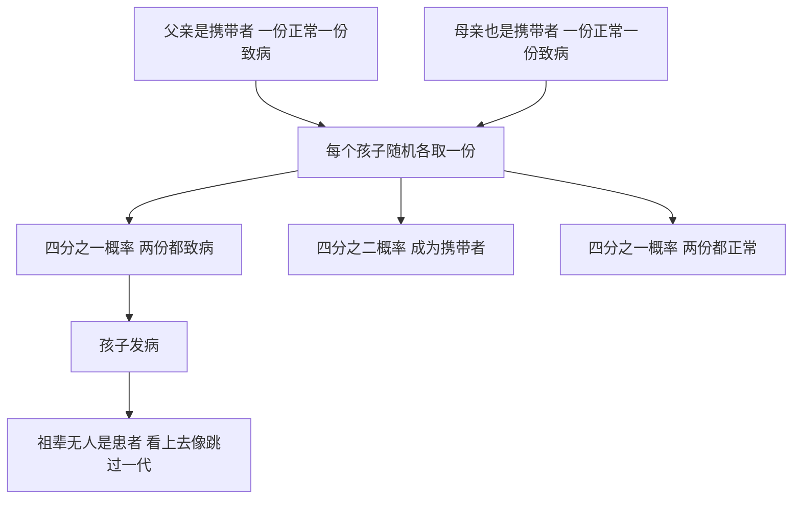

# 09｜遗传病为什么有时会「跳过一代」？

> 一种病，祖辈没有、父辈没有，却出现在孩子身上——它真的「跳过一代」了吗？

---

## 一、先说结论

家族里最常见的困惑之一：明明一家人都好好的，某个孩子却得了遗传病。往上追查，父母没病，祖父母也没病，于是大家得出结论——这病「隔代遗传」，甚至「跳了两代」。

穆克吉要告诉我们的是：**「跳过一代」不是命运在开玩笑，而是概率规律在运作。**

关键在两个词：**显性**与**隐性**；以及由此衍生出的各种**遗传模式**——常染色体显性、常染色体隐性、X 染色体连锁，等等。

隐性致病的基因可以「潜伏」在健康人身上好几代，只有在父母双方恰好都携带、并且都把那份拷贝传给孩子时，它才会显现。显性基因则往往代代可见，不会凭空消失。

理解这件事的意义，远超解释一个家族现象：它是我们从「遗传是命」走向「遗传是可计算的概率」的关键一步——**把「为什么是我们」换成「有多大概率」。**

---

## 二、我们先理解一个问题

先一起做一道家族推理题。

假设有一对年轻父母，双方家庭往上数两三代都没听说过谁得过某种罕见的代谢病，可孩子出生后却被诊断出这种病。直觉上有几种解释：基因突变了？还是这病真的「跳过一代」，藏了很久？

要回答它，得先接受一个反直觉的前提：**每个人身上都有两份基因拷贝，一份来自父亲，一份来自母亲。** 如果一份正常、一份致病，这个人可能完全看不出来——他是一个「携带者」。

现在问题就变成了：

> **如果一份致病拷贝可以被一份正常拷贝「盖住」，那它藏在谁身上、藏了几代、又什么时候会重新出现？**

---

## 三、作者到底提出了什么观点？

穆克吉在讲遗传模式时，反复想纠正一个流行观念：人们习惯把遗传想成「血的混合」，于是把显性、隐性理解成「强」和「弱」。

他的观点是：**显性和隐性，描述的不是基因的强弱，而是它在个体身上「会不会被表现出来」。**

- **显性**：只要有一份拷贝，性状或疾病就会表现出来，很难被「藏住」。
- **隐性**：需要两份拷贝同时存在才会表现出来；只有一份时，人通常健康，却是携带者。

于是「跳过一代」有了一种自然的解释：**它不是病在跳跃，而是携带者在沉默。** 我们看到的是「没有病人」，看不见的是「有携带者」。

穆克吉还强调：**遗传模式提供概率，不提供保证**——两个携带者每次生育，孩子患病概率是四分之一，既不是「一定会」，也不是「一定不会」。

---

## 四、把这个观点翻译成人话

用「两份文件」来比喻。

每个人手里都有两套指令：一套来自父亲，一套来自母亲。有些指令「只要有一套是坏的，事情就出问题」；有些则要求「两套都坏，才会出问题」。

前者是显性，它藏不住，只要传下去下一代就有很大概率看得见。后者是隐性，它藏得住：一套好指令足以让生活照常运转，坏的那一套可以安静地待在家族里很多代。

所以「跳过一代」的真相是：**不是坏指令跳过了谁，而是那几代人恰好都拿着「一坏一好」的组合，活得好好的。** 直到一位携带者遇上另一位携带者，两份坏指令凑到同一个孩子身上，病才第一次现身。它其实一步都没跳，它一直在。

---

## 五、为什么会这样？

把概率画出来，一切就清楚了。

这就是最经典的**常染色体隐性遗传**：每次生育，孩子有 25% 的概率患病、50% 成为携带者、25% 完全正常。三个数字加起来是 1，但落到某个具体的孩子身上，仍然不确定。

另外两种模式则能解释「为什么有些病代代相传」。

**常染色体显性遗传**：一份致病拷贝就会发病，于是父母之一患病时，每个孩子有 50% 的概率患病；它通常不会「消失」，而是每一代都出现——亨廷顿病就是典型。

**X 染色体连锁遗传**：致病基因在 X 染色体上。男性只有一条 X，一旦携带就会发病；女性有两条 X，通常是携带者而不发病。于是常见的情形是：**母亲健康，但她生下的儿子有一半概率患病**——血友病、红绿色盲都属于这一类。

还有两种情况也会伪装成「跳过一代」：**新发突变**——父母都没带，孩子身上第一次出现；**发病晚**——携带者其实已发病，只是死亡早于症状出现，家族记忆里自然就「没有病人」。

---

## 六、举一个现实生活中的例子

X 染色体连锁遗传给出了一个既著名又残酷的样本：欧洲王室的血友病。

英国维多利亚女王本人健康，却是一名携带者；这个基因通过她的子女与联姻进入欧洲多国王室。最广为人知的是俄国沙皇尼古拉二世的独子阿列克谢——一点磕碰都可能造成严重出血。

把它讲成「王室诅咒」就是迷信；按遗传模式去读，它立刻可以预测：**携带者母亲所生的儿子，各有一半概率患病；女儿各有一半概率成为携带者。**

同样的逻辑也解释了另一类现象：某些隐性病在特定地区格外常见，可能与**奠基者效应**有关——某个小群体里恰好有人携带，随着繁衍被放大。**那不是那里的人「基因差」，而是历史把概率推高了。**

---

## 七、回到书中重新理解

现在回头看穆克吉的个人焦虑，就多了一层意味。

他从小担心叔叔们的「疯狂」会不会传给自己。而这些遗传模式恰好给了他一部分答案：**疾病是否会显现，取决于它在遗传上属于哪一类**——显性还是隐性，在哪条染色体上，需要几份拷贝。有些恐惧，是可以被拆解成概率的。

这也是《基因传》的一个转折点：遗传从前面的「谜」与「命」，第一次变成一套**可计算、可推理的规则**。

**把「为什么是我家」换成「有多大概率」，人就从无力感里走出来了一步。**

---

## 八、这个观点背后还有什么？

「跳过一代」背后，还藏着一个更深的事实：**大多数人都以为自己「干净」，其实每个人身上都潜伏着若干隐性致病变异。**

从群体遗传学看，携带者不是例外，而是常态：你我都可能携带几种隐性致病拷贝，只是恰好没遇到「同款」伴侣，于是它们永远不显现。

这带来两个后果。它让人**谦卑**：所谓「健康人」并非没有致病基因，只是没有凑齐两份。它也带来**歧视**：一旦「携带者」被社会看见，就可能被污名化——优生学正是从这里下手的，把「携带」偷换成「有病」，把概率偷换成判决。**一个可计算的概率，很容易被讲成一句不可改变的诅咒。**

---

## 九、这个观点有问题吗？

有几点必须说清楚，否则「显性隐性」会被误用。

第一，「显性／隐性」描述的是**性状层面的表现**，不是分子层面的真相。在分子水平上，许多基因的两种版本同时起作用（共显性或不完全显性）。

第二，孟德尔的简洁比例主要适用于**单基因性状**。高血压、糖尿病、精神疾病这类多基因疾病，「25%」「50%」根本不适用，它们的风险是连续分布、层层叠加的。

第三，即便在单基因病里也有**外显率**问题：携带显性致病基因不等于百分百发病，发病年龄和严重程度也因人而异。把「显性即必发」当定律，是另一种过度简化。

第四，概率是**对群体、对每一次生育**说的，不是对某个人说的。连生三个健康孩子不意味着第四个一定健康；生了一个患儿也不代表下一个有问题。

所以重点在「概率」，而不是「可计算」。**能算，不等于能算准每一个人。**

---

## 十、今天再看这个观点

（以下为现代延伸，非穆克吉原文）

今天，这些知识已被工程化成一系列具体的技术与制度。

**携带者筛查**越来越普及：一次抽血就能评估数百种隐性遗传病的携带情况，把「等孩子出生才知道」变成「提前知道」，也让「两位携带者相遇」的概率第一次可以被主动管理。胚胎基因检测则让一些家庭能够在胚胎阶段选择不携带两份致病拷贝的孩子。

但新问题随之而来。**筛查会把「携带」这个原本中性的状态，变成一份可能带来焦虑、甚至影响婚姻与保险的文件**：信息该由谁掌握、会不会被滥用？

更重要的是，我们开始在没有生病时追问未来——这既是进步，也意味着要学会与「已知的风险」长期共处。

---

## 十一、这一篇真正应该记住什么？

1. **「跳过一代」不是神秘现象，而是携带者在沉默。** 病从来没有跳，只是一直没被表现出来。

2. **显性与隐性，说的不是强弱，而是会不会被表现出来。** 一份拷贝就显现的是显性，两份才显现的是隐性。

3. **遗传模式给出的是概率，不是保证。** 25%、50% 都是每次生育的独立概率。

4. **携带者是常态，不是例外。** 每个人都可能携带若干隐性致病变异而不自知。

5. **能计算概率，不等于能预言个人命运。** 这正是遗传学让人谦卑的地方。

---

## 十二、留一个问题

到这里，我们讨论的都是有清楚模式的遗传病：一个基因、明确的显隐性、可以画进家族图谱、可以算出比例。

可有另一类病，完全不服从这套规则：它们也会在家族里聚集，却画不出干净的 25% 或 50%，也找不到「罪魁祸首」的基因。精神病就是最典型、也最令人不安的一种。

那么问题来了：

> **如果一种病确实在家族里聚集，却找不到「那个基因」，它到底算不算遗传病？**

下一篇，我们就走进穆克吉最私人、也最沉重的一段：《疯狂是否写在基因里？——穆克吉的家族之谜》。
