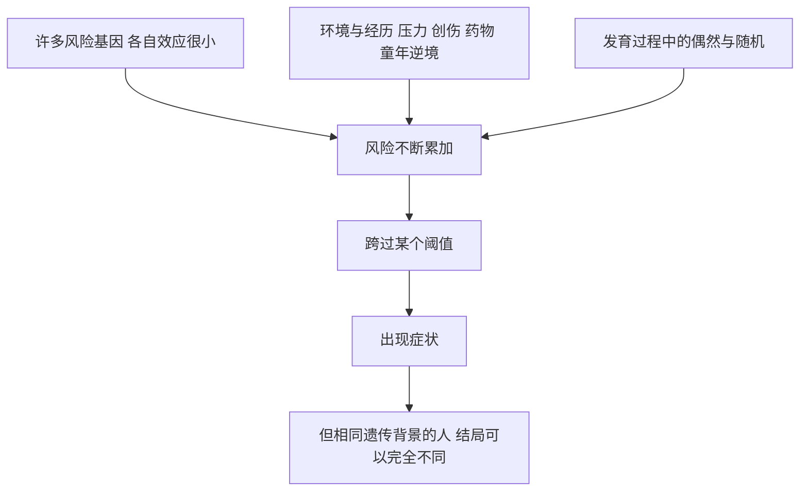

# 10｜疯狂是否写在基因里？——穆克吉的家族之谜

> 他的两个叔叔都在精神疾病中沉没，他从小最恐惧的问题是：这会不会也写在我身上？

---

## 一、先说结论

这是全书最私人、也最沉重的一章。

穆克吉的家族里，两个叔叔都患有严重的精神疾病：一个长期流浪，一个反复自伤。于是他从童年起就活在一个具体而冰冷的恐惧里——**这会不会遗传给我？会不会传给我的孩子？**

围绕这个问题，书中梳理了一条很长的研究史：家族研究、双生子研究、领养研究，一直到今天仍未结束的基因搜寻。

结论既让人不安，也让人清醒：**精神疾病有显著的遗传成分，但没有任何一个「疯狂基因」。** 它更像是众多基因、环境、成长经历与偶然共同作用的结果——基因给了概率，却不能决定结局。

---

## 二、我们先理解一个问题

假设一个家族里，除了两位长辈患病，还有一个表亲也曾住进精神科。旁人的第一反应往往是：「他们家有问题。」

但这个反应跳过了几个关键问题。**「在家族里聚集」就等于「遗传」吗？** 一家人不仅共享基因，还共享贫穷、冲突、创伤与生活方式。**如果它不是遗传的，为什么这种病在家族里的聚集又明显高于随机分布？** 而**如果它是遗传的，为什么同一对父母的孩子，有的发病、有的安然无事？**

于是真正的问题浮出来了：

> **一种在家族里聚集、却又找不到单一病因的病，我们凭什么说它「有遗传成分」？**

---

## 三、作者到底提出了什么观点？

穆克吉在这一章里表达的，大致是这样一个立场：

> **精神疾病具有真实、可测量的遗传风险，但它不是由某一个基因决定的；它属于「多基因 + 环境」的复杂性状。**

拆开来看，包含三层意思。

第一，**遗传成分是真实的。** 这不是印象，而是多类研究反复支持的结果：患者亲属的风险明显升高，同卵双生的「同病率」远高于异卵双生，领养研究则进一步把「遗传」和「成长环境」分开。

第二，**它又是高度多基因的。** 不存在一个「精神分裂症基因」，大规模研究找到的是许多个位点，每一个的效应都极其微小。

第三，**因此它不能成为判决。** 风险是概率，不是命运：同一个基因背景下，不同的人可以有完全不同的结局。

---

## 四、把这个观点翻译成人话

可以用一个比喻来理解，但要小心别把它讲成一句安慰。

基因决定的不是「明天一定下雨」，而是**这座城市的降水概率**：它告诉你这地方容易下雨，却说不准哪一天下、下多大、你会不会被淋。

两者都指向同一件事：**遗传提供的是倾向，不是结局。**

还有一个反过来的提醒：**概率高不等于一定发生，概率低也不等于安全。** 很多人以为「多基因」意味着「风险小到可以忽略」，这是另一种误读。多个微小的效应叠加起来，可以形成相当可观的风险——这正是它在家族里聚集的原因。

---

## 五、为什么会这样？

把风险的形成过程画出来，就清楚多了。

这个模型有几个关键含义。

第一，**风险是连续的，不是「有」或「没有」。** 人群里的遗传倾向像身高一样分布，所谓「患病」，往往是某些人在环境推动下跨过了那条并不清晰的界线。

第二，**没有单一的开关，因此也没有单一的「解药」**——这解释了为什么寻找「精神分裂症基因」的努力一次次落空。

第三，**环境不是可有可无的点缀。** 同卵双胞胎基因几乎相同，若一人发病而另一人没有，就说明「基因之外的东西」起了作用。

---

## 六、举一个现实生活中的例子

最能说明问题的人间证据，是同卵双胞胎的「不一致」。

同卵双胞胎的基因几乎一模一样。如果精神分裂症完全由基因决定，那么一人患病，另一人几乎必然也患病。但研究反复显示，同卵双胞胎的同病率大约在四成到五成之间——**远高于一般人群，却远低于百分之百。**

这个数字很值得琢磨：它一方面证明遗传成分确实存在，另一方面又证明基因绝不是全部。那剩下的一半是什么？研究指向出生并发症、孕期感染、童年逆境、精神活性物质，以及大量尚未被完全理解的随机因素。

还有一个特殊例子：某些染色体片段缺失（例如 22 号染色体上的一小段缺失）会明显提高患病风险。但即便是这样明确的遗传改变，也不是每个携带者都会发病——**它抬高的是概率，不是命运。**

顺带要说，「遗传」不能被读成「父母有错」。20 世纪中期曾流行一种把病因推给母亲的理论，给无数家庭造成二次伤害，后来被证明缺乏依据。**这本身就是科学自我纠错的例子。**

---

## 七、回到书中重新理解

现在再回到穆克吉的家族，这一章的重量就显现出来了。

他小时候的恐惧，本质上是一个**没有答案的问题**：我会不会病？而这一章告诉他——**这个问题在原则上就不可能被回答成「会」或「不会」。** 他能得到的是概率，而不是判决。恰恰是「概率」这个概念，构成了他在全书中最想坚持的立场：**基因是真实的力量，但不是可以替人做决定的命运。**

这也解释了为什么这一章写得如此克制：他没有说「所以我放心了」，也没有说「所以我绝望了」，而是展示了一种更难的姿态——**带着不确定继续生活。** 这正是《基因传》从科学史走向伦理学的地方。

---

## 八、这个观点背后还有什么？

「没有疯狂基因」这个结论背后，有两层更深的含义。

第一层，是**对人性的重新描述**。如果精神疾病不是某个开关被按下，而是许多微小因素在时间里逐渐累积，那么「正常」与「异常」之间就不是一道墙，而是一片连续的坡地——精神疾病不是「另一种人」的事。

第二层，是**对「基因决定论」的又一次拆解**。单基因病是罕见而干净的例外，精神疾病则更接近生命的常态：多因、多果、概率化。穆克吉正是在这里，把「基因决定我们是谁」这一诱惑再往后退了一格。

还有一点值得记住：**正因为它是概率，干预才有意义。** 如果一切都写死，帮助就无从谈起；概率恰恰意味着，环境、支持、早期识别和治疗可以真正改变轨迹。

---

## 九、这个观点有问题吗？

有几个争议与限制，必须诚实指出。

第一，**「遗传成分」的量化本身有争议。** 同卵双胞胎同病率常被换算成「遗传率」，但遗传率是群体统计量，不是「某个人百分之多少由基因决定」。把它当成个人成分比例，是最常见的误读。

第二，**双生子研究依赖理想化假设**，比如「同卵与异卵双胞胎的成长环境同样相似」。这个假设未必成立，估计值因此存在误差。

第三，**基因研究的可重复性曾是重灾区。** 早期许多「找到了致病基因」的结论在大样本重复研究中纷纷失效，提示我们对小样本、低效应的结论要格外谨慎。

第四，**「多基因 + 环境」有时会变成一句含糊的套话**，既解释一切，也等于没解释。真正有意义的追问是：哪些基因、哪些环境、在什么时间点相互作用——答案至今很不完整。

最后，**诊断本身也在变化。** 精神分裂症、躁郁症这些分类主要来自症状归纳，而非生物标志物。分类不牢靠，病因研究就更难定位。

---

## 十、今天再看这个观点

（以下为现代延伸，非穆克吉原文）

近年来，精神疾病遗传学积累了不少新东西，但基本图景与穆克吉的叙述一致：**很多基因、效应很小、加起来可观、环境始终在场。**

**多基因风险评分**把成千上万个微小位点汇总成一个分数，用于估计患病风险。它用于个人预测时仍相当粗糙：同分数的人结局可以差别很大，不同祖源人群之间的适用性也有问题——更像一把粗略的尺，而不是一支判决的笔。相对而言，**药物基因组学**的效用更具体，也更容易验证。

在社会层面，真正可能改变轨迹的往往不是基因技术，而是**减少污名、早期识别、可负担的治疗与心理支持**。如果一个孩子因为家族史而从小被告知「你注定会疯」，那份恐惧本身就会造成伤害。

所以今天再读这一章，结论可以说得更清楚：**基因给了概率，而如何对待一个「概率高」的人，是社会必须回答的问题。**

---

## 十一、这一篇真正应该记住什么？

1. **精神疾病有真实的遗传成分，但没有「疯狂基因」。** 它是多基因与环境共同作用的结果。

2. **家族聚集不等于纯粹遗传。** 一家人在共享基因的同时，也共享环境、经历与命运。

3. **遗传给出的是概率，不是判决。** 同卵双胞胎同病率远高于常人，却远不到百分之百，这就是最好的证明。

4. **「遗传率」是群体统计量，不是个人成分表。** 误读它会制造宿命论。

5. **正因为它是概率，干预才有意义。** 减少污名与提供支持，本身就是在改变结局。

---

## 十二、留一个问题

我们一路讨论到这里，始终围绕着一对更根本的对立。精神疾病是「多基因 + 环境」，镰刀型贫血是「一个字母」，两者看起来天差地别；但把问题拉远一点，它们其实在回答同一件事的两个侧面：

> **一个人之所以成为今天的自己，究竟有多少是「天生」，有多少是「养成」？**

这不仅是遗传学的问题，也是每个人都忍不住要问的——关于智力、性格、身高、疾病，甚至命运。

下一篇，我们就来正面处理这桩持续了一百年的争论：《基因决定我们是谁吗？——先天与后天的百年之争》。
