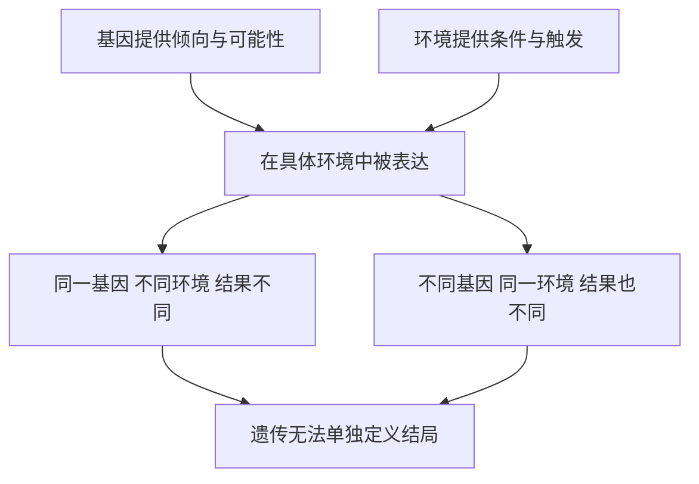

# 11｜基因决定我们是谁吗？——先天与后天的百年之争

> 一个人的智力、性格、疾病与命运，究竟有多少是「天生」，多少是「养成」？

---

## 一、先说结论

这是贯穿《基因传》全书的中心张力，也是人类最古老、最纠缠的问题之一。

穆克吉的立场相当明确，而且两头都不站：**基因不是命运，但也不是可以忽略的选项。**

遗传提供倾向与可能性，环境决定这些倾向是否被表达。智力、身高、疾病风险都是高度「多基因 + 环境」的性状——既不是写死的，也不是白纸。

因此两种极端都会被现实证伪：**纯粹的决定论**和**纯粹的环境论**（人是一张任人涂写的白纸）。真正值得问的不是「谁更重要」，而是：**在多大程度上可以被影响，以及在什么条件下影响。**

---

## 二、我们先理解一个问题

假设一对同卵双胞胎，基因几乎完全相同，却从出生起被两个家庭分别抚养：一个在资源充足、鼓励表达的环境里长大，一个在贫困、动荡的环境里长大。

几十年后再看，他们会一样吗？很多方面仍然相像——长相、身高、某些气质；但也一定会不同——说话方式、兴趣、人生轨迹。

于是问题来了：

> **如果基因相同而人生不同，那不同的部分从哪里来？如果环境不同却仍然相像，那相像的部分又从哪里来？**

这正是「先天与后天」之争的起点：它要求我们同时承认两件事都在起作用，而人偏偏喜欢一个简单的答案。

---

## 三、作者到底提出了什么观点？

穆克吉在这一主题上的立场，可以概括为四句话。

第一，**基因给的是倾向，不是指令。** 它更像一份概率分布，而不是一份执行清单。

第二，**环境不是背景，而是共同作者。** 它决定基因是否被「打开」，以及以多大强度被表达。

第三，**对于复杂性状，单基因解释必然失败。** 身高、智力、常见病风险都受大量基因位点共同影响，每一个的效应都极其微小。

第四，**承认遗传的作用，不等于接受基因决定论。** 两者常被混为一谈，仿佛说「某性状有遗传成分」就等于宣判「无法改变」。事实恰恰相反：只有先弄清二者的各自作用，我们才知道改变的空间在哪里。

「先天决定论」在二十世纪不只是一派学术观点，还被用来论证等级、种族与优生政策——**这场争论从来不只是科学问题。**

---

## 四、把这个观点翻译成人话

最常见的比喻是「种子与土壤」：一粒种子决定了它可能是橡树还是玫瑰，但同一粒种子，种在沃土里和石缝里会长成完全不同的样子。

这个比喻只说了一半，而且容易误导。因为真实的情况是：**基因和环境不是两个相加的独立项，而是彼此缠绕、互相定义的。**

两个机制可以说明这一点。

一是**基因—环境交互**：同一个基因变体，在不同环境下产生不同结果——「基因的作用」本身依赖于环境。

二是**基因—环境相关**：基因会影响我们选择什么环境，环境又反过来影响基因的表达——一个天生外向的孩子更容易交到朋友、获得更多刺激，这些经历又进一步塑造他。因果是双向的。

所以更准确的说法不是「先天占几成、后天占几成」，而是：**它们是同一台机器里互相咬合的两个齿轮。**

---

## 五、为什么会这样？

把「交互」画出来，就能看到它为什么不能用简单加法理解。

这里有几个很容易被忽略的点。

第一，**「遗传」和「可改变」不是反义词。** 一个性状高度受遗传影响，不代表它不能被人为干预——身高就是最好的例子。

第二，**遗传率会随环境变化。** 当环境变得更均质，遗传差异在人群结果中的占比反而上升——不是基因变强了，而是环境差异被抹平了。**遗传率高的社会未必「命定」，反而可能更公平。**

第三，**同卵双胞胎的相像，也不能被简单算作「纯基因」。** 长得像的人更容易被同样对待，从而变得更像——社会反馈在放大相似性。

所以「先天 vs 后天」这个提问方式本身就有陷阱：它默认二者可以分开称重，而它们其实是一体的。

---

## 六、举一个现实生活中的例子

**身高**是理解这件事最好的样本。

身高的遗传率相当高，常见估计在八成左右。但整个二十世纪，许多国家人群的平均身高显著增长，主要原因是营养、卫生与医疗的改善——**在基因库基本没变的几十年里，平均身高大幅改变。**

这看起来矛盾，其实不矛盾：**在给定环境里，个体差异主要来自基因；而环境整体改善时，整个人群都会往上挪。**

**一句话：基因给出的是范围，环境决定你落在这个范围的哪里。**

---

## 七、回到书中重新理解

他担心「疯狂」会遗传——这是一个关于命运的问题。而看清遗传学的全貌后，他的答案既不是「会」也不是「不会」，而是：**遗传是真实的，但它不单独决定任何人的结局。**

这也是整本《基因传》最核心的姿态。从孟德尔的豌豆开始，人类一直把「像」往基因上归因；越往深走，越发现基因总是在环境中被表达、在概率中实现。于是它从「命运」变成了「可能性」——从名词变成了一个动词。

穆克吉真正想留住的，是这个词之间的空间：**正因为是可能性，才容得下选择。**

---

## 八、这个观点背后还有什么？

「先天与后天」之争背后，站着一个更古老的问题：**人到底能改变多少？**

这个争论百年不休，正因为两种答案都触动着我们最深的期待与恐惧。它还牵涉**责任与归因**：如果智力、性格、健康都高度受遗传影响，那么贫穷、失败、疾病该由谁负责？历史上，这个问题常被引向冷酷的方向——把处境归咎于「天生低劣」，从而免除社会责任。

穆克吉的取径正好相反：**承认遗传，恰恰是为了更准确地看见环境的作用，从而知道该在哪里施加影响。** 这也是「可塑性」真正的分量——它不是一句乐观口号，而是一个可以被研究、被设计、被检验的空间。

---

## 九、这个观点有问题吗？

有，而且争论在学界从未停歇。

第一，**遗传率的局限性极大。** 它依赖双生子与领养研究的若干假设，尤其是「同卵与异卵双胞胎环境同样相似」。这些假设一旦松动，估计值就会变化。更重要的是，遗传率是群体统计量，**它无法告诉任何一个人「你有几成是基因」**。

第二，**智力的测量本身充满争议。** 智力测验测到的是特定能力，且长期受教育与文化影响，效度从未完全摆脱质疑。二十世纪的智力量表曾与优生学、移民限制政策纠缠在一起——测量工具从来不是中立的。

第三，**从群体差异推断基因差异，是一个著名的逻辑错误。** 一个性状「在群体内有遗传成分」，不等于「群体之间的差异也来自基因」——讨论智力、种族时尤其要小心。

第四，**「基因不是命运」也可能被滥用**：有时被拿来淡化遗传风险，有时又被拿来暗示「改善环境也没用」。两种解读都背离了它真正的含义。

所以这一章最诚实的结论或许只是一句：**我们知道很多因素都在起作用，但对它们如何协同，了解得仍然很不够。**

---

## 十、今天再看这个观点

（以下为现代延伸，非穆克吉原文）

**多基因风险评分**可以把成千上万个微小位点汇总成一个分数，用于估计身高、疾病甚至教育相关的倾向。它在研究上有价值，但用于个人预测时非常粗糙，不同祖源之间迁移性差。更重要的是，**一旦这类分数被用于筛选、保险或社会评价，就会立刻重现二十世纪的老问题。**

与此同时，**表观遗传学**揭示了环境如何通过化学修饰影响基因的「开关」，但也常被过度解读。

在应用层面，最能改变结局的往往不是基因技术，而是**环境侧的努力**：早期营养与教育、稳定的照护关系、可及的心理与医疗服务。这些措施效果有限、缓慢，却真实，正是「可塑性」的具体形态。

也许可以这样总结这个时代的新认识：**我们比过去更清楚「基因很重要」，也更清楚「基因不是全部」——而这两句话必须同时成立，才是诚实。**

---

## 十一、这一篇真正应该记住什么？

1. **基因不是命运，但也不是可以忽略的选项。** 它给出倾向，而非执行清单。

2. **基因与环境不是相加，而是交互。** 同一基因在不同环境中结果不同。

3. **遗传率高不等于不可改变。** 身高最好地说明了这一点：高度遗传，却随环境整体上移。

4. **遗传率是群体统计量，不是个人成分表。** 它是这整个话题里最容易被误用的概念。

5. **承认遗传、看见环境，是为了找到真正能施加影响的地方。** 这才是可塑性的意义。

---

## 十二、留一个问题

我们一路走到这里，始终在讨论一个看起来温和的问题：基因和环境各起多少作用。但这个问题一旦离开个体的命运、转向群体与社会，就会变得极其危险。因为如果人们真的相信「智力、健康、品德都由基因决定」，下一步会发生什么？

历史已经给出了答案：会有人主张，应该「帮助」那些「基因更好」的人多生育，同时阻止那些「基因更差」的人留下后代。他们把这个主张叫作——**改良人种**。

而这门学问，在它诞生的时代并不被视为疯狂，而是被当作科学、进步与公共善。那么问题来了：

> **一个今天听来荒谬甚至邪恶的观念，为什么曾经被那么多聪明人、甚至善意的人，认真接受为「科学」？**

下一篇，我们进入全书最沉重的一部分：《「改良人种」：优生学如何成为一门「科学」？》。
