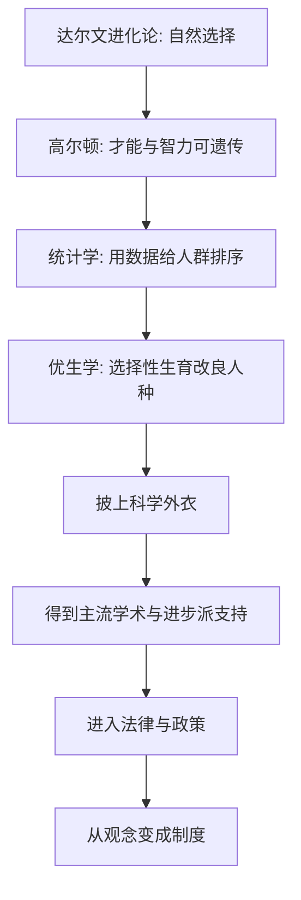

# 12｜「改良人种」：优生学如何成为一门「科学」？

> 一个今天听来荒谬甚至邪恶的观念，为什么曾被无数聪明人当成进步的、科学的、值得为之奋斗的事业？

---

## 一、先说结论

穆克吉讲优生学，最让人不安的地方，不是它有多疯狂，而是它有多「合理」。

它诞生在维多利亚时代的英国，由达尔文的表弟高尔顿提出，用的是遗传学、统计学、公共卫生的语言。它被写进论文、编进教材、开成国际会议，得到过进步派、社会名流，甚至一些著名科学家的公开支持。在那个年代，一个受过良好教育的人赞成优生学，不代表他落后，反而常常被认为很「先进」。

穆克吉的结论因此格外刺人：**优生学最危险的地方，不在于它荒谬，而在于它曾经看起来非常科学。**

它做的核心动作只有一个：把「遗传」等同于「命运」，再把复杂的人性，压缩成几个可以标记、可以筛选、可以淘汰的性状。

---

## 二、我们先理解一个问题

先做一个思想实验。

假设你生活在一百年前的欧洲或美国。你每天都能看到两种现象：一边是贫民窟里的人艰难谋生，孩子里有些从小疾病缠身；另一边是受过教育的体面家庭生育越来越少，而家庭里出人才的比例却很高。

你没有真正的遗传学知识，但你有常识，也有统计表格。于是你自然会想：**「出生」这件事，是不是也能像庄稼一样被改良？** 既然人类能通过选育提高牛的产奶量、把狗的品种培育得千差万别，那为什么不能用同样的方法，让人类变好一点？

这个念头，在当时听起来几乎是顺理成章的。

真正的问题就在这里：

> **当「育种」的逻辑被从牲畜搬到人身上时，是什么让它显得如此自然、如此正确？**

---

## 三、作者到底提出了什么观点？

穆克吉的观点可以概括成这样：

> **优生学不是科学史上的一个意外事故，而是遗传学、统计思想与社会焦虑合流之后的产物。**

他讲这段历史时，重点不在于谴责某个人，而在于揭示一套思维结构。人类长期「会用不懂」遗传（这是第一篇的主题），因此当遗传学刚刚有了科学外形时，社会立刻把它拿来回答最迫切的问题：贫穷、犯罪、疾病、社会秩序，究竟是因为环境，还是因为「血统」？

优生学给出的答案是后者：问题的根源在基因，解决之道在生育。

于是它分成两支，用今天的话说：

- **积极优生学**：鼓励所谓「优良」的人多生育；
- **消极优生学**：阻止所谓「劣质」的人生育。

穆克吉想让我们看清的，是这套结构——**它把社会问题医疗化，把医疗问题道德化，再把道德问题遗传化。**

---

## 四、把这个观点翻译成人话

打个比方。

假设一个城市的马路总是堵车，还经常出车祸。有人提出：「车不行。好车上路就没事，破车才惹麻烦。我们只要禁止破车开进市区，路上就干净了。」

这个说法有两个巨大的漏洞：第一，它把路的设计、信号灯、限速、驾驶规则全忽略了；第二，它默认「破车」是车本身天生就烂。

优生学就是这样一种「禁破车上路」的方案，只不过被禁止上路的是人。

它忽略了贫困、教育、医疗、营养、机会——这些看得见摸得着的环境变量；同时把「贫困」「犯罪」「低智力」这些模糊的社会标签，硬塞进一个生物学抽屉里，贴上「遗传」的标签。

而这个抽屉一旦贴上「遗传」，后果就变了：**既然是天生的、写在血里的，那么帮助就没意义，隔离和绝育反而显得「理性」。**

---

## 五、为什么会这样？

因为优生学在诞生之初，占了一个极好的位置：它借用了一套听上去无可反驳的语言。

（以下为科学史脉络的概括，非穆克吉原话）

高尔顿是达尔文的表弟，他对「天才是否在家族中聚集」做过统计研究。十九世纪后半叶，他提出人类的智力、才能、品格有很强的遗传性，因此应当鼓励「优秀者」多生育。1883 年，他为这套主张造了一个词——优生学。据记载，这个词来自希腊语，本意是「出身良好」。

随后，统计学、家谱调查、人口数据让这套主张显得越来越「实证」。二十世纪初，优生学在英美等地进入学术机构，成立学会、召开国际会议、出版期刊。它的追随者里，有社会改革者，也有希望「一次性解决贫困问题」的进步主义者——在他们眼中，优生学是公共卫生的一部分，是替未来省钱、替社会减负。

这就是穆克吉所强调的**合理性外衣**：它从不自称残忍，它自称「为下一代好」。

---

## 六、举一个现实生活中的例子

今天我们在新闻里，仍会看到优生学的思维回声。

比如，当某个家庭出现几个有精神疾病或成瘾问题的成员，旁人很容易说一句：「这一家子基因不好。」这句话的便利之处在于，它一次性解释了一切，也一次性免除了所有责任——不用谈贫困、创伤、医疗资源、教育机会。

再比如，一些商业化的基因检测，会给你一个「风险分」，让你误以为命运已经有了判决书。它把概率讲成命运，把统计讲成预言。

或者看更普遍的场景：我们评价一个孩子「聪明」「有天赋」时，往往默认那是天生注定；而当一个孩子成绩差，我们更容易归因于「不是读书的料」，而不是教室、教材、家庭与睡眠。

优生学并没有真的死去。**它只是换掉了那套种族与血统的词汇，改用「天赋」「基因」「风险」这些更体面的说法。**

---

## 七、回到书中重新理解

现在再看穆克吉为什么要把优生学放在全书的中段，就清楚了。

他先用了十几篇讲「遗传是如何被发现的」「基因如何运作」「疾病与基因的关系」，铺垫了一个前提：基因确实重要，确实影响健康与性状。正因为这个前提是真的，优生学才格外危险——**它不是建立在无知之上，而是建立在「半懂」之上。**

人们刚刚发现遗传有规律，就急不可耐地拿它去解答社会问题；刚刚发现性状可遗传，就立刻把「可遗传」翻译成「不可改变」，再翻译成「不值得帮助」。

穆克吉要我们记住的是这层递进：**理解遗传，本应让人更谦卑；而在优生学那里，它反而让人更傲慢。**

---

## 八、这个观点背后还有什么？

背后还有一个更深的东西：**当科学被用来给「人的价值」排序时，它就变成了权力的工具。**

优生学真正处理的，从来不是纯粹的生物学问题，而是「谁配当社会成员」的问题。它把「健康」「智力」「勤劳」这些带着强烈时代偏见的标准，伪装成自然的、客观的、不可争辩的尺度。

这也解释了它为什么能同时吸引左与右：有人想用它改良种族，有人想用它消灭贫穷。**同一个工具，可以服务完全不同的政治想象，这才是最危险的。**

穆克吉反复强调的一点是：基因知识本身是中性的、宝贵的；灾难不来自知识，而来自把「差异」直接翻译成「高下」。

---

## 九、这个观点有问题吗？

这里有几处必须说清楚的争议。

第一，「优生学等于伪科学」这个说法，本身需要小心。在当时，它的很多主张确实缺乏可靠的遗传学证据，尤其把「智力」「犯罪」这类复杂性状归因于单一遗传，今天看是站不住的。但把它简单称为「伪科学」，也可能让人忽略一个更麻烦的事实：**它是由许多真诚的研究者用当时的科学语言推进的**，其中一些统计方法（比如相关系数、回归）到今天仍在用。问题出在推断，而不是出在算数。

第二，优生学与「改善公共健康」之间的边界，确实容易被混淆。今天仍有争议：产前筛查、遗传咨询、胚胎植入前筛查，算不算优生学？一种常见的区分是——**如果选择是个人的、自愿的、以个体健康为目的，它与以国家名义、针对群体、强制实施的优生学有本质不同；但「自愿」在信息不对称、社会压力与偏见之下能有多纯粹，仍是一个真问题。**

第三，责任该怎么分？是高尔顿这样的倡导者、是提供资金的机构、是立法的政府，还是执行绝育的医生？穆克吉的写法倾向于提醒：**这不是某个恶人的问题，而是一整套社会机制共同运转的结果。**

---

## 十、今天再看这个观点

（以下为现代延伸，非穆克吉原文）

今天的优生学，很少再以国家绝育令的形式出现，但它换了皮肤。

它出现在基因检测的营销话术里，出现在「挑选最优秀胚胎」的商业服务里，出现在「某些人群天生如此」的公共讨论里，也出现在用基因解释贫富与教育差异的畅销书里。技术门槛在降低，而人的判断力并没有同步提高。

真正值得警惕的不是某一条具体政策，而是那种熟悉的思维习惯：**遇到复杂的社会问题，先去找一个生物学答案。** 因为生物学答案听上去最干脆、最像终局，也最容易让人放弃追问。

基因给了我们读取生命的能力，但它没有给我们评判生命价值的资格。这道分界线，是优生学留给我们最重要的一课。

---

## 十一、这一篇真正应该记住什么？

1. **优生学最可怕之处不是疯狂，而是合理。** 它穿着科学和公共利益的外衣进入主流。

2. **它的核心错误是把「遗传」等同于「命运」。** 可遗传不等于不可改变，更不等于不值得帮助。

3. **优生学不是某个恶人的发明，而是遗传学、统计思想与社会焦虑的合流。** 它同时吸引了不同政治立场的人。

4. **知识是中性的，排序是危险的。** 把「差异」翻译成「高下」，才是灾难的起点。

5. **「自愿」与「强制」是重要分界，但自愿也可能被偏见与压力污染。**

---

## 十二、留一个问题

如果优生学只是停留在论文、学会和会议上，它或许只会是一段令人尴尬的学术史。

但接下来发生的事，远远超出了「倡导」的范围：它被写进法律，被做成手术，被用于决定谁可以生育、谁必须绝育，最后被推到一个更可怕的终点——**决定谁值得活着。**

> **一套本意是「改良人种」的理论，是如何一步一步，变成屠杀的理论依据的？**

下一篇，我们就来看纳粹的「种族卫生」：**遗传学，如何沦为屠杀的工具？**
