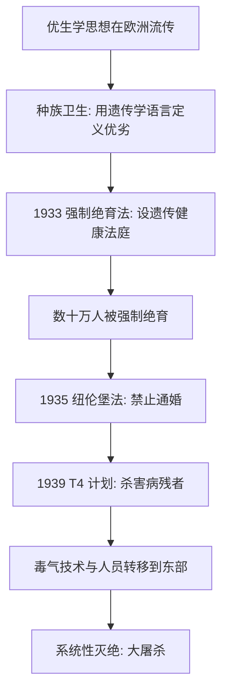

# 13｜纳粹的「种族卫生」：遗传学如何沦为屠杀的工具？

> 一门科学，是如何一步一步变成大屠杀的理论依据的？

---

## 一、先说结论

穆克吉写这段历史时，语气是克制的，但内容极其沉重。

纳粹并不是凭空发明了一套仇恨，而是接过了一整套已经在欧洲流传了几十年的「科学」话语——种族卫生。它有理论、有学者、有期刊、有国际同行。纳粹做的事，是把这套理论从「建议」变成「法律」，从「主张」变成「手术」，最后从「绝育」变成「屠杀」。

所以穆克吉的结论是：**这从来不是「科学与政治无关」的例外，恰恰是科学与权力结合时最深的警钟。**

基因知识本身是中性的、宝贵的；真正可怕的是把「基因差异」直接等同于「人的价值」，然后由某个机构来裁定谁的价值更高。

---

## 二、我们先理解一个问题

先问一个看似简单的问题：灭绝一个群体，是怎么被「论证」出来的？

它不会从一句「我恨他们」开始。它通常从一句听起来很技术的话开始：「为了后代的健康。」然后一步一步，把道德判断伪装成医学判断。

顺序大致是这样的：先承认「有些性状是遗传的」；再把「不好的性状」列成清单；接着把「拥有这些性状的人」列成名单；然后宣布「让他们生育，是对社会和后代的伤害」；最后得出结论：「阻止他们生育，是负责任的、甚至是仁慈的。」

真正的问题就在这里：

> **当「健康」被定义成「值得活」的标准时，医学离屠杀还有多远？**

---

## 三、作者到底提出了什么观点？

穆克吉的观点可以概括成这样：

> **纳粹的罪行不是遗传学的必然结果，而是遗传学语言被权力征用后的极端后果。**

他反复区分两件事：

- 一是基因知识：它描述差异、解释疾病，本身是宝贵的；
- 二是价值判断：谁「值得活」、谁「不值得活」，这是政治与伦理问题，不是生物学问题。

种族卫生做的，恰恰是把这两件事焊接在一起。它借用了遗传学的词汇（遗传、退化、劣质、净化），执行的却是政治任务（排除、隔离、灭绝）。

所以穆克吉的要点不是「科学错了」，而是：**当科学被要求为权力提供合法性时，它说出的每一个词，都可能变成一把刀。**

---

## 四、把这个观点翻译成人话

打个比方。

化验单本来是给医生用的。它告诉你哪项指标偏高，提醒你注意饮食、复查、治疗。它是一份说明，不是一个判决。

但假设有一天，有人把化验单拿去做另一件事：把指标高的人从名单里划掉，先从公司辞退，再从城市里赶走，最后从「人」这个类别里除名。

问题不在化验单本身，也不在指标本身。问题在于：**谁有权把一份说明，变成一份判决；又是谁，给了这份判决执行的权力。**

种族卫生就是这样。它手里的「化验单」看起来是科学的，但拿它做判决的，是国家机器。

---

## 五、为什么会这样？

因为这条路是**滑下去**的，而不是跳下去的。每一步都比上一步只多一点点，而每一步都有「合理的理由」。

（以下为科学史事实的概括，非穆克吉原话）

「种族卫生」这个词，据记载是十九世纪末由德国学者提出的，比纳粹上台早了几十年。它有一批学者、期刊和教科书，把「遗传」与「种族」混在一起谈，主张对「遗传上有缺陷者」进行干预。

1933 年，纳粹上台后不久便颁布了《防止遗传病后代法》，设立「遗传健康法庭」，对所谓「遗传性病患」实施强制绝育。列进去的名目包括先天性智力低下、精神分裂症、癫痫、遗传性失明失聪、严重畸形等——这些判断标准本身就极其模糊。据记载，此后数年间被强制绝育的人数以十万计。

1935 年，《纽伦堡法》禁止犹太人与「德意志血统」者通婚，把种族隔离写进法律。

1939 年，代号 T4 的计划开始，对精神病院和疗养院中的病人实施系统性杀害。据记载，最初使用的方法包括毒气，受害者数以万计；后因公开抗议而形式上停止，但相关技术、人员与经验被转移到东部的灭绝营。

再往后，就是我们所知的那场大屠杀。

---

## 六、举一个现实生活中的例子

今天听来，这套逻辑的起点可能并不陌生。

想想体检报告上那些「不合格」的指标。一个人体检显示某项异常，公司是否因此不录用他？保险是否因此拒保？这种「用医学数据给人分类」的冲动，在现代社会里随处可见，只是程度和后果不同。

或者想一个更贴近的场景：我们常听到「这种人就是社会的负担」这类话。说这话的人，可能并不认为自己在主张什么可怕的事，他只是在做一个「成本收益」判断。

种族卫生的历史提醒我们：**当「负担」这个词被允许用来形容某一群人时，下一步就容易变成「清除负担」。** 可怕的是，从「负担」到「清除」，中间隔的不是一段悬崖，而是一级一级的台阶。

---

## 七、回到书中重新理解

现在再看穆克吉为什么要把这一篇写得如此克制。

他没有把纳粹写成一群怪物。他把它写成一条可以被复述的路径：先有理论，再有法律，再有执行，最后有灭绝。每一环都有「理性」的说法，每一环都有人签字。

这恰恰是最令人不安的地方。因为如果凶手只是疯子，我们只需要防范疯子；但如果凶手是制度、是专家、是「按规矩办事」的人，那么这段历史就与我们每个人都有关。

穆克吉想说的不是「纳粹很坏」，而是：**同样的条件如果再次出现，我们是否有能力在中途认出它。**

---

## 八、这个观点背后还有什么？

背后是一个关于「中立科学」的根本问题：科学能不能、该不该宣称自己与价值无关？

穆克吉的立场倾向于：**方法可以中立，但应用从来不是。** 遗传学不会自己决定谁该绝育，决定的是人；但遗传学提供的语言——「遗传缺陷」「退化」「纯化」——会被权力借走，变成天然正当的借口。

这也是为什么战后的纽伦堡审判不仅审判了医生，还催生了《纽伦堡法典》：它第一次明确写下，医学实验必须基于受试者的自愿同意。**这条原则的诞生，直接来自优生学与种族卫生的历史。**

---

## 九、这个观点有问题吗？

有几个层面值得展开。

第一，「纳粹优生学与英美优生学是两回事」是一种常见说法。确实，纳粹把它推到了灭绝的极端，其他国家的形式不同。但史学界的争议在于：**纳粹并非与外部隔绝的孤例**——它的绝育法参考过美国的样板，种族卫生的学者也与国际同行有交流。把一切都推给「纳粹的特殊性」，可能反而让其他地方更容易遗忘自己的那一页。

第二，「科学是否应当承担责任」也有不同解释。一种观点认为：科学只提供事实，责任在被权力误用的那一环；另一种观点认为：**当科学家主动提供语言、主动站台、主动设计执行方案时，他就不再只是旁观者。** 穆克吉的写法更接近后者。

第三，还要区分「强制绝育」与「个人自愿的遗传咨询」。今天如果一个人因家族遗传病而选择不生育，这是他的自主选择，与以国家名义强制执行、针对整个群体实施，性质完全不同。把二者混为一谈，会模糊真正需要警惕的边界。

第四，必须承认这段历史中有些细节——具体数字、具体程序、具体人物的动机——在不同史料中有不同表述。稳妥的态度是：**方向是确凿的，细节应谨慎。**

---

## 十、今天再看这个观点

（以下为现代延伸，非穆克吉原文）

今天，没有任何一个国家的政府会公开谈论「谁不值得活」。但同样的结构以更细微的方式存在着。

它出现在对某些群体「生育太多」的抱怨里，出现在对残障生命的低估值里，出现在「筛掉有缺陷的胚胎」被当作理所当然的对话里，也出现在把基因差异直接用来解释社会不平等的叙事里。

技术越强大，这种风险越具体。产前筛查、胚胎选择、基因编辑，都在把「选择」的权力往前推：从选择治疗，到选择性状，再到选择什么样的人才配出生。

穆克吉想留下的，不是禁令，而是一道清醒的界线：**可以描述差异，不可以裁定价值。** 基因能告诉我们人与人之间的不同，但它永远没有资格告诉我们，谁更应该活着。

---

## 十一、这一篇真正应该记住什么？

1. **种族卫生是「优生学 + 权力」的产物。** 它不是凭空出现的仇恨，而是被制度化的理论。

2. **这条路是滑下去的，不是跳下去的。** 每一级台阶都有「合理的理由」，所以格外难以中途叫停。

3. **危险不在基因知识本身，而在把基因差异等同于人的价值。** 描述与裁定，是两件不同的事。

4. **科学方法可以中立，科学的应用与站台从不中立。** 学术共同体也有其历史责任。

5. **《纽伦堡法典》的诞生，是对这段历史最直接的回应：同意，是医学不可让渡的前提。**

---

## 十二、留一个问题

我们习惯把优生学的历史讲成一个「德国故事」，讲成一个只有在极端政权下才会发生的例外。

但如果翻开同一时期的档案，会发现另一个事实：在纳粹之前与之后，美国与北欧的一些国家，也曾以法律的名义，对成千上万的人做过强制绝育；而在苏联，遗传学则被以另一种方式摧毁——它被宣布为「资产阶级伪科学」，连研究都成了罪。

> **优生学，究竟是纳粹一国的罪行，还是整个西方世界的共同历史？**

下一篇，我们就来看美国、北欧与苏联：**优生学如何成了一整代人被遗忘的历史？**
