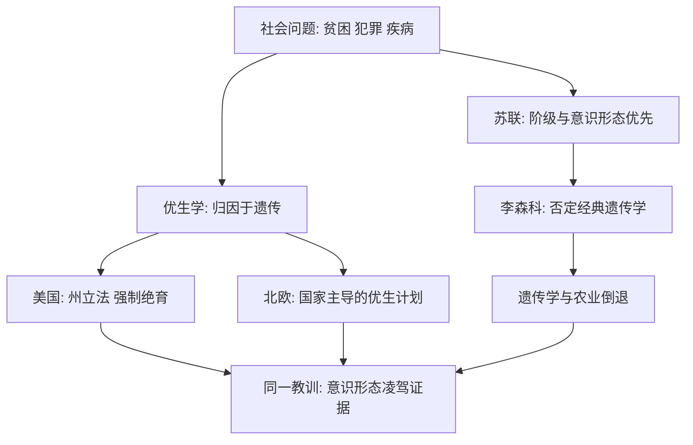

# 14｜美国、北欧与苏联：被遗忘的优生学历史

> 优生学只是纳粹的罪行，还是整个西方世界的共同历史？

---

## 一、先说结论

穆克吉讲完纳粹之后，把镜头拉回来，指向了一个更不舒服的事实：**优生学不是德国的专利。**

在纳粹之前，美国就已经有州通过立法，对所谓「不适宜生育者」实施强制绝育；北欧多个国家在二十世纪长期实行类似的计划，一直延续到七十年代。换句话说，在相当长的时间里，优生学是西方世界的一项「常规政策」，而不是某个极权国家的特例。

反过来，苏联走的是一条镜像的路：它没有搞绝育，而是在李森科的主导下，官方否定经典遗传学，把基因学说打成「资产阶级伪科学」，导致遗传学与农业倒退数十年。

穆克吉用这两个极端指向同一个教训：**当意识形态凌驾于证据之上，科学就会变成牺牲品。**

---

## 二、我们先理解一个问题

先问一个反直觉的问题：为什么一项明显侵犯人权的政策，能在民主国家合法地运行几十年？

答案往往不是「暴政」，而是「共识」。当一个社会普遍相信「这些人天生就是负担」「不让他们生育是为社会好」，那么在当时的多数人看来，强制绝育并不是迫害，而是一项负责任的公共卫生措施。

真正的问题就在这里：

> **如果一项政策是「民主程序通过的」，还被许多人认为「科学」，我们凭什么说它是错的？**

这个问题，正是优生学史留给今天最难的部分。

---

## 三、作者到底提出了什么观点？

穆克吉的观点可以概括成这样：

> **优生学是一场跨国运动，而不是一次孤立的暴行；而对它的否定，也不该只留给某一个国家。**

他讲这段历史时，把两个方向并列：

- 在美、北欧等地，是**用遗传学给社会问题下医学结论**——把贫困、犯罪、智力、疾病归因于遗传，然后用法律和手术去「解决」；
- 在苏联，则是**用意识形态给科学研究下政治结论**——宣布经典遗传学是资产阶级的、反动的，把科研方向交给政治正确。

这两条路径表面相反，内核相同：**都是先有结论，再找「科学」来背书。** 一个是让科学服务于社会工程，一个是让科学服从于政治路线。

---

## 四、把这个观点翻译成人话

打个比方。

假设一个小区总是有人生病。有两种处理方式。

第一种：派人去查水质、查通风、查居住密度，发现是下水道设计有问题，于是改造管道。

第二种：直接宣布「住在这栋楼的人体质天生就差」，然后想办法不让他们搬进来、不让他们生小孩。

第二种方式的问题，不是它「查得不够仔细」，而是它从一开始就没打算查——它已经认定问题出在人身上。

优生学的两种形态，本质上都是第二种。美国的版本说「这些人天生不合格，必须绝育」；苏联的版本说「说基因决定性状的那套理论不合格，必须放弃」。**一个否定了人，一个否定了证据，但它们都选择了让结论先于事实。**

---

## 五、为什么会这样？

因为在这两个例子里，科学都被要求回答一个它其实回答不了的问题：谁该在社会里拥有位置。

（以下为科学史事实的概括，非穆克吉原话）

在美国，据记载，二十世纪初有多州陆续通过强制绝育立法，对精神病院与收容机构中的人实施手术。1927 年，美国最高法院在「巴克诉贝尔案」中维持了弗吉尼亚州的绝育法；此案判决中留下了一句后来广被引用的话，大意是「三代低能已经够了」——它成为优生学被法律承认的标志性时刻。据记载，二十世纪美国被强制绝育的总人数约有数万，其中加州、北卡等地的规模较大。

北欧方面，据记载，丹麦在二十年代末率先立法，瑞典、挪威、芬兰、冰岛随后跟进。瑞典的相关法律从三十年代延续到七十年代中期，被绝育者数以万计；九十年代末，瑞典媒体与政府调查把这页历史重新翻出，引发全国性争论。

苏联方面，李森科是一位出身农学的实践者，他主张可以通过环境处理改变作物的遗传表现，并否定孟德尔与摩尔根的经典遗传学。在政治支持下，经典遗传学被宣布为「资产阶级伪科学」，相关研究被禁止，学者遭到批判。著名植物遗传学家瓦维洛夫因此被捕，据记载于四十年代初死于狱中。这一局面直到六十年代中期才被正式纠正，而苏联农业与遗传学已付出沉重代价。

---

## 六、举一个现实生活中的例子

今天仍有对应的现象。

当一个学生成绩不好，最省事的解释是「他不是这块料」；当一个地区长期贫困，最省事的解释是「那里的人不行」。这种解释的力量在于，它不需要任何改变——不需要改进学校、不需要投入医疗、不需要创造就业。

同样地，当某种科学结论与某个政治立场相冲突时，最省事的做法不是重新检查证据，而是宣布这个结论「立场有问题」。

这两种省事，看起来方向相反，其实是同一个动作：**拒绝面对复杂性，直接给出一个不用负责的答案。**

---

## 七、回到书中重新理解

现在再看穆克吉的结构安排，就明白他为什么要先写优生学（12），再写纳粹（13），最后写美国、北欧与苏联（14）。

如果只写到纳粹，读者容易把优生学当成一段「已经被战胜的黑暗」，然后安心合上书。加上这一篇，故事就变了：**它是一段仍在各国的档案里、需要被各自承认的历史。**

穆克吉想说的不是「大家一样坏」，而是：**科学被权力误用，不是某个制度的专利，而是现代文明共同面对的诱惑。** 民主也好、集权也好，只要「先有结论、再找科学」，同样的路就会重复。

---

## 八、这个观点背后还有什么？

背后是一个关于科学与意识形态关系的老问题。

一方面，科学当然不能脱离社会：它靠经费、靠机构、靠政策。另一方面，一旦政治有权决定哪个科学结论「正确」，科学就不再是知识，而是宣传。

李森科的故事给出的，正是最极端的例子：**不是科学被误用，而是科学被取缔。** 这提醒我们，优生学的危险有两种形式——一种是科学语言被权力借走，另一种是权力干脆指定什么是科学。

两者都指向同一件事：**科学的独立性，需要制度性的保护，而不是靠某个人的善意。**

---

## 九、这个观点有问题吗？

有几处争议必须认真对待。

第一，把各国优生学「一视同仁」也有风险。纳粹的种族卫生导向系统性灭绝，与其他国家以社会与健康为由的绝育，在动机与后果上并不相同。把它们完全等同，既不准确，也可能被用来淡化纳粹的独特罪责。更稳妥的说法是：**它们共享同一套思想资源，却走向了不同严重程度的后果。**

第二，北欧的计划常被描述为「福利国家式的优生学」。这里的争议在于：许多案例表面上有「同意」程序，但当事人往往身处收容机构、贫困与信息不对称之中，「自愿」到底有多少含金量，学界与受害群体有不同看法。

第三，关于李森科，也存在不同解释。有观点认为这完全是政治压制科学；也有历史研究指出，当时的农业困境与社会对「快速增产」的渴望，为李森科提供了土壤——**科学被否定，往往是政治需求与专业傲慢共同促成的。**

第四，还有一个方法论的提醒：具体的绝育人数、法律年份、政策动机，各研究给出的说法有差异。方向是清楚的，具体数字应保持谨慎。

---

## 十、今天再看这个观点

（以下为现代延伸，非穆克吉原文）

今天，国家层面的强制绝育大多已经废除，相关国家也陆续进行了道歉与赔偿。但优生学的两种模式都以新的形式留存下来。

一种仍是「用基因解释社会」：把教育差距、收入差距、犯罪率差异，草率地归到生物差别上。

另一种仍是「用立场审查科学」：当某个研究结论不符合某种期待时，先讨论它的「立场」，再讨论它的证据。

这两种倾向，在今天的公共讨论中都不难见到。区别只在于，我们是否还记得它们曾经通向哪里。

穆克吉留下的问题因此格外朴素：**我们能不能做到——结论先于立场，证据先于偏好？** 这听起来像一句老话，但优生学的全部历史，就是这句老话被反复违反的记录。

---

## 十一、这一篇真正应该记住什么？

1. **优生学是跨国运动，不是纳粹的专利。** 美国与北欧都曾以法律名义长期实行强制绝育。

2. **「合法」不等于「正当」，多数人的共识也可能错。** 民主程序不能替代伦理底线。

3. **苏联是镜像案例：不是科学被误用，而是科学被取缔。** 李森科事件让遗传学与农业倒退数十年。

4. **两个极端，同一个教训：当意识形态凌驾于证据之上，科学就会变成牺牲品。**

5. **科学的独立需要制度保护，而不是依赖个别人的良知。**

---

## 十二、留一个问题

优生学的故事讲到这里，似乎是一个关于「科学被滥用」的完整教训。但它也留下了一个更大的悬念。

如果人类真的能把自己的遗传信息完整地读出来，会发生什么？这会不会是「读懂生命」的终点，从而让所有基于「血统」的猜测彻底失去市场？还是说，它反而会带来一种更精细、更不容易被识别的优生学？

> **当人类第一次能够「读取」自己的全部基因，我们真的会更了解自己，还是只是学会了用更精确的方式给人排序？**

下一篇，我们就来看人类基因组计划：**如何读完一本「30 亿字母」的书？**
