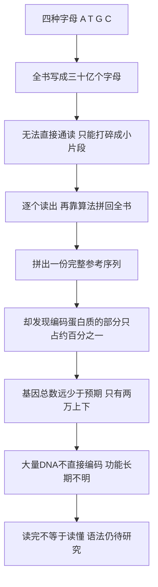

# 15｜人类基因组计划：如何读完一本「30 亿字母」的书？

> 把人类全部的遗传信息读出来，为什么曾被视为近乎不可能的工程？它读出了什么？

---

## 一、先说结论

到二十世纪七十年代，遗传学已经走完最惊心动魄的一段路：我们知道 DNA 是双螺旋，知道它靠碱基配对复制自己，也破译了遗传密码。于是有人提出一个自然的念头——既然每个字母都认识了，为什么不把一个人全部的基因读一遍？

这就是人类基因组计划。

穆克吉讲这一段时，有敬意，也有收敛。他想说的核心有两件事。

**第一，它把生命科学变成了「大科学」。** 不再是一个修道士在花园里数豌豆，而是几十个国家、上千名科学家、数十亿美元、长达十几年的工程。

**第二，它最深的发现是一个反直觉的意外：人没有那么特殊。** 我们原以为人有几万甚至十万个基因，结果只有两万上下，比很多植物和虫子多不了多少；真正编码蛋白质的部分，只占整个基因组的百分之一多一点。

所以这一篇的结论是：**「生命之书」被翻开了，但我们只是认识字，还不会读懂句子。**

---

## 二、我们先理解一个问题

做一个思想实验。假设有一本书，只用四个字母写成：A、T、G、C，全长三十亿个字母。

它就是你。你要把它一字不差地抄下来。

难点在于：它装在一个比针尖还小的细胞核里，你没法像翻书一样一页页翻，只能先打碎成无数小片段，逐个读出，再拼回原样——而拼的时候，你并不知道每块原来在哪。更麻烦的是，书里有大量重复段落，像同一段话被复制了几十万遍。

这就是人类基因组计划的核心困难：

> **不是「读一个字母」难，而是「把三十亿个字母拼成一本完整的书」难。**

---

## 三、作者到底提出了什么观点？

一方面，这是遗传学的高光时刻：分散在世界各地的研究，第一次被组织成一场目标明确的全球协作，证明有些知识已不可能靠一个人、一间实验室得到。

另一方面，计划中途出现了一个从未有过的局面：**公共资助的国际联合体，和文特尔创办的私营公司塞莱拉，同时冲刺。** 一个主张数据免费公开、属于全人类；一个主张用更快的方法，并申请专利。竞赛推动了进度，也逼出一个问题：**人类基因组，到底是谁的？**

而最让穆克吉在意的，是结果带来的意外：人的基因数量远低于预期。我们以为自己的复杂必然来自海量基因，可数字显示，人和果蝇、线虫、一棵芥菜的基因数目处在同一量级。

于是他提出这一节真正的观点：

> **读取不等于理解。我们得到了全书，却还没有学会语法。**

---

## 四、把这个观点翻译成人话

想象你拿到一本从未见过的语言写成的巨著。字你全认识，因为只有四个字母；印刷也清晰，你一个不漏地抄了一遍。

可你依然读不懂。你不知道哪些段落是句子，哪些是批注；不知道词与词怎么组合，标点在哪里。你有全部原始材料，却没有语法书。

人类基因组计划做完的，正是「把书抄下来」。而理解它在说什么，是接下来几代人的工作。

穆克吉想说的是：**不要因为拿到全文，就以为谜题解开了。** 真正的难题才刚开始。

---

## 五、为什么会这样？

因为基因组的信息结构，和我们原本的想象完全不同。

「基因」在概念上曾经很简单：一段编码一个蛋白质的指令。按此逻辑，生物越复杂，基因就该越多。

但真正编码蛋白质的只是一小部分。剩下的大量序列，过去被叫作「垃圾 DNA」——这个称呼本身就是理解不足的证据。后来人们发现，其中许多区域承担着调控作用：什么时候打开哪个基因、在哪个组织打开、打开多大，往往靠这些「不编码」的部分指挥。

换句话说，**基因不是一颗颗孤立的珠子，而是一张互相牵连的网。** 数量少不代表简单；恰恰是少而互联，才可能拼出复杂。

---

## 六、举一个现实生活中的例子

想想装修房子。你拿到一份极其详细的清单，写着这间房子用的每一块砖、每一根钉子的型号和数量，长到你根本读不完。

你可能以为，读完清单就懂了这间房子。可你更需要知道的是：这些材料怎么搭起来？哪面墙承重？水电怎么走？哪块砖少了房子会塌？

基因组计划交付的，正是那份「材料清单」。它告诉我们有哪些材料、有多少，却没有直接告诉我们这间房子是怎么盖起来、怎么运作的。读完清单，距离理解建筑还差很远。

---

## 七、回到书中重新理解

放回《基因传》的脉络，这一篇既是高峰，也是转折。

高峰在于：从孟德尔的豌豆到双螺旋、到遗传密码，遗传学一路「由小到大」，终于把一个人的全部遗传信息摊在桌面上。

转折在于：**摊开之后，我们发现桌上并没有一份现成的说明书。** 基因数量之少、非编码区域之多，提醒我们复杂性不完全来自零件数量，而来自零件之间的关系。

穆克吉还借这场竞赛讨论了一个根本问题：**知识属于谁？** 当基因序列同时意味着公共利益和巨大商机，开放与专利的张力第一次如此尖锐。后来形成的共识是：基因本身不应被简单当作私人财产——这个共识来之不易，也并非没有反复。

---

## 八、这个观点背后还有什么？

至少有四层。

第一，**「大科学」的诞生**：有些问题已超出任何单个实验室的能力，必须靠跨国、长期、稳定的投入，此后的天文、粒子物理、气候研究都沿用了这种模式。

第二，**数据共享的伦理**：公共计划的开放路线与私营路线之争，直接塑造了此后生命科学的数据文化。

第三，**对「基因决定论」的一次降温**：如果复杂性主要不取决于基因数量，「一个基因一种命运」就更站不住脚。

第四，**一种新的谦逊**：拥有完整文本，不等于掌握意义。

---

## 九、这个观点有问题吗？

有几点需要澄清。

「人类只有两万多个基因」这个数字是不断修订的：早期估计十万，后来降到三万多，又修正到两万上下。而且「基因」的定义本身在变化——同一段 DNA 经过不同剪接，可以产生不同蛋白质。**「一个基因、一个蛋白质」是过度简化的说法。**

「垃圾 DNA」也引发了很大争议。2012 年，ENCODE 计划提出基因组约八成序列具有某种「生化功能」；不少科学家立刻反驳：一段序列在细胞里被转录、被结合，不等于它真的承担重要功能——**「有活动」和「有用」不是一回事。** 争论至今未平，恰好说明从「读出序列」到「解释功能」隔着巨大鸿沟。

此外，计划交付的不是「某个人的基因组」，而是一份拼合出来的参考序列，混合了少数志愿者的信息。它更像一张通用地图，而不是具体某个人的画像，天然缺少对全人类多样性的覆盖。所以「读完」本身也只是阶段性说法：一些高度重复、结构复杂的区域长期无法完整组装，直到更晚的技术才补上。

---

## 十、今天再看这个观点

（以下为现代延伸，非穆克吉原文）

最惊人的变化之一是**成本**：当初读完一份基因组要约三十亿美元、耗时十多年；如今成本已降到几百美元量级，时间以天计。测序从「国家级工程」变成了可规模化生产的常规技术。

随之而来的是数据爆炸。各国启动大规模人群基因组计划，把成千上万人的序列和健康记录放在一起研究，也带来新问题：**我们能更快地测，却未必更快地懂。**

另一个进展，是对「单一参考基因组」的反思。用一个标准模板代表全人类并不合适，于是人们开始构建「泛基因组」，把不同人群的序列都纳入进来。这既追求准确，也是一种迟来的公平：如果参考序列只代表某一类人，基于它的医学判断就可能对其他人不准。

还有一个追问延续至今：**当测序变便宜，谁有权获得你的基因数据？** 穆克吉的「知识属于谁」，因商业化而更加迫切。

---

## 十一、这一篇真正应该记住什么？

1. **读取的核心困难在于「组装」，不只是「读取」。** 打碎、读出、拼回，每一步都是工程挑战。

2. **它把遗传学带进了「大科学」时代。** 全球协作、长期投入、数据共享，成为解决超大规模问题的范式。

3. **公共计划与私营公司的竞赛，逼出了「基因数据属于谁」的问题。** 开放与专利的张力至今仍在。

4. **最反直觉的发现是：人的基因数量并没有想象中多。** 复杂性不完全来自零件数量，而来自零件之间的关系。

5. **读完不等于读懂。** 我们有了全文，却还没有语法书。

---

## 十二、留一个问题

人类基因组计划完成之后，遗传学第一次拥有了「把一个人的全部基因读一遍」的能力。

那么，一个非常自然、也非常危险的问题就出现了：

> **如果基因可以预测未来，我们该不该去看那张「命运的成绩单」？**

知道了，可能改变一生；不知道，也许活得更轻松。这道题没有标准答案。

下一篇，我们就来看**基因检测**：**当一张报告告诉你「风险略高」，你究竟得到了什么，又失去了什么？**
