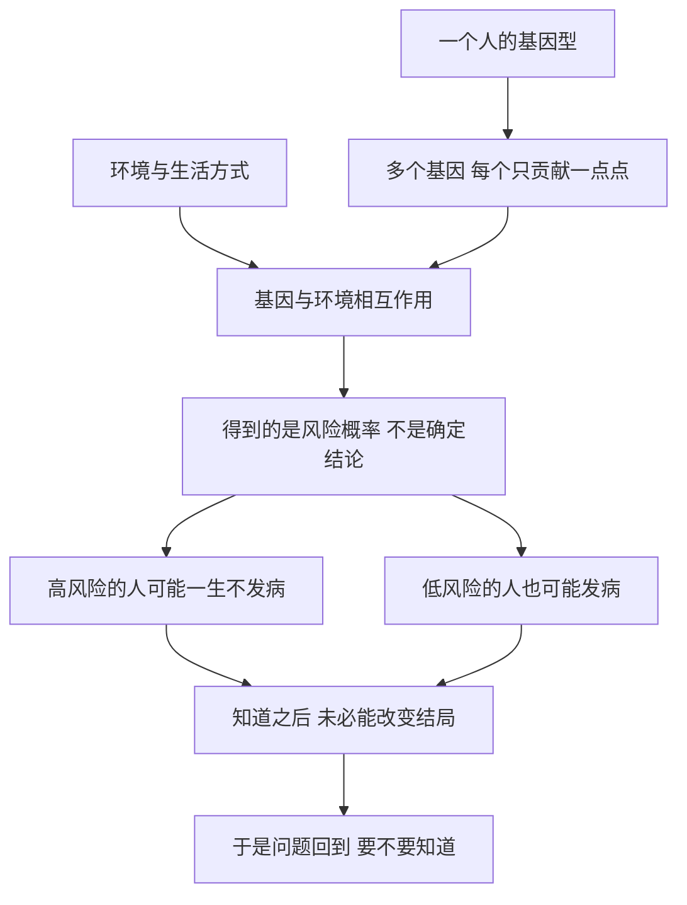

# 16｜基因检测：我们能预知自己的命运吗？

> 如果基因可以预测未来，我们该不该去看那张「命运的成绩单」？

---

## 一、先说结论

如果命运真的写在基因里，那么基因检测就是提前偷看答案。

穆克吉想说的恰恰是：**这种想象，和现实之间隔着一道很深的沟。**

基因检测确实有用：能诊断明确的单基因病，能筛查携带者，能指导某些用药，也能在少数情况下给出接近确定的预测。但对大多数常见疾病，它给出的不是判决，而是**概率**——风险可能略高也可能略低，却说不准你一定会不会得病。

真正让穆克吉在意的，不是技术，而是那道伦理难题：**知道了又能怎样？** 有些命运无从改变，有些改变会带来新的焦虑。在「知道」和「不知道」之间，是一道没有标准答案的选择题。

---

## 二、我们先理解一个问题

设想一个场景。你打开一个网站，它承诺花几百块，就能告诉你未来可能患上的疾病。你犹豫了一下，还是寄出了唾液。

几周后，报告来了，上面列了几十项：某项风险「略高」，某项「正常」，还有一项写着「增加约百分之三十」。

你怎么办？你既没生病，也没被告知一定会生病，只是多了几个数字。可这几个数字，可能让你从此睡不好觉。

于是问题浮出来：

> **一份报告如果只能告诉你概率，它到底是在给你力量，还是在给你负担？**

要回答这个，得先弄清：基因检测能测出什么，测不出的又是什么。

---

## 三、作者到底提出了什么观点？

穆克吉的做法，是把「基因检测」拆开看。至少有三类完全不同的检测，常被混为一谈。

**诊断性检测：** 人已出现症状，用检测确认是不是某种遗传病。

**预测性检测：** 人还没生病，检测是为了估算未来风险——大多数常见病的检测属于这一类，得到的往往是概率。

**携带者检测：** 检测者本人可能不发病，但要知道自己是否携带隐性致病基因，从而评估传给孩子的风险。

最关键的区别是：**有些基因几乎等于命运，有些基因只是统计学上的一点微调。** 亨廷顿病是前者——携带特定突变的人几乎必然发病，且目前无法治愈；大多数高血压、糖尿病、常见癌症的风险基因属于后者，它们影响概率，却不能单独决定结局。

穆克吉的立场可以概括为：

> **基因检测的真正困难，不在技术能不能测出来，而在于测出来之后，人该如何面对一个「不确定的确定」。**

---

## 四、把这个观点翻译成人话

可以用天气预报来理解：基因检测更像「气候概率」，而不是「明天你家门口下不下雨」。

它可能告诉你，你所在的城市这个季节下雨的概率比别处高一点。这有用，但它不能告诉你，明天早上八点你出门时头顶会不会有雨。

问题在于，很多人把「风险略高」直接听成了「我会得病」。这种误读会真实地改变生活：有人过度检查、终日焦虑，有人不敢买保险、不敢生育，也有人干脆否认一切检测的价值。

穆克吉想提醒的是：**你拿到的是一个概率，而不是一份判决书。** 而人天生不擅长和概率相处。

---

## 五、为什么会这样？

因为绝大多数常见病，根本不是「一个基因决定一件事」。

从孟德尔那里继承的直觉，是「一个性状对应一个因子」。但现实里，除了少数单基因病，绝大多数性状都是**多基因加环境**共同作用的结果。每个相关基因可能只让风险上升百分之几，几十、几百个基因加在一起，再加上生活方式、年龄、偶然，最后才形成你的实际风险。

这意味着两件事。**一，风险可计算，但只是粗略的**；很多研究主要基于欧洲血统人群，用在其他人身上准确度会下降。**二，风险高不等于命运已定**：评分高的人可能一辈子平安，评分低的人也可能因别的原因发病。所以基因检测给出的常是「既重要又模糊」的信息。

---

## 六、举一个现实生活中的例子

最沉重也最清楚的例子是亨廷顿病。它通常在中年发病，逐渐损害运动、认知和精神功能，目前无法治愈；只要携带致病突变，发病风险极高——很多人把它看作「基因等于命运」的少数真实案例。

遗传学家南希·韦克斯勒的母亲死于亨廷顿病，她把职业生涯献给了寻找致病基因的工作。可当检测技术真的出现时，她选择**不做**检测。她一生都在推进这项研究，却不愿知道自己是否携带那个突变。这不是逃避，而说明一个残酷的事实：**在无法治疗的病面前，「知道」本身可能成为漫长的煎熬。** 有些人宁愿知道，以便安排人生；有些人选择不知道。两种选择都值得尊重——这里没有标准答案。

这也说明：**同一份检测结果，在不同疾病、不同人身上，意义可能完全不同**——它可能是值得行动的健康警报，也可能只是被放大的噪音。

---

## 七、回到书中重新理解

穆克吉本人是肿瘤科医生，每天都在面对这个问题。病人问他：我该不该做这个检测？测出来风险很高怎么办？孩子也可能携带，要不要告诉他们？

他慢慢意识到，医学过去习惯把「知道」当作天然的好事：知道得越多，越能治疗。但遗传学打破了这个假设。**有些知识，你得到了却没有行动空间；有些知识，会牵连你的家人、保险、人生决定。**

于是他提出一组对照：**能改变结局的知识**（如早期筛查能真正降低死亡风险的检测），值得知道；**无法改变结局的知识**（如尚无疗法的预测性检测），需要极其慎重；**会严重影响他人、却无法撤回的知识**，更要在测之前想清楚。这组对照，是他从临床里长出来的。

---

## 八、这个观点背后还有什么？

至少有三层。**隐私与歧视**：基因信息也部分关于父母、兄弟姐妹和孩子，一旦泄露可能影响就业和保险，因此一些国家专门立法反基因歧视。**「不知情的权利」**：医学长期默认病人想知道一切，但遗传学提出反向问题——一个人有没有权利选择不去知道自己的某些风险？**商业化的风险**：面向消费者的营销往往放大焦虑，把「统计学上的一点点」包装成「你的命运」。

---

## 九、这个观点有问题吗？

需要平衡两边的说法。

一种误读是「基因检测没什么用，都是概率游戏」。这过头了。对于明确的单基因病、某些癌症遗传综合征，以及药物代谢相关的基因，检测有真实而重要的临床价值，甚至能救命。一概否定，会让真正需要的人错过机会。另一种误读是「测出来就能预防」，同样过头：很多风险即使知道，也缺乏有效的干预手段。

还有一个更细的问题：**风险沟通本身非常难。** 「相对风险增加百分之五十」听上去很吓人，但如果基线风险只有百分之四，绝对增加的可能只是一个百分点左右。这不完全是公众的错，报告本身就该说清楚。

此外，同一句「基因检测」，用在亨廷顿病和用在一位七十岁老人的轻微糖尿病风险上，性质完全不同。**把它当成一个统一的词来讨论，本身就是一种偷懒。** 所以这不是「该不该检测」的是非题，而是「对哪一种病、为了什么目的、检测之后有没有行动空间」的具体判断题。

---

## 十、今天再看这个观点

（以下为现代延伸，非穆克吉原文）

多基因风险评分被越来越多地提出，它把成千上万个微小效应加总，试图给出更细的风险分层。它在某些疾病上确有价值，但也暴露了老问题：**分数越高只意味着概率越大，仍不能告诉你个人的结局**；而且现有数据对非欧洲血统人群覆盖不足，直接套用可能加剧健康差距。

液体活检等早期筛查，试图在症状出现前发现问题——这是「知道」真正可能有用的地方，但也带来大量「疑似异常」引发的过度检查。面向消费者的检测继续扩张，行业逐渐意识到，**检测的真正产品不是数据，而是解释和后续支持**。

回头看，穆克吉那句「知道了又能怎样」反而更响亮了：技术越容易给出答案，我们越需要先想清楚，**什么是我们真正想知道的，什么是我们能够承受的。**

---

## 十一、这一篇真正应该记住什么？

1. **基因检测不是命运判决书，对大多数常见病它给出的是概率。** 「风险略高」不等于「你会得病」。

2. **不同的检测性质完全不同。** 诊断性、预测性、携带者检测，意义和后果天差地别，不能笼统讨论。

3. **亨廷顿病式的「基因即命运」是少数，而不是常态。** 大多数疾病风险是多基因与环境共同作用的结果。

4. **「知道」本身是一个伦理选择。** 有些知识没有行动空间，有些会牵连家人，有些宁可不知道——这些选择都值得尊重。

5. **检测的难点往往在解释，而不在技术。** 相对风险与绝对风险、个体与群体、不同血统的适用性，都需要被认真说清楚。

---

## 十二、留一个问题

基因检测最初是为个体服务的：一个人想知道自己的风险。

可当它开始被用来描述**群体**——某一类人更聪明、更容易犯罪、更容易得某种病——事情就完全变了。

> **那些最容易引发争论的人类差异：种族、智力、性向，究竟有多少真的写在基因里？**

这不是一个纯粹的科学问题，它直接连着一个沉重的历史：优生学。

下一篇，我们就来面对这个最难、也最需要谨慎的问题：**为什么「用基因给人贴标签」，几乎总是错的？**
