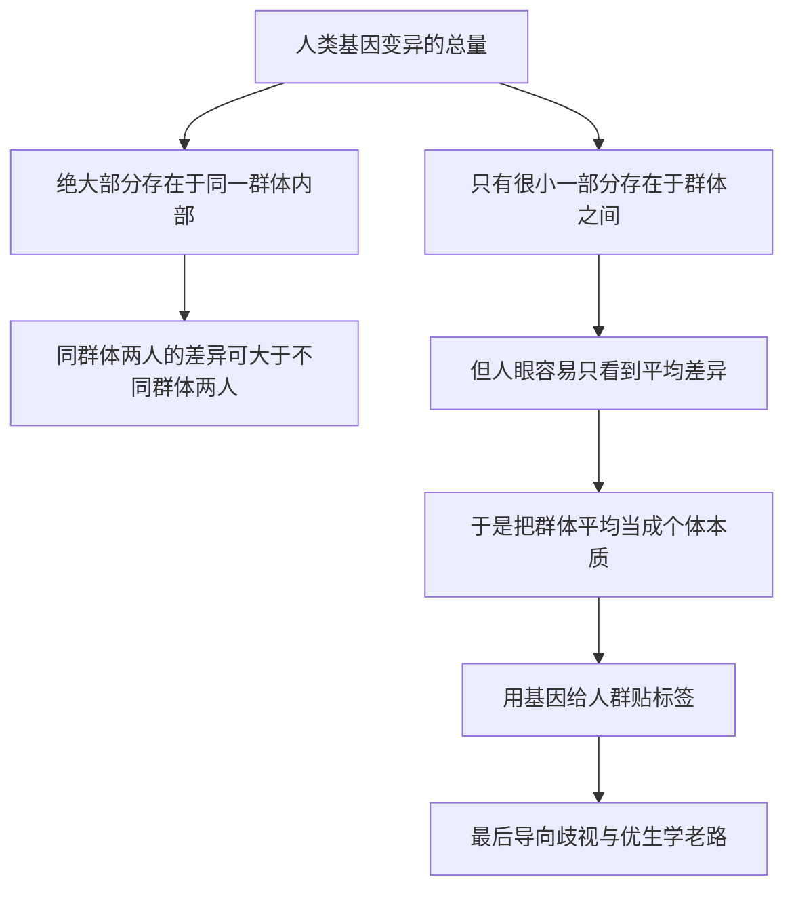

# 17｜种族、智力、性向：有多少写在基因里？

> 那些最容易引发争论的人类差异，究竟有多少是遗传决定的？

---

## 一、先说结论

这是这个系列里最需要小心下笔的一篇。种族、智力、性向这三个词，都曾被当作「基因决定的」使用，而每一次几乎都造成了伤害——优生学、强制绝育、种族隔离，都借用了「遗传」的语言。

**第一，生物学上，「种族」并不是清晰、封闭的遗传类别。** 人类内部的基因差异，绝大部分存在于任意一个群体之内，而不是群体之间。

**第二，智力、性向这样的复杂性状，受大量基因与环境共同影响**，简单归因极其危险。

**第三，穆克吉的立场是：科学的诚实，要求我们承认「我们还不完全知道」**，而不是急着用基因给人群排序、贴标签。

---

## 二、我们先理解一个问题

做一个思想实验。随机挑两个人：一个来自东亚，一个来自欧洲；再随机挑两个同城、同属一种「种族」的人。

现在问：哪一对的基因差异更大？

直觉会说是东亚人和欧洲人，但现代群体遗传学给出的答案恰恰相反：**大多数情况下，同一群体内部两个人的基因差异，比不同群体两个人平均而言还要大。** 因为人类高度混血、不断迁移，「种族」在基因上没有清晰边界。

于是问题来了：

> **如果一个类别在基因上并不清晰，我们凭什么用它解释智力、性向，甚至决定一个人的价值？**

---

## 三、作者到底提出了什么观点？

穆克吉没有给出斩钉截铁的「是」或「否」，而是把话说得非常克制。他的立场分三层。

**第一层，相对清楚的科学事实：** 人类基因组的变异绝大部分发生在任何一个人群内部，不同大陆人群之间的平均差异只占很小一部分。所谓「种族」更多是社会建构的类别，它在某些疾病风险和祖先来源上有相关性，但不是生物学分类。

**第二层，仍有真实的科学争议：** 智力、性向的遗传成分到底有多大？目前只能给出有限的、依赖人群和定义的估计。争议不在「有没有遗传成分」，而在「在不同环境下它意味着什么」。

**第三层，明确的滥用：** 把群体间的平均差异说成「天生优劣」，用它正当化歧视、剥夺权利——这不是科学，而是用科学名号包装的偏见。

> **面对这些问题，科学最重要的美德不是给出答案，而是守住诚实：承认复杂性，承认不确定性，拒绝用基因给人贴标签。**

---

## 四、把这个观点翻译成人话

一个人的基因像一本书的全部文字；而「种族」，更像书的封面颜色。

你可以按封面颜色把书分成几堆，这或许方便，但封面颜色不能告诉你书里写了什么，更不能说明哪本书「更好」。一旦有人开始用封面颜色判断内容，甚至据此决定谁能读书——那就从分类，变成了歧视。

「智力」和「性向」也有类似的陷阱：我们容易把它们想成单一开关，可现实更像一锅汤——无数配料加上火候，最后才形成味道。**你很难指着其中一味调料说，这锅汤的味道完全是它决定的。**

---

## 五、为什么会这样？

因为人的差异，是「群体内远大于群体间」的。

关键概念是**遗传率**：在某一群人中，某个性状的差异有多大比例和基因差异相关。它有三个容易被忽略的性质。

**一，它是群体的，不是个人的。** 「遗传率百分之五十」不等于「你的一半来自基因」。

**二，它依赖环境。** 营养充足时，身高差异可能更多来自基因；营养不足时，改善营养反而更能改变身高。

**三，群体内部遗传率高，不等于群体之间的差异也是遗传的。** 这是最危险的推理错误：即便某性状在群体内部主要由基因决定，两群体之间的平均差异，仍可能几乎全部来自环境、历史或机会的不平等。

「有多少写在基因里」这个问法，本身就预设了一个过于简单的世界：**基因和环境无法被干净地切开。**

---

## 六、举一个现实生活中的例子

镰刀型细胞贫血是一个清楚、也较少争议的医学例子。它由血红蛋白基因的一个突变引起，携带者（只带一份突变）对疟疾有抵抗力；该突变在历史上疟疾高发地区更常见——撒哈拉以南非洲、地中海沿岸、中东和印度。

关键在这里：**它和「疟疾流行区」相关，而不是和某个「种族」本质绑定。** 同一个所谓「种族」里，不同地区的人携带率差别很大；分属不同「种族」的人，只要来自疟疾流行区就可能携带。用「种族」作医学分类，远不如用祖先来源和地理历史准确。

再看智力和性向。不同群体的平均智力测验分数，历史上确实有差异，但如何解释才是争议核心：**智商分数不是智力的全部；而「弗林效应」显示，多国平均分数几十年持续上升，远快于基因变化**，说明环境与教育影响巨大。至于性向，2019 年一项大型基因组研究找到若干相关位点，但每个效应都极微弱，**根本不存在一个所谓「同性恋基因」**；双生子研究提示它有中等程度的遗传成分，但个人经历与自我认同同样重要。

---

## 七、回到书中重新理解

这一篇和前面优生学那几篇是一体的。穆克吉写那段历史时态度非常清楚：**优生学不是凭空出现的疯狂，它一开始穿着「科学」和「进步」的外衣。** 高尔顿、美国多州的强制绝育法、纳粹的种族卫生，都借用同一种语言——把遗传差异等同于人的价值。而种族、智力、性向，正是那套语言最常攻击的对象。

所以穆克吉的姿态是提醒我们：在真相尚未清楚之前，诚实的克制有多重要。**基因是理解人的一把钥匙，从来不是给人分等级的标准。**

---

## 八、这个观点背后还有什么？

至少两层。一是**「祖先」与「种族」的区别**：祖先来源是可追踪的历史事实，「种族」是被社会划分出来、边界模糊的类别；医学用祖先信息评估风险，靠的是地理历史关联，而非「种族」本质。二是**科学被政治利用的机制**：当社会已存在偏见，科学若给出含糊、可被曲解的结果，往往会被用来「证明」偏见早已认定的事。

---

## 九、这个观点有问题吗？

这一节必须真正面对争议，也要把不同性质的说法分清楚。

**科学事实（学界高度共识）：** 人类基因变异绝大部分在群体内部，群体间平均差异只占小部分；不存在清晰、封闭的「种族」基因边界；智力、性向是高度多基因、受环境影响的复杂性状，不存在决定性单一基因；没有任何科学证据支持「某个群体天生优于另一个群体」这种价值判断。

**仍有学术争议（结论未定）：** 某些复杂性状的遗传成分有多大，估计值依赖人群、定义与测量方式，尚不稳定；群体间某些测量性状的平均差异如何分解为基因与环境，学界仍有分歧；祖先信息用于医学的边界，也仍在探索。

**被滥用（历史反复发生、后果严重）：** 用群体平均差异推断某个具体个体的能力；用「基因」为歧视、隔离、绝育背书；把「尚未确定」包装成「已经证明」，制造群体优劣的叙事。

要特别指出一个逻辑陷阱：即便某性状在群体内部遗传率较高，也**完全不能**推出群体之间的差异是遗传的，因为两群人可能身处完全不同的环境、历史与机会。把「群体内遗传率」偷换成「群体间差异的遗传解释」，是科学史上被反复利用的错误推理。

也要承认，这类研究政治敏感，讨论容易被两边绑架——一边压下任何遗传研究，一边用「科学」之名推出歧视性结论。**穆克吉式的态度，是既不回避研究，也不让研究沦为标签的工具。** 底线必须毫不含糊：**人的尊严不取决于任何基因，以基因为由贬低某个群体，不是科学，而是偏见。**

---

## 十、今天再看这个观点

（以下为现代延伸，非穆克吉原文）

全基因组关联研究规模越来越大，出现了所谓「多基因评分」，甚至被用来预测教育成就。这类评分在群体层面或许有一点统计信号，但用在个体身上极不可靠，而且现有数据严重偏向欧洲血统人群，**直接套用既不准，也不公平。**

同时，基因编辑和「增强」的讨论重新升温，有人担心优生学会以新形式回来——不再是国家强制，而是市场化的「选择」。**只要还有人相信「基因决定价值」，历史就仍有重演的风险。**

---

## 十一、这一篇真正应该记住什么？

1. **「种族」不是清晰的生物学分类。** 人类基因差异绝大部分在群体之内，群体之间只占很小一部分。

2. **群体内部的遗传率，不能推出群体之间差异的遗传解释。** 这是最危险的推理错误。

3. **智力、性向都是多基因加环境的复杂性状，不存在决定性的单一基因。** 简单归因极其危险。

4. **必须区分三种说法：科学事实、仍有争议、被滥用。** 讨论遗传研究正当，用基因给人贴标签不正当。

5. **科学的诚实，是承认「我们还不完全知道」。** 而人的尊严，不取决于任何基因。

---

## 十二、留一个问题

我们已经看到：基因既不能决定一个人的种族价值，也不能单独解释智力与性向。

但有一个领域，基因的作用是明确而具体的：**它会引起疾病。**

那么，既然我们知道某些病源于某个基因的错误——

> **能不能干脆把「正确的基因」送进身体，把错误改回来？**

下一篇，我们就进入「改写生命」的开始：**基因治疗，以及那场让整个领域停下脚步的悲剧。**
