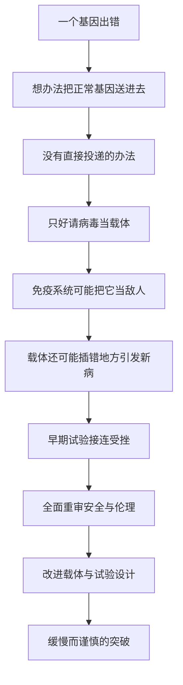

# 18｜基因治疗：从一场悲剧到重新出发

> 既然疾病源于基因，能不能直接把「正确的基因」送进身体里？

---

## 一、先说结论

前面十几篇，我们一步步走到了一个危险的门口：基因被证明是一段可以逐字阅读的指令，而一个字母写错，就可能改变一个人的一生。

于是最自然的念头出现了——**既然错的是信息，那把它改回去不就行了？**

穆克吉没有把这个念头写成好消息。他写的是它的曲折：基因治疗几乎与分子生物学一样古老，却一次次撞在现实的墙上。1999 年，十八岁的杰西·盖辛格在一项基因治疗试验中死亡，成了整个领域最沉重的警钟。

这一篇的结论是：**基因治疗证明的不是技术有多强，而是越强大的技术，越需要以最谨慎的敬畏去使用。**

---

## 二、我们先理解一个问题

先想象一个场景。

你家的水管漏水，是因为某个阀门装反了。既然知道问题在哪，是不是直接换一个好的上去就行？

听起来简单，可你马上会遇到一连串麻烦：好阀门往哪儿放？怎么送进去？送进去会不会把管子撑爆？邻居家的水压会不会把它冲走？

基因治疗面对的就是这些问题。我们知道哪个基因错了，甚至知道错在哪个字母上。可「正确的基因」既不是一颗药丸，也不是一针疫苗。它是一段很长的分子，是一整套操作说明。你要把它送进几十万亿个细胞里的**某些**细胞，还要让它安分地待在那里、被正确读取、不惹出别的麻烦。

所以真正的问题不是「能不能想到」，而是：

> **把一段信息送进人体，为什么比想到这件事难上几十倍？**

---

## 三、作者到底提出了什么观点？

穆克吉在书里对基因治疗的态度，与其说是鼓吹，不如说是**审慎**。

他的观点大致可以概括为三层。

第一，基因治疗的逻辑本身是干净的。疾病既然可以追溯到基因层面，那么从根源上补偿或替换，理应是一个方向。

第二，基因治疗真正的困难，从来不在「改什么」，而在「怎么送、送到哪、送完之后会怎样」。**技术最难的部分，往往不是设计，而是交付。**

第三，也是他最沉重的一层：当科学从「理解」走向「干预」，它就不再只是实验室里的事。它会直接落在具体的人身上：一个十八岁的少年，一对签下知情同意书的父母。

穆克吉警惕的不是技术本身，而是人类在还没有学会安全地使用它之前，就已经急着使用它。

---

## 四、把这个观点翻译成人话

打个比方。

把基因想象成一封很长、很重要的信。信里写着「这个酶该怎么造」。有人这封信写错了一个字，身体读错指令，于是生病。

最直觉的办法是：再寄一封正确的信过去。

可人体不是空信箱。它更像一座守备森严的城堡：外来分子会被检查、被拦截、被清除。你不能光明正大地走进去，只能想办法搭一辆「便车」。

科学家找到的便车，是病毒。

病毒在进化里练了几亿年的本事，就是把自己的基因送进细胞。于是研究者把病毒「掏空」，装上人类想要的基因，让它当快递员。这个被改造过的病毒，就叫**载体**。

问题也随之而来：这个快递员是从「敌人」改装的。身体的守门人未必认得它已经改邪归正——一次强烈的误判，就可能引发致命的后果。

---

## 五、为什么会这样？

因为在基因治疗里，「送进去」这件事本身就同时踩中了三重风险。

第一重是免疫。腺病毒这类载体在人群里很常见，很多人早就有抗体，或者身体记得它。剂量一高，反应就可能失控。

第二重是插入。早期常用逆转录病毒做载体，它把基因插进细胞基因组，位置是随机的。万一正好插在一个控制细胞生长的基因旁边，就可能把它「点着」——这正是后来一些儿童在治疗重症联合免疫缺陷后罹患白血病的机制。

第三重，是疾病本身的复杂度。基因治疗最擅长对付的，是**单基因、机制清楚、受影响组织明确**的病。而人类大多数常见病——心脏病、糖尿病、多数癌症——都是多基因、多环境因素交织的结果。对这些病，我们连「改哪一个」都还说不清。

---

## 六、举一个现实生活中的例子

1999 年，美国宾夕法尼亚大学的一项试验，招募了患有鸟氨酸氨甲酰转移酶缺乏症（OTC 缺乏症）的受试者。

这种病的成因清楚：一个基因出错，肝脏处理氨的能力下降。研究的思路也很直接：用改造过的腺病毒，把正常基因送进肝脏。

杰西·盖辛格，十八岁，患的是相对温和、靠饮食和药物可以控制的那种。他参加试验，一部分原因是想帮同样患病的婴儿——这项试验本身并不预期能治好他。他接受了较高剂量的载体，经肝动脉输入。几天后，他的免疫系统剧烈反应，多器官衰竭，最终死亡。

后来的调查指出了一些令人不安的事实：此前在高剂量动物实验中已出现死亡，其他受试者也出现过肝毒性，但这些风险的告知并不充分；他也可能并不完全符合入组标准。

**这不是一个「技术失败」的简单故事，而是一个关于知情同意、受试者保护和研究压力的故事。**

这场悲剧之后，美国监管部门暂停了多项试验，整个领域被重新审视。此后二十多年，基因治疗走得很慢：中国在 2003 年批准过一款 p53 基因治疗产品，欧洲 2012 年批准的 Glybera 后来因商业原因退出市场；真正的转折出现在 2017 年之后——治疗遗传性视网膜病变的 Luxturna、治疗脊髓性肌萎缩的 Zolgensma 相继获批。它们价格高昂，却确实改变了某些孩子的一生。

---

## 七、回到书中重新理解

现在再看穆克吉的写法，就能明白他为什么不把基因治疗写成凯歌。

他关心的不是「这是不是好技术」，而是**当科学从观察者变成干预者，它必须背负什么**。

盖辛格的死亡不是孤例，而是整个领域的成人礼：它逼着科学家承认，自己面对的从来不是「一个基因」，而是活生生的人、焦急的家属，以及可能被速度牺牲掉的谨慎。

而他给出的答案，恰恰是克制：不是放弃，而是慢一点、严一点、把风险说清楚。基因治疗后来能重新出发，靠的正是这种并不痛快的谨慎。

---

## 八、这个观点背后还有什么？

这个观点背后，藏着一个更深的结构问题：**交付问题，是生物技术共同的瓶颈。**

我们其实不止一次遇到它。CAR-T 要先把病人的免疫细胞取出来、在体外改造、再输回去——因为「直接送进去」太难；RNA 疫苗要包在脂质纳米颗粒里，才不会被迅速降解。

**发现一个靶点，和把药物准确送到靶点，是两件难度完全不同的事。** 基因治疗的百年曲折，很大程度上不是理念的失败，而是物流的失败。

第二层是经济。基因治疗往往「一次给药、长期甚至终身有效」，这让它的定价逻辑极其尴尬：如果一次治疗就能治愈，那该收多少钱？Glybera 退市、Zolgensma 数百万美元一针，背后都是同一道难题——**科学上的成功，未必是商业和公平上的成功。**

---

## 九、这个观点有问题吗？

需要格外小心地拆几层。

第一，把盖辛格事件说成「基因治疗失败的证明」，是过度简化。它同时是**监管、伦理和沟通的失败**。事实上，这件事之后，受试者保护和利益冲突披露制度被显著强化。

第二，基因治疗与基因编辑，并不是一回事。传统基因治疗多是「补一个基因」或「加一个基因」，并不精确修改原有基因组；而 CRISPR 那类工具是直接在原位改写。两者在风险与伦理上的问题并不相同，不能混为一谈。

第三，伦理争议确实存在真实分歧。有人认为，对绝症患者，即使风险高也应允许尝试——这是自主权；也有人认为，早期试验的风险与获益严重不对等，患者往往被「最后的希望」绑架。这需要制度去平衡。

最后还有一个滑坡的担忧：如果「治病」被允许，那「增强」呢？如果一项技术能让孩子不得遗传病，能不能顺便让他更高、更强？这条坡在每个环节都看似合理，却可能一路滑很远。

---

## 十、今天再看这个观点

（以下为现代延伸，非穆克吉原文）

今天，基因治疗已经不再是「未来」。CAR-T 让部分血液肿瘤患者获得长期缓解；2023 年，基于 CRISPR 的疗法 Casgevy 获批用于镰刀型细胞贫血和β地中海贫血，成为基因编辑走向临床的标志性事件；针对血友病、遗传性失明的疗法也在陆续落地。

但真正的难题，反而更清楚了。

一是**可及性**。一次性数百万美元的价格，意味着它先惠及最富裕的人。一种只能被少数人使用的治愈，算不算公共健康意义上的成功？

二是**长期安全**。插入突变、脱靶、免疫反应，都需要以十年为单位追踪。首批接受治疗的孩子，如今已长大成人——他们本身就是一部仍在书写的安全性数据。

三是**边界**。基因治疗越成功，「治疗」与「增强」的界线就越模糊，而它通向的下一站，正是克隆、干细胞与 CRISPR 那些更难回答的问题。

---

## 十一、这一篇真正应该记住什么？

1. **基因治疗的核心难点是「交付」**：送什么、怎么送、送到哪、送完之后会怎样，远比「想到要改」困难。

2. **盖辛格事件不是简单的技术失败**，它暴露的是知情同意、风险披露、研究压力与监管的系统性问题。

3. **安全是慢出来的**：基因治疗能重新出发，靠的是更严格的试验设计和更谨慎的载体改进，而不是更快的脚步。

4. **治疗与增强之间是一条滑坡**：一旦允许为治病而改动基因，边界就开始变得模糊。

5. **强大的技术需要谨慎的敬畏**：这句话不是保守，而是这个领域用生命换来的经验。

---

## 十二、留一个问题

基因治疗要解决的，是把基因送进**这个病人**的身体——它改变的是一个人，且通常不会传给他的孩子。

可如果能力再往前一步：不只是送一段基因进去，而是**复制一个完整的生命**；或者把细胞变成任何我们想要的组织——那么「一个人的身体」和「一个人的独特性」之间，还剩下什么区别？

下一篇，我们就来看克隆与干细胞：**当生命可以被复制、被制造，我们到底在创造什么？**
