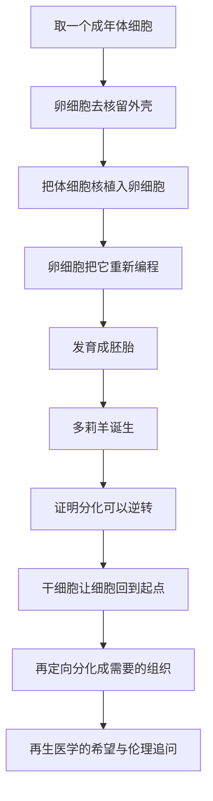

# 19｜克隆与干细胞：创造生命的边界

> 当我们能复制生命、培养细胞，生命的边界还剩下什么？

---

## 一、先说结论

基因治疗是在**一个人体内**做修改；而克隆与干细胞，动的是更根本的东西——**生命的来源与形态**。

一只叫多莉的羊，让人类第一次证明：一个已经分化、已经「决定」了自己命运的成体细胞，可以被重新「拨回去」，长成一整个新的个体。而干细胞研究则从另一个方向逼近同一件事：让细胞回到起点，再把它变成我们需要的组织。

这条路的尽头，有两个方向截然相反的声音：一个是希望——帕金森、糖尿病、脊髓损伤或许终于有了新办法；另一个是恐惧——如果生命可以被复制、被制造，那「我」这个独一无二的人，还意味着什么？

穆克吉没有给出轻松的答案。他让我们看到的是：**技术与伦理在这里第一次正面相撞。**

---

## 二、我们先理解一个问题

先问一个反常识的问题：**双胞胎不就是「复制」吗？为什么克隆让我们这么不安？**

同卵双胞胎来自同一个受精卵分裂，基因几乎完全相同。他们既是自然现象，又从来不被当成「同一个人的副本」。为什么？

因为我们心里默认：双胞胎是「恰好长得一样」的两个人；而克隆，是「被制造出来的另一个你」。

这里的差别不在基因，而在**来源和意图**。双胞胎来自一次自然的分裂；克隆来自一次人为的决定——有人挑选了你的细胞，决定让它变成一个生命。

所以真正的问题不是：

> **我们能不能复制一个生命？**

而是：

> **当我们能复制时，被复制出来的那个，究竟是「谁」？**

---

## 三、作者到底提出了什么观点？

穆克吉在书中对克隆与干细胞的讨论，主线不是技术细节，而是**它如何动摇我们对「个体」的想象。**

他的观点大致有几层。

第一，克隆在科学上真正的震撼，不是「造出一只羊」，而是证明了一件事——**细胞的分化不是不可逆的单行道。** 一个乳腺细胞里，仍然完整地保存着长成整只羊的全部信息。

第二，「复制」这个说法本身是误导的。克隆得到的从来不是一个完全相同的人，甚至连完全相同的动物都不是。基因组的复制，远不等于生命的复制。

第三，也是他反复回到的：**每当人类获得「创造生命」的能力，关于「人是什么」的问题，就会从哲学课堂冲进现实。**

---

## 四、把这个观点翻译成人话

想象一份工作简历。

一个成年人，已经选定了职业——他是会计，一辈子都在做账。这就是「分化的细胞」：它只做一件事，别的能力看起来消失了。

克隆技术做的事，相当于把这个会计重新送进大学，让他从大一重新选专业，最后居然又走完了整个人生，成了一个全新的、完整的人。这说明：**那个「会计」的档案里，其实一直藏着所有专业的招生简章，只是它们被锁起来了。**

干细胞研究的思路，恰好是这条路的另一半：不是「让一个已经选好专业的人重来」，而是**找到那些还没选专业的学生**——胚胎干细胞，或者被人为「退回学生状态」的细胞——然后引导他们去学我们想要的专业：心肌、神经、胰岛。

一个负责「从头再来」，一个负责「定向培养」。

---

## 五、为什么会这样？

因为生命的信息，并不只写在基因序列里，还写在**「哪些基因被打开」**上。

关键在于「重新编程」。

一个乳腺细胞和一个人的神经细胞，基因序列几乎一样，差别主要在**表观遗传标记**——哪些基因被打开、哪些被关闭。多莉的诞生说明，卵细胞的细胞质里存在某种力量，能把已经贴好的「开关标签」大致擦掉，让细胞回到接近起点的状态。

后来的干细胞技术，本质上是把这件事在培养皿里、用化学和基因手段重现：先让细胞回到起点（诱导多能干细胞），再给它一套新的「培养方案」。2012 年，山中伸弥因为发现这种方法获得诺贝尔奖，与他分享奖项的，是更早证明「细胞核可以被重编程」的格登。

**这解释了一件事：命运之所以看起来「锁死」，很多时候不是因为信息丢了，而是因为开关被固定了。**

---

## 六、举一个现实生活中的例子

1996 年，英国罗斯林研究所的一只小羊出生，第二年它被公之于众，名字叫多莉。

它的特殊之处在于：它来自一只成年母羊的乳腺细胞。研究人员把这个细胞核放进一个去核的卵细胞，最终长成一只活生生的羊。在此之前，人们认为用成体细胞复制哺乳动物是做不到的。

多莉后来有健康问题：它得过关节炎，2003 年因肺部疾病被安乐死，只活了大约六年半。这提醒人们，克隆并非「无痛复制」，重编程过程中的异常、以及克隆胚胎的高失败率，都是真实存在的代价。

而干细胞这边，故事更贴近临床：科学家已经能诱导多能干细胞分化出心肌细胞、胰岛样细胞、神经元，并在实验室里研究用它们修复受损组织。2010 年前后，美国曾批准过首例利用胚胎干细胞治疗脊髓损伤的人体试验，后来因商业与资金原因中止——希望与挫折，几乎是并行的。

---

## 七、回到书中重新理解

现在再看穆克吉为什么把克隆和干细胞放在「改写生命」这一部分。

因为它们共同指向一个前提：**生命不再只是「被理解」的对象，而成了「可以被操作」的材料。** 一旦跨过这条线，问题就不再只是「能不能做到」，而是「我们依据什么来决定做什么」。

他并不认为克隆必然是灾难。他真正警惕的是：当人类拥有了创造生命的能力，却还没有想清楚「我们凭什么决定一个生命的样子」，力量就会跑在判断力前面。

---

## 八、这个观点背后还有什么？

一个反直觉的事实是：**克隆并不产生「完全相同的个体」。**

首先，克隆胚胎的细胞质来自卵细胞提供者，线粒体 DNA 往往不是原来那个人的。其次，发育过程中的表观遗传重编程并不精确，同一套基因可能被「打开」得不同。再次，从出生那一刻起，环境、经历、偶然就完全不同——而人之所以是人，很大一部分正来自这些不可复制的部分。

所以「复制一个人」，在生物学上就已经不成立。真正被复制的，只是一份「起点说明书」。

这也让「个体的独特性」这个问题变得更微妙：如果独特性不只由基因决定，那么克隆真正动摇的，可能不是生物学，而是我们的**心理叙事**——我们希望自己是不可替代的，而技术似乎在说：「你的一部分可以再来一份。」

---

## 九、这个观点有问题吗？

这里的伦理分歧，比基因治疗更尖锐，而且没有共识答案。

第一，克隆人如果真的发生，安全问题极其严重。动物克隆的失败率、畸形率、出生后异常都远高于自然繁殖。**在安全都无法保证时，「尝试克隆人」就不是自由，而是把风险强加给一个无法同意的生命。**

第二，是心理与自主问题。一个为「替代某人」或「实现某个期待」而被制造的孩子，将来如何面对自己的人生？他有没有权利要求「我只是我」？

第三，干细胞研究把争论引向另一个维度：**胚胎的道德地位。** 早期胚胎干细胞研究需要破坏胚胎，一些人认为这等同于伤害生命，另一些人则认为早期胚胎尚不具备人格地位。这是宗教、哲学与法律交织的分歧，无法靠实验数据解决。

第四，还有「滑坡」的担忧：治疗性克隆（用克隆胚胎获取细胞）与生殖性克隆（让克隆胚胎长成人），只差最后一步——「把它放回子宫」。许多国家因此明确立法，禁止生殖性克隆，同时对治疗性克隆保持谨慎。

需要说明的是：**把主张「研究干细胞」等同于主张「克隆人」，是一种常见但过度的推论。** 这两者在目的、手段与伦理考量上都有实质差别。

---

## 十、今天再看这个观点

（以下为现代延伸，非穆克吉原文）

今天的进展，某种程度上「绕过」了当年最尖锐的争论。诱导多能干细胞技术让科学家不必再依赖胚胎，也能得到多能干细胞，这在伦理上缓解了很大一部分冲突，尽管它也有自己的安全性问题。

同时，类器官（在培养皿里长出的迷你器官）让研究者能在不触碰「制造生命」红线的前提下研究疾病；干细胞与基因编辑结合，正在向「修复病人自己的细胞再输回去」的方向走。克隆本身则主要在农业和宠物领域商业化——克隆宠物已经是可以付费购买的服务。

但核心追问没有被解决，只是换了形式：**我们愿意把「生命」这个词，扩展到什么程度？** 当一个培养皿里的细胞团越来越像器官，当一个克隆动物越来越健康，那条「可以做什么」的红线，还是不是当初那一根？

---

## 十一、这一篇真正应该记住什么？

1. **克隆在科学上最重要的意义，是证明分化可逆**：成体细胞里仍保存着发育成完整个体的全部信息。

2. **「复制」是误导的说法**：克隆复制的是起点，不是个体；线粒体、表观遗传、环境与经历都不同。

3. **干细胞的希望是真的，代价也是真的**：重编程伴随着失败与风险，不是无痛的魔法。

4. **技术与伦理在这里第一次正面相撞**：胚胎地位、代际同意、个体独特性，都是没有唯一答案的问题。

5. **把研究干细胞等同于主张克隆人，是过度推论**：目的和手段不同，需要分别判断。

---

## 十二、留一个问题

克隆与干细胞让我们看到：生命的「形态」可以被改写。

但如果改写可以更精确、更便宜、更简单呢？如果有一天，修改一个基因，就像在电脑文档里用「查找替换」那么直接——我们还能靠「技术太难」来推迟伦理决定吗？

下一篇，我们就来看那把被称作「改写生命的剪刀」的工具：**CRISPR。**
