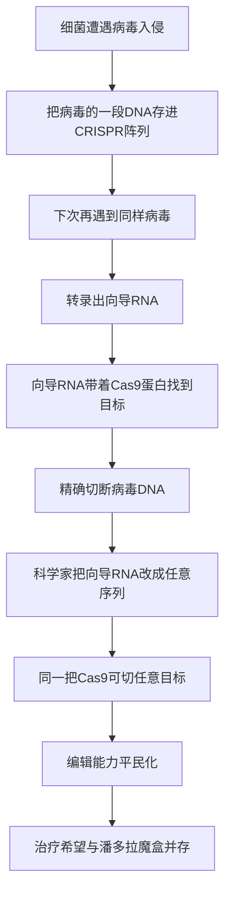

# 20｜CRISPR：一把改写生命的剪刀

> 为什么 CRISPR 被称为「改写生命的剪刀」，它到底革命在哪里？

---

## 一、先说结论

如果说基因治疗是「送信」，克隆与干细胞是「重开一局」，那么 CRISPR 带来的，是一种前所未有的能力：**在几十亿个字母的基因组里，找到指定的一处，剪开它，再改成你要的样子。**

但 CRISPR 的革命性，并不只在「能改」。在此之前，科学家早就能改基因了。真正的转折是：它**便宜、简单、高效**——一个普通实验室、一个研究生，就能上手。

这正是它让人又兴奋又恐惧的地方。穆克吉的写法里透出一种复杂情绪：**知识已经到来了，如何接住它，成了全人类的问题。**

---

## 二、我们先理解一个问题

先做一个思想实验。

假设有一本书，三十亿个字，字与字之间几乎没有标点，而且每一页都长得差不多。现在要你把其中一个写错的字找出来，改成正确的。

问题不是「怎么改」，而是：**你怎么找到它？**

这就是基因编辑的核心难题。基因组不是一张有目录的地图，而是一段极长的、由 A、T、C、G 四个字母组成的序列。你要找的那个位置，靠人眼、靠扫描，几乎不可能。

所以在 CRISPR 之前，基因编辑要么极其笨拙，要么只能在极少数特定情况下进行。真正的问题一直是：

> **有没有一种办法，能带着「坐标」走进基因组，精确定位、精确切割？**

CRISPR 给的答案，出人意料地简单：**让 RNA 当向导，让蛋白质当剪刀。**

---

## 三、作者到底提出了什么观点？

穆克吉在书里对 CRISPR 的处理，重点不在技术炫技，而在**它把「改写生命」这件事的门槛，降到了一个临界点以下。**

他的观点大致有几层。

第一，CRISPR 的故事有一个漂亮的起源：它不是人类发明的，而是**从细菌身上「借」来的**。细菌用它来记住并抵御病毒——这是自然界早就存在的免疫系统。

第二，真正的革命是**可编程性**。同一把 Cas9 蛋白，只要换一段向导 RNA，就能去切不同的目标。这意味着一种通用工具，而不是一把只能开一把锁的钥匙。

第三，也是最重的：**技术变得越简单，约束它的就越不可能只是技术本身。** 当「能不能」不再是问题，「该不该」就必须由人来回答。

---

## 四、把这个观点翻译成人话

打个比方。

旧日的基因编辑，像手工雕刻：你得是技艺高超的匠人，花很长时间，才能在一个极其复杂的对象上，改一小刀。能做的人凤毛麟角。

CRISPR 出现后，它更像是给基因组装上了一套**可以输入坐标的数控机床**：你告诉它去哪、切哪儿，它就去执行。精度和效率都上了不止一个台阶，而操作门槛却一下子降下来。

但要注意：**门槛降低不等于风险降低。** 一台谁都能用的锋利机床，做坏事的成本也一起降低了。这就是为什么 CRISPR 的道德分量，反而比它之前那些「高不可攀」的技术更重。

---

## 五、为什么会这样？

因为 CRISPR 的作用机制，天然就是「可编程」的。

关键在两步。

第一步是**识别**。向导 RNA 的序列，与目标 DNA 一一配对。你想切哪儿，就把向导设计成哪一段的「镜像」。这就是「可编程」的来源。

第二步是**切割**。Cas9 像一把分子剪刀，在向导的带领下到达位置，把 DNA 双链剪断。

剪断之后，细胞会启动修复：要么把断口草率粘回去（常导致基因失效），要么在提供模板的情况下照模板补上正确的序列（实现精确修改）。科学家正是利用这两种修复方式，做到「敲除」或「改写」。

旁边还有一个细节叫 PAM——一段很短的序列，Cas9 需要先「认得」它，才会动手。这既限制了 CRISPR 能切哪里，也让脱靶的可能性被约束在某种程度上。

---

## 六、举一个现实生活中的例子

先说它的来源。

1987 年，日本研究者在细菌基因组里发现了一段奇怪的结构：一些短序列反复出现，中间夹着不重复的间隔。当时没人知道它是干什么的。后来，随着更多细菌基因组被测序，这些「重复」被命名为 CRISPR（成簇规律间隔短回文重复）。2007 年，一组研究者用实验证明：细菌靠这套系统，把入侵过的病毒片段记下来，从而对再次入侵产生免疫。**这是细菌的「疫苗接种」记录本。**

2012 年，杜德纳与沙尔庞捷证明：可以用一段人工设计的 RNA，引导 Cas9 在指定位置精确切割 DNA。2013 年，张锋、乔治·丘奇等团队证明它可以编辑人类细胞。2020 年，杜德纳与沙尔庞捷获得诺贝尔化学奖。

然后是临床。2023 年，基于 CRISPR 的疗法 Casgevy 获批，用于镰刀型细胞贫血和β地中海贫血：研究者取出病人的造血干细胞，用 CRISPR 重新打开胎儿血红蛋白的开关，再输回病人体内。这是 CRISPR 从实验室走进药房的标志性一步，也说明它确实能救命。

---

## 七、回到书中重新理解

再回到穆克吉的警惕，就能理解他为什么情绪复杂。

他不是在反对 CRISPR。恰恰相反，他清楚这类工具可能带来的医学突破。他担心的是**一场「能力跑在判断力前面」的加速**。

在这本书里，他反复讲优生学的历史：那门学问当年也是「科学的」「进步的」，却把人类带到了最黑暗的地方。如今，改写基因的门槛比任何时代都低，而人类对自身价值的判断力，并没有以同样的速度提升。

所以他给出的不是「禁止」，而是一种清醒：**先想清楚我们要什么，再让技术去实现，而不是让技术替我们定义要什么。**

---

## 八、这个观点背后还有什么？

CRISPR 背后，藏着几个不太被公众注意的结构性问题。

第一是**专利与利益**。杜德纳与沙尔庞捷的团队，与张锋所在的博德研究所，长期围绕 CRISPR 的核心专利发生争议，涉及「谁能用、要付多少钱」。这说明一项基础发现如何迅速变成一门生意，而定价权会直接影响谁能用得起治疗。

第二是**脱靶与嵌合**。向导序列可能认错位置，导致非预期修改；在胚胎或早期细胞中编辑，还可能产生「镶嵌」——一部分细胞改了、一部分没改。这既是技术问题，也是安全评估的难点。

第三是**生态风险**。CRISPR 不只能用于人。所谓「基因驱动」，可以让某个经过改造的基因在野生种群中迅速扩散——比如让蚊子不能传播疟疾。它可能是公共卫生的巨大胜利，也可能造成不可逆的生态后果。这里的「不可逆」，比临床失误更让人不安。

第四是**共识的脆弱**。CRISPR 领域其实有相当明确的共识：生殖系编辑（会遗传给后代）不应进入临床。可共识没有强制力。它靠的是科学共同体的自律——而只要有人不遵守，共识就可能被一次事件击穿。

---

## 九、这个观点有问题吗？

有几个常见的争议点，需要分开看。

第一，「精准」是不是真的精准？CRISPR 常被形容为「分子手术刀」，但它并非零误差。脱靶、大片段缺失、染色体结构改变，都已被报道。**把它说成「可以随便改而不留痕迹」，是过度美化。**

第二，编辑本身就一定更好吗？有时候，把致病基因彻底关闭，比精确改回某个序列更安全、更可行——技术路线之争并不简单。而且人们对「安全性」的期待，也随着它进入临床而不断提高。

第三，反对增强与反对研究，是两件事。有人反对把 CRISPR 用于生殖系，却支持它用于体细胞治疗和基础研究；也有人主张，在严格监管下应该允许对生殖系编辑进行科学研究。**把不同立场简化成「支持技术 vs 反对技术」，会丢掉真正重要的分歧。**

第四，还有公平问题。如果一项治疗只能被少数人负担，它在改善人类健康的同时，可能也在放大不平等。这不是 CRISPR 独有的问题，但它把问题推到了最尖锐的地方。

---

## 十、今天再看这个观点

（以下为现代延伸，非穆克吉原文）

CRISPR 之后，编辑工具还在快速迭代。碱基编辑可以在不切断双链的情况下把单个字母换掉；先导编辑则能更灵活地「查找并替换」。它们的目标都一样：更少的意外，更精细的修改。

递送技术也在进步：如何把编辑工具送进肝脏、眼睛、肌肉甚至大脑，是当下最关键的瓶颈——这又回到了基因治疗那个老问题：**发现改什么只是开始，送进去才是难关。**

与此同时，治理在追赶：世界卫生组织建立了人类基因组编辑的登记与咨询机制，多个国家出台了监管规则，科学界也在持续讨论可遗传编辑的「红线」在哪里。但现实是，法规更新永远慢于工具更新。

CRISPR 真正教会我们的，或许不是「我们终于能改基因了」，而是：**当工具强大到人人可用，文明才第一次真正面对自己的选择。**

---

## 十一、这一篇真正应该记住什么？

1. **CRISPR 源自细菌的免疫系统**：细菌用它记住并抵御病毒，人类把它改造成了通用编辑工具。

2. **它的革命在于「可编程」**：换一段向导 RNA，就能换一个目标，这使它廉价、简单、高效。

3. **门槛降低，风险也一起降低**——不是变得无害，而是变得人人可及。

4. **「精准」是相对的**：脱靶、嵌合、结构变异都是真实问题，不能神话这项技术。

5. **约束它的不会是技术本身**：法律、规范、科学共同体的自律，一个都不能少。

---

## 十二、留一个问题

体细胞编辑治疗的是一个病人，改完不会传给下一代，我们大体上能接受。

但如果把同一把剪刀，用在**一个还没有出生、也不可能同意**的胚胎上，改变的是他一生、甚至他后代的基因呢？

我们会说：「这是在预防疾病。」可如果有一天，被改的不是疾病，而是身高、智力、外貌呢？

下一篇，我们就来看设计婴儿：**我们该不该编辑下一代？边界在哪里？**
