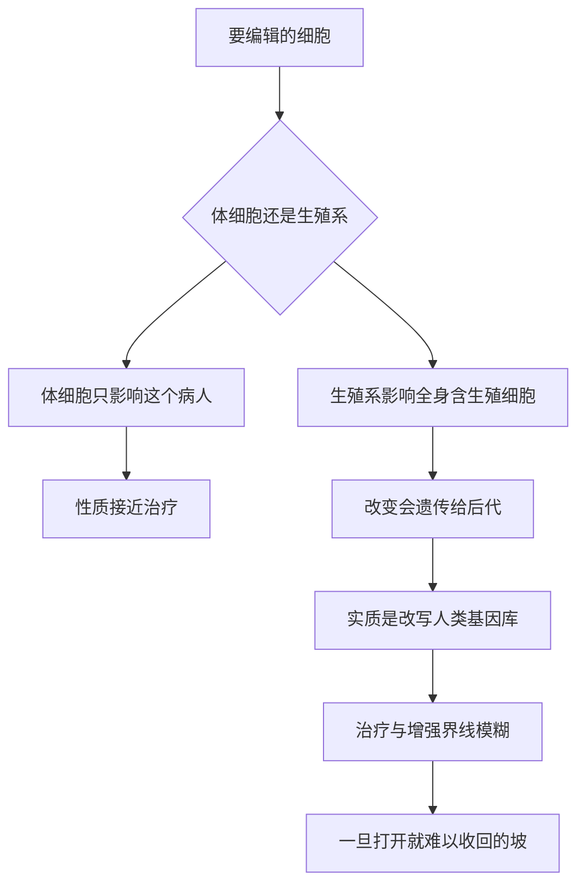

# 21｜设计婴儿：我们该不该编辑下一代？

> 如果可以，在胚胎阶段修改孩子的基因，我们该做吗？边界在哪里？

---

## 一、先说结论

到这里，问题终于触及最核心的地方。

体细胞编辑和生殖系编辑，看起来只差「改在哪一类细胞」，性质却完全不同：前者治疗的是**这个病人**，改完不会传下去；后者改的是**一个将来的人**，而且这个改变会进入他的生殖细胞，传给他的孩子、孩子的孩子。

前者更像医疗，后者更像**改写人类基因库的一段文本**。

而一旦允许「为了更好」而编辑——更聪明、更高、更强、更不容易生病——我们就会撞上一个前所未有的问题：**谁来决定什么是「更好」？**

穆克吉的答案里没有舒适的选项。他让我们看清：**「治愈」和「增强」之间，是一道一滑就滑下去的坡。**

---

## 二、我们先理解一个问题

先做一个假设。

有一对夫妻，男方携带亨廷顿病的致病突变。这种病通常在中年发病，目前无法治愈，会逐步摧毁一个人的运动、认知和精神。他们有两条路：一是通过胚胎筛选（植入前遗传学诊断），挑出不带突变的胚胎；二是用基因编辑，把一个正常胚胎的突变改掉。

很多人会说：这有什么问题？救一个孩子免于可怕的疾病，不是好事吗？

再看另一个假设。同一对夫妻，身体健康。他们希望孩子将来更高一些、数学更好一些。于是也想改一改。

同样叫「基因编辑」，你的直觉却完全不同。

所以真正的问题不是「能不能编辑胚胎」，而是：

> **同样一把工具，为什么用在第一种情形下很多人能接受，用在第二种情形下却让人本能地不安？这条界线画在哪里？**

---

## 三、作者到底提出了什么观点？

穆克吉在书里讨论这个问题时，立场是谨慎而清醒的。

他的观点大致有几层。

第一，**体细胞与生殖系必须分开谈。** 前者改变的是病人自己，后者改变的是一个无法同意的后代，并且影响可遗传。两者在同意、风险和代际责任上根本不同。

第二，**「治疗」与「增强」的界线，比它看起来模糊得多。** 抵抗某种传染病算治疗还是增强？提高肌肉量以预防老年跌倒呢？概念一旦开始滑动，就很难再停住。

第三，他真正的担忧不在某一次编辑，而在**方向**：当社会开始把基因当作「优化的对象」，它离「把人的价值等同于某些性状」就不远了——而这正是优生学历史的回声。

---

## 四、把这个观点翻译成人话

用一个装修的比方。

体细胞编辑，像是给一栋已经建好的房子换窗户、修电路。房子还是这栋房子，改动只关乎现在住在这里的人。

生殖系编辑，更像是**修改一份会传给所有后代的建筑图纸**。你改的那一笔，不只是这一栋房子的问题，而是以后每一栋照这张图纸盖的房子的起点。更麻烦的是，你还不知道一百年后的人会不会想要那种结构。

而且这份图纸的主人——那个将来会照它长成的孩子——**从头到尾没有机会说同意或不同意。**

这就是为什么「设计婴儿」这个词让人不安：它把一个还未来到世上的人，当成了一个可以被设计的产品。

---

## 五、为什么会这样？

因为生殖系编辑同时踩中了四道难题，而且它们互相纠缠。

第一道是**安全**。胚胎编辑出错，影响的是一个人完整的一生，而且这种错误会遗传下去。伦理审查在这里之所以格外严格，正是因为「后果不可撤回」。

第二道是**同意**。接受治疗的大人可以签字；被编辑的胚胎不能。由父母代为一个未来的人决定他基因组的根本样貌，这本身就是一个没有得到解决的伦理难题。

第三道是**代际责任**。今天我们觉得「更聪明」「更高」是好事，一百年后的人未必同意。我们有权替未出生者做这种不可逆的决定吗？

第四道是**公平**。如果只有付得起钱的人能给孩子「增强」，那么基因层面的不平等就会叠加到社会不平等之上。**这可能是所有问题里最现实、也最容易被低估的一个。**

---

## 六、举一个现实生活中的例子

其实，「选择孩子的基因」在某种程度上**已经存在**了。

植入前遗传学诊断（PGD）在辅助生殖中已被广泛使用：在体外受精的胚胎里进行检测，选择不携带某种严重致病突变的胚胎植入。它在很多国家是合法的，也被很多人接受为「避免孩子患重病」的正当手段。

于是出现了更微妙的问题：如果**筛选**是允许的，那**编辑**为什么不同？两者不都是父母在为孩子「挑基因」吗？

区别至少在于：筛选是在已有的胚胎里**挑选**，不改变任何胚胎的基因；而编辑是**制造**一个原本不存在的改变，并且这个改变会在后代中延续。「选择」和「改写」之间的距离，正是伦理争论的关键地带。

另一个必须提的历史节点是 2015 年：中国的研究者首次报告在人类胚胎（当时使用的是无法发育成个体的异常胚胎）中尝试基因编辑，引发全球科学界的强烈反应。同年，人类基因编辑国际峰会在华盛顿召开，明确建议：**生殖系编辑不应进入临床。** 这是一条被广泛认可的共识红线。

---

## 七、回到书中重新理解

再回到穆克吉的整本书，就能看出「设计婴儿」为什么是它的高潮问题。

因为一路走来，他终于把我们带到这个位置：人类不仅读懂了生命的语言，还学会了修改它。而这门学问的历史，已经用优生学的惨痛教训提醒过我们——**当「科学」开始定义谁更值得存在，灾难就不远了。**

穆克吉的立场不是禁止，而是克制与自省。他要问的不是「技术能不能」，而是：我们凭什么替未来的人决定，什么算是更好的人生？

---

## 八、这个观点背后还有什么？

这个观点背后，是一个关于**「增强的逻辑会自我加速」**的问题。

如果增强技术存在，第一对父母用了，孩子变得更「有竞争力」。其他父母会怎么想？不用的孩子，会不会输在起跑线上？于是使用的人越来越多，最后变成一种新的「默认」。

到那时，问题不再是「该不该允许增强」，而是「谁还敢不增强」。这就是所谓的**军备竞赛逻辑**：每个个体的理性选择，叠加起来却可能是一个谁都不想要的集体结果。

还有一层更深的问题：**什么是「更好」，本身就没有客观答案。** 智力的定义充满争议；性格、幸福、寿命都难以量化；而且一个人的「优势」，往往和他所处的社会环境有关。一个世纪前被认为「优等」的某些性状，今天未必如此。把「更好」写进基因，等于把某一代人的偏见，固化到后代的身体里。

---

## 九、这个观点有问题吗？

这里的争议是真实的，需要认真对待，而不是只给一个「反对」就完事。

第一，**「滑坡论证」是否成立，学界有分歧。** 有人认为，从「治疗」滑向「增强」是必然的，所以必须在一开始就禁止；也有人认为，滑坡论证本身是一种逻辑谬误，只要制度设计得当，治疗和增强完全可以分开管理。**这个分歧不是谁不讲道理，而是对制度能力的不同判断。**

第二，**治疗与增强的界线确实模糊。** 用基因编辑提高对某种疾病的抵抗力，算预防还是增强？用药物或训练达到类似效果，为什么就可以接受？有人由此主张：与其纠结概念，不如按「风险与必要性」逐案评估。

第三，**残障权利视角的批评值得重视。** 一些残障人士主张：把某种差异一律说成「缺陷」、需要被消除，其实隐含着对残障者的贬低。**「预防疾病」和「贬低一种人生」之间的界线，需要被认真对待。**

第四，**文化差异。** 不同社会对「家族」「生育」「自然」的理解很不一样，全球统一规则很难达成。这也意味着，只要有一个地方允许，需求就可能流向那里——这就是「生殖旅游」的隐忧。

最后需要说明：**反对在当下把生殖系编辑用于临床，与反对一切生殖系研究，是两个不同的立场。** 一些主张审慎的人同时认为，在严格条件下进行基础研究是被允许的。

---

## 十、今天再看这个观点

（以下为现代延伸，非穆克吉原文）

今天的图景有两面。

一面是**治理在补课**：世界卫生组织建立了人类基因组编辑的全球登记和咨询机制，建议各国建立监管框架；多国法律明确禁止可遗传的胚胎编辑进入临床；2020 年，美国国家科学院、工程院与英国皇家学会联合发布的报告也强调，可遗传编辑在满足严格标准之前不应推进，即便满足，也存在深重的伦理分歧。

另一面是**技术在滑动**：基因检测、多基因风险评分、胚胎筛选在商业上越来越活跃。即使没有「编辑」，「选择」也已经能实现部分「设计」的效果。**换句话说，真正的竞赛可能不是「编辑 vs 不编辑」，而是我们有没有能力让「选择」也被同样的伦理审视所覆盖。**

---

## 十一、这一篇真正应该记住什么？

1. **体细胞与生殖系是性质完全不同的两件事**：前者治病，后者改写可遗传的基因库。

2. **同意问题无法回避**：被编辑的胚胎不能同意，父母代为决定的是别人一生的起点。

3. **治疗与增强的界线比想象中模糊**，而一旦打开，增强逻辑会自我加速。

4. **公平是核心风险**：基因层面的不平等会叠加到社会不平等之上。

5. **反对临床应用的生殖系编辑，不等于反对一切研究**；把分歧简化成「支持或反对」会丢掉重点。

---

## 十二、留一个问题

我们一直在讨论「界」该画在哪里、「坡」滑不滑得下去。

但这一切，在 2018 年，被一个人用一次具体的行动，提前变成了现实：一对被编辑过基因的双胞胎，真的出生了。

为什么全世界的反应不是「存在争议」，而是几乎一致的谴责？这一次，越过的究竟是什么线？

下一篇，我们就从贺建奎说起：**基因编辑的伦理底线。**
