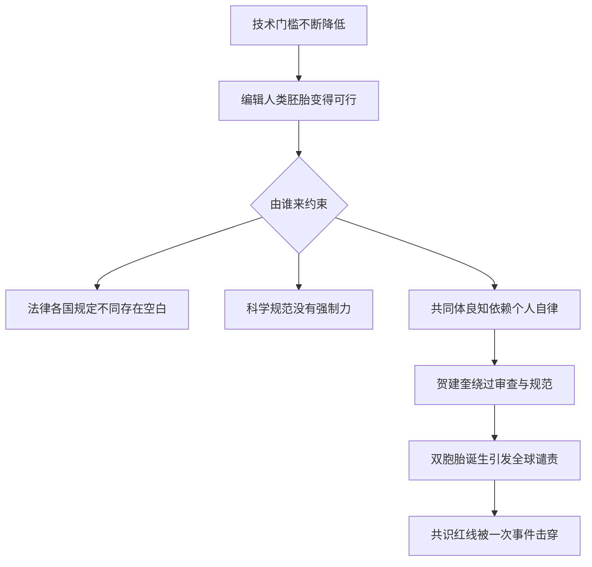

# 22｜基因编辑的伦理底线：从贺建奎说起

> 2018 年，一对被编辑过基因的双胞胎诞生，为什么全世界都谴责，而不只是「争议」？

---

## 一、先说结论

前面几篇，我们讨论的都是「边界在哪里」「坡有多滑」——基本还停留在思想实验的层面。

2018 年 11 月，这件事落地了：中国科学家贺建奎宣布，一对经过 CRISPR 编辑的双胞胎女孩已经出生。

这不是「观点分歧」，而是**对共识红线的越界**：绕过伦理审查、绕过科学规范、绕过必要的安全验证，把一个未经证实的技术，直接施加在两个无法同意的生命身上。

穆克吉书里的所有追问，在这一刻被推到现实面前：**当技术门槛越来越低，约束它的究竟是法律、是规范，还是科学共同体的良知？** 他的预言提前发生了。

---

## 二、我们先理解一个问题

先搞清楚这件事的基本事实。

2018 年 11 月，在香港举行的第二届人类基因组编辑国际峰会前夕，贺建奎公开宣布：一对名为露露和娜娜的双胞胎女孩已经出生。她们的胚胎在植入前，用 CRISPR 对 CCR5 基因进行了编辑。

思路是：CCR5 是 HIV 进入免疫细胞的通道；人群中存在一种天然突变（CCR5-Δ32），携带者对该型 HIV 有较强抵抗力。贺建奎想复制的，就是这种「天然抵抗力」。

但问题立刻成堆地出现。

第一，这项工作**在医学上并没有必要**。孩子的父亲是 HIV 阳性、母亲阴性，通过规范的精子洗涤等技术，已经可以极大地降低传播风险。也就是说，这对双胞胎本不需要一个以感染 HIV 为代价的「预防」。

第二，**安全验证严重不足**。动物实验、脱靶分析、嵌合检测都不充分。后来的信息显示，最终的编辑结果并不像最初描述的那样干净，可能出现非预期的改变。

第三，**程序违规**。他绕过正规的伦理审查流程，知情同意文件也被指存在严重问题，参与的父母可能并未真正理解这项操作的性质和风险。

所以真正要问的是：

> **既然争议一直存在，为什么这一次不是「争议」，而是「越界」？**

---

## 三、作者到底提出了什么观点？

严格说，这一事件发生在《基因传》出版之后，但穆克吉书里对基因编辑伦理的讨论，几乎逐条指向了它。

他的观点大致是。

第一，**科学有边界，而这个边界不能只由科学家一个人划。** 一项技术是否应该被使用，涉及的不只是技术可行性，还有社会共识和代际责任。

第二，**可遗传的编辑尤其特殊**，因为它改变的不是一个人，而是他之后的每一个后代，必须建立在极高的安全标准之上。

第三，也是最锋利的一条：**当约束只靠「自律」时，一次越界就足以击穿它。** 优生学的历史已经证明，最危险的不是恶意的疯狂，而是「我是在做正确的事」的自信。

所以他给出的不是技术方案，而是一种态度：**在能改写人类自身的时候，敬畏不是软弱，而是底线。**

---

## 四、把这个观点翻译成人话

打个比方。

一座桥还在施工，工程师反复强调：结构还没验收，任何车辆都不得通行。

这时有一个人，绕过所有检查，把一辆载着乘客的车开了上去。事后他解释说：「我是为了让大家更快过河。」

问题不在于他有没有好意，而在于他**跳过了所有保障安全与征求意见的环节**，承担后果的，却是车上那些没有同意的人。

贺建奎事件在结构上就是这件事：**技术、审查、知情同意、安全验证，这些「护栏」被一个环节一个环节地绕过，而代价由一个尚未出生、无法发声的生命承担。**

而且更麻烦的是：这个代价不会随双胞胎长大而结束，它可能通过她们的生殖细胞传给下一代。**人类第一次把自己的「未完成试验」，写进了别人家族的遗传史。**

---

## 五、为什么会这样？

因为约束基因编辑的力量，本质上是三层的，而三层都有空隙。

第一层是**法律**。各国对胚胎编辑的规定差异极大：有的明确禁止，有的高度限制，有的存在模糊地带。跨国合作与「生殖旅游」，让单一国家的法律很难完全兜住。

第二层是**科学规范**。国际峰会、学会声明、期刊政策形成了很强共识——可遗传编辑不应进入临床。但共识是「应该」，不是「必须」，它没有执法权。

第三层是**良知**。这看起来最抽象，却往往最关键。绝大多数科学家不去做这件事，不是因为法律禁止，而是因为他们知道那是不该做的。可**自律有一个致命弱点：只要一个人不遵守，就会失效。**

贺建奎事件的本质，正是这三层同时被穿过的结果。

---

## 六、举一个现实生活中的例子

把时间线串起来，能看清这件事的性质。

2015 年，人类基因编辑国际峰会在华盛顿召开，明确表态：生殖系编辑不应进入临床。2018 年 11 月，第二届峰会在香港举行，贺建奎就在会议前后公布了他的「成果」。反应几乎是即时的：各地科学家当场表达震惊与谴责，主办方随后重申，这类操作越过了科学和伦理底线。

随后是调查与追责。2019 年 12 月，中国深圳的法院以非法行医罪判处贺建奎有期徒刑并处罚金，他随后被禁止再从事相关领域研究，有报道称其于 2022 年刑满获释。围绕双胞胎女孩的健康与隐私，公开信息非常有限——这也是一个提醒：**事件留下的最沉重的遗产，是两个真实的人一生的隐私与福祉。**（网上关于后果的许多说法缺乏可靠依据，事实确认之前不宜当作结论。）

---

## 七、回到书中重新理解

现在再想穆克吉的整本书，会发现它像一份提前写好的判词。

他从优生学的历史讲起，讲那门「进步科学」如何把人类推向灾难；他反复强调基因知识本身是中性的，危险的是把它等同于人的价值；他最后把我们带到基因编辑的门口，问的正是：**我们凭什么来决定一个生命该是什么样子？**

贺建奎没有回答这个问题，他直接跳过它做了决定。而全世界的反应之所以空前一致，是因为它触动的不是技术细节，而是所有人心里的同一根弦：**我们有权改写下一个人吗？**

---

## 八、这个观点背后还有什么？

这个事件背后，是所有强大技术迟早都会遇到的**治理难题**。

第一是**时间差**。技术更新以年计，法规更新以十年计。当一项能力已经「人人可做」，而规则还没来得及覆盖，灰色地带就出现了。

第二是**管辖权问题**。科学是全球的，监管是国家的，只要有一个地方允许或默许，需求就会流动过去——这正是国际共识和全球登记机制重要的原因。

第三是**动机的复杂性**。把越界者简单描绘成「想出名」或「想做好事」，都过于简单。真实情况往往混杂着野心、自我辩护，以及「我在推动人类进步」的信念。**而这正是最需要警惕的：破坏规则的人，通常都认为自己有正当理由。**

---

## 九、这个观点有问题吗？

这个问题必须诚实处理，它涉及真实的争议。

第一，**「科学上毫无价值」的说法，需要限定。** 多数专家认为，这项操作在医学必要性、安全性和研究设计上都存在严重问题，更像一次缺乏正当性的冒险。但也有人认为，从纯技术角度看，它提供了关于人类胚胎编辑可行性与失败模式的信息——**这不意味着它应该被做，只是说不宜用「完全没意义」来简化。**

第二，**处罚是否恰当，存在不同看法。** 有人主张应给予更严厉惩处以形成威慑；也有人担心，把它主要当作刑事问题处理，会让未来的越界行为更加隐蔽。这个分歧至今没有定论。

第三，**「反对这次事件」不等于「反对一切相关研究」。** 2020 年，美国国家科学院、工程院与英国皇家学会的联合报告指出：可遗传编辑在达到严格标准之前不应推进；即便达到，伦理上仍有深刻分歧。**共识是「不能这样用」，不是「不能研究」。** 混为一谈会误伤研究。

第四，**一个更深的问题始终悬着**：如果有一天技术足够安全、社会也充分讨论过，我们是否仍要划一条「永不」的红线？有人认为某些红线绝对不可越，也有人认为伦理判断应随知识变化。这不是一次判决能结束的问题。

最后，也要避免把事件简化为「一个坏人的故事」。**真正值得记住的，是制度为什么没有拦住他，而不是只记住他是谁。**

---

## 十、今天再看这个观点

（以下为现代延伸，非穆克吉原文）

事件之后，世界做了一些补救。

世界卫生组织建立了人类基因组编辑的全球登记与咨询机制；中国也在 2019 年出台相关管理规范，并在 2021 年施行的《生物安全法》与《刑法修正案（十一）》中，把非法人类基因编辑纳入规制。科学界也持续呼吁暂停其临床应用。

但真正的挑战才刚开始。基因编辑工具越来越便宜好用，编辑公司在各地兴起，生殖技术的商业化在加速，跨境监管依然困难。**贺建奎事件不是终点，而是一次预警：技术的门槛在下沉，治理的能力必须同步上升。**

---

## 十一、这一篇真正应该记住什么？

1. **这不是「观点分歧」，而是「越界」**：绕过审查与程序、无视安全与知情同意，性质与学术争论完全不同。

2. **医学必要性、安全性、知情同意，是三道不能省的关**：这次事件每一道都失守了。

3. **代价由无法同意的人承担**，而且可能跨代延续——这是它格外严重之处。

4. **约束不能只靠自律**：法律、规范、共同体良知三层都要在，任何一层失守都可能出事。

5. **「反对这次事件」不等于「反对一切研究」**：分清这两者，才能既不纵容越界，也不误伤科学。

---

## 十二、留一个问题

「改写生命」的部分到这里收尾了。

我们一路看到力量如何增长：从送一段基因，到复制生命，到用剪刀精确修改，再到有人跨过红线。可这本书真正想留下的，或许不是这些问题，而是它们背后的人之问。

穆克吉写这本书，起点是他家族的「疯狂」。他一生都在担心，某种东西会从基因里传下来，决定他是谁。

那么，当人类终于能读懂、甚至改写基因之后——**基因，究竟在多大程度上决定了我们是谁？**

下一篇，也是最后一篇：**基因不是命运——穆克吉最终想告诉我们什么？**
