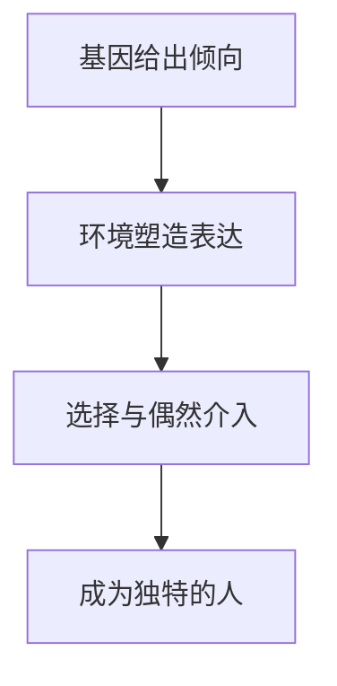

# 23｜基因不是命运：穆克吉最终想告诉我们什么？

> 读完从孟德尔到 CRISPR 的一百五十年，我们终于要面对那个最初的问题：基因，究竟在多大程度上决定了我们是谁？

---

## 一、先说结论

走到这里，我们已经跟着穆克吉走完了一整段漫长的路。

从修道院花园里的豌豆，到果蝇眼睛的颜色；从一张模糊的 X 光照片，到双螺旋、遗传密码；从人类基因组计划那三十亿个字母，到 CRISPR 这把剪刀；中间还穿过了一段最黑暗的走廊——优生学、强制绝育、种族卫生、大屠杀。最后，剪刀被递到人的手里，然后被用来编辑一对尚未出生的双胞胎。

读完这一切，那个最私人、也最普遍的问题摆在桌面上：

> **基因到底决定了我们多少？我究竟是谁的产物？**

穆克吉给出的答案，不是口号，而是一种分寸：

**基因是我们生命的底层语法，但不是我们人生的全部文本。**

它给出可能性、倾向和风险，却把「成为谁」这一部分，留给了偶遇、选择和环境。

全书的落脚点，是一种克制而深情的信念：**在「命定」与「自由」之间，永远留有一块属于人的空间。**

---

## 二、我们先理解一个问题

先做一个思想实验。

假设有两个人，基因完全相同——同卵双胞胎。他们从同一个受精卵分裂而来，携带一模一样的三十亿个字母。

按「基因决定论」的直觉，他们应该像同一份文件打印两次：长相一样，性格一样，命运也该几乎重合。

可现实不是这样。同卵双胞胎确实非常相似，但越长大，越会走向不同的地方。一个患上精神分裂症，另一个可能终生健康；一个成为严谨的会计，另一个成为冒险的记者。他们的疾病史不同，他们爱上的、后悔的、放不下的，也各不相同。

于是真正的问题浮出来了：

> **如果连基因完全相同的人，都能活成两个不同的人，那么「基因决定一切」这句话，究竟漏掉了什么？**

漏掉的，正是基因与「人生」之间那段充满变量的距离。

---

## 三、作者到底提出了什么观点？

穆克吉的立场，要放在两个极端之间来理解。

一端是基因决定论的狂热：好像只要能读出你的基因组，就能读出一生——智力、疾病、性格、结局，都写在那串字母里。另一端是对技术的简单拒斥：既然基因带来这么多麻烦和伦理困境，那不如干脆别碰它。

穆克吉两边都不站。他说的是：**基因给你的是倾向，而不是判决。** 它像一份底稿，而不是一条铁轨。底稿规定了纸张、墨色和大致可用的词句，但最终写成怎样一篇文章，还取决于谁在写、什么时候写、写的时候发生了什么。

他还给了一个更深的层次：**基因不是孤立的零件，而是与环境持续对话的系统。** 一个基因表达不表达、表达多少、什么时候表达，都要看它所处的环境。

所以「基因 vs 环境」这个习惯的对立问法，本身就是错的。真实的图景是：**环境通过基因起作用，基因的效应又要靠环境才能显现。**

---

## 四、把这个观点翻译成人话

打个比方：基因像一份乐谱。

乐谱上写着音符、节奏、和声，它真实存在、可读、可以精确到每个符号。但乐谱不是音乐。同一份乐谱，交给不同的演奏者、不同的乐器、不同的音乐厅，甚至同一位演奏者在不同心境下，出来的声音都不一样。乐谱给了可能性的范围，音乐却是在演奏中发生的。

人生也是这样。基因写了几个音，却没有规定你这首曲子的情绪。它可能让你对某个和声更敏感，但最终奏出什么，是演奏者、乐器和那个具体的夜晚共同决定的。

穆克吉说的「可能性」，是乐谱里的音符；他说的「选择与偶遇」，就是演奏本身。

---

## 五、为什么会这样？

因为基因的作用方式，从来不是「命令」，而是「倾向于」。

第一层，基因给出倾向。它可能让你对某种疾病更易感，对某种刺激更敏感，让身体在某些条件下更容易出问题。但「倾向」的意思是概率偏高，不是「必定发生」。

第二层，环境塑造表达。一个有患病倾向的人，如果成长在完全不同的环境里——不同的营养、压力、支持系统——这个倾向可能被放大，也可能被压下去，甚至一辈子不显现。

第三层，选择与偶然介入。人会做选择，也会遇到偶然：读哪本书，遇见哪个人，在哪个岔路口停下来；一场病，一次事故，一个贵人或一个坏人。这些东西不写进基因，却真实地改变一个人的走向。

三层叠起来，才有了那个独一无二、无法从基因里提前算出来的人。

---

## 六、举一个现实生活中的例子

想想身高。

身高是遗传度很高的性状。但把一百年里同一群人的平均身高画成曲线，会发现一件事：在很多国家，人们的平均身高在几十年里显著增长了。

基因没有改变，改变的是营养、医疗和卫生条件。**同一个基因组，在不同的环境里，会长出不同的高度。** 基因设定范围，环境决定你落在哪一端。

再比如精神疾病。穆克吉的家族里，两个叔叔都患有严重精神疾病，按最粗鲁的基因决定论，这几乎等于宣判。可事实并非如此：同样的家族背景，不同的人走向完全不同的结局，而穆克吉自己，把那段历史变成了写下这本书的理由。

---

## 七、回到书中重新理解

现在再回望这一整段历史，会发现「基因不是命运」这个结论，不是温柔的安慰，而是从血里长出来的。

孟德尔证明了遗传有规律、可预测比例——这给了人类一种「命定可算」的兴奋。紧接着，优生学家把这套语言拿去给人群排序：谁该生，谁不该生；谁高贵，谁低贱。他们犯的错，正是把「概率的倾向」直接读成了「不可改变的命运」。纳粹的种族卫生，就是这种误读最血腥的版本。

等到双螺旋被揭开、遗传密码被破译、人类基因组被读完，人类一度以为拿到了完整的生命说明书。结果发现，基因数量比预想的少得多，大量 DNA 并不直接编码蛋白质——读完，不等于读懂。于是我们绕了一大圈，才慢慢回到一个更朴素的答案：**基因很重要，但它不是剧本，而是乐谱；不是判决，而是倾向。**

而这条线，从头到尾都绑着穆克吉的私人恐惧。他害怕的那个「疯狂」，最终既没有被当成宿命接受，也没有被当成谎言否认，而是被放进了这本书里——被理解，被讲述，被转化成对他人有用的东西。这本身就是对「基因不是命运」最有力的证明：**同一段遗传背景，可以被活成疾病，也可以被活成理解。**

---

## 八、这个观点背后还有什么？

这个观点背后，藏着整本书最深的伦理关切：**如果基因是命运，那么一切不平等都可以被解释成「天生的」，于是社会不必改变，只需要筛选。** 这是优生学的逻辑起点，也是它最危险的地方。

而如果基因只是倾向，那么环境、教育、医疗、机会，就都重新变得重要起来。一个人没有成为他基因「应该」成为的样子，不是因为他「战胜了命运」，而是因为命运本来就不是单行道。

穆克吉的「人的空间」，正是从这里生长出来的。它不是自我安慰，也不是对科学的背叛，而是在最充分的科学认知之后仍然坚持的一件事：**人不是被写好的，人是在被写、被读、被改写的过程中，成为自己的。**

这也是《基因传》与优生学最根本的分野：前者相信，基因差异不该变成人的价值排序；后者坚信，差异就是高低。

---

## 九、这个观点有问题吗？

必须承认，这个立场本身也有它难以回避的争议。

第一个争议关于自由意志。如果基因确实影响行为——某些变异与冲动、成瘾、情绪波动相关——那么「选择」还剩下多少分量？如果连「我为什么这样选」都有生物学基础，那块「留给人自己的空间」会不会只是错觉？

这个问题至今没有共识。有研究者主张，行为遗传学揭示的只是统计层面的倾向，不构成对自由意志的否定；也有人认为，它至少逼我们重新定义「自由」。**这是真问题，不能靠一句「基因不是命运」就打发掉。**

第二个争议关于责任的误读。听到「基因不是命运」，人很容易滑向两个相反的方向。

一个方向是：「既然不是命定，那一切靠努力就行。」于是受困于遗传疾病、精神疾病、家庭环境的人，被暗暗指责为「不够努力」。这恰恰是穆克吉最反对的：很多困境，不是个人意志能扛下的。

另一个方向是：「既然只是倾向，那做什么都没用。」这又成了披着开明外衣的宿命论。

第三个争议关于限度。承认「基因不是命运」，容易让人低估基因的真实分量。对于单基因病、对于某些高外显的风险，基因的约束是非常真实的，不是靠心态就能改变。把「不是命运」说成「想怎样就怎样」，同样是不诚实。

所以这个观点最准确的说法，应该是：**基因不是命运，但它是一种真实的约束；人的空间不是无限的，而是有限的自由。**

---

## 十、今天再看这个观点

（以下为现代延伸，非穆克吉原文）

一方面，我们比任何时候都更容易把基因当成命运：多基因风险评分、消费级检测、胚胎筛选，都在鼓励我们相信，读出了字母就能预知未来。可这些评分对大多数人的预测能力仍然有限，把它们当成判决，是一种新的决定论。

另一方面，我们比任何时候都更有能力改写基因。CRISPR 让「命运」第一次成为可以主动修改的东西。问题于是变成：如果基因真的不是命运，那我们是为了治病去改它，还是为了追求某个「更好」的版本去改它？更根本的一层是：当技术把「可能性」一点点收窄成「设计」，我们是否也在悄悄挤掉那块属于人的空间？

穆克吉的克制值得记住。他既没说「基因无关紧要」，也没说「技术必须停下」。他说的是：**在能读懂、能改写之前，先想清楚自己到底珍视什么。**

---

## 十一、这一篇真正应该记住什么？

1. **基因是底层语法，不是全部文本。** 它给出倾向、可能性和风险，但不写定结局。

2. **基因与环境不是对立，而是合作。** 起作用的是「基因在什么环境里、以什么方式被表达」。

3. **「不是命运」不等于「不重要」。** 它是一种真实的约束，人的空间是有限的自由。

4. **优生学的教训，是不要把倾向读成宿命。** 差异一旦被当成高低，科学就会沦为排序工具。

5. **穆克吉的家族故事，就是这句话的证明。** 同一段遗传背景，可以活成疾病，也可以活成理解。

---

## 十二、留一个问题

从孟德尔在花园里数出那个 3∶1，到 CRISPR 切开人类的基因，人类用一百五十年，从「不懂遗传」走到「可以改写遗传」。我们解开了生命最深的谜，也犯下过最冷的罪。

所以，全系列最后，把这个问题留给你：

> **如果有一天，我们真的能读出并改写每一个决定「我是谁」的基因——你会去改吗？你会改哪一部分？而改完之后，那个人，还是你吗？**

这个系列到这里就结束了，但基因与人的故事，还远没有结束。
