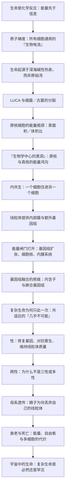

# 《复杂生命的起源》深度解读系列

## 系列简介

如果把地球四十亿年的生命史压缩成一天，那么从早到晚的绝大部分时间，这颗星球上只有细菌和古菌——单细胞、没有细胞核、形态简单。真正的「复杂生命」——真菌、植物、动物、以及你我——只在一个瞬间出现过一次，而且全部来自同一个祖先。

为什么是「一次」？为什么细菌统治了四十亿年却始终没有变复杂？为什么复杂生命偏偏带来了性、两性、衰老与死亡？英国生物化学家尼克·莱恩在这本书里给出了一个大胆而统一的答案：**关键不在基因，而在能量。** 生命本质上是化学反应，细胞靠质子梯度这股「生物电流」驱动；而细菌的能量供给方式，恰好卡死了它们通往复杂性的路。只有一次偶然的「细胞内共生」，让一个细胞住进另一个细胞，才打开了能量的闸门。

本系列不按原书章节复述，而是重建一条认知链：先讲「生命为什么首先是能量问题」，再讲「生命从哪里来」，然后走进「复杂生命为何只出现一次」这一核心谜题，最后讨论它给性、性别、衰老、死亡乃至宇宙中生命概率带来的连锁答案。莱恩的很多观点仍是前沿假说，本系列会明确区分「作者主张」与「学界争议」。

---

## 全书核心问题

| 层次 | 问题 |
|---|---|
| 定义问题 | 生命到底是什么？是信息，还是能量的流动？ |
| 起源问题 | 第一个生命从哪里来？是偶然还是必然？ |
| 瓶颈问题 | 细菌为什么四十亿年都没有演化出复杂结构？ |
| 转折问题 | 复杂生命为什么在地球史上只出现了一次？ |
| 机制问题 | 线粒体、细胞核、内含子是怎么出现的？ |
| 生命史问题 | 为什么会有性？为什么只有两种性别？ |
| 存在问题 | 我们为什么会衰老和死亡？ |
| 宇宙问题 | 复杂生命在宇宙中是普遍还是罕见？ |

一句话版本：

> **如果生命的关键不是基因而是能量，那么「复杂生命为什么只出现一次」这个谜题，能否用一块细胞膜上的电压来解释？**

---

## 全书知识地图



再压缩成一句话：

```text
生命是能量现象
   → 起源靠地质提供的质子梯度
   → 细菌卡在能量瓶颈上
   → 一次内共生打开闸门
   → 复杂生命诞生
   → 性、两性、衰老、死亡都是这次事件的余波
   → 因此复杂生命可能极其罕见
```

---

## 全系列目录

### 第一部分：生命不是信息，是能量

#### 01｜为什么地球上所有复杂生命都来自同一个祖先

核心问题：为什么从蘑菇到人类，所有复杂生命都共享同一套细胞结构，而细菌却始终简单？

核心观点：生命分为两大类——原核生物（细菌、古菌）与真核生物（所有复杂生命）。真核生物在地球史上只诞生过一次，此后所有真菌、植物、动物都是这一个祖先的后代。这个「只出现过一次」的事实，是全书真正要解释的谜题。

理解难度：★★☆☆☆

关键词：原核生物、真核生物、复杂生命、单一共同祖先

---

#### 02｜生命究竟是什么——为什么「信息」离不开「能量」

核心问题：为什么把生命理解为「遗传信息」是片面的，甚至是一种误导？

核心观点：莱恩主张，生命首先是化学反应与能量流动，基因信息只有在能量供给下才有意义。没有能量的信息，就像拔掉插头的电脑。把生命等同于 DNA 与遗传密码，会让我们看不见真正驱动演化的问题。

理解难度：★★★☆☆

关键词：能量先于信息、代谢、生命定义、莱恩的视角转换

---

#### 03｜我们其实是由「电」构成的——细胞里的质子电池

核心问题：细胞究竟怎样储存和搬运能量？为什么所有生命共用同一种「货币」？

核心观点：所有细胞都靠质子（氢离子）跨膜形成的电化学梯度来驱动能量。这套机制叫化学渗透，由彼得·米切尔提出，其地位相当于生命世界的通用电网。ATP 合成酶就是一台被质子流驱动的微型涡轮机。

理解难度：★★★☆☆

关键词：化学渗透、质子梯度、膜电位、ATP 合成酶、彼得·米切尔

---

### 第二部分：生命从哪里来

#### 04｜生命诞生在「温暖的小池塘」里吗——被误信百年的原始汤

核心问题：为什么达尔文式的「温暖小池塘」和被广泛流传的「原始汤」图景，在化学上站不住脚？

核心观点：原始汤假说依赖闪电、紫外线等外部能量把简单分子「随机」拼成生命。莱恩指出，这在能量、浓度和方向性上都行不通——一堆砖头不会因为一场暴风雨就变成房子。生命需要的是持续、稳定、有方向性的能量梯度。

理解难度：★★★☆☆

关键词：原始汤、温暖小池塘、外部能量、浓度问题

---

#### 05｜生命起源为什么可能是一种必然——深海热泉与质子梯度

核心问题：如果生命不是偶然的奇迹，那它最可能在哪里、以什么方式出现？

核心观点：莱恩追随地质学家迈克尔·罗素，认为生命起源于海底碱性热液喷口。那里的矿物微孔天然隔出两个区域，形成稳定的质子梯度；矿物表面的铁硫簇可以催化有机分子合成。生命起源因此不是「从零开始」，而是「借用」了地球本身已有的能量结构。

理解难度：★★★★☆

关键词：碱性热液喷口、矿物催化、铁硫簇、质子梯度、罗素、必然性

---

#### 06｜LUCA——所有生命最后的共同祖先长什么样

核心问题：细菌和古菌的共同祖先是什么样子？它为什么已经拥有后来生命的关键机制？

核心观点：LUCA（最后共同祖先）并非一团简单的「原生糊」，而很可能已经是一个拥有质子梯度能量系统、遗传机制和基本代谢的细胞。细菌与古菌这两大分支，是在 LUCA 之后各自分道扬镳的。

理解难度：★★★★☆

关键词：LUCA、细菌与古菌、共同祖先、深部生命树

---

### 第三部分：复杂生命为什么只出现一次

#### 07｜细菌统治了地球四十亿年，为什么始终没有变复杂

核心问题：细菌生存在几乎所有环境里，为什么它们从未演化出大型、多细胞、复杂形态的生命？

核心观点：原核细胞的能量生产依赖细胞外膜，能量供应随体积增长被「表面积／体积比」严格限制。细胞越大，能分到的能量越少。这不是懒惰或运气问题，而是物理与几何决定了它们无法负担更多基因和更复杂的结构。

理解难度：★★★★☆

关键词：表面积／体积比、原核细胞、能量限制、基因数量

---

#### 08｜「生物学中心的黑洞」——原核与真核之间的能量鸿沟

核心问题：一个真核细胞与一个细菌相比，可用的能量差距究竟有多大？为什么这个差距是决定性的？

核心观点：莱恩用费米式的估算指出，真核细胞平均每个基因可获得的能量，是细菌的上千倍乃至更多。这道巨大的能量鸿沟被他称为「生物学中心的黑洞」。有了这笔「额外收入」，真核细胞才养得起庞大的基因组、复杂的调控网络和多细胞身体。

理解难度：★★★★☆

关键词：能量／基因、费米估算、生物学黑洞、基因组扩张

---

#### 09｜线粒体——一次偶然的吞并，如何改写了整个地球

核心问题：线粒体到底是什么？它的到来如何一举解决了复杂生命的能量瓶颈？

核心观点：线粒体原本是自由生活的细菌，被一个古菌宿主吞入后没有被消化，而是成为提供能量的伙伴。它的内膜大量折叠，把巨大的产能表面搬进了细胞内部；它自带的基因还能就地调控能量生产。这一次内共生，正是真核细胞诞生的瞬间。

理解难度：★★★☆☆

关键词：内共生、线粒体、内膜折叠、宿主与共生体、ATP

---

#### 10｜为什么这次「创世级」的合并只发生了一次

核心问题：如果内共生有好处，为什么它在地球四十亿年里只成功了一次？

核心观点：要让两个独立细胞融合成一个能繁衍的整体，需要把共生体的大量基因转移到宿主细胞核，并让两套基因组在调控上互相匹配（共适应）。这个过程极其脆弱、几乎不可能完成，结果只有一条谱系活了下来——这就是莱恩所说的「几乎是奇迹的一次」。

理解难度：★★★★★

关键词：基因转移、共适应、内共生瓶颈、唯一事件

---

#### 11｜细胞核、内含子与基因组——一次融合留下的疤痕

核心问题：细胞核和基因组里大量看似「多余」的结构，是不是这次融合留下的证据？

核心观点：真核细胞的基因被内含子打断、必须经过剪接，基因组还混入了大量细菌来源的基因。莱恩把这些「怪癖」解释为内共生与基因转移的痕迹——它们不是设计的产物，而是历史事故留下的疤痕，却被后来的复杂生命继续沿用。

理解难度：★★★★☆

关键词：细胞核、内含子、基因剪接、嵌合基因组、历史痕迹

---

### 第四部分：性、两性，与死亡

#### 12｜真核细胞为什么非要「性」不可

核心问题：无性繁殖更省事、更高效，为什么复杂生命几乎都选择了有性生殖？

核心观点：莱恩把性的起源追溯到线粒体。无性繁殖会让有害的线粒体突变在细胞里不断累积且无法清除；有性生殖通过基因重组和选择，帮助后代维持住「高质量的发电厂」。性因此不是奢侈，而是复杂生命维持能量系统的必要机制。

理解难度：★★★★☆

关键词：有性生殖、基因重组、线粒体质量、突变累积

---

#### 13｜为什么地球上只有两种性别

核心问题：为什么是两种性别，而不是三种、四种或更多？

核心观点：一旦繁殖细胞出现「大小分工」——一方提供大而营养丰富的卵，另一方提供小而灵活的精子——演化就会迅速分化成两个阵营（异配生殖）。两种性别不是自然的设计，而是一条自我强化的路径被走到极致的结果。

理解难度：★★★★☆

关键词：异配生殖、配子大小、自我强化、两性起源

---

#### 14｜为什么线粒体只从母亲那里继承

核心问题：为什么我们只从母亲继承线粒体，父亲的那一套会被丢弃？

核心观点：精子中大量线粒体会被主动清除，这并非偶然。父本线粒体数量多、复制次数多、突变风险高；让后代只继承一套经过筛选的母系线粒体，能避免两套线粒体「打架」、减少有害突变的混入。母系遗传是维护能量系统的又一重保险。

理解难度：★★★★☆

关键词：母系遗传、精子线粒体清除、突变风险、线粒体质量控制

---

#### 15｜我们为什么会衰老和死亡

核心问题：既然自然选择偏爱继续生存，为什么复杂生命普遍会衰老、最终死亡？

核心观点：莱恩把衰老与大能量需求联系在一起：能量生产越旺盛，自由基与损伤的代价越高；多细胞身体又需要「程序性细胞死亡」来维持秩序。死亡不是生命的意外故障，而可能是复杂生命这套高耗能系统长期运转必然要付的代价。

理解难度：★★★★☆

关键词：衰老、自由基、线粒体、程序性细胞死亡、多细胞代价

---

### 第五部分：我们在宇宙中孤独吗

#### 16｜复杂生命是宇宙的常态，还是地球的意外

核心问题：如果复杂生命需要一次几乎不可能的细胞内共生，那么宇宙中还有多少地方存在复杂生命？

核心观点：莱恩认为，适合生命起源的行星可能很多，但能跨过「内共生」这道窄门的极其稀少。细菌或许在宇宙中普遍存在，而真正复杂、多细胞、有智慧的生命，可能因为这道能量与共适应的门槛而格外孤独。

理解难度：★★★☆☆

关键词：费米佯谬、生命普遍性、复杂生命罕见、内共生门槛

---

#### 17｜如果答案只是「能量」——这本书真正想告诉我们什么

核心问题：把性、性别、衰老、死亡和宇宙中的孤独统统用「能量」来解释，这个框架的野心与边界在哪里？

核心观点：莱恩的核心贡献，是提醒生物学重新把能量放回演化解释的中心，而不是只盯着基因。但这个框架仍是活跃的假说，许多环节缺乏直接证据。真正值得带走的，不是「能量万能」，而是一种思考方式：先问代价从何而来，再问结构为何如此。

理解难度：★★★☆☆

关键词：能量范式、学科争议、假说与证据、给读者的方法论

---

## 推荐阅读顺序

**主线（建议按序读完）：** 01 → 17。

按认知难度可分五段：

1. **入门段（★★☆☆☆～★★★☆☆）**：01、02、03。先建立「生命是能量现象」的基本视角，这是后面所有论证的地基。
2. **起源段（★★★☆☆～★★★★☆）**：04、05、06。回答「生命从哪来」，同时破除原始汤的直觉。
3. **核心段（★★★★☆～★★★★★）**：07、08、09、10、11。全书最硬、最重要的部分——复杂生命的能量瓶颈与唯一一次内共生。第 10 篇难度最高，读不下去可先跳过，回头再读。
4. **生命史段（★★★★☆）**：12、13、14、15。把前面的能量逻辑，延伸到性、两性与死亡这些「我们为何如此」的问题。
5. **收束段（★★★☆☆～★★★★☆）**：16、17。从地球走向宇宙，再回到方法论层面反思整个框架。

**不同需求的入口：**

- **只想抓住骨架**：01 → 03 → 07 → 09 → 10 → 16。六篇读懂全书主干。
- **对「我们为什么会死」感兴趣**：03 → 09 → 12 → 14 → 15。
- **想练习批判性阅读**：直接读 05、10、15，这三篇的作者主张最强、争议也最大，适合对照反方观点思考。

---

## 全系列状态

- 计划篇数：**17 篇**（另加本目录篇 00）
- 状态：仅有拆解目录，正文尚未开始
- 下一步：回复「开始写」生成第 01 篇正文
